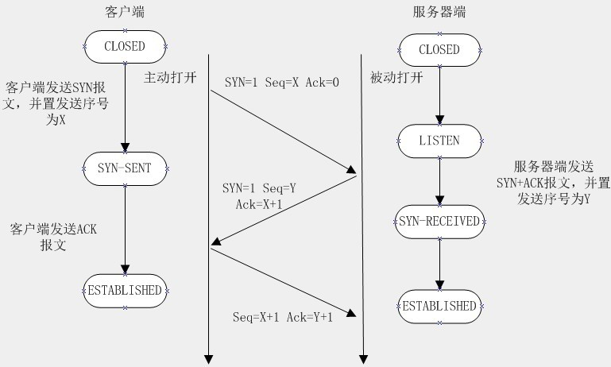
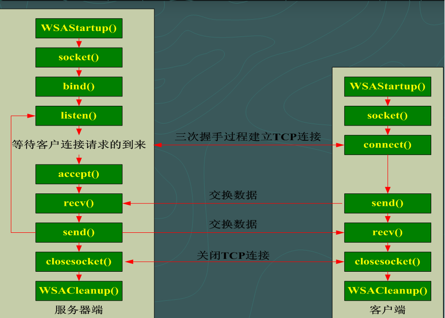

我们知道网络层，可以实现两个主机之间的通信。但是这并不具体，因为，真正进行通信的实体是在主机中的进程，是一个主机中的一个进程与另外一个主机中的一个进程在交换数据。IP协议虽然能把数据报文送到目的主机，**但是并没有交付给主机的具体应用进程**。而**端到端**的通信才应该是应用进程之间的通信。

UDP：在传送数据前不需要先建立连接，远地的主机在收到UDP报文后也不需要给出任何确认。虽然UDP不提供可靠交付，但是正是因为这样，省去和很多的开销，使得它的速度比较快，比如一些对实时性要求较高的服务，就常常使用的是UDP。对应的应用层的协议主要有 DNS,TFTP,DHCP,SNMP,NFS 等。

TCP：提供面向连接的服务，在传送数据之前必须先建立连接，数据传送完成后要释放连接。因此TCP是一种可靠的的运输服务，但是正因为这样，不可避免的增加了许多的开销，比如确认，流量控制等。对应的应用层的协议主要有 SMTP,TELNET,HTTP,FTP 等。

> TCP把连接作为最基本的对象，每一条TCP连接都有两个端点，这种断点我们叫作套接字（socket），它的定义为端口号拼接到IP地址即构成了套接字，例如，若IP地址为192.3.4.16 而端口号为80，那么得到的套接字为192.3.4.16:80。

Delphi里提供TServerSocket和TClientSocket控件来进行网络编程。也可以直接使用api，当然也完全可以使用第三方的控件。这里推荐两个：

- [ICS：http://wiki.overbyte.eu/wiki/index.php/Main_Page](http://wiki.overbyte.eu/wiki/index.php/Main_Page)

- [indy：https://www.indyproject.org/download/](https://www.indyproject.org/download/)

## TCP建立连接的过程

> 最开始的时候客户端和服务器都是处于CLOSED状态。主动打开连接的为客户端，被动打开连接的是服务器。




三次握手的具体过程阐述如下：

1. 客户端主动与服务器联系，TCP首部控制位中的SYN设置为1，发送带有SYN的TCP段，并把初始序号告诉对方。

2. 服务器端收到带有SYN的报文，记录客户端的初始序号，选择自己的初始序号，设置控制位中的SYN和ACK。因为SYN占用一个序号，所以确认序号设置为客户端的初始序号加1，对客户端的SYN进行确认。

3. 服务器端的报文到达客户端，客户端设置ACK控制位，并把确认号设为服务器的初始序号加1，以确认服务器的SYN报文段，这个报文只是确认信息，告诉服务器已经成功建立了连接。

## 具体实现

学习嘛还是从底层开始，所以这次着重学习和就研究的就是利用win32API实现简单的端到端的通讯，涉及到的函数如下：




## 函数详解

```pascal
//引用的单元
uses Winapi.WinSock, ScktComp;
```

初始化：

function WSAStartup(wVersionRequired: word; var WSData: TWSAData): Integer; stdcall;

参数说明：

| 参数名称          | 作用                                                     |
| :--------------- | :------------------------------------------------------- |
| wVersionRequired | 要求使用Winsock的最低版本号                                |
| WSData           | 这个结构体中返回WinSock库的一些信息，如版本号，监听队列的大小 |


返回值：

- 当函数成功调用时返回0，失败时返回非0的值


用于生成socket：

function socket(af, Struct, protocol: Integer): TSocket; stdcall;


参数说明：

| 参数名称 | 作用                                                            |
| :------- | :-------------------------------------------------------------- |
| af       | 地址家族(通常使用:AF_INET)                                       |
| Struct   | socket的种类，SOCK_STREAM : 用于TCP协议，SOCK_DGRAM : 用于UDP协议 |
| protocol | 所使用的协议                                                     |

返回值：

- 当函数成功调用时返回一个新的SOCKET

- 失败时返回INVALID_SOCKET


指定本地IP地址所使用的端口号时候使用：

function bind(s: TSocket; var addr: TSockAddr; namelen: Integer): Integer; stdcall;


参数说明：

| 参数名称 | 作用                                  |
| :------ | :------------------------------------ |
| s       | 指向用Socket函数生成的Socket           |
| addr    | 这个结构体用于指定服务器端IP、端口等信息 |
| namelen | 结构体的长度                           |


返回值

- 当函数成功调用时返回0

- 调用失败时返回 SOCKET_ERROR


等待客户端：

function accept(s: TSocket; addr: PSockAddr; addrlen: PInteger): TSocket; stdcall;


参数说明：

| 参数名称 | 作用                          |
| :------ | :---------------------------- |
| s       | 是一个限定套接字，它处在监听模式 |
| addr    | 有效的TSockAddr结构的地址       |
| namelen | 结构的长度                     |


返回值

- 当函数成功调用时返回客户端的Socket对象

- 失败时返回INVALID_SOCKET


> PS：这种写法会造成阻塞，具体表现是窗口假死


发送数据：

function send(s: TSocket; var Buf; len, flags: Integer): Integer; stdcall;

参数说明：

| 参数名称 | 作用                               |
| :------ | :-------------------------------- |
| s       | 参数是已建立连接的套接字            |
| Buf     | 字符缓冲区，区内包含即将发送的数据   |
| len     | 指定即将发送的缓冲区内的字符数       |
| flags   | flags可为0、MSG_DONTROUTE或MSG_OOB |

返回值

- 当函数成功调用时返回发送的字节数

- 失败时返回SOCKET_ERROR


## 两个小问题

上面这调用accept函数后会造成阻塞导致界面的主线程无法继续，针对这种情况有两种解决办法，第一种是直接启用线程解决，第二种利用Windows操作系统提供的五种I/O模型，篇幅所限不详细解释了，下一篇再详细讲解

这一块的知识点实在是太零散了，我在翻源代码的时候发现除了Winapi.WinSock这个单元外还有一个Winapi.WinSock2单元 尝试使用Winapi.WinSock2没有成功，所以虽然我在前面的代码中指定了版本但是我有理由怀疑我并没有使用2.2的版本，而且并没有在网上找到对应的解决方案，还希望有知道的朋友不吝赐教


## I/O模型

Windows操作系统提供了五种I/O模型，分别是：

- 选择(select),我更愿意称为轮询

- 异步选择（WSAAsyncSelect）

- 事件选择（WSAEventSelect）

- 重叠I/O（Overlapped I/O）

- 完成端口（Completion Port)

每一种模型适用于一种特定的应用场景。程序员应该对自己的应用需求非常明确，综合考虑到程序的扩展性和可移植性等因素，作出自己的选择。


***

http://blog.chinaunix.net/uid-11572501-id-2868657.html

https://www.cnblogs.com/findumars/p/5393420.html?utm_source=debugrun&utm_medium=referral

https://www.cnblogs.com/wzd24/archive/2009/03/09/1407326.html

选择（select）模型是Winsock中最常见的 I/O模型。核心便是利用 select 函数，实现对 I/O的管理！利用 select 函数来判断某Socket上是否有数据可读，或者能否向一个套接字写入数据，防止程序在Socket处于阻塞模式中时，在一次 I/O 调用（如send或recv、accept等）过程中，被迫进入"锁定"状态；同时防止在套接字处于非阻塞模式中时，产生WSAEWOULDBLOCK错误。

select 的函数原型如下：

```c++
//C++
int select(int nfds,fd_set* readfds,fd_set* writefds,fd_set* exceptfds,const struct timeval* timeout);
```

```pascal
//Delphi
function select(nfds: Integer; readfds, writefds, exceptfds: PFdSet; timeout: PTimeVal): Integer; stdcall;
```

- nfds：本参数忽略，仅起到兼容作用。
- readfds：（可选）指针，指向一组等待可读性检查的套接口。
- writefds：（可选）指针，指向一组等待可写性检查的套接口。
- exceptfds：（可选）指针，指向一组等待错误检查的套接口。
- timeout：select()最多等待时间，对阻塞操作则为NULL。

其中最重要的就是FD_SET结构体指针，通过查看源码，它的声明如下

```pascal
fd_set = record
    fd_count: u_int;                                 // how many are SET?
    fd_array: array [0..FD_SETSIZE - 1] of TSocket;   // an array of SOCKETs
end;
{$EXTERNALSYM fd_set}
TFdSet = fd_set;
PFdSet = ^fd_set;
```


fdset 代表着一系列特定套接字的集合。其中， readfds 集合包括符合下述任何一个条件的套接字：

- 有数据可以读入。

- 连接已经关闭、重设或中止。

- 假如已调用了listen，而且一个连接正在建立，那么accept函数调用会成功。

writefds 集合包括符合下述任何一个条件的套接字：

- 有数据可以发出。

- 如果已完成了对一个非锁定连接调用的处理，连接就会成功。

exceptfds 集合包括符合下述任何一个条件的套接字：

- 假如已完成了对一个非锁定连接调用的处理，连接尝试就会失败。

- 有带外（Out-of-band，OOB）数据可供读取。

举个例子，假设我们想测试一个套接字是否“可读”，必须将自己的套接字增添到readfds集合中，然后调用 select 函数并等待其完成。select 完成之后，再次判断自己的套接字是否仍为 readfds 集合的一部分。若答案是肯定的，则表明该套接字“可读”，可立即着手从它上面读取数据。在三个参数中（readfds、writefds 和 exceptfds），任何两个都可以是空值（ NULL）；但是，至少有一个不能为空值！在任何不为空的集合中，必须包含至少一个套接字句柄；否则， select 函数便没有任何东西可以等待。最后一个参数 timeout 对应的是一个指针，它指向一个timeval 结构，用于决定select 最多等待 I/O操作完成多久的时间。如 timeout 是一个空指针，那么 select 调用会无限期地“锁定”或停顿下去，直到至少有一个描述符符合指定的条件后结束。对 timeval 结构的定义如下：  

tv_sec 字段以秒为单位指定等待时间

tv_usec 字段则以毫秒为单位指定等待时间。  

1秒 = 1000毫秒  

若将超时值设置为（0 , 0），表明 select 会立即返回，出于对性能方面的考虑，应避免这样的设置。  

█ select 函数返回值：  

select 成功完成后，会在 fdset 结构中，返回刚好有未完成的 I/O操作的所有套接字句柄的总量。  

若超过 timeval 设定的时间，便会返回0。若 select 调用失败，都会返回 SOCKET_ERROR，  

应该调用 WSAGetLastError 获取错误码！  

用 select 对套接字进行监视之前，必须将套接字句柄分配给一个fdset的结构集合，  

之后再来调用 select，便可知道一个套接字上是否正在发生上述的 I/O 活动。  

Winsock 提供了下列宏操作，可用来针对 I/O活动，对 fdset 进行处理与检查：  

● FD_CLR(s, *set)：从set中删除套接字s。  

● FD_ISSET(s, *set)：检查s是否set集合的一名成员；如答案是肯定的是，则返回TRUE。  

● FD_SET(s, *set)：将套接字s加入集合set。  

● FD_ZERO( * set)：将set初始化成空集合。  

例如，假定我们想知道是否可从一个套接字中安全地读取数据，同时不会陷于无休止的  

“锁定”状态，便可使用 FDSET 宏，将自己的套接字分配给 fdread 集合，再来调用 select。要  

想检测自己的套接字是否仍属 fdread 集合的一部分，可使用 FD_ISSET 宏。采用下述步骤，便  

可完成用 select 操作一个或多个套接字句柄的全过程：  

1) 使用FDZERO宏，初始化一个fdset对象；  

2) 使用FDSET宏，将套接字句柄加入到fdset集合中；  

3) 调用 select 函数，等待其返回……select 完成后，会返回在所有 fdset 集合中设置的套接字句柄总数，  

并对每个集合进行相应的更新。  

4) 根据 select的返回值和 FDISSET宏，对 fdset 集合进行检查。  

5) 知道了每个集合中“待决”的 I/O操作之后，对 I/O进行处理，  

然后返回步骤1 )，继续进行 select 处理。  

select 函数返回后，会修改 fdset 结构，删除那些不存在待决 I/O 操作的套接字句柄。  

这正是我们在上述的步骤 ( 4 ) 中，为何要使用 FDISSET 宏来判断一个特定的套接字是否仍在集合中的原因。
