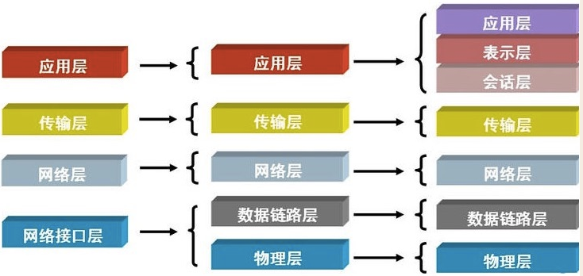

以前也知道过网络协议，同时也写过网络编程相关的代码。只是没有详细的整理过，网络分层方式也只知道有一个7层，具体每层是干什么的就不知道了，所以今天把网络分层部分的内容详细整理一下

互联网分层方式主要有以下三种：

> 而现在大多数人普遍认同的是五层的分法，下面也是针对这种分层方式分别说明每一层的主要作用和任务

**网络通信协议：** 通过计算机网络可以使多台计算机实现连接，位于同一个网络中的计算机在进行连接和通信时需要遵守一定的规则，这就好比在道路中行驶的汽车一定要遵守交通规则一样。在计算机网络中，这些连接和通信的规则被称为网络通信协议，它对数据的传输格式、传输速率、传输步骤等做了统一规定，通信双方必须同时遵守才能完成数据交换。

## 物理层

物理层就是把电脑连接起来的物理手段，可以用光缆、电缆、双绞线、无线电波等方式。主要规定了网络的一些电气特性

> 本层的主要作用：负责传送0和1的电信号

## 数据链路层（数据传输层）

单纯的0和1没有任何意义，必须规定解读方式：多少个电信号算一组？每个信号位有何意义？

>  本层的主要作用：确定 0与1 的分组方式

**以太网协议：一种确定了0与1分组的标准**

MAC地址：

- 相当于网卡编号，每块网卡出厂的时候，都有一个全世界独一无二的MAC地址，长度是48个二进制位，通常用12个十六进制数表示。前6个十六进制数是厂商编号，后6个是该厂商的网卡流水号。

以太网规定，一组电信号构成一个数据包，叫做"帧"(Frame)。每一帧分成两个部分：标头(Head)和数据(Data)

广播：

- 以太网发送数据包的方式，向本子网络内所有计算机发送数据包，让每台计算机自己判断（对比MAC地址或IP地址），是否为接收方，是则接收该数据包，不是则丢弃。

ARP协议：

- 能从IP地址得到对方MAC地址的实现方式，在一个子网络内，以IP地址与MAC地址（FF:FF:FF:FF:FF:FF 称为广播地址）进行广播，IP地址匹配的那台机器接收数据，然后回复本机的MAC地址。

## 网络层

**为什么要有网络层**

- 以太网依靠MAC地址采用广播方式发送数据包，所有成员人手一"包"，不仅效率低，而且局限在发送者所在的子网络。如果两台计算机不在同一个子网络，广播是传不过去的。这种设计是合理的，否则互联网上每一台计算机都会收到所有数据包，那会引起灾难。
所以就有了网络层：它的作用是引进一套新的地址，使得我们能够区分不同的计算机是否属于同一个子网络。这套地址就叫做"网络地址”，简称"网址"

**IP协议：规定网络地址(IP地址)的协议**

- IP协议的作用主要有两个，一个是为每一台计算机分配IP地址，另一个是确定哪些地址在同一个子网络
目前，广泛采用的是IP协议第四版，简称IPv4。这个版本规定，网络地址由32个二进制位组成。习惯上，我们用分成四段的十进制数表示IP地址，从0.0.0.0一直到255.255.255.255

IP地址：分成两个部分，前一部分代表网络，后一部分代表主机（可从子网掩码中判断出哪部分是网络，哪部分是主机）

**如何确定两主机是否在同一个子网络**

- 子网掩码：subnet mask  表示子网络特征的一个参数;它在形式上等同于IP地址，也是一个32位二进制数字，它表示网络部分全部为1，主机部分全部为0

- 将两个IP地址与子网掩码分别进行AND运算，若结果相同，就表明它们在同一个子网络中
 简单的说就是：根据子网掩码判断出两IP的网络部分(对应子网掩码二进制格式为1部分)，再对比两IP的网络部分，一样则表示这两主机在同一个子网络内，不同则表示不在同一个子网络内。

> 主要作用：用于将传输的数据进行分组，将分组数据发送到目标计算机或者网络。

## 传输层

>同一台主机上有许多程序都需要用到网络，当一个数据包从互联网上发来的时候，如何确定这个数据包该给哪个程序使用？
> 传输层主要用来解决这个问题的，传输层的功能，就是建立"端口到端口"的通信。

**端口 port**

-  这里指的是虚拟端口，TCP/IP协议规定的使用网卡的一种虚拟接口，这种接口有多个，它们的编号称为端口号

- 端口号是0-65535之间的一个整数；0-1023的端口被系统占用，用户的应用程序会被系统随机分配一个大于1023的端口

- 一个应用程序要使用网络需通过网卡接收和发送数据，系统会自动为该应用程序分配一个能使用网卡的虚拟接口，表现形式就是系统为该应用程序随机分配一个端口号。有了端口号，计算机就能确定从互联网接收到的数据包该给谁使用了。

**UDP协议：User Datagram Protocol  用户数据报协议**

UDP是一种无连接的，不可靠的，面向报文的传输层通信协议

- 无连接：传输数据之前源端和终端不建立连接，当它想传送时就简单地去抓取来自应用程序的数据，并尽可能快地把它扔到网络上

- 不可靠：不提供数据传送的保证机制，在网络质量很差的环境下，UDP协议数据包丢失会比较严重

- 面向报文：对应用程序交下来的报文，在添加首部后就向下交付给IP层；既不拆分，也不合并，而是保留这些报文的边界，因此，应用程序需要选择合适的报文大小。

- 标头(首部)格式：固定8字节，分为四部分，各部分均为2字节；源端口号 目标端口号 数据报长度 校验和

**TCP协议：Transmission Control Protocol 传输控制协议**

TCP是一种面向连接的、可靠的、基于字节流的传输层通信协议

- 面向连接：在彼此交换数据包之前必须先建立一个TCP连接(这一过程与打电话很相似)

- 可靠的：包含了专门的传递保证机制，当数据接收方收到发送方传来的信息时，会自动向发送方发出确认消息，数据包丢失会重发

- 基于字节流：TCP把应用程序交下来的报文看成一连串无结构的字节流，然后把数据流分割成适当长度的报文段，适当加工后添加首部向下交付给IP层。

- 标头(首部)格式：20-60字节；源端口号 目标端口号 数据包中的第一个字节的序列号 确认序列号校验和

> TCPP/IP协议族(簇、组、体系)，并不是TCP协议和IP协议的总称，TCP/IP指的是整个网络传输体系，而TCP协议和IP协议就是单单的两个协议

## 应用层

应用层的主要作用是规定应用程序的数据格式

常用的协议有以下几种：

- 超文本传输协议(HTTP)：用于实现WWW服务；规定了浏览器这类应用程序通信的数据格式

- 文件传输协议(FTP)：用于实现交互式文件传输功能；规定了文件传输形式的数据格式

- 域名系统(DNS)：用于实现网络设备名字到IP地址映射的网络服务。

- 简单邮件传送协议(SMTP)：用于实现电子邮箱传送功能

