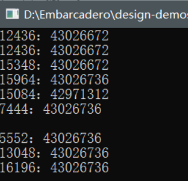

​接上篇，细心的朋友可能发现我在上一篇文章中重写类NewInstance和FreeInstance函数，原因是：【在delphi中编译器对构造函数的保护级别进行了处理，即便设为private，编译器仍然会将其修正为public，所以覆盖基类中的NewInstance类方法，系统在每次构造对象时都会调用这个类方法，通过重载它就可以实现对构造函数的控制】，同时在上篇文章中有一段核心代码


```pascal
class function TSingle.GetInstance:TSingle;
begin
    if GlobalSingle=nil then      begin
          GlobalSingle:=TSingle.Create();
    end;

    Result:=  GlobalSingle;
end;
```


我以注释的形式标注这里在并发环境下存在安全隐患，那么现在我们就通过多线程的方式研究一下这个问题？具体做法就是我创建10个线程，反复的调用这个函数

# 调整代码

因为现在的CPU执行速度很快，而我们的代码又不是什么复杂的运算，所以通过添加延时的方式模拟

```pascal
class function TSingle.GetInstance:TSingle;
begin
    if GlobalSingle=nil then      begin
        TThread.Sleep(1000)
          GlobalSingle:=TSingle.Create();
    end;

    Result:=  GlobalSingle;
end;
```


# 测试代码

```pascal
unit ProjectSingle;
{$APPTYPE CONSOLE}
{$r *.res}

uses
    System.SysUtils, System.Classes, System.Types;
    uCommonUtil in 'uCommonUtil.pas';

procedure Demo1();
begin
    try
        for var i := 1 to 10 do
                do begin TThread.CreateAnonymousThread(
                procedure begin writeln(inttoStr(TThread.CurrentThread.ThreadID) +
                  ':' + inttoStr(integer(TSingle.GetInstance))); end;

                ).Start;
        end;
    except
    on e: Exception do
        writeln(e.message);

    end;
end

begin
    Demo1();

end.
```


# 执行结果



> 结论：我们发现当以多线程的方式访问时出现了创建多个TSingle类对象的情况，这就是我前面提的并发环境下的安全问题

# 原因分析


线程1：当第一个线程执行这个代码时GlobalSingle变量的值确实为空，if成立，进入等待状态

线程2：在线程1未执行GlobalSingle赋值操作之前也进入函数，此时if依然成立，进入等待状态

线程n：同理

当延迟结束有可能有一个或者多个线程对GlobalSingle变量进行了赋值


# 解决方案

解决方案主要有两种

- 通过同步锁(线程锁)的方式解决，但是这种方式会存在效率的问题，我们知道一旦代码需要同步的时其实就是以单线程的方式在执行

- 通过内部类的方式解决，这种方式解释起来比较费劲，我也没有深究过Delphi类的加载机制


## 同步锁

临界区对象初始化和销毁

```pascal
var
    GlobalSingle: TSingle;
    { 声明临界区 }
    CriticalSection: TCriticalSection;

implementation

initialization

CriticalSection := TCriticalSection.Create;

finalization
    {释放临界区对象}
  CriticalSection.Free;
```


```pascal
class function TSingle.GetInstance: TSingle;
begin
    //临界区开始
    CriticalSection.Enter;
    if GlobalSingle = nil then begin
        //添加延迟模拟多线程暂留
        TThread.Sleep(1000);
        GlobalSingle := TSingle.create();
    end;
​
    //临界区结束
    CriticalSection.Leave;
​
    Result := GlobalSingle;
end;
```


> 测试的代码不变，我们会发现问题已经成功的被解决了

## 内部类

完整的代码如下：

**uCommonUtil单元**

```pascal
unit uCommonUtil;
​
interface
​
uses
    system.SyncObjs, System.Classes, System.SysUtils;
​
type
    TStringBuild = class(TObject)
    private
        constructor Create;
    public
        //其实这个地方可以设置为private的然后提供一个public的函数，偷个懒
        type
            Build = class
                //注意函数的返回值
                class function GetInstance(): TStringBuild;
            end;
        class function NewInstance: TObject; override;
        procedure FreeInstance; override;
    end;
​
implementation
​
var
​
    { TStringBuild }
    StringBuild: TStringBuild = nil;
​
constructor TStringBuild.Create;
begin
    Writeln('TStringBuild的构造方法');
end;
​
procedure TStringBuild.FreeInstance;
begin
    inherited;
    StringBuild := nil;
end;
​
class function TStringBuild.NewInstance: TObject;
begin
    if StringBuild = nil then
        //重载方法通过父类  NewInstance方法获取对象，强制转换为 TSingle类型
        StringBuild := TStringBuild(inherited NewInstance);
    Result := StringBuild;
end;
​
//内部类的类方法
class function TStringBuild.Build.GetInstance: TStringBuild;
begin
    if StringBuild = nil then
        StringBuild := TStringBuild.create();
    Result := StringBuild;
end;
​
initialization
​
finalization
​
end.
```


**测试单元**

```pascal

​program ProjectSingle;
​
{$APPTYPE CONSOLE}
{$R *.res}
​
uses
    System.Classes,
    System.SysUtils,
    System.Types,
    uCommonUtil in 'uCommonUtil.pas';
​
procedure Demo2();
begin
    try
​
        for var I := 1 to 100 do begin
            TThread.CreateAnonymousThread(
                procedure
                begin
                    var instance := TStringBuild.Build.GetInstance();
​
                    writeln(IntToStr(TThread.CurrentThread.ThreadID) + '：' + IntToStr(Integer(instance)));
                end).Start;
        end;
​
    except
        on e: Exception do
            writeln(e.Message);
    end;
​
    readln;
end;
​
begin
    Demo2();
end.
```


**执行结果**


> 以内部类的方式来解决貌似是我现在能够想到最靠谱的解决方案了，各位有什么好的方法可以给我留言


