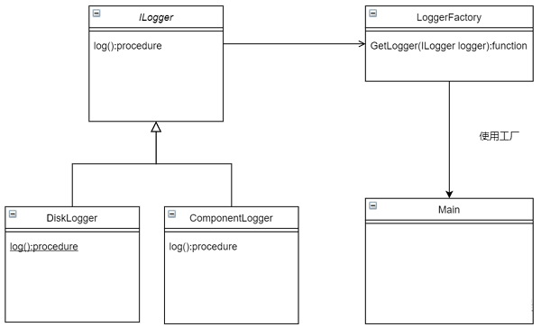

​工厂模式（Factory Pattern）是最常用的设计模式之一。这种类型的设计模式属于创建型模式，它提供了一种创建对象的最佳方式。

在工厂模式中，我们在创建对象时不会对客户端暴露创建逻辑，并且是通过使用一个共同的接口来指向新创建的对象。

## 优点

1. 一个调用者想创建一个对象，只要知道其名称就可以了

2. 扩展性高，如果想增加一个产品，只要扩展一个工厂类就可以

3. 屏蔽产品的具体实现，调用者只关心产品的接口


## 缺点

每次增加一个产品时，都需要增加一个具体类和对象实现工厂，使得系统中类的个数成倍增加，在一定程度上增加了系统的复杂度，同时也增加了系统具体类的依赖。

## 应用场景

1. 日志记录器：记录可能记录到本地硬盘、系统事件、远程服务器等，用户可以选择记录日志到什么地方

2. 设计一个连接服务器的框架，需要三个协议，"POP3"、"IMAP"、"HTTP"，可以把这三个作为产品类，共同实现一个接口。


## 实现





```pascal
unit UnitLogger;
​
interface
​
uses
    System.SysUtils;
​
type
    {日志接口}
    ILogger = interface(IUnKnown)
        ['{2C7DD96A-795F-4D8A-99C7-EC7D4CD9F475}']
        procedure Log();
    end;
​
    {硬盘的实现方式}
    TDiskLogger = class(TInterfacedObject, ILogger)
    public
        procedure Log(); overload;
    end;
​
    {控件的实现方式}
    TComponentLogger = class(TInterfacedObject, ILogger)
        procedure Log(); overload;
    end;
​
    {定义工厂类}
    TLoggerFactory = class(TObject)
    public
        class function GetLogger(LoggerType: Integer): ILogger;
    end;
​
implementation
​
{ TDiskLogger }
​
procedure TDiskLogger.Log;
begin
    Writeln('将日志写入硬盘');
end;
​
{ TComponentLogger }
​
procedure TComponentLogger.Log;
begin
    Writeln('将日志在控件上进行展示');
end;
​
​
{ TLoggerFactory }
class function TLoggerFactory.GetLogger(LoggerType: Integer): ILogger;
begin
    case LoggerType of
        1:
            begin
                Result := TDiskLogger.Create();
            end;
        2:
            begin
                Result := TDiskLogger.Create();
            end;
​
    else
        raise Exception.Create('类型非法');
    end;
end;
​
end.
```

## 调用

```pascal
program Project1;
​
{$APPTYPE CONSOLE}
​
{$R *.res}
​
uses
    System.SysUtils,
    UnitLogger in 'UnitLogger.pas';
​
begin
    try
        var Logger := TLoggerFactory.GetLogger(1);
        Logger.log();
​
    except
        on E: Exception do
            Writeln(E.ClassName, ': ', E.Message);
    end;
​
    readln;
end.
```

> 以上就是工厂模式的简单使用，其实工厂类中的方法最好利用RTTI机制实现对象创建，这样具体的对象就可以实现定制化
