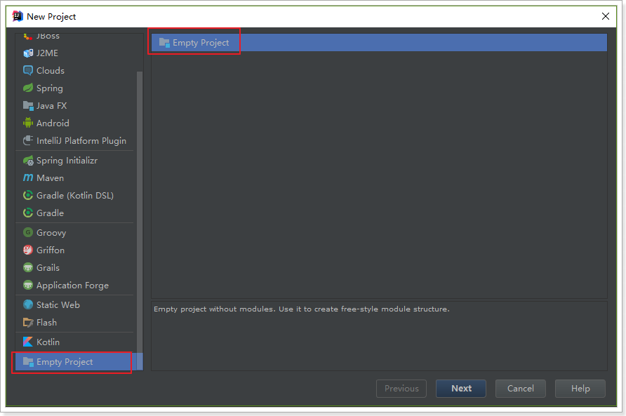
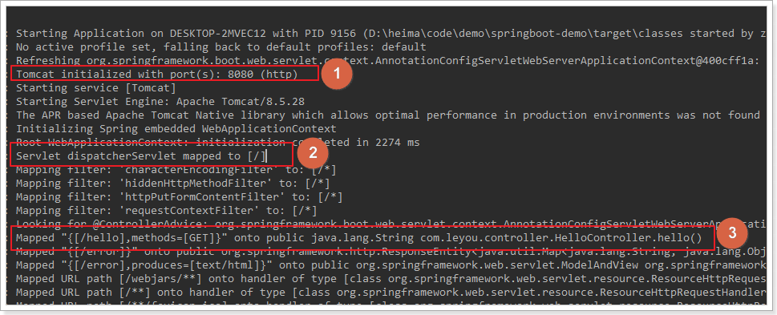
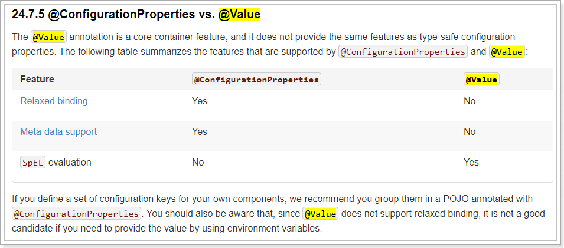
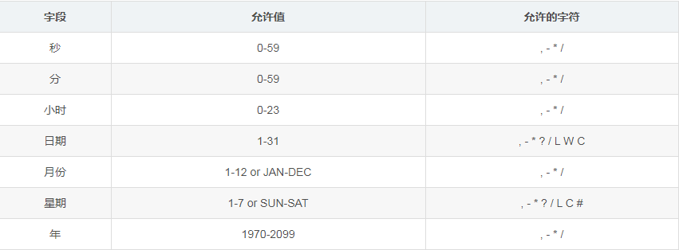
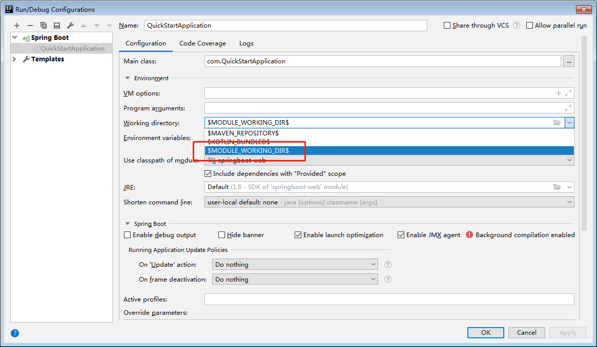

### 1. 为什么要学习SpringBoot

Java一直被人诟病的一点就是臃肿、麻烦。当我们还在辛苦的搭建项目时，可能Python程序员已经把功能写好了，究其原因注意是两点：

- 复杂的配置：项目各种配置其实是开发时的损耗， 因为在思考 Spring 特性配置和解决业务问题之间需要进行思维切换，所以写配置挤占了写应用程序逻辑的时间。

- 一个是混乱的依赖管理：项目的依赖管理也是件吃力不讨好的事情。决定项目里要用哪些库就已经够让人头痛的了，你还要知道这些库的哪个版本和其他库不会有冲突，这难题实在太棘手。并且，依赖管理也是一种损耗，添加依赖不是写应用程序代码。一旦选错了依赖的版本，随之而来的不兼容问题毫无疑问会是生产力杀手。

而SpringBoot让这一切成为过去！

> Spring Boot 简化了基于Spring的应用开发，只需要“run”就能创建一个独立的、生产级别的Spring应用。Spring Boot为Spring平台及第三方库提供开箱即用的设置（提供默认设置，存放默认配置的包就是启动器），这样我们就可以简单的开始。多数Spring Boot应用只需要很少的Spring配置。

我们可以使用SpringBoot创建java应用，并使用java –jar 启动它，就能得到一个生产级别的web工程。


#### 1.1. SpringBoot工程的使用特点

Spring Boot 主要目标是：

为所有 Spring 的开发者提供一个非常快速的、广泛接受的入门体验

开箱即用（启动器starter-其实就是SpringBoot提供的一个jar包），但通过自己设置参数（.properties），即可快速摆脱这种方式。

提供了一些大型项目中常见的非功能性特性，如内嵌服务器、安全、指标，健康检测、外部化配置等

绝对没有代码生成，也无需 XML 配置。

更多细节，可以到[官网](http://projects.spring.io/spring-boot/)查看。


#### 1.2. 快速开始

利用SpringBoot搭建一个web工程，体会一下SpringBoot的魅力所在！

**第一步：创建工程**




**第二步：添加依赖**

传统开发的问题之一就是依赖管理混乱，怎么这里我们还需要管理依赖呢？难道SpringBoot不帮我们管理吗

SpringBoot提供了一个名为spring-boot-starter-parent的工程，里面已经对各种常用依赖（并非全部）的版本进行了管理，我们的项目需要以这个项目为父工程，这样我们就不用操心依赖的版本问题了，需要什么依赖，直接引入坐标即可！

```xml
<parent>
    <groupId>org.springframework.boot</groupId>
    <artifactId>spring-boot-starter-parent</artifactId>
    <version>2.0.0.RELEASE</version>
</parent>
```

为了让SpringBoot帮我们完成各种自动配置，我们必须引入SpringBoot提供的自动配置依赖，我们称为**启动器**。因为我们是web项目，这里我们引入web启动器：

```xml
<dependencies>
    <dependency>
        <groupId>org.springframework.boot</groupId>
        <artifactId>spring-boot-starter-web</artifactId>
    </dependency>
</dependencies>
```

需要注意的是，我们并没有在这里指定版本信息。因为SpringBoot的父工程已经对版本进行了管理了。

这个时候，我们会发现项目中多出了大量的依赖：


这些都是SpringBoot根据spring-boot-starter-web这个依赖自动引入的，而且所有的版本都已经管理好，不会出现冲突

完整的pom.xml

```xml
<?xml version="1.0" encoding="UTF-8"?>
<project xmlns="http://maven.apache.org/POM/4.0.0"
         xmlns:xsi="http://www.w3.org/2001/XMLSchema-instance"
         xsi:schemaLocation="http://maven.apache.org/POM/4.0.0 http://maven.apache.org/xsd/maven-4.0.0.xsd">
    <modelVersion>4.0.0</modelVersion>

    <groupId>com.demo</groupId>
    <artifactId>springboot-demo</artifactId>
    <version>1.0-SNAPSHOT</version>

    <properties>
        <java.version>1.8</java.version>
    </properties>

    <parent>
        <groupId>org.springframework.boot</groupId>
        <artifactId>spring-boot-starter-parent</artifactId>
        <version>2.0.0.RELEASE</version>
    </parent>

    <dependencies>
        <dependency>
            <groupId>org.springframework.boot</groupId>
            <artifactId>spring-boot-starter-web</artifactId>
        </dependency>
    </dependencies>
</project>
```

**第三步：编写启动类**


```java
@SpringBootApplication
public class Application {
    public static void main(String[] args) {
        SpringApplication.run(Application.class, args);
    }
}
```

**第四步：编写Controller**


```java
@RestController
public class HelloController {

    @GetMapping("hello")
    public String hello(){
        return "hello, spring boot!";
    }
}
```

**第五步：启动测试**

接下来，我们运行main函数，查看控制台：


并且可以看到监听的端口信息：



打开页面访问：http://localhost:8080/hello


### 2. Java配置

在入门案例中，我们没有任何的配置，就可以实现一个SpringMVC的项目了，快速、高效！

但是，如果没有任何的xml，那么我们如果要配置一个Bean该怎么办？比如我们要配置一个数据库连接池，以前会这么玩：

```xml
<!-- 配置连接池 -->
<bean id="dataSource" class="com.alibaba.druid.pool.DruidDataSource"
      init-method="init" destroy-method="close">
    <property name="url" value="${jdbc.url}" />
    <property name="username" value="${jdbc.username}" />
    <property name="password" value="${jdbc.password}" />
</bean>
```

现在该怎么做呢？

#### 2.1. 回顾历史

事实上，在Spring3.0开始，Spring官方就已经开始推荐使用java配置来代替传统的xml配置了，我们不妨来回顾一下Spring的历史：

**Spring1.0时代**

在此时因为jdk1.5刚刚出来，注解开发并未盛行，因此一切Spring配置都是xml格式，想象一下所有的bean都用xml配置，细思极恐啊，心疼那个时候的程序员2秒

**Spring2.0时代**

Spring引入了注解开发，但是因为并不完善，因此并未完全替代xml，此时的程序员往往是把xml与注解进行结合，貌似我们之前都是这种方式。

**Spring3.0及以后**

3.0以后Spring的注解已经非常完善了，因此Spring推荐大家使用完全的java配置来代替以前的xml，不过似乎在国内并未推广盛行。然后当SpringBoot来临，人们才慢慢认识到java配置的优雅。

有句古话说的好：拥抱变化，拥抱未来。所以我们也应该顺应时代潮流，做时尚的弄潮儿，一起来学习下java配置的玩法。

#### 2.2. 尝试Java配置

Java配置主要靠java类和一些注解，比较常用的注解有：

- @Configuration：声明一个类作为配置类，代替xml文件
- @Bean：声明在方法上，将方法的返回值加入Bean容器，代替`<bean>`标签
- @value：属性注入
- @PropertySource：指定外部属性文件，

我们接下来用java配置来尝试实现连接池配置：

首先引入Druid连接池依赖：

```xml
<dependency>
    <groupId>com.alibaba</groupId>
    <artifactId>druid</artifactId>
    <version>1.1.6</version>
</dependency>
```

创建一个jdbc.properties文件，编写jdbc属性：

```.properties
jdbc.driverClassName=com.mysql.jdbc.Driver
jdbc.url=jdbc:mysql://127.0.0.1:3306/leyou
jdbc.username=root
jdbc.password=123
```

编写代码：

```java
@Configuration
@PropertySource("classpath:jdbc.properties")
public class JdbcConfig {

    @Value("${jdbc.url}")
    String url;
    @Value("${jdbc.driverClassName}")
    String driverClassName;
    @Value("${jdbc.username}")
    String username;
    @Value("${jdbc.password}")
    String password;

    @Bean
    public DataSource dataSource() {
        DruidDataSource dataSource = new DruidDataSource();
        dataSource.setUrl(url);
        dataSource.setDriverClassName(driverClassName);
        dataSource.setUsername(username);
        dataSource.setPassword(password);
        return dataSource;
    }
}
```

说明：

- @Configuration：声明我们`JdbcConfig`是一个配置类
- @PropertySource：指定属性文件的路径是:`classpath:jdbc.properties`
- 通过@Value为属性注入值
- 通过@Bean将dataSource()方法声明为一个注册Bean的方法，Spring会自动调用该方法，将方法的返回值加入Spring容器中。

然后我们就可以在任意位置通过**@Autowired**注入DataSource了！

```java
@RestController
public class HelloController {

    @Autowired
    private DataSource dataSource;

    @GetMapping("hello")
    public String hello() {
        return "hello, spring boot!" + dataSource;
    }
}
```
然后Debug运行并查看：


### 3. SpringBoot的属性注入

在上面的案例中，我们实验了Java配置方式。不过属性注入使用的是@Value注解。这种方式虽然可行，但是不够强大，因为它只能注入基本类型值。

在SpringBoot中，提供了一种新的属性注入方式，支持各种java基本数据类型及复杂类型的注入。


我们新建一个类，用来进行属性注入：

```java
@ConfigurationProperties(prefix = "jdbc")
public class JdbcProperties {
    private String url;
    private String driverClassName;
    private String username;
    private String password;
    // ... 略
    // getters 和 setters
}
```

- 在类上通过@ConfigurationProperties注解声明当前类为属性读取类

- prefix="jdbc"`读取属性文件中，前缀为jdbc的值。

- 在类上定义各个属性，名称必须与属性文件中**jdbc.**后面部分一致

- 需要注意的是，这里我们并没有指定属性文件的地址，所以我们需要把jdbc.properties名称改为application.properties，这是SpringBoot默认读取的属性文件名：

在JdbcConfig中使用这个属性：

```java
@Configuration
@EnableConfigurationProperties(JdbcProperties.class)
public class JdbcConfig {
    @Bean
    public DataSource dataSource(JdbcProperties jdbc) {
        DruidDataSource dataSource = new DruidDataSource();
        dataSource.setUrl(jdbc.getUrl());
        dataSource.setDriverClassName(jdbc.getDriverClassName());
        dataSource.setUsername(jdbc.getUsername());
        dataSource.setPassword(jdbc.getPassword());
        return dataSource;
    }
}
```

通过**@EnableConfigurationProperties(JdbcProperties.class)**来声明要使用**JdbcProperties**这个类的对象


然后你可以通过以下方式注入JdbcProperties：

@Autowired注入

```java
@Autowired
private JdbcProperties prop;
```
构造函数注入

```java
private JdbcProperties prop;
public JdbcConfig(Jdbcproperties prop){
    this.prop = prop;
}
```

声明有@Bean的方法参数注入

```java
@Bean
public Datasource dataSource(JdbcProperties prop){
    // ...
}
```

这种方式似乎更麻烦了，事实上这种方式有更强大的功能，也是SpringBoot推荐的注入方式。两者对比关系：




优势：

Relaxed binding：松散绑定

- 不严格要求属性文件中的属性名与成员变量名一致。支持驼峰，中划线，下划线等等转换，甚至支持对象引导。比如：user.friend.name：代表的是user对象中的friend属性中的name属性，显然friend也是对象。@value注解就难以完成这样的注入方式。

- meta-data support：元数据支持，帮助IDE生成属性提示（写开源框架会用到）。

#### 3.1. 更优雅的注入

事实上，如果一段属性只有一个Bean需要使用，我们无需将其注入到一个类（JdbcProperties）中。而是直接在需要的地方声明即可：

```java
@Configuration
public class JdbcConfig {

    @Bean
    // 声明要注入的属性前缀，SpringBoot会自动把相关属性通过set方法注入到DataSource中
    @ConfigurationProperties(prefix = "jdbc")
    public DataSource dataSource() {
        DruidDataSource dataSource = new DruidDataSource();
        return dataSource;
    }
}
```

我们直接把**@ConfigurationProperties(prefix = "jdbc")**声明在需要使用的**@Bean**的方法上，然后SpringBoot就会自动调用这个Bean（此处是DataSource）的set方法，然后完成注入。使用的前提是：**该类必须有对应属性的set方法！**

### 4. 自动配置原理

使用SpringBoot之后，一个整合了SpringMVC的WEB工程开发，变的无比简单，那些繁杂的配置都消失不见了，这是如何做到的？

#### 4.1. 注解-@SpringBootApplication

Spring Boot提供一个方便的 @SpringBootApplication 选择。该注解等价于以默认属性使用 @Configuration ， @EnableAutoConfiguration 和 @ComponentScan 。

```java
@SpringBootApplication
public class QuickStartApplication {
	public static void main(String[] args) {
		SpringApplication.run(QuickStartApplication.class, args);
	}

}
```

#### 4.2. 注解-@SpringBootConfiguration

在这个注解上面，又有一个**@Configuration**注解。通过上面的注释阅读我们知道：这个注解的作用就是声明当前类是一个配置类，然后Spring会自动扫描到添加了**@Configuration**的类，并且读取其中的配置信息。而**@SpringBootConfiguration**是来声明当前类是SpringBoot应用的配置类，项目中只能有一个。所以一般我们无需自己添加。

#### 4.3. 注解-@EnableAutoConfiguration

关于这个注解，官网上有一段说明：

> The second class-level annotation is **@EnableAutoConfiguration**. This annotation tells Spring Boot to “guess” how you want to configure Spring, based on the jar dependencies that you have added. Since **spring-boot-starter-web** added Tomcat and Spring MVC, the auto-configuration assumes that you are developing a web application and sets up Spring accordingly.

简单翻译一下：

>  第二级的注解**@EnableAutoConfiguration**，告诉SpringBoot基于你所添加的依赖，去“猜测”你想要如何配置Spring。比如我们引入了**spring-boot-starter-web**，而这个启动器中帮我们添加了Tomcat、SpringMVC的依赖。此时自动配置就知道你是要开发一个web应用，所以就帮你完成了web及SpringMVC的默认配置了！


总结，SpringBoot内部对大量的第三方库或Spring内部库进行了默认配置，这些配置是否生效，取决于我们是否引入了对应库所需的依赖，如果有那么默认配置就会生效。

所以，我们使用SpringBoot构建一个项目，只需要引入所需框架的依赖，配置就可以交给SpringBoot处理了。除非你不希望使用SpringBoot的默认配置，它也提供了自定义配置的入口。


#### 4.4. 注解-@ComponentScan


并没有看到什么特殊的地方。我们查看类的注释中有一段话：


大概的意思：

> 配置组件扫描的指令。提供了类似与**<context:component-scan>**标签的作用
> 通过basePackageClasses或者basePackages属性来指定要扫描的包。如果没有指定这些属性，那么将从声明这个注解的类所在的包开始，扫描包及子包

而我们的@SpringBootApplication注解声明的类就是main函数所在的启动类，因此扫描的包是该类所在包及其子包。因此，**一般启动类会放在一个比较前的包目录中。**

### 5. 默认配置原理

我们知道@EnableAutoConfiguration会开启SpringBoot的自动配置，并且根据你引入的依赖来生效对应的默认配置。那么问题来了

- 这些默认配置是在哪里定义的呢？
- 为何依赖引入就会触发配置呢？

其实在我们的项目中，已经引入了一个依赖：spring-boot-autoconfigure，其中定义了大量自动配置类：


非常多，几乎涵盖了现在主流的开源框架，我们来看一个我们熟悉的，例如SpringMVC，查看mvc 的自动配置类：


打开之后内容如下：


我们看到这个类上的4个注解：

@Configuration：声明这个类是一个配置类

@ConditionalOnWebApplication(type = Type.SERVLET)

- ConditionalOn，翻译就是在某个条件下，此处就是满足项目的类是是Type.SERVLET类型，也就是一个普通web工程，显然我们就是

@ConditionalOnClass({ Servlet.class, DispatcherServlet.class, WebMvcConfigurer.class })

- 这里的条件是OnClass，也就是满足以下类存在：Servlet、DispatcherServlet、WebMvcConfigurer，其中Servlet只要引入了tomcat依赖自然会有，后两个需要引入SpringMVC才会有。这里就是判断你是否引入了相关依赖，引入依赖后该条件成立，当前类的配置才会生效！

@ConditionalOnMissingBean(WebMvcConfigurationSupport.class)

- 这个条件与上面不同，OnMissingBean，是说环境中没有指定的Bean这个才生效。其实这就是自定义配置的入口，也就是说，如果我们自己配置了一个WebMVCConfigurationSupport的类，那么这个默认配置就会失效！


#### 5.1. 默认配置属性

默认配置的属性来自哪里呢？


我们看到，这里通过@EnableAutoConfiguration注解引入了两个属性：WebMvcProperties和ResourceProperties。这就是SpringBoot的属性注入的玩法。

找到了内部资源视图解析器的prefix和suffix属性。

ResourceProperties中主要定义了静态资源（.js,.html,.css等)的路径：


如果我们要覆盖这些默认属性，只需要在application.properties中定义与其前缀prefix和字段名一致的属性即可。


#### 5.2. 总结

SpringBoot为我们提供了默认配置，而默认配置生效的条件一般有两个：

- 你引入了相关依赖
- 你自己没有配置

**启动器**

所以，我们如果不想配置，只需要引入依赖即可，而依赖版本我们也不用操心，因为只要引入了SpringBoot提供的stater（启动器），就会自动管理依赖及版本了。

因此，玩SpringBoot的第一件事情，就是找启动器，SpringBoot提供了大量的默认启动器

**全局配置**

SpringBoot的默认配置，都会读取默认属性，而这些属性可以通过自定义`application.properties`文件来进行覆盖。这样虽然使用的还是默认配置，但是配置中的值改成了我们自定义的。


### 6. 核心配置文件

因为项目的运行环境，一般情况下我们会准备两套甚至多套环境，而SpringBoot支持这种多环境配置

默认情况下SpringBoot的核心配置文件名：application.properties

在这个核心配置文件中我们一般存放项目的共同配置，但是有一些不同的配置分开存放，默认的名字application-xxxx.propertie

在核心配置文件中我们通过`spring.profiles.active` 来指定启动时使用那一套配置，例如：

```properties
# application-dev.properties
server.port=8081
```

```properties
# application.properties
spring.profiles.active=dev
```


#### 6.1. yaml配置文件

yaml配置文件在springboot中除了properties的特性外还有一些其他的特性，例如可以在同一文件中分段定义环境

```yaml
spring:
  profiles:
    active: dev

---
server:
  port: 8081
---

server:
  port: 8082
```

#### 6.2. yaml特点

SpringBoot除了支持properties属性配置文件外，也支持yaml的配置文件，这种类型的配置文件对数据格式的支持更灵活，不像properties只能使用key=value的方式


YAML 语言（发音 /ˈjæməl/ ）的设计目标，就是方便人类读写。它实质上是一种通用的数据串行化格式。

它的基本语法规则如下。

- 大小写敏感
- 使用缩进表示层级关系
- 缩进时不允许使用Tab键，只允许使用空格。
- 缩进的空格数目不重要，只要相同层级的元素左侧对齐即可

`# ` 表示注释，从这个字符一直到行尾，都会被解析器忽略。

YAML 支持的数据结构有三种。

- 对象：键值对的集合，又称为映射（mapping）/ 哈希（hashes） / 字典（dictionary）
- 数组：一组按次序排列的值，又称为序列（sequence） / 列表（list）
- 纯量（scalars）：单个的、不可再分的值

#### 6.3. 对象

对象的一组键值对，使用冒号结构表示。`animal: pets`

Yaml 也允许另一种写法，将所有键值对写成一个行内对象。`hash: { name: Steve, foo: bar } `

#### 6.4. 数组

一组连词线开头的行，构成一个数组。

```yaml
- Cat
- Dog
- Goldfish
```

数据结构的子成员是一个数组，则可以在该项下面缩进一个空格。

```yaml
-
 - Cat
 - Dog
 - Goldfish
```

#### 6.5. 复合结构

对象和数组可以结合使用，形成复合结构。

```yaml
languages:
 - Ruby
 - Perl
 - Python
websites:
 YAML: yaml.org
 Ruby: ruby-lang.org
 Python: python.org
 Perl: use.perl.org
```

#### 6.6. 字符串

字符串是最常见，也是最复杂的一种数据类型。

字符串默认不使用引号表示。`str: 这是一行字符串`

单引号之中如果还有单引号，必须连续使用两个单引号转义

```yaml
str: 'labor''s day'
```

字符串可以写成多行，从第二行开始，必须有一个单空格缩进。换行符会被转为空格。

```yaml
str: 这是一段
  多行
  字符串
```

更详细的语法参考 [阮一峰：YAML 语言教程](http://www.ruanyifeng.com/blog/2016/07/yaml.html)


### 7. 定时任务


后台项目开发中经常会用到定时任务，现在实现定时任务都方式也是多种多样。下面列举几种常见的定时任务实现方式：

1. Quartz：Quartz的使用相当广泛，它是一个功能强大的调度器，当然使用起来也相对麻烦；

    - 注解：@EnableScheduling作用于配置类，表示启动定时任务
    - 注解：@Scheduled(cron="0/2 * * * * ?")作用于方法，表示按指定周期执行该方法；cron为定时表达式

2. java.util包里的Timer，它也可以实现定时任务但是功能过于单一所有使用很少。


```java
@Component
@Slf4j
public class ScheduledTasks {
    private int fixedDelayCount = 1;
    private int fixedRateCount = 1;
    private int initialDelayCount = 1;
    private int cronCount = 1;
    //fixedDelay = 5000表示当前方法执行完毕5000ms后，Spring scheduling会再次调用该方法
    @Scheduled(fixedDelay = 5000)
    public void testFixDelay() {
        log.info("===fixedDelay: 第{}次执行方法", fixedDelayCount++);
    }
    //fixedRate = 5000表示当前方法开始执行5000ms后，Spring scheduling会再次调用该方法
    @Scheduled(fixedRate = 5000)
    public void testFixedRate() {
        log.info("===fixedRate: 第{}次执行方法", fixedRateCount++);
    }
    //initialDelay = 1000表示延迟1000ms执行第一次任务
    @Scheduled(initialDelay = 1000, fixedRate = 5000)
    public void testInitialDelay() {
        log.info("===initialDelay: 第{}次执行方法", initialDelayCount++);
    }
    //cron接受cron表达式，根据cron表达式确定定时规则
    @Scheduled(cron = "0 0/1 * * * ?")
    public void testCron() {
        log.info("===initialDelay: 第{}次执行方法", cronCount++);
    }

}
```

| 属性               | 描述                                                   |
| :----------------- | :----------------------------------------------------- |
| cron               | 指定任务在特定时间执行                                   |
| fixedDelay         | 表示上一次任务执行完成后多久再次执行，参数类型为long，单位ms |
| fixedDelayString   | 与fixedDelay含义一样，只是参数类型变为String              |
| fixedRate          | 表示按一定的频率执行任务，参数类型为long，单位ms            |
| fixedRateString    | 与fixedRate的含义一样，只是将参数类型变为String            |
| initialDelay       | 表示延迟多久再第一次执行任务，参数类型为long，单位ms        |
| initialDelayString | 与initialDelay的含义一样，只是将参数类型变为String         |
| zone               | 时区，默认为当前时区，一般没有用到。                       |


**开启定时任务**

```java
@SpringBootApplication
@EnableScheduling
public class Application {
    public static void main(String[] args) {
        SpringApplication.run(Application.class, args);
    }
}
```

#### 7.1. cron表达式

@Scheduled(cron = " 0/10 * * * * ? ")  表达式从**左到右**分别代表：　秒 分 时 日 月 星期 年份




“ * ” 表示所有值 在秒的位置写“ * ”表示每秒

“ ? ” 用来指定“非明确的值”

“-” 表示至，例如日期中“2-5”，指的是2号、3号、4号、5号

“，” 表示和，例如日期中“2,5”，指的是2号和5号

“/” 表示增量，例如上面实现代码中的“0/10”，指的是每隔10秒

常用表达式

```
0 0 10,14,16 * * ?           每天上午10点，下午2点，4点
0 0/30 9-17 * * ?            朝九晚五工作时间内每半小时
0 0 12 ? *                   WED 表示每个星期三中午12点
"0 0 12 * * ?"               每天中午12点触发
"0 15 10 ? * *"              每天上午10:15触发
"0 15 10 * * ?"              每天上午10:15触发
"0 15 10 * * ? *"            每天上午10:15触发
"0 15 10 * * ? 2017"         2017年的每天上午10:15触发
"0 * 14 * * ?"               在每天下午2点到下午2:59期间的每1分钟触发
"0 0/5 14 * * ?"             在每天下午2点到下午2:55期间的每5分钟触发
"0 0/5 14,18 * * ?"          在每天下午2点到2:55期间和下午6点到6:55期间的每5分钟触发
"0 0-5 14 * * ?"             在每天下午2点到下午2:05期间的每1分钟触发
"0 10,44 14 ? 3 WED"         每年三月的星期三的下午2:10和2:44触发
"0 15 10 ? * MON-FRI"        周一至周五的上午10:15触发
"0 15 10 15 * ?"             每月15日上午10:15触发
"0 15 10 L * ?"              每月最后一日的上午10:15触发
"0 15 10 ? * 6L"             每月的最后一个星期五上午10:15触发
"0 15 10 ? * 6L 2002-2005"   2002年至2005年的每月的最后一个星期五上午10:15触发
"0 15 10 ? * 6#3"        每月的第三个星期五上午10:15触发
```

cron表达式生成工具：[http://cron.qqe2.com/](http://cron.qqe2.com/)

### 8. SpringBoot整合SSM+Thymeleaf

#### 8.1. 依赖

```xml
<parent>
    <groupId>org.springframework.boot</groupId>
    <artifactId>spring-boot-starter-parent</artifactId>
    <version>2.1.9.RELEASE</version>
    <relativePath>./</relativePath>
</parent>

<groupId>com.example</groupId>
<artifactId>quick-start</artifactId>
<version>0.0.1-SNAPSHOT</version>
<name>quick-start</name>
<description>spring boot 案例</description>

<properties>
    <java.version>1.8</java.version>
</properties>

<dependencies>
    <dependency>
        <groupId>org.springframework.boot</groupId>
        <artifactId>spring-boot-starter-test</artifactId>
        <scope>test</scope>
    </dependency>
    <dependency>
        <groupId>org.springframework.boot</groupId>
        <artifactId>spring-boot-starter-web</artifactId>
    </dependency>
    <dependency>
        <groupId>org.mybatis.spring.boot</groupId>
        <artifactId>mybatis-spring-boot-starter</artifactId>
        <version>1.3.0</version>
    </dependency>
    <dependency>
        <groupId>tk.mybatis</groupId>
        <artifactId>mapper-spring-boot-starter</artifactId>
        <version>2.1.5</version>
    </dependency>

    <!--mysql jdbc驱动 -->
    <dependency>
        <groupId>mysql</groupId>
        <artifactId>mysql-connector-java</artifactId>
        <version>5.1.38</version>
    </dependency>
    <!-- Druid连接池 -->
    <dependency>
        <groupId>com.alibaba</groupId>
        <artifactId>druid-spring-boot-starter</artifactId>
        <version>1.1.10</version>
    </dependency>

    <dependency>
        <groupId>org.projectlombok</groupId>
        <artifactId>lombok</artifactId>
        <scope>provided</scope>
    </dependency>
    <!--日志依赖-->
    <dependency>
        <groupId>ch.qos.logback</groupId>
        <artifactId>logback-classic</artifactId>
    </dependency>
    <dependency>
        <groupId>com.github.pagehelper</groupId>
        <artifactId>pagehelper-spring-boot-starter</artifactId>
        <version>1.2.10</version>
    </dependency>
    <dependency>
        <groupId>org.springframework.boot</groupId>
        <artifactId>spring-boot-starter-thymeleaf</artifactId>
    </dependency>
    <dependency>
        <groupId>org.springframework.boot</groupId>
        <artifactId>spring-boot-devtools</artifactId>
        <optional>true</optional>
    </dependency>
</dependencies>

<build>
    <plugins>
        <plugin>
            <groupId>org.springframework.boot</groupId>
            <artifactId>spring-boot-maven-plugin</artifactId>
            <configuration>
                <fork>true</fork>
            </configuration>
        </plugin>
    </plugins>
</build>
```

#### 8.2. application.properties

```properties
# 连接四大参数
spring.datasource.url=jdbc:mysql://localhost:3306/springboot
spring.datasource.username=root
spring.datasource.password=123456
# 可省略，SpringBoot自动推断
spring.datasource.driverClassName=com.mysql.jdbc.Driver


#初始化连接数
spring.datasource.druid.initial-size=1
#最小空闲连接
spring.datasource.druid.min-idle=1
#最大活动连接
spring.datasource.druid.max-active=20
#获取连接时测试是否可用
spring.datasource.druid.test-on-borrow=true
#监控页面启动
spring.datasource.druid.stat-view-servlet.allow=true

#别名
mybatis.type-aliases-package=com.example.quickstart.domain
#xml映射文件
mybatis.mapper-locations=classpath:mapper/*.xml
#分页插件
pagehelper.helperDialect=mysql

spring.thymeleaf.cache=false


spring.mvc.view.prefix=/
spring.mvc.view.suffix=.html

```


#### 8.3. 启动类

```java
@SpringBootApplication
@MapperScan("com.example.quickstart.mapper")
public class QuickStartApplication {

	public static void main(String[] args) {
		SpringApplication.run(QuickStartApplication.class, args);
	}

}
```

#### 8.4. 整合SpringMVC

**访问静态资源**

我们的项目是一个jar工程，那么就没有webapp，我们的静态资源该放哪里呢？

回顾我们上面看的源码，有一个叫做ResourceProperties的类，里面就定义了静态资源的默认查找路径：


默认的静态资源路径为：

- classpath:/META-INF/resources/
- classpath:/resources/
- classpath:/static/
- classpath:/public

只要静态资源放在这些目录中任何一个，SpringMVC都会帮我们处理。

**添加拦截器**

拦截器也是我们经常需要使用的，在SpringBoot中该如何配置呢？

拦截器不是一个普通属性，而是一个类，所以就要用到java配置方式了。在SpringBoot官方文档中有这么一段说明：

> If you want to keep Spring Boot MVC features and you want to add additional [MVC configuration](https://docs.spring.io/spring/docs/5.0.5.RELEASE/spring-framework-reference/web.html#mvc) (interceptors, formatters, view controllers, and other features), you can add your own **@Configuration** class of type **WebMvcConfigurer** but **without** **@EnableWebMvc**. If you wish to provide custom instances of **RequestMappingHandlerMapping**, **RequestMappingHandlerAdapter**, or **ExceptionHandlerExceptionResolver**, you can declare a **WebMvcRegistrationsAdapter** instance to provide such components.
> If you want to take complete control of Spring MVC, you can add your own **@Configuration** annotated with **@EnableWebMvc**

翻译：

> 如果你想要保持Spring Boot 的一些默认MVC特征，同时又想自定义一些MVC配置（包括：拦截器，格式化器, 视图控制器、消息转换器 等等），你应该让一个类实现**WebMvcConfigurer**，并且添加**@Configuration**注解，但是**千万不要**加**@EnableWebMvc**注解。如果你想要自定义**HandlerMapping**、**HandlerAdapter**、**ExceptionResolver**等组件，你可以创建一个**WebMvcRegistrationsAdapter**实例 来提供以上组件。
> 如果你想要完全自定义SpringMVC，不保留SpringBoot提供的一切特征，你可以自己定义类并且添加**@Configuration**注解和**@EnableWebMvc**注解

总结：通过实现**WebMvcConfigurer**并添加**@Configuration**注解来实现自定义部分SpringMvc配置。


```java
//定义拦截器类
public class LoginInterceptor implements HandlerInterceptor {

    private Logger logger = LoggerFactory.getLogger(LoginInterceptor.class);
    @Override
    public boolean preHandle(HttpServletRequest request, HttpServletResponse response, Object handler) {
        logger.debug("preHandle method is now running!");
        return true;
    }

    @Override
    public void postHandle(HttpServletRequest request, HttpServletResponse response, Object handler, ModelAndView modelAndView) {
        logger.debug("postHandle method is now running!");
    }

    @Override
    public void afterCompletion(HttpServletRequest request, HttpServletResponse response, Object handler, Exception ex) {
        logger.debug("afterCompletion method is now running!");
    }
}
```

```java
@Configuration
public class MvcConfig implements WebMvcConfigurer{
    /**
     * 通过@Bean注解，将我们定义的拦截器注册到Spring容器
     * @return
     */
    @Bean
    public LoginInterceptor loginInterceptor(){
        return new LoginInterceptor();
    }

    /**
     * 重写接口中的addInterceptors方法，添加自定义拦截器
     * @param registry
     */
    @Override
    public void addInterceptors(InterceptorRegistry registry) {
        // 通过registry来注册拦截器，通过addPathPatterns来添加拦截路径
        registry.addInterceptor(this.loginInterceptor()).addPathPatterns("/**");
    }
}
```

#### 8.5. 整合事务

spring中的jdbc连接和事务是配置中的重要一环，在SpringBoot中该如何处理呢？


答案是不需要处理，我们只要找到SpringBoot提供的启动器即可：


```xml
<dependency>
    <groupId>org.springframework.boot</groupId>
    <artifactId>spring-boot-starter-jdbc</artifactId>
</dependency>
```

当然，不要忘了数据库驱动，SpringBoot并不知道我们用的什么数据库，这里我们选择MySQL：

```xml
<dependency>
    <groupId>mysql</groupId>
    <artifactId>mysql-connector-java</artifactId>
</dependency>
```

至于事务，SpringBoot中通过注解来控制。就是我们熟知的**@Transactional**

```java
@Service
public class UserService {

    @Autowired
    private UserMapper userMapper;

    public User queryById(Long id){
        return this.userMapper.selectByPrimaryKey(id);
    }

    @Transactional
    public void deleteById(Long id){
        this.userMapper.deleteByPrimaryKey(id);
    }
}
```

#### 8.6. 整合连接池

理论上只要我们导入连接池依赖就可以了

HikariCP应该是目前速度最快的连接池了，我们看看它与c3p0的对比：


因此，我们只需要指定连接池参数即可：

```properties
# 连接四大参数
spring.datasource.url=jdbc:mysql://localhost:3306/heima
spring.datasource.username=root
spring.datasource.password=123
# 可省略，SpringBoot自动推断
spring.datasource.driverClassName=com.mysql.jdbc.Driver

spring.datasource.hikari.idle-timeout=60000
spring.datasource.hikari.maximum-pool-size=30
spring.datasource.hikari.minimum-idle=10
```

当然，如果你更喜欢Druid连接池，也可以使用Druid官方提供的启动器：

```xml
<!-- Druid连接池 -->
<dependency>
    <groupId>com.alibaba</groupId>
    <artifactId>druid-spring-boot-starter</artifactId>
    <version>1.1.10</version>
</dependency>
```

而连接信息的配置与上面是类似的，只不过在连接池特有属性上，方式略有不同：

```properties
#初始化连接数
spring.datasource.druid.initial-size=1
#最小空闲连接
spring.datasource.druid.min-idle=1
#最大活动连接
spring.datasource.druid.max-active=20
#获取连接时测试是否可用
spring.datasource.druid.test-on-borrow=true
#监控页面启动
spring.datasource.druid.stat-view-servlet.allow=true
```
#### 8.7. 整合JSP

默认情况下SpringBoot不支持JSP，并且官方也**不推荐使用JSP**，官方推荐的模板引擎是Thymeleaf

1. 开启SpringBoot的JSP支持，添加下面的依赖

```xml
<!--jsp的支持的依赖-->
<dependency>
    <groupId>org.apache.tomcat.embed</groupId>
    <artifactId>tomcat-embed-jasper</artifactId>
</dependency>
```

2. 设置当前模块的工作的目录，否则JSP页面无法跳转




### 9. Spring Boot Starter

#### 9.1. 应用类

|                     名称                      |                                                                                                                                                              描述                                                                                                                                                              |                                                                                  POM                                                                                   |
| --------------------------------------------- | ------------------------------------------------------------------------------------------------------------------------------------------------------------------------------------------------------------------------------------------------------------------------------------------------------------------------------ | ---------------------------------------------------------------------------------------------------------------------------------------------------------------------- |
| `spring-boot-starter`                         | 核心 starter，包含自动配置支持、日志和 YAML                                                                                                                                                                                                                                                                                       | [Pom](https://github.com/spring-projects/spring-boot/tree/v2.0.0.RELEASE/spring-boot-project/spring-boot-starters/spring-boot-starter/pom.xml)                         |
| `spring-boot-starter-activemq`                | 提供 JMS 消息支持，使用 Apache ActiveMQ                                                                                                                                                                                                                                                                                          | [Pom](https://github.com/spring-projects/spring-boot/tree/v2.0.0.RELEASE/spring-boot-project/spring-boot-starters/spring-boot-starter-activemq/pom.xml)                |
| `spring-boot-starter-amqp`                    | 提供 Spring AMQP 与 Rabbit MQ 支持                                                                                                                                                                                                                                                                                              | [Pom](https://github.com/spring-projects/spring-boot/tree/v2.0.0.RELEASE/spring-boot-project/spring-boot-starters/spring-boot-starter-amqp/pom.xml)                    |
| `spring-boot-starter-aop`                     | 提供 Spring AOP 与 AspectJ 面向切面编程支持                                                                                                                                                                                                                                                                                      | [Pom](https://github.com/spring-projects/spring-boot/tree/v2.0.0.RELEASE/spring-boot-project/spring-boot-starters/spring-boot-starter-aop/pom.xml)                     |
| `spring-boot-starter-artemis`                 | 提供 JMS 消息服务支持，使用 Apache Artemis                                                                                                                                                                                                                                                                                       | [Pom](https://github.com/spring-projects/spring-boot/tree/v2.0.0.RELEASE/spring-boot-project/spring-boot-starters/spring-boot-starter-artemis/pom.xml)                 |
| `spring-boot-starter-batch`                   | 提供 Spring Batch 支持                                                                                                                                                                                                                                                                                                         | [Pom](https://github.com/spring-projects/spring-boot/tree/v2.0.0.RELEASE/spring-boot-project/spring-boot-starters/spring-boot-starter-batch/pom.xml)                   |
| `spring-boot-starter-cache`                   | 提供 Spring Framework 缓存支持                                                                                                                                                                                                                                                                                                  | [Pom](https://github.com/spring-projects/spring-boot/tree/v2.0.0.RELEASE/spring-boot-project/spring-boot-starters/spring-boot-starter-cache/pom.xml)                   |
| `spring-boot-starter-cloud-connectors`        | 使用 Spring Cloud Connectors 简单连接到类似 Cloud Foundry 和 Heroku 等云平台                                                                                                                                                                                                                                                      | [Pom](https://github.com/spring-projects/spring-boot/tree/v2.0.0.RELEASE/spring-boot-project/spring-boot-starters/spring-boot-starter-cloud-connectors/pom.xml)        |
| `spring-boot-starter-data-cassandra`          | 提供对 Cassandra 分布式数据库和 Spring Data Cassandra 的支持                                                                                                                                                                                                                                                                     | [Pom](https://github.com/spring-projects/spring-boot/tree/v2.0.0.RELEASE/spring-boot-project/spring-boot-starters/spring-boot-starter-data-cassandra/pom.xml)          |
| `spring-boot-starter-data-cassandra-reactive` | 提供对 Cassandra 分布式数据库和 Spring Data Cassandra Reactive 的支持                                                                                                                                                                                                                                                            | [Pom](https://github.com/spring-projects/spring-boot/tree/v2.0.0.RELEASE/spring-boot-project/spring-boot-starters/spring-boot-starter-data-cassandra-reactive/pom.xml) |
| `spring-boot-starter-data-couchbase`          | 提供对 Couchbase 面向文档数据库和 Spring Data Couchbase 的支持                                                                                                                                                                                                                                                                    | [Pom](https://github.com/spring-projects/spring-boot/tree/v2.0.0.RELEASE/spring-boot-project/spring-boot-starters/spring-boot-starter-data-couchbase/pom.xml)          |
| `spring-boot-starter-data-couchbase-reactive` | 提供对 Couchbase 面向文档数据库和 Spring Data Couchbase Reactive 的支持                                                                                                                                                                                                                                                           | [Pom](https://github.com/spring-projects/spring-boot/tree/v2.0.0.RELEASE/spring-boot-project/spring-boot-starters/spring-boot-starter-data-couchbase-reactive/pom.xml) |
| `spring-boot-starter-data-elasticsearch`      | 提供对 Elasticseach 搜索与分析引擎和 Spring Data Elasticsearch 的支持                                                                                                                                                                                                                                                             | [Pom](https://github.com/spring-projects/spring-boot/tree/v2.0.0.RELEASE/spring-boot-project/spring-boot-starters/spring-boot-starter-data-elasticsearch/pom.xml)      |
| `spring-boot-starter-data-jpa`                | 提供 Spring Data JPA 与 Hibernate 的支持                                                                                                                                                                                                                                                                                        | [Pom](https://github.com/spring-projects/spring-boot/tree/v2.0.0.RELEASE/spring-boot-project/spring-boot-starters/spring-boot-starter-data-jpa/pom.xml)                |
| `spring-boot-starter-data-ldap`               | 提供对 Spring Data LDAP 的支持                                                                                                                                                                                                                                                                                                  | [Pom](https://github.com/spring-projects/spring-boot/tree/v2.0.0.RELEASE/spring-boot-project/spring-boot-starters/spring-boot-starter-data-ldap/pom.xml)               |
| `spring-boot-starter-data-mongodb`            | 提供对 MongoDB 面向文档数据库和 Spring Data MongoDB 的支持                                                                                                                                                                                                                                                                        | [Pom](https://github.com/spring-projects/spring-boot/tree/v2.0.0.RELEASE/spring-boot-project/spring-boot-starters/spring-boot-starter-data-mongodb/pom.xml)            |
| `spring-boot-starter-data-mongodb-reactive`   | 提供对 MongoDB 面向文档数据库和 Spring Data MongoDB Reactive 的支持                                                                                                                                                                                                                                                               | [Pom](https://github.com/spring-projects/spring-boot/tree/v2.0.0.RELEASE/spring-boot-project/spring-boot-starters/spring-boot-starter-data-mongodb-reactive/pom.xml)   |
| `spring-boot-starter-data-neo4j`              | 提供对 Neo4j 图数据库与 SPring Data Neo4j 的支持                                                                                                                                                                                                                                                                                 | [Pom](https://github.com/spring-projects/spring-boot/tree/v2.0.0.RELEASE/spring-boot-project/spring-boot-starters/spring-boot-starter-data-neo4j/pom.xml)              |
| `spring-boot-starter-data-redis`              | 提供对 Redis 键值数据存储、Spring Data Redis 和 Lettuce 客户端的支持                                                                                                                                                                                                                                                              | [Pom](https://github.com/spring-projects/spring-boot/tree/v2.0.0.RELEASE/spring-boot-project/spring-boot-starters/spring-boot-starter-data-redis/pom.xml)              |
| `spring-boot-starter-data-redis-reactive`     | 提供对 Redis 键值数据存储、Spring Data Redis Reactive 和 Lettuce 客户端的支持                                                                                                                                                                                                                                                     | [Pom](https://github.com/spring-projects/spring-boot/tree/v2.0.0.RELEASE/spring-boot-project/spring-boot-starters/spring-boot-starter-data-redis-reactive/pom.xml)     |
| `spring-boot-starter-data-rest`               | 提供使用 Spring Data REST 通过 REST 暴露 Spring Data 资源库的支持                                                                                                                                                                                                                                                                 | [Pom](https://github.com/spring-projects/spring-boot/tree/v2.0.0.RELEASE/spring-boot-project/spring-boot-starters/spring-boot-starter-data-rest/pom.xml)               |
| `spring-boot-starter-data-solr`               | 提供对 Apache Solr 搜索平台与 Spring Data Solr 的支持                                                                                                                                                                                                                                                                            | [Pom](https://github.com/spring-projects/spring-boot/tree/v2.0.0.RELEASE/spring-boot-project/spring-boot-starters/spring-boot-starter-data-solr/pom.xml)               |
| `spring-boot-starter-freemarker`              | 提供使用 Freemakrer 视图构建 MVC web 应用的支持                                                                                                                                                                                                                                                                                  | [Pom](https://github.com/spring-projects/spring-boot/tree/v2.0.0.RELEASE/spring-boot-project/spring-boot-starters/spring-boot-starter-freemarker/pom.xml)              |
| `spring-boot-starter-groovy-templates`        | 提供使用 Groovy 模板视图构建 MVC web 应用的支持                                                                                                                                                                                                                                                                                   | [Pom](https://github.com/spring-projects/spring-boot/tree/v2.0.0.RELEASE/spring-boot-project/spring-boot-starters/spring-boot-starter-groovy-templates/pom.xml)        |
| `spring-boot-starter-hateoas`                 | 提供使用 Spring MVC 与Spring HATEOAS 构建基于超媒体的 RESTful web 应用的支持                                                                                                                                                                                                                                                       | [Pom](https://github.com/spring-projects/spring-boot/tree/v2.0.0.RELEASE/spring-boot-project/spring-boot-starters/spring-boot-starter-hateoas/pom.xml)                 |
| `spring-boot-starter-integration`             | 提供对 Spring Integration 的支持                                                                                                                                                                                                                                                                                                | [Pom](https://github.com/spring-projects/spring-boot/tree/v2.0.0.RELEASE/spring-boot-project/spring-boot-starters/spring-boot-starter-integration/pom.xml)             |
| `spring-boot-starter-jdbc`                    | 提供 JDBC 与 Tomcat JDBC 连接池的支持                                                                                                                                                                                                                                                                                            | [Pom](https://github.com/spring-projects/spring-boot/tree/v2.0.0.RELEASE/spring-boot-project/spring-boot-starters/spring-boot-starter-jdbc/pom.xml)                    |
| `spring-boot-starter-jersey`                  | 提供对使用 JAX-RS 与 Jersey 构建 RESTful web 应用的支持。[`spring-boot-starter-web`](https://docs.spring.io/spring-boot/docs/2.0.0.RELEASE/reference/htmlsingle/#spring-boot-starter-web) 的替代方案                                                                                                                               | [Pom](https://github.com/spring-projects/spring-boot/tree/v2.0.0.RELEASE/spring-boot-project/spring-boot-starters/spring-boot-starter-jersey/pom.xml)                  |
| `spring-boot-starter-jooq`                    | 提供对使用 JOOQ 访问 SQL 数据库的支持。[`spring-boot-starter-data-jpa`](https://docs.spring.io/spring-boot/docs/2.0.0.RELEASE/reference/htmlsingle/#spring-boot-starter-data-jpa) 或 [`spring-boot-starter-jdbc`](https://docs.spring.io/spring-boot/docs/2.0.0.RELEASE/reference/htmlsingle/#spring-boot-starter-jdbc) 的替代方案 | [Pom](https://github.com/spring-projects/spring-boot/tree/v2.0.0.RELEASE/spring-boot-project/spring-boot-starters/spring-boot-starter-jooq/pom.xml)                    |
| `spring-boot-starter-json`                    | 提供了读写 json 的支持                                                                                                                                                                                                                                                                                                          | [Pom](https://github.com/spring-projects/spring-boot/tree/v2.0.0.RELEASE/spring-boot-project/spring-boot-starters/spring-boot-starter-json/pom.xml)                    |
| `spring-boot-starter-jta-atomikos`            | 提供 Atomikos JTA 事务支持                                                                                                                                                                                                                                                                                                      | [Pom](https://github.com/spring-projects/spring-boot/tree/v2.0.0.RELEASE/spring-boot-project/spring-boot-starters/spring-boot-starter-jta-atomikos/pom.xml)            |
| `spring-boot-starter-jta-bitronix`            | 提供 Bitronix JTA 事务支持                                                                                                                                                                                                                                                                                                      | [Pom](https://github.com/spring-projects/spring-boot/tree/v2.0.0.RELEASE/spring-boot-project/spring-boot-starters/spring-boot-starter-jta-bitronix/pom.xml)            |
| `spring-boot-starter-jta-narayana`            | 提供 Narayana JTA 支持                                                                                                                                                                                                                                                                                                         | [Pom](https://github.com/spring-projects/spring-boot/tree/v2.0.0.RELEASE/spring-boot-project/spring-boot-starters/spring-boot-starter-jta-narayana/pom.xml)            |
| `spring-boot-starter-mail`                    | 提供使用　Java Mail 与 Spring Framework 的邮件发送支持                                                                                                                                                                                                                                                                           | [Pom](https://github.com/spring-projects/spring-boot/tree/v2.0.0.RELEASE/spring-boot-project/spring-boot-starters/spring-boot-starter-mail/pom.xml)                    |
| `spring-boot-starter-mustache`                | 提供使用 Mustache 视图构建 web 应用的支持                                                                                                                                                                                                                                                                                        | [Pom](https://github.com/spring-projects/spring-boot/tree/v2.0.0.RELEASE/spring-boot-project/spring-boot-starters/spring-boot-starter-mustache/pom.xml)                |
| `spring-boot-starter-quartz`                  | Quartz 支持                                                                                                                                                                                                                                                                                                                    | [Pom](https://github.com/spring-projects/spring-boot/tree/v2.0.0.RELEASE/spring-boot-project/spring-boot-starters/spring-boot-starter-quartz/pom.xml)                  |
| `spring-boot-starter-security`                | Spring Security 支持                                                                                                                                                                                                                                                                                                           | [Pom](https://github.com/spring-projects/spring-boot/tree/v2.0.0.RELEASE/spring-boot-project/spring-boot-starters/spring-boot-starter-security/pom.xml)                |
| `spring-boot-starter-test`                    | 提供包含了 JUnit、Hamcrest 与 Mockito 类库的 Spring Boot 单元测试支持                                                                                                                                                                                                                                                              | [Pom](https://github.com/spring-projects/spring-boot/tree/v2.0.0.RELEASE/spring-boot-project/spring-boot-starters/spring-boot-starter-test/pom.xml)                    |
| `spring-boot-starter-thymeleaf`               | 提供使用 Thymeleaf 视图构建 MVC web 应用的支持                                                                                                                                                                                                                                                                                   | [pom](https://github.com/spring-projects/spring-boot/tree/v2.0.0.RELEASE/spring-boot-project/spring-boot-starters/spring-boot-starter-thymeleaf/pom.xml)               |
| `spring-boot-starter-validation`              | 提供 Hibernate Validator 与 Java Bean Validation 的支持                                                                                                                                                                                                                                                                         | [Pom](https://github.com/spring-projects/spring-boot/tree/v2.0.0.RELEASE/spring-boot-project/spring-boot-starters/spring-boot-starter-validation/pom.xml)              |
| `spring-boot-starter-web`                     | 提供使用 Spring MVC 构建 web（包含 RESTful）应用的支持，使用 Tomcat 作为默认嵌入式容器                                                                                                                                                                                                                                               | [Pom](https://github.com/spring-projects/spring-boot/tree/v2.0.0.RELEASE/spring-boot-project/spring-boot-starters/spring-boot-starter-web/pom.xml)                     |
| `spring-boot-starter-web-services`            | Spring Web Services 支持                                                                                                                                                                                                                                                                                                       | [Pom](https://github.com/spring-projects/spring-boot/tree/v2.0.0.RELEASE/spring-boot-project/spring-boot-starters/spring-boot-starter-web-services/pom.xml)            |
| `spring-boot-starter-webflux`                 | 提供使用 Spring Framework 的 Reactive Web 支持构建 WebFlux 应用的支持                                                                                                                                                                                                                                                             | [Pom](https://github.com/spring-projects/spring-boot/tree/v2.0.0.RELEASE/spring-boot-project/spring-boot-starters/spring-boot-starter-webflux/pom.xml)                 |
| `spring-boot-starter-websocket`               | 提供使用 Spring Framework 的 WebSocket 支持构建 WebSocket 应用的支持                                                                                                                                                                                                                                                              | [Pom](https://github.com/spring-projects/spring-boot/tree/v2.0.0.RELEASE/spring-boot-project/spring-boot-starters/spring-boot-starter-websocket/pom.xml)               |


#### 9.2. 技术类

|                名称                 |                                                                                                描述                                                                                                 |                                                                             POM                                                                              |
| ----------------------------------- | -------------------------------------------------------------------------------------------------------------------------------------------------------------------------------------------------- | ------------------------------------------------------------------------------------------------------------------------------------------------------------ |
| `spring-boot-starter-jetty`         | 使用 Jetty 作为嵌入式 servlet 容器。可代替 [`spring-boot-starter-tomcat`](https://docs.spring.io/spring-boot/docs/2.0.0.RELEASE/reference/htmlsingle/#spring-boot-starter-tomcat)                     | [Pom](https://github.com/spring-projects/spring-boot/tree/v2.0.0.RELEASE/spring-boot-project/spring-boot-starters/spring-boot-starter-jetty/pom.xml)         |
| `spring-boot-starter-log4j2`        | 使用 Log4j2 作为日志组件。可代替 [`spring-boot-starter-logging`](https://docs.spring.io/spring-boot/docs/2.0.0.RELEASE/reference/htmlsingle/#spring-boot-starter-logging)                             | [Pom](https://github.com/spring-projects/spring-boot/tree/v2.0.0.RELEASE/spring-boot-project/spring-boot-starters/spring-boot-starter-log4j2/pom.xml)        |
| `spring-boot-starter-logging`       | 使用 Logback 作为日志组件，此 starter 为默认的日志 starter                                                                                                                                             | [Pom](https://github.com/spring-projects/spring-boot/tree/v2.0.0.RELEASE/spring-boot-project/spring-boot-starters/spring-boot-starter-logging/pom.xml)       |
| `spring-boot-starter-reactor-netty` | 使用 Reactor Netty 作为内嵌响应式 HTTP 服务器                                                                                                                                                         | [Pom](https://github.com/spring-projects/spring-boot/tree/v2.0.0.RELEASE/spring-boot-project/spring-boot-starters/spring-boot-starter-reactor-netty/pom.xml) |
| `spring-boot-starter-tomcat`        | 使用 Tomcat 作为嵌入式 servlet 容器，此为 [`spring-boot-starter-web`](https://docs.spring.io/spring-boot/docs/2.0.0.RELEASE/reference/htmlsingle/#spring-boot-starter-web) 默认的 servlet 容器 starter | [Pom](https://github.com/spring-projects/spring-boot/tree/v2.0.0.RELEASE/spring-boot-project/spring-boot-starters/spring-boot-starter-tomcat/pom.xml)        |
| `spring-boot-starter-undertow`      | 使用 Undertow 作为嵌入式 servlet 容器，可代替 [`spring-boot-starter-tomcat`](https://docs.spring.io/spring-boot/docs/2.0.0.RELEASE/reference/htmlsingle/#spring-boot-starter-tomcat)                  | [Pom](https://github.com/spring-projects/spring-boot/tree/v2.0.0.RELEASE/spring-boot-project/spring-boot-starters/spring-boot-starter-undertow/pom.xml)      |