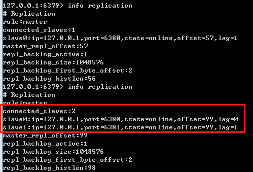

### 1. NoSQL介绍

NoSQL，泛指非关系型的数据库。随着互联网web2.0网站的兴起，传统的关系数据库在应付web2.0网站，特别是超大规模和高并发的SNS类型的web2.0纯动态网站已经显得力不从心，暴露了很多难以克服的问题，而非关系型的数据库则由于其本身的特点得到了非常迅速的发展。**NoSQL数据库的产生就是为了解决大规模数据集合多重数据种类带来的挑战，尤其是大数据应用难题。**

#### 1.1. NoSQL数据库的四大分类

**键值(Key-Value)存储数据库**

这一类数据库主要会使用到一个哈希表，这个表中有一个特定的键和一个指针指向特定的数据。Key/value模型对于IT系统来说的优势在于简单、易部署。但是如果DBA只对部分值进行查询或更新的时候，Key/value就显得效率低下了。

例如：Tokyo Cabinet/Tyrant, Redis, Voldemort, Oracle BDB.


**列存储数据库**

这部分数据库通常是用来应对分布式存储的海量数据。键仍然存在，但是它们的特点是指向了多个列。这些列是由列家族来安排的。

例如：Cassandra, HBase, Riak.

**文档型数据库**

文档型数据库的灵感是来自于Lotus Notes办公软件的，而且它同第一种键值存储相类似。该类型的数据模型是版本化的文档，半结构化的文档以特定的格式存储，比如JSON。文档型数据库可 以看作是键值数据库的升级版，允许之间嵌套键值。而且文档型数据库比键值数据库的查询效率更高。

例如：CouchDB, MongoDb. 国内也有文档型数据库SequoiaDB，已经开源。

图形(Graph)数据库

图形结构的数据库同其他行列以及刚性结构的SQL数据库不同，它是使用灵活的图形模型，并且能够扩展到多个服务器上。NoSQL数据库没有标准的查询语言(SQL)，因此进行数据库查询需要制定数据模型。许多NoSQL数据库都有REST式的数据接口或者查询API。

例如：Neo4J, InfoGrid, Infinite Graph.


因此，我们总结NoSQL数据库在以下的这几种情况下比较适用：

1、数据模型比较简单；

2、需要灵活性更强的IT系统；

3、对数据库性能要求较高；

4、不需要高度的数据一致性；

5、对于给定key，比较容易映射复杂值的环境。

**Redis 与其他 key - value 缓存产品有以下三个特点：**

Redis支持数据的持久化，可以将内存中的数据保存在磁盘中，重启的时候可以再次加载进行使用。

Redis不仅仅支持简单的key-value类型的数据，同时还提供list，set，zset，hash等数据结构的存储。

Redis支持数据的备份，集群等**高可用**功能。

### 2. 什么是Redis

基本概念

Redis是一个开源的、使用C语言编写的、支持网络交互的、可基于内存也可持久化的Key-Value数据库（非关系性数据库）。

Redis的优势

速度快，因为数据存在内存中，类似于HashMap，HashMap的优势就是查找和操作的时间复杂度都是O(1),Redis能读的速度是110000次/s,写的速度是81000次/s 。

支持丰富数据类型，支持string，list，set，sorted set，hash

支持事务，操作都是原子性，所谓的原子性就是对数据的更改要么全部执行，要么全部不执行

丰富的特性：可用于缓存，消息，按key设置过期时间，过期后将会自动删除,Redis还支持 publish/subscribe, 通知, key 过期等等特性。


缺点：

持久化。Redis直接将数据存储到内存中，要将数据保存到磁盘上，Redis可以使用两种方式实现持久化过程。定时快照（snapshot）：每隔一段时间将整个数据库写到磁盘上，每次均是写全部数据，代价非常高。第二种方式基于语句追加（aof）：只追踪变化的数据，但是追加的log可能过大，同时所有的操作均重新执行一遍，回复速度慢。

耗内存，占用内存过高。


#### 2.1. 应用场景

**缓存**

对于一些要返回给前端数据的缓存，当有大量数据库sql操作时候，为了避免每次接口请求都要去查询数据库，可以把一些数据缓存到Redis中，这样是直接从内存中获取数据，速度回增快很多。

 web端用户，用于登陆缓存session数据，登陆的一些信息存到session中，缓存到Redis中

**登录session缓存**

说明：

web端用户，用于登陆缓存session数据，登陆的一些信息存到session中，缓存到Redis中，没次用户再次登录判断Redis只能够是否存在或者已过期。

**购物车缓存**

说明：

每个用户的购物车是一个哈希表，用户id作为key，存储了 itemId 与 商品加车数量之间的关系。购物车提供数量设置，购物车不随用户登录退出删除。

**队列**

Redis中提供了list接口，这个list提供了lpush和rpop，这两个方法具有原子性，可以插入队列元素和弹出队列元素。

数据存储

Redis是非关系型数据库，可以把Redis直接用于数据存储，提供了增删改查等操作，因为Redis有良好的硬盘持久化机制，Redis数据就可以定期持久化到硬盘中，保证了Redis数据的完整性和安全性。

Redis锁实现防刷机制

Redis锁可以处理并发问题,Redis数据类型中有一个set类型，set类型在存储数据的时候是无序的，而且每个值是不一样的，不能重复，这样就可以快速的查找元素中某个值是否存在，精确的进行增加删除操作。


### 3. 安装与启动

Redis的安装

- Redis安装比较简单解压即可

修改Redis密码配置(非必须)

- 打开 Redis.windows.conf 配置文件Redis.conf找到requirepass foobared，把前面的#号去掉，把foobared改成密码，例如requirepass 123456

> 注意修改密码后需要重新启动Redis服务器


Redis的基本命令

- 检测启动Redis客户端命令：`Redis-clis`

启动Redis命令：

- 直接启动Redis：`./Redis-server`

- 启动固定配置文件，例如：`redis-server  ./redis.windows.conf`


Redis服务相关命令

- 卸载服务：`Redis-server --service-uninstall`

- 开启服务：`Redis-server --service-start`

- 停止服务：`Redis-server --service-stop`

本地客户端登录：`Redis-cli 密码登陆（Redis-cli -a  password)`

连接远程服务器：Redis-cli –h IP地址 –p 端口 –a 密码


#### 3.1. Redis中的内存维护策略

Redis作为优秀的中间缓存件，时常会存储大量的数据，即使采取了集群部署来动态扩容，也应该即使的整理内存，维持系统性能。

在Redis中有两种解决方案，

一是为数据设置超时时间，

二是采用LRU算法动态将不用的数据删除。内存管理的一种页面置换算法，对于在内存中但又不用的数据块（内存块）叫做LRU，操作系统会根据哪些数据属于LRU而将其移出内存而腾出空间来加载另外的数据。

1. volatile-lru：设定超时时间的数据中,删除最不常使用的数据.

2. allkeys-lru：查询所有的key中最近最不常使用的数据进行删除，这是应用最广泛的策略.

3. volatile-random：在已经设定了超时的数据中随机删除.

4. allkeys-random：查询所有的key,之后随机删除.

5. volatile-ttl：查询全部设定超时时间的数据,之后排序,将马上将要过期的数据进行删除操作.

6. noeviction：如果设置为该属性,则不会进行删除操作,如果内存溢出则报错返回.

    - volatile-lfu：从所有配置了过期时间的键中驱逐使用频率最少的键

    - allkeys-lfu：从所有键中驱逐使用频率最少的键


#### 3.2. 下载

[中文网](http://www.redis.cn/)

[Windows版本](https://github.com/microsoftarchive/redis/releases)

[命令参考站点](https://www.redis.net.cn/order/)

> Linux版本直接从官网下载即可

### 4. 基本数据类型

Redis是一种高级的key-value非关系型数据库。，其中value支持五种数据类型：string,List,set,hash,sore set

<div class="container" >

#### 4.1.  键(key)命令

<table >
<tbody><tr>
	<th>命令</th>
	<th>描述</th>
</tr>
<tr>
	<td><a href="https://www.redis.net.cn/order/3543.html">Redis Type 命令</a></td>
	<td>返回 key 所储存的值的类型。</td>
</tr><tr>
	<td><a href="https://www.redis.net.cn/order/3533.html">Redis PEXPIREAT 命令</a></td>
	<td>设置 key 的过期时间亿以毫秒计。</td>
</tr><tr>
	<td><a href="https://www.redis.net.cn/order/3534.html">Redis PEXPIREAT 命令</a></td>
	<td>设置 key 过期时间的时间戳(unix timestamp) 以毫秒计</td>
</tr><tr>
	<td><a href="https://www.redis.net.cn/order/3541.html">Redis Rename 命令</a></td>
	<td>修改 key 的名称</td>
</tr><tr>
	<td><a href="https://www.redis.net.cn/order/3537.html">Redis PERSIST 命令</a></td>
	<td>移除 key 的过期时间，key 将持久保持。</td>
</tr><tr>
	<td><a href="https://www.redis.net.cn/order/3536.html">Redis Move 命令</a></td>
	<td>将当前数据库的 key 移动到给定的数据库 db 当中。</td>
</tr><tr>
	<td><a href="https://www.redis.net.cn/order/3540.html">Redis RANDOMKEY 命令</a></td>
	<td>从当前数据库中随机返回一个 key 。</td>
</tr><tr>
	<td><a href="https://www.redis.net.cn/order/3529.html">Redis Dump 命令</a></td>
	<td>序列化给定 key ，并返回被序列化的值。</td>
</tr><tr>
	<td><a href="https://www.redis.net.cn/order/3539.html">Redis TTL 命令</a></td>
	<td>以秒为单位，返回给定 key 的剩余生存时间(TTL, time to live)。</td>
</tr><tr>
	<td><a href="https://www.redis.net.cn/order/3531.html">Redis Expire 命令</a></td>
	<td>seconds
为给定 key 设置过期时间。</td>
</tr><tr>
	<td><a href="https://www.redis.net.cn/order/3528.html">Redis DEL 命令</a></td>
	<td>该命令用于在 key 存在是删除 key。</td>
</tr><tr>
	<td><a href="https://www.redis.net.cn/order/3538.html">Redis Pttl 命令</a></td>
	<td>以毫秒为单位返回 key 的剩余的过期时间。</td>
</tr><tr>
	<td><a href="https://www.redis.net.cn/order/3542.html">Redis Renamenx 命令</a></td>
	<td>仅当 newkey 不存在时，将 key 改名为 newkey 。</td>
</tr><tr>
	<td><a href="https://www.redis.net.cn/order/3530.html">Redis EXISTS 命令</a></td>
	<td>检查给定 key 是否存在。</td>
</tr><tr>
	<td><a href="https://www.redis.net.cn/order/3532.html">Redis Expireat 命令</a></td>
	<td>EXPIREAT 的作用和 EXPIRE 类似，都用于为 key 设置过期时间。 不同在于 EXPIREAT 命令接受的时间参数是 UNIX 时间戳(unix timestamp)。</td>
</tr><tr>
	<td><a href="https://www.redis.net.cn/order/3535.html">Redis Keys 命令</a></td>
	<td>查找所有符合给定模式( pattern)的 key 。</td>
</tr></tbody></table>

#### 4.2. 字符串(String)命令

<table class="table table-bordered table-striped">
<tbody><tr>
	<th>命令</th>
	<th>描述</th>
</tr>
<tr>
	<td><a href="https://www.redis.net.cn/order/3552.html">Redis Setnx 命令</a></td>
	<td>只有在 key 不存在时设置 key 的值。</td>
</tr><tr>
	<td><a href="https://www.redis.net.cn/order/3546.html">Redis Getrange 命令</a></td>
	<td>返回 key 中字符串值的子字符</td>
</tr><tr>
	<td><a href="https://www.redis.net.cn/order/3555.html">Redis Mset 命令</a></td>
	<td>同时设置一个或多个 key-value 对。</td>
</tr><tr>
	<td><a href="https://www.redis.net.cn/order/3551.html">Redis Setex 命令</a></td>
	<td>将值 value 关联到 key ，并将 key 的过期时间设为 seconds (以秒为单位)。</td>
</tr><tr>
	<td><a href="https://www.redis.net.cn/order/3544.html">Redis SET 命令</a></td>
	<td>设置指定 key 的值</td>
</tr><tr>
	<td><a href="https://www.redis.net.cn/order/3545.html">Redis Get 命令</a></td>
	<td>获取指定 key 的值。</td>
</tr><tr>
	<td><a href="https://www.redis.net.cn/order/3548.html">Redis Getbit 命令</a></td>
	<td>对 key 所储存的字符串值，获取指定偏移量上的位(bit)。</td>
</tr><tr>
	<td><a href="https://www.redis.net.cn/order/3550.html">Redis Setbit 命令</a></td>
	<td>对 key 所储存的字符串值，设置或清除指定偏移量上的位(bit)。</td>
</tr><tr>
	<td><a href="https://www.redis.net.cn/order/3561.html">Redis Decr 命令</a></td>
	<td>将 key 中储存的数字值减一。</td>
</tr><tr>
	<td><a href="https://www.redis.net.cn/order/3562.html">Redis Decrby 命令</a></td>
	<td>key 所储存的值减去给定的减量值（decrement） 。</td>
</tr><tr>
	<td><a href="https://www.redis.net.cn/order/3554.html">Redis Strlen 命令</a></td>
	<td>返回 key 所储存的字符串值的长度。</td>
</tr><tr>
	<td><a href="https://www.redis.net.cn/order/3556.html">Redis Msetnx 命令</a></td>
	<td>同时设置一个或多个 key-value 对，当且仅当所有给定 key 都不存在。</td>
</tr><tr>
	<td><a href="https://www.redis.net.cn/order/3559.html">Redis Incrby 命令</a></td>
	<td>将 key 所储存的值加上给定的增量值（increment） 。</td>
</tr><tr>
	<td><a href="https://www.redis.net.cn/order/3560.html">Redis Incrbyfloat 命令</a></td>
	<td>将 key 所储存的值加上给定的浮点增量值（increment） 。</td>
</tr><tr>
	<td><a href="https://www.redis.net.cn/order/3553.html">Redis Setrange 命令</a></td>
	<td>用 value 参数覆写给定 key 所储存的字符串值，从偏移量 offset 开始。</td>
</tr><tr>
	<td><a href="https://www.redis.net.cn/order/3557.html">Redis Psetex 命令</a></td>
	<td>这个命令和 SETEX 命令相似，但它以毫秒为单位设置 key 的生存时间，而不是像 SETEX 命令那样，以秒为单位。</td>
</tr><tr>
	<td><a href="https://www.redis.net.cn/order/3563.html">Redis Append 命令</a></td>
	<td>如果 key 已经存在并且是一个字符串， APPEND 命令将 value 追加到 key 原来的值的末尾。</td>
</tr><tr>
	<td><a href="https://www.redis.net.cn/order/3547.html">Redis Getset 命令</a></td>
	<td>将给定 key 的值设为 value ，并返回 key 的旧值(old value)。</td>
</tr><tr>
	<td><a href="https://www.redis.net.cn/order/3549.html">Redis Mget 命令</a></td>
	<td>获取所有(一个或多个)给定 key 的值。</td>
</tr><tr>
	<td><a href="https://www.redis.net.cn/order/3558.html">Redis Incr 命令</a></td>
	<td>将 key 中储存的数字值增一。</td>
</tr></tbody></table><div class="page-header">

#### 4.3. 列表(List)命令

<table class="table table-bordered table-striped">
<tbody><tr>
	<th>命令</th>
	<th>描述</th>
</tr>
<tr>
	<td><a href="https://www.redis.net.cn/order/3580.html">Redis Lindex 命令</a></td>
	<td>通过索引获取列表中的元素</td>
</tr><tr>
	<td><a href="https://www.redis.net.cn/order/3592.html">Redis Rpush 命令</a></td>
	<td>在列表中添加一个或多个值</td>
</tr><tr>
	<td><a href="https://www.redis.net.cn/order/3586.html">Redis Lrange 命令</a></td>
	<td>获取列表指定范围内的元素</td>
</tr><tr>
	<td><a href="https://www.redis.net.cn/order/3591.html">Redis Rpoplpush 命令</a></td>
	<td>移除列表的最后一个元素，并将该元素添加到另一个列表并返回</td>
</tr><tr>
	<td><a href="https://www.redis.net.cn/order/3577.html">Redis Blpop 命令</a></td>
	<td>移出并获取列表的第一个元素， 如果列表没有元素会阻塞列表直到等待超时或发现可弹出元素为止。</td>
</tr><tr>
	<td><a href="https://www.redis.net.cn/order/3578.html">Redis Brpop 命令</a></td>
	<td>移出并获取列表的最后一个元素， 如果列表没有元素会阻塞列表直到等待超时或发现可弹出元素为止。</td>
</tr><tr>
	<td><a href="https://www.redis.net.cn/order/3579.html">Redis Brpoplpush命令</a></td>
	<td>从列表中弹出一个值，将弹出的元素插入到另外一个列表中并返回它； 如果列表没有元素会阻塞列表直到等待超时或发现可弹出元素为止。</td>
</tr><tr>
	<td><a href="https://www.redis.net.cn/order/3587.html">Redis Lrem 命令</a></td>
	<td>移除列表元素</td>
</tr><tr>
	<td><a href="https://www.redis.net.cn/order/3582.html">Redis Llen 命令</a></td>
	<td>获取列表长度</td>
</tr><tr>
	<td><a href="https://www.redis.net.cn/order/3589.html">Redis Ltrim 命令</a></td>
	<td>对一个列表进行修剪(trim)，就是说，让列表只保留指定区间内的元素，不在指定区间之内的元素都将被删除。</td>
</tr><tr>
	<td><a href="https://www.redis.net.cn/order/3583.html">Redis Lpop 命令</a></td>
	<td>移出并获取列表的第一个元素</td>
</tr><tr>
	<td><a href="https://www.redis.net.cn/order/3585.html">Redis Lpushx 命令</a></td>
	<td>将一个或多个值插入到已存在的列表头部</td>
</tr><tr>
	<td><a href="https://www.redis.net.cn/order/3581.html">Redis Linsert 命令</a></td>
	<td>在列表的元素前或者后插入元素</td>
</tr><tr>
	<td><a href="https://www.redis.net.cn/order/3590.html">Redis Rpop 命令</a></td>
	<td>移除并获取列表最后一个元素</td>
</tr><tr>
	<td><a href="https://www.redis.net.cn/order/3588.html">Redis Lset 命令</a></td>
	<td>通过索引设置列表元素的值</td>
</tr><tr>
	<td><a href="https://www.redis.net.cn/order/3584.html">Redis Lpush 命令</a></td>
	<td>将一个或多个值插入到列表头部</td>
</tr><tr>
	<td><a href="https://www.redis.net.cn/order/3593.html">Redis Rpushx 命令</a></td>
	<td>为已存在的列表添加值</td>
</tr></tbody></table>

#### 4.4. 哈希(Hash)命令

<table class="table table-bordered table-striped">
<tbody><tr>
	<th>命令</th>
	<th>描述</th>
</tr>
<tr>
	<td><a href="https://www.redis.net.cn/order/3573.html">Redis Hmset 命令</a></td>
	<td>同时将多个 field-value (域-值)对设置到哈希表 key 中。</td>
</tr><tr>
	<td><a href="https://www.redis.net.cn/order/3572.html">Redis Hmget 命令</a></td>
	<td>获取所有给定字段的值</td>
</tr><tr>
	<td><a href="https://www.redis.net.cn/order/3574.html">Redis Hset 命令</a></td>
	<td>将哈希表 key 中的字段 field 的值设为 value 。</td>
</tr><tr>
	<td><a href="https://www.redis.net.cn/order/3567.html">Redis Hgetall 命令</a></td>
	<td>获取在哈希表中指定 key 的所有字段和值</td>
</tr><tr>
	<td><a href="https://www.redis.net.cn/order/3566.html">Redis Hget 命令</a></td>
	<td>获取存储在哈希表中指定字段的值/td&gt;</td>
</tr><tr>
	<td><a href="https://www.redis.net.cn/order/3565.html">Redis Hexists 命令</a></td>
	<td>查看哈希表 key 中，指定的字段是否存在。</td>
</tr><tr>
	<td><a href="https://www.redis.net.cn/order/3568.html">Redis Hincrby 命令</a></td>
	<td>为哈希表 key 中的指定字段的整数值加上增量 increment 。</td>
</tr><tr>
	<td><a href="https://www.redis.net.cn/order/3571.html">Redis Hlen 命令</a></td>
	<td>获取哈希表中字段的数量</td>
</tr><tr>
	<td><a href="https://www.redis.net.cn/order/3564.html">Redis Hdel 命令</a></td>
	<td>删除一个或多个哈希表字段</td>
</tr><tr>
	<td><a href="https://www.redis.net.cn/order/3576.html">Redis Hvals 命令</a></td>
	<td>获取哈希表中所有值</td>
</tr><tr>
	<td><a href="https://www.redis.net.cn/order/3569.html">Redis Hincrbyfloat 命令</a></td>
	<td>为哈希表 key 中的指定字段的浮点数值加上增量 increment 。</td>
</tr><tr>
	<td><a href="https://www.redis.net.cn/order/3570.html">Redis Hkeys 命令</a></td>
	<td>获取所有哈希表中的字段</td>
</tr><tr>
	<td><a href="https://www.redis.net.cn/order/3575.html">Redis Hsetnx 命令</a></td>
	<td>只有在字段 field 不存在时，设置哈希表字段的值。</td>
</tr></tbody></table>

#### 4.5. 集合(Set)命令

<table class="table table-bordered table-striped">
<tbody><tr>
	<th>命令</th>
	<th>描述</th>
</tr>
<tr>
	<td><a href="https://www.redis.net.cn/order/3606.html">Redis Sunion 命令</a></td>
	<td>返回所有给定集合的并集</td>
</tr><tr>
	<td><a href="https://www.redis.net.cn/order/3595.html">Redis Scard 命令</a></td>
	<td>获取集合的成员数</td>
</tr><tr>
	<td><a href="https://www.redis.net.cn/order/3604.html">Redis Srandmember 命令</a></td>
	<td>返回集合中一个或多个随机数</td>
</tr><tr>
	<td><a href="https://www.redis.net.cn/order/3601.html">Redis Smembers 命令</a></td>
	<td>返回集合中的所有成员</td>
</tr><tr>
	<td><a href="https://www.redis.net.cn/order/3598.html">Redis Sinter 命令</a></td>
	<td>返回给定所有集合的交集</td>
</tr><tr>
	<td><a href="https://www.redis.net.cn/order/3605.html">Redis Srem 命令</a></td>
	<td>移除集合中一个或多个成员</td>
</tr><tr>
	<td><a href="https://www.redis.net.cn/order/3602.html">Redis Smove 命令</a></td>
	<td>将 member 元素从 source 集合移动到 destination 集合</td>
</tr><tr>
	<td><a href="https://www.redis.net.cn/order/3594.html">Redis Sadd 命令</a></td>
	<td>向集合添加一个或多个成员</td>
</tr><tr>
	<td><a href="https://www.redis.net.cn/order/3600.html">Redis Sismember 命令</a></td>
	<td>判断 member 元素是否是集合 key 的成员</td>
</tr><tr>
	<td><a href="https://www.redis.net.cn/order/3597.html">Redis Sdiffstore 命令</a></td>
	<td>返回给定所有集合的差集并存储在 destination 中</td>
</tr><tr>
	<td><a href="https://www.redis.net.cn/order/3596.html">Redis Sdiff 命令</a></td>
	<td>返回给定所有集合的差集</td>
</tr><tr>
	<td><a href="https://www.redis.net.cn/order/3608.html">Redis Sscan 命令</a></td>
	<td>迭代集合中的元素</td>
</tr><tr>
	<td><a href="https://www.redis.net.cn/order/3599.html">Redis Sinterstore 命令</a></td>
	<td>返回给定所有集合的交集并存储在 destination 中</td>
</tr><tr>
	<td><a href="https://www.redis.net.cn/order/3607.html">Redis Sunionstore 命令</a></td>
	<td>所有给定集合的并集存储在 destination 集合中</td>
</tr><tr>
	<td><a href="https://www.redis.net.cn/order/3603.html">Redis Spop 命令</a></td>
	<td>移除并返回集合中的一个随机元素</td>
</tr></tbody></table>

#### 4.6. 有序集合(sorted set)命令

<table class="table table-bordered table-striped">
<tbody><tr>
	<th>命令</th>
	<th>描述</th>
</tr>
<tr>
	<td><a href="https://www.redis.net.cn/order/3625.html">Redis Zrevrank 命令</a></td>
	<td>返回有序集合中指定成员的排名，有序集成员按分数值递减(从大到小)排序</td>
</tr><tr>
	<td><a href="https://www.redis.net.cn/order/3614.html">Redis Zlexcount 命令</a></td>
	<td>在有序集合中计算指定字典区间内成员数量</td>
</tr><tr>
	<td><a href="https://www.redis.net.cn/order/3627.html">Redis Zunionstore 命令</a></td>
	<td>计算给定的一个或多个有序集的并集，并存储在新的 key 中</td>
</tr><tr>
	<td><a href="https://www.redis.net.cn/order/3621.html">Redis Zremrangebyrank 命令</a></td>
	<td>移除有序集合中给定的排名区间的所有成员</td>
</tr><tr>
	<td><a href="https://www.redis.net.cn/order/3610.html">Redis Zcard 命令</a></td>
	<td>获取有序集合的成员数</td>
</tr><tr>
	<td><a href="https://www.redis.net.cn/order/3619.html">Redis Zrem 命令</a></td>
	<td>移除有序集合中的一个或多个成员</td>
</tr><tr>
	<td><a href="https://www.redis.net.cn/order/3613.html">Redis Zinterstore 命令</a></td>
	<td>计算给定的一个或多个有序集的交集并将结果集存储在新的有序集合 key 中</td>
</tr><tr>
	<td><a href="https://www.redis.net.cn/order/3618.html">Redis Zrank 命令</a></td>
	<td>返回有序集合中指定成员的索引</td>
</tr><tr>
	<td><a href="https://www.redis.net.cn/order/3612.html">Redis Zincrby 命令</a></td>
	<td>有序集合中对指定成员的分数加上增量 increment</td>
</tr><tr>
	<td><a href="https://www.redis.net.cn/order/3617.html">Redis Zrangebyscore 命令</a></td>
	<td>通过分数返回有序集合指定区间内的成员</td>
</tr><tr>
	<td><a href="https://www.redis.net.cn/order/3616.html">Redis Zrangebylex 命令</a></td>
	<td>通过字典区间返回有序集合的成员</td>
</tr><tr>
	<td><a href="https://www.redis.net.cn/order/3626.html">Redis Zscore 命令</a></td>
	<td>返回有序集中，成员的分数值</td>
</tr><tr>
	<td><a href="https://www.redis.net.cn/order/3622.html">Redis Zremrangebyscore 命令</a></td>
	<td>移除有序集合中给定的分数区间的所有成员</td>
</tr><tr>
	<td><a href="https://www.redis.net.cn/order/3628.html">Redis Zscan 命令</a></td>
	<td>迭代有序集合中的元素（包括元素成员和元素分值）</td>
</tr><tr>
	<td><a href="https://www.redis.net.cn/order/3624.html">Redis Zrevrangebyscore 命令</a></td>
	<td>返回有序集中指定分数区间内的成员，分数从高到低排序</td>
</tr><tr>
	<td><a href="https://www.redis.net.cn/order/3620.html">Redis Zremrangebylex 命令</a></td>
	<td>移除有序集合中给定的字典区间的所有成员</td>
</tr><tr>
	<td><a href="https://www.redis.net.cn/order/3623.html">Redis Zrevrange 命令</a></td>
	<td>返回有序集中指定区间内的成员，通过索引，分数从高到底</td>
</tr><tr>
	<td><a href="https://www.redis.net.cn/order/3615.html">Redis Zrange 命令</a></td>
	<td>通过索引区间返回有序集合成指定区间内的成员</td>
</tr><tr>
	<td><a href="https://www.redis.net.cn/order/3611.html">Redis Zcount 命令</a></td>
	<td>计算在有序集合中指定区间分数的成员数</td>
</tr><tr>
	<td><a href="https://www.redis.net.cn/order/3609.html">Redis Zadd 命令</a></td>
	<td>向有序集合添加一个或多个成员，或者更新已存在成员的分数</td>
</tr></tbody></table>

#### 4.7. 连接命令

<table class="table table-bordered table-striped">
<tbody><tr>
	<th>命令</th>
	<th>描述</th>
</tr>
<tr>
	<td><a href="https://www.redis.net.cn/order/3650.html">Redis Echo 命令</a></td>
	<td>打印字符串</td>
</tr><tr>
	<td><a href="https://www.redis.net.cn/order/3653.html">Redis Select 命令</a></td>
	<td>切换到指定的数据库</td>
</tr><tr>
	<td><a href="https://www.redis.net.cn/order/3651.html">Redis Ping 命令</a></td>
	<td>查看服务是否运行</td>
</tr><tr>
	<td><a href="https://www.redis.net.cn/order/3652.html">Redis Quit 命令</a></td>
	<td>关闭当前连接</td>
</tr><tr>
	<td><a href="https://www.redis.net.cn/order/3649.html">Redis Auth 命令</a></td>
	<td>验证密码是否正确</td>
</tr></tbody></table>

#### 4.8. 服务器命令

<table class="table table-bordered table-striped">
<tbody><tr>
	<th>命令</th>
	<th>描述</th>
</tr>
<tr>
	<td><a href="https://www.redis.net.cn/order/3659.html">Redis Client Pause 命令</a></td>
	<td>在指定时间内终止运行来自客户端的命令</td>
</tr><tr>
	<td><a href="https://www.redis.net.cn/order/3672.html">Redis Debug Object 命令</a></td>
	<td>获取 key 的调试信息</td>
</tr><tr>
	<td><a href="https://www.redis.net.cn/order/3675.html">Redis Flushdb 命令</a></td>
	<td>删除当前数据库的所有key</td>
</tr><tr>
	<td><a href="https://www.redis.net.cn/order/3680.html">Redis Save 命令</a></td>
	<td>异步保存数据到硬盘</td>
</tr><tr>
	<td><a href="https://www.redis.net.cn/order/3683.html">Redis Showlog 命令</a></td>
	<td>管理 redis 的慢日志</td>
</tr><tr>
	<td><a href="https://www.redis.net.cn/order/3677.html">Redis Lastsave 命令</a></td>
	<td>返回最近一次 Redis 成功将数据保存到磁盘上的时间，以 UNIX 时间戳格式表示</td>
</tr><tr>
	<td><a href="https://www.redis.net.cn/order/3667.html">Redis Config Get 命令</a></td>
	<td>获取指定配置参数的值</td>
</tr><tr>
	<td><a href="https://www.redis.net.cn/order/3662.html">Redis Command 命令</a></td>
	<td>获取 Redis 命令详情数组</td>
</tr><tr>
	<td><a href="https://www.redis.net.cn/order/3682.html">Redis Slaveof 命令</a></td>
	<td>将当前服务器转变为指定服务器的从属服务器(slave server)</td>
</tr><tr>
	<td><a href="https://www.redis.net.cn/order/3673.html">Redis Debug Segfault 命令</a></td>
	<td>让 Redis 服务崩溃</td>
</tr><tr>
	<td><a href="https://www.redis.net.cn/order/3674.html">Redis Flushall 命令</a></td>
	<td>删除所有数据库的所有key</td>
</tr><tr>
	<td><a href="https://www.redis.net.cn/order/3671.html">Redis Dbsize 命令</a></td>
	<td>返回当前数据库的 key 的数量</td>
</tr><tr>
	<td><a href="https://www.redis.net.cn/order/3654.html">Redis Bgrewriteaof 命令</a></td>
	<td>异步执行一个 AOF（AppendOnly File） 文件重写操作</td>
</tr><tr>
	<td><a href="https://www.redis.net.cn/order/3661.html">Redis Cluster Slots 命令</a></td>
	<td>获取集群节点的映射数组</td>
</tr><tr>
	<td><a href="https://www.redis.net.cn/order/3669.html">Redis Config Set 命令</a></td>
	<td>修改 redis 配置参数，无需重启</td>
</tr><tr>
	<td><a href="https://www.redis.net.cn/order/3666.html">Redis Command Info 命令</a></td>
	<td>获取指定 Redis 命令描述的数组</td>
</tr><tr>
	<td><a href="https://www.redis.net.cn/order/3681.html">Redis Shutdown 命令</a></td>
	<td>异步保存数据到硬盘，并关闭服务器</td>
</tr><tr>
	<td><a href="https://www.redis.net.cn/order/3684.html">Redis Sync 命令</a></td>
	<td>用于复制功能(replication)的内部命令</td>
</tr><tr>
	<td><a href="https://www.redis.net.cn/order/3656.html">Redis Client Kill 命令</a></td>
	<td>关闭客户端连接</td>
</tr><tr>
	<td><a href="https://www.redis.net.cn/order/3679.html">Redis Role 命令</a></td>
	<td>返回主从实例所属的角色</td>
</tr><tr>
	<td><a href="https://www.redis.net.cn/order/3678.html">Redis Monitor 命令</a></td>
	<td>实时打印出 Redis 服务器接收到的命令，调试用</td>
</tr><tr>
	<td><a href="https://www.redis.net.cn/order/3664.html">Redis Command Getkeys 命令</a></td>
	<td>获取给定命令的所有键</td>
</tr><tr>
	<td><a href="https://www.redis.net.cn/order/3658.html">Redis Client Getname 命令</a></td>
	<td>获取连接的名称</td>
</tr><tr>
	<td><a href="https://www.redis.net.cn/order/3670.html">Redis Config Resetstat 命令</a></td>
	<td>重置 INFO 命令中的某些统计数据</td>
</tr><tr>
	<td><a href="https://www.redis.net.cn/order/3663.html">Redis Command Count 命令</a></td>
	<td>获取 Redis 命令总数</td>
</tr><tr>
	<td><a href="https://www.redis.net.cn/order/3665.html">Redis Time 命令</a></td>
	<td>返回当前服务器时间</td>
</tr><tr>
	<td><a href="https://www.redis.net.cn/order/3676.html">Redis Info 命令</a></td>
	<td>获取 Redis 服务器的各种信息和统计数值</td>
</tr><tr>
	<td><a href="https://www.redis.net.cn/order/3668.html">Redis Config rewrite 命令</a></td>
	<td>对启动 Redis 服务器时所指定的 redis.conf 配置文件进行改写</td>
</tr><tr>
	<td><a href="https://www.redis.net.cn/order/3657.html">Redis Client List 命令</a></td>
	<td>获取连接到服务器的客户端连接列表</td>
</tr><tr>
	<td><a href="https://www.redis.net.cn/order/3660.html">Redis Client Setname 命令</a></td>
	<td>设置当前连接的名称</td>
</tr><tr>
	<td><a href="https://www.redis.net.cn/order/3655.html">Redis Bgsave 命令</a></td>
	<td>在后台异步保存当前数据库的数据到磁盘</td>
</tr></tbody></table>

#### 4.9. 脚本命令

<table class="table table-bordered table-striped">
<tbody><tr>
	<th>命令</th>
	<th>描述</th>
</tr>
<tr>
	<td><a href="https://www.redis.net.cn/order/3647.html">Redis Script kill 命令</a></td>
	<td>杀死当前正在运行的 Lua 脚本。</td>
</tr><tr>
	<td><a href="https://www.redis.net.cn/order/3648.html">Redis Script Load 命令</a></td>
	<td>将脚本 script 添加到脚本缓存中，但并不立即执行这个脚本。</td>
</tr><tr>
	<td><a href="https://www.redis.net.cn/order/3643.html">Redis Eval 命令</a></td>
	<td>执行 Lua 脚本。</td>
</tr><tr>
	<td><a href="https://www.redis.net.cn/order/3644.html">Redis Evalsha 命令</a></td>
	<td>执行 Lua 脚本。</td>
</tr><tr>
	<td><a href="https://www.redis.net.cn/order/3645.html">Redis Script Exists 命令</a></td>
	<td>查看指定的脚本是否已经被保存在缓存当中。</td>
</tr><tr>
	<td><a href="https://www.redis.net.cn/order/3646.html">Redis Script Flush 命令</a></td>
	<td>从脚本缓存中移除所有脚本。</td>
</tr></tbody></table>

#### 4.10. 事务命令

<table class="table table-bordered table-striped">
<tbody><tr>
	<th>命令</th>
	<th>描述</th>
</tr>
<tr>
	<td><a href="https://www.redis.net.cn/order/3639.html">Redis Exec 命令</a></td>
	<td>执行所有事务块内的命令。</td>
</tr><tr>
	<td><a href="https://www.redis.net.cn/order/3642.html">Redis Watch 命令</a></td>
	<td>监视一个(或多个) key ，如果在事务执行之前这个(或这些) key 被其他命令所改动，那么事务将被打断。</td>
</tr><tr>
	<td><a href="https://www.redis.net.cn/order/3638.html">Redis Discard 命令</a></td>
	<td>取消事务，放弃执行事务块内的所有命令。</td>
</tr><tr>
	<td><a href="https://www.redis.net.cn/order/3641.html">Redis Unwatch 命令</a></td>
	<td>取消 WATCH 命令对所有 key 的监视。</td>
</tr><tr>
	<td><a href="https://www.redis.net.cn/order/3640.html">Redis Multi 命令</a></td>
	<td>标记一个事务块的开始。</td>
</tr></tbody></table>

#### 4.11. 发布订阅命令

<table class="table table-bordered table-striped">
<tbody><tr>
	<th>命令</th>
	<th>描述</th>
</tr>
<tr>
	<td><a href="https://www.redis.net.cn/order/3637.html">Redis Unsubscribe 命令</a></td>
	<td>指退订给定的频道。</td>
</tr><tr>
	<td><a href="https://www.redis.net.cn/order/3636.html">Redis Subscribe 命令</a></td>
	<td>订阅给定的一个或多个频道的信息。</td>
</tr><tr>
	<td><a href="https://www.redis.net.cn/order/3633.html">Redis Pubsub 命令</a></td>
	<td>查看订阅与发布系统状态。</td>
</tr><tr>
	<td><a href="https://www.redis.net.cn/order/3635.html">Redis Punsubscribe 命令</a></td>
	<td>退订所有给定模式的频道。</td>
</tr><tr>
	<td><a href="https://www.redis.net.cn/order/3634.html">Redis Publish 命令</a></td>
	<td>将信息发送到指定的频道。</td>
</tr><tr>
	<td><a href="https://www.redis.net.cn/order/3632.html">Redis Psubscribe 命令</a></td>
	<td>订阅一个或多个符合给定模式的频道。</td>
</tr></tbody>
</table>


### 5. Redis多数据库

说明：一个Redis实例可以包含多个数据库，客户端可以指定连接某个数据库（与MySql客户端我们创建多个数据库类似）一个Redis实例最多可以提供16个数据库，下标是从0到15，默认连接的是第0号数据库。

代码相关演示:


```shell
127.0.0.1:6379> select 1  //选择数据库1
OK
127.0.0.1:6379[1]> keys *
(empty list or set)
127.0.0.1:6379[1]> select 0
OK
127.0.0.1:6379> set string1 2
OK
127.0.0.1:6379> keys *  //查询所有的key
1) "hsah1"
2) "list1"
3) "set1"
4) "list2"
5) "string1"
6) "hash1"
7) "string2"
127.0.0.1:6379> move list1 1  //移动list1到数据库1
(integer) 1
127.0.0.1:6379> move set1 1
(integer) 1
127.0.0.1:6379> keys *
1) "hsah1"
2) "list2"
3) "string1"
4) "hash1"
5) "string2"
127.0.0.1:6379> select 1
OK
127.0.0.1:6379[1]> keys *
1) "list1"
2) "set1"
127.0.0.1:6379[1]> type set1 //获取数据类型
set
127.0.0.1:6379[1]>

```

### 6. Redis事务的概念

事务的基本命令

multi 标记一个事务的开始

exec 执行所有事务块内的命令

discard 取消事务，放弃执行事务块内的所有命令


事务特性

- 事务中的命令都是串行执行的。

- 事务执行期间Redis不会再对其它的客户端提供任何服务，从而保证事务中的命令能够原子化执行。

- 单个 Redis 命令的执行是原子性的，但 Redis 没有在事务上增加任何维持原子性的机制，所以 Redis 事务的执行并不是原子性的。事务可以理解为一个打包的批量执行脚本，但批量指令并非原子化的操作，中间某条指令的失败不会导致前面已做指令的回滚，也不会造成后续的指令不做。

代码实例

```shell
Redis 127.0.0.1:6379> MULTI   //开启事务
OK
Redis 127.0.0.1:6379> SET book-name "Mastering C++ in 21 days"
QUEUED
Redis 127.0.0.1:6379> GET book-name
QUEUED
Redis 127.0.0.1:6379> SADD tag "C++" "Programming" "Mastering Series"
QUEUED
Redis 127.0.0.1:6379> SMEMBERS tag
QUEUED
Redis 127.0.0.1:6379> EXEC //提交事务
1) OK
2) "Mastering C++ in 21 days"
3) (integer) 3
4) 1) "Mastering Series"
   2) "C++"
   3) "Programming"

```


### 7. Redis数据持久化

安装Redis之后默认选择的是RDB方式，还有在修改过Redis-config之后注意要重新启动Redis服务才能生效 。

#### 7.1. RDB数据持久化方式

优势

Redis数据库会只包含一个文件存储在硬盘中，对于文件备份会简单很多。

对于灾难恢复，RDB是更好的选择，因为一个文件可以直接拷贝走，拷贝回来。

性能最大化，Redis开始持久化的时候只分出一些子进程，之后这些子进程会完成持久化工作,避免了服务器进程执行io的操作。数据集很大的时候，启动效率会更高。


缺点

最大限度的避免数据丢失，RDB做的不是特别好，系统一定在定时持久化之前出现一些档期的情况，还没有来得及往硬盘上写，数据已经丢失掉。

因为RDB是通过开启子进程的方式来进行持久化操作的，因此当数据集比较大的时候，这个过程可能会导致服务器停止一定事件，几十毫秒甚至1秒。

配置

linux目录中/usr/local/Redis/Redis-conf目录中找到这样的几行代码

```shell
save 900 1
save 300 10
save 60 10000

```

第一行代码表示：900秒，也就是15分钟至少又一个key发生变化就会持久化一次。

第二行代码表示：300秒，至少有10个key发生变化就会往硬盘中持久化一次。

第三行代码表示：60秒，至少有10000个key发生变化就会往硬盘中持久化一次。

```shell
dbfilename dump.rdb
```

配置中继续往下看，看到这样一行代码，这个dump是数据库的名字。

往下一段代码

```shell
dir ./
```

保存路径位置，就是当前目录下的上面的名字，就是持久化的数据库


#### 7.2. AOF数据持久化方式

优势

可以带来更高的数据安全性，这种数据持久化方式有三种同步策略，每秒同步，每修改同步（每一次发生数据的变化都会立即被记录到磁盘中，效率最低但是最安全），不同步。

日志的写入操作是采用append追加的模式，在写入过程中即使出现服务器档期问题，也不会破坏日志文件中已经写入的内容。

如果日志过大，Redis可以自动启动重写机制，Redis会不断的将修改的数据写入到老的磁盘当中，同时Redis会创建一个新的文件来记录此期间产生了哪些修改命令被执行了。

AOF包含一个格式非常清晰易于理解的日志文件，用于记录所有的修改操作。通过这个文件就可以完成数据的重建。

劣势

对于相同的数据集文件，AOF要比RDB文件大。

根据同步策略的不同，AOF在运行效率上往往低于RDB，AOF每修改就同步到硬盘上效率肯定是没有RDB高的。

配置

linux目录中/usr/local/Redis/Redis-conf目录中找到这样的几行代码

```shell
appendonly no

# The name of the append only file(default:"appendonly.aof")

appendfilename "appendonly.aof"

```


如果使用AOF的持久还方式，需要把appendonly 后面的属性变为yes

appendonly.aof是用来记录所有修改操作的文件，这个文件还可以用来进行数据的恢复等，例如一条删除操作成功后，我们在appendonly.aof文件中把删除命令去掉，重新运行Redis，之前的数据又都会恢复


```shell
# appendfsync always
appendfsync everysec
# appendfsync no

```

这段代码是关于同步策略的一个设置，第一条是每修改就同步持久化，第二条是每秒同步持久化一次，第三条是不同步持久化。


### 8. 主从复制

为什么需要主从复制

- 其实所谓的主从复制就是为了实现读写分离,提高我们存取数据的执行效率

- 1个主多从，主的Redis负责写，从的Redis负责读取数据

缺点：

一旦负责写入数据的Redis节点宕机之后，那么我们的程序将无法继续写入

#### 8.1. 具体配置

redis-6379.conf配置文件如下：


```ini
#主节点的配置文件
# Redis使用后台模式
daemonize yes
# 注释以下内容开启远程访问
# bind 127.0.0.1
# 修改启动端口为6379
port 6379
# 修改pidfile指向路径--Redis以守护进程方式运行时把pid写入文件
pidfile /usr/local/redis-3.0.0/conf/redis_6379.pid
#数据库的存放位置 自己定义
dir /usr/local/redis-3.0.4/db/master/
```

**从节点配置**

redis-6380.conf配置文件如下：

```ini
# Redis使用后台模式
daemonize yes
# 关闭保护模式
#protected-mode no
# 注释以下内容开启远程访问
# bind 127.0.0.1
# 修改启动端口为6379
port 6380
# 修改pidfile指向路径
pidfile /usr/local/redis-3.0.0/conf/redis_6380.pid
#数据库的存放位置
dir /usr/local/redis-3.0.4/db/slave_one
#Slaveof命令可以将当前服务器转变为指定服务器的从属服务器(slave server)。
slaveof 127.0.0.1 6379
```

redis-6381.conf配置文件如下：

```ini
# Redis使用后台模式
daemonize yes
# 关闭保护模式
#protected-mode no
# 注释以下内容开启远程访问
# bind 127.0.0.1
# 修改启动端口为6379
port 6381
# 修改pidfile指向路径
pidfile /usr/local/redis-3.0.0/conf/redis_6381.pid
#数据库的存放位置
dir /usr/local/redis-3.0.4/db/slave_two/
#Slaveof命令可以将当前服务器转变为指定服务器的从属服务器(slave server)。
slaveof 127.0.0.1 6379
```

启动Redis

```shell
/usr/local/bin/redis-server /usr/local/redis-3.0.4/conf/redis-6379.conf
/usr/local/bin/redis-server /usr/local/redis-3.0.4/conf/redis-6380.conf
/usr/local/bin/redis-server /usr/local/redis-3.0.4/conf/redis-6381.conf
```

查看是否成功



### 9. 哨兵机制

 为什么要有哨兵机制？

- 哨兵机制的出现是为了解决主从复制的缺点的

#### 9.1. 哨兵进程的作用

- 提醒(Notification)：当被监控的某个Redis节点出现问题时, 哨兵(sentinel) 可以通过 API向管理员或者其他应用程序发送通知。

- 监控(Monitoring): 哨兵(sentinel) 会不断地检查你的Master和Slave是否运作正常。

- 自动故障迁移(Automatic failover)：

当一个Master不能正常工作时，哨兵(sentinel)会开始一次自动故障迁移操作，它会将失效Master的其中一个Slave升级为新的Master,并让失效Master的其他Slave改为复制新的Master；

当客户端试图连接失效的Master时，集群也会向客户端返回新Master的地址，使得集群可以使用现在的Master替换失效Master。Master和Slave服务器切换后，Master的redis.conf、Slave的redis.conf和sentinel.conf的配置文件的内容都会发生相应的改变，即，Master主服务器的redis.conf配置文件中会多一行slaveof的配置，sentinel.conf的监控目标会随之调换。

#### 9.2. 哨兵进程的工作方式

每个Sentinel（哨兵）进程以每秒钟一次的频率向整个集群中的Master主服务器，Slave从服务器以及其他Sentinel（哨兵）进程发送一个 PING 命令。

如果一个实例（instance）距离最后一次有效回复 PING 命令的时间超过 down-after-milliseconds 选项所指定的值， 则这个实例会被 Sentinel（哨兵）进程标记为主观下线（SDOWN）。

如果一个Master主服务器被标记为主观下线（SDOWN），则正在监视这个Master主服务器的所有 Sentinel（哨兵）进程要以每秒一次的频率确认Master主服务器的确进入了主观下线状态。

当有足够数量的 Sentinel（哨兵）进程（大于等于配置文件指定的值）在指定的时间范围内确认Master主服务器进入了主观下线状态（SDOWN）， 则Master主服务器会被标记为客观下线（ODOWN）。

在一般情况下， 每个 Sentinel（哨兵）进程会以每 10 秒一次的频率向集群中的所有Master主服务器、Slave从服务器发送 INFO 命令。

当Master主服务器被 Sentinel（哨兵）进程标记为客观下线（ODOWN）时，Sentinel（哨兵）进程向下线的 Master主服务器的所有 Slave从服务器发送 INFO 命令的频率会从 10 秒一次改为每秒一次。


若没有足够数量的 Sentinel（哨兵）进程同意 Master主服务器下线， Master主服务器的客观下线状态就会被移除。若 Master主服务器重新向 Sentinel（哨兵）进程发送 PING 命令返回有效回复，Master主服务器的主观下线状态就会被移除。

> 总结

哨兵的个数为奇数

哨兵通过每秒钟一次的频率向整个集群发送PING的命令来检测其中的节点是否挂掉

哨兵会通过节点选举的方式来判断某个节点是否挂掉，如果超过半数的哨兵认为该节点挂掉，那么该节点就是挂掉了


#### 9.3. 哨兵环境搭建


哨兵搭建至少需要1主2从3哨兵的实现方式，下面是在搭建哨兵配置的说明

```ini
# 当前Sentinel服务运行的端口
port 26379
# 哨兵监听的主服务器
sentinel monitor mymaster 192.168.1.246 6379 2
# 3s内mymaster无响应，则认为mymaster宕机了
sentinel down-after-milliseconds mymaster 3000
# 如果10秒后,mysater仍没启动过来，则启动failover
sentinel failover-timeout mymaster 10000
# 执行故障转移时， 最多有1个从服务器同时对新的主服务器进行同步
sentinel parallel-syncs mymaster 1
# 哨兵监听需要密码认证
sentinel auth-pass mymaster test@2017
# 线程守护
daemonize no
# 日志路径
logfile "D:/gateway/log/sentinel.log"
```


主服务配置（redis.windows.conf）
```ini
port 6000

bind 192.168.1.223

requirepass 123456
```


从1服务配置（redis.windows.conf）

```ini
port 6001

bind 192.168.1.223

slaveof 192.168.1.223 6000

masterauth 123456

requirepass 123456
```


从2服务配置（redis.windows.conf）

```ini
port 6002

bind 192.168.1.223

slaveof 192.168.1.223 6000

masterauth 123456

requirepass 123456
```


哨兵1配置（sentinel.conf）

> 哨兵启动：redis-server ./sentinel-001.conf --sentinel


```ini
port 60000

bind 192.168.1.223

sentinel monitor mymaster 192.168.1.223 6000 2

sentinel down-after-milliseconds mymaster 5000

sentinel failover-timeout mymaster 15000

sentinel auth-pass mymaster 123456

protected-mode yes
```


哨兵2配置（sentinel.conf）

```ini
port 60001

bind 192.168.1.223

sentinel monitor mymaster 192.168.1.223 6000 2

sentinel down-after-milliseconds mymaster 5000

sentinel failover-timeout mymaster 15000

sentinel auth-pass mymaster 123456

protected-mode yes
```


哨兵3配置（sentinel.conf）

```ini
port 60002

bind 192.168.1.223

sentinel monitor mymaster 192.168.1.223 6000 2

sentinel down-after-milliseconds mymaster 5000

sentinel failover-timeout mymaster 15000

sentinel auth-pass mymaster 123456

protected-mode yes
```

>  info replication 查看当前的信息


### 10. Java集成Redis

依赖

```xml
<dependency>
    <groupId>redis.clients</groupId>
    <artifactId>jedis</artifactId>
    <version>3.1.0</version>
</dependency>

```

```java
// 创建一个 Jedis 的连接
Jedis jedis = new Jedis(“127.0.0.1”, 6379);
// 密码认证 如果设置了密码，就需要进行认证
jedis.auth(“offcn123”);
// 执行 redis 命令
jedis.set(“mytest”, “hello world, this is jedis client!”);

```

#### 10.1. Spring环境


依赖

```xml
<dependency>
    <groupId>redis.clients</groupId>
    <artifactId>jedis</artifactId>
    <version>3.1.0</version>
</dependency>

<dependency>
    <groupId>org.springframework.data</groupId>
    <artifactId>spring-data-redis</artifactId>
    <version>2.2.0.RELEASE</version>
</dependency>

```

```java

@ComponentScan(basePackages = "demos")
@Configuration
public class Application{

	@Bean
	public RedisTemplate redisTemplate(RedisConnectionFactory redisConnectionFactory){

		RedisTemplate template=new RedisTemplate();
        template.setConnectionFactory(redisConnectionFactory);
        template.setDefaultSerializer(new StringRedisSerializer());
		return template;
	}
	@Bean
	public RedisConnectionFactory redisConnectionFactory(){

        RedisStandaloneConfiguration configuration = new RedisStandaloneConfiguration();
		JedisConnectionFactory factory=new JedisConnectionFactory(configuration);

        return factory;
	}
	public static void main(String args[]){

		ApplicationContext context = new AnnotationConfigApplicationContext(Application.class);

		RedisTemplate bean = context.getBean(RedisTemplate.class);


        bean.opsForValue().set("11", "222");

        System.out.println( bean.opsForValue().get("11"));;


	}
}
```

**Redis序列化**

1、当我们使用RedisTemplte对数据进行操作的时候它会采用序列化的方式将我们的数据存入redis

2、RedisTemplte默认使用序列化方式是我们的JDK序列化

3、区别：

JdkSerializationRedisSerializer序列化后长度最小，Jackson2JsonRedisSerializer效率最高。

如果综合考虑效率和可读性，牺牲部分空间，推荐key使用StringRedisSerializer，保持的key简明易读；value可以使用Jackson2JsonRedisSerializer

如果空间比较敏感，效率要求不高，推荐key使用StringRedisSerializer，保持的key简明易读；value可以使用JdkSerializationRedisSerializer

总结：

1、Redis支持的序列化方式

   - JdkSerializationRedisSerializer：默认值

   - Jackson2JsonRedisSerializer

   - StringRedisSerializer			：推荐

#### 10.2. SpringBoot环境

```xml
<dependency>
    <groupId>org.springframework.boot</groupId>
    <artifactId>spring-boot-starter-data-redis</artifactId>
</dependency>

```


### 11. 配置文件详解

redis关于内存分配使用的单位，不区分大小写，K、M、G单位进制1000，kb，mb，gb进制1024

> 配置项：#include .\path\to\local.conf

一般的一台服务器上会跑多个Redis实例，而这些实例配置大同小异，因此将共同的部分抽取出来template.conf，然后在其他配置(Instance.conf)中引入是一种合理的实践方式，Redis配置支持这种实践模式,通过include指令，除此以外,在Instance.conf 覆盖参数也是合理的需求。


> 配置项：#bind 127.0.0.1

如果bind参数没有定义, redis将会监听服务器的所有的IP（一般服务器有多个网卡）

**警告**：在生产环境中（或者说在公网）监听全部的IP是极度危险的，所以默认的，Redis设定之间听回环IP(127.0.0.1),这样Redis只会处理来自本机的连接。如果 你确认需要监听本机全部的IP，请注释掉bind 配置

> 配置项：protected-mode yes

用于设定是否开启保护模式，默认开启。

当Redis暴露在互联网，没有设定具体的监听IP，也没有开启访问的密码验证：如果开启保护模式，那么Redis只会接受来自本机（本机回环地址）以及Unix Domain Socket（也是本机）的连接，


> 配置项：port 6379

Redis监听的TCP端口 ，用于客户端连接，必须设定为大于0，且要避开系统端口


> 配置项：tcp-backlog 511

基本上就是用于指定Redis可同时维持的最大的通信进程数，但是这个进程数不能超过Linux系统的默认设定值，一般不需要设定


> 配置项：timeout 0

设定Redis与客户端断开连接后与Redis关闭这个连接的时间差，0代表No

> 配置项：tcp-keepalive 0

TCP keepalive.单位second 一般60秒

用于设定Redis向客户端发出心跳检测的间隔时间，目的有两个：一个是心跳检测，一个是保证网络畅通(网络中间设备可能会掐断链路)


> 配置项：daemonize no

设定是否在以守护进程的模式运行，默认No，当开启后会在写一个/var/run/redis.pid 记录pid


> 配置项：supervised no


如果使用 upstart or systemd 做服务的监控，可以配置这个选项用于发送信号给两者

可用选项：


| 选项               | 描述                                                |
| :----------------- | :-------------------------------------------------- |
| supervised no      | no supervision interaction                          |
| supervised upstart | signal upstart by putting Redis into SIGSTOP mode   |
| supervised systemd | signal systemd by writing READY=1 to $NOTIFY_SOCKET |
| supervised auto    | supervised auto                                     |


> 配置项：databases 16

设定 redis 分区数量，一般在多个应用使用一个群组的时候需要为不同应用分配不同空间避免Key冲突


> 配置项：loglevel notice

设定Redis 日志的级别

> 配置项：logfile ""

设定日输出文件名，不设定日志输出会被重定向到标准输出流


> 配置项：# Save the DB on disk:

> - save 900 1
> - save 300 10
> - save 60 10000

设定写入到磁盘的时机，要同时满足两条件 时间（单位seconds）、key的更改次数

如果不需要写到磁盘 用save "" 覆写

> 配置项：stop-writes-on-bgsave-error yes

如果开启了快照而最新的快照又失败的话,Redis将拒绝写入操作,以避免灾难发生,尽管这是很硬核的策略

如果Redis 后台写快照又正常了，Redis则会自动的允许写入

如果你设定正确的监控和持久化策略。你可以关闭这个特性(use no),即使硬盘坏了或者写出权限不足


> 配置项：rdbcompression yes

在Redis 把内存中的数据dump到硬盘上的rdb文件时，是否使用LZF算法对string 进行压缩，开启压缩的话，文件会变小，但是CPU小号功率会上升，默认开启。

> 配置项：rdbchecksum yes

从第5个发布的版本开始，Redis增加了在RDB文件的介未增加了CRC64的完整性校验位，防止文件被破坏。但是在存储的时候会降低大约10%的效率。默认yes开启no关闭

> 配置项：dbfilename dump.rdb

设定mem数据dump到硬盘时的文件名 （Snapshot）

> 配置项：dir ./

设定文件的存储目录 绝对路径或者相对路径均可以 只可以是文件夹：dafilename文件会存储在这个目录下

> 配置项：# requirepass foobared

是否需要开启密码验证（一般情况下，并不需要）,Redis 性能相当高，大约每秒处理大约150k请求，因此密码最好很长，不然直接就暴力破解了

> 配置项：# maxclients 10000

设定Redis同时最大的客户端连接数量，默认情况为10000，如果Redis无法从配置文件进行配置，Redis将会设定为当前文件的限制减去32；

> 配置项：# persistence-available [(yes)|no]

是否开启持久化机制，如果否，那么一切持久化相关配置都会失效。比如RDB（内存数据快照）&AOF(操作记录AppendOnlyFile)

> 配置项：# maxmemory `<bytes>`

当内存使用量达到设定的上限时，Redis就会开始回收过期的Key.

如果无法删除key,Redis会对使用大量内存的命令（lpush等）返回错误信息，但是GET类命令正常响应。

除此之外,如果当前Redis有备机存在，那么写到备机时所可使用的最大缓存大小为机器内存减去Redis数据所占内存。因此,当数据过多时就会挤压主从缓冲的大小，直至缓冲被挤占完全，当网络有问题时，会造成同步失败，简单的说，当有备机存在时，maxmemory需要设置的小点给主从复制缓冲留些空间


> 配置项：# maxmemory-policy noeviction

内存用尽时的Key删除策略，共5种

volatile-lru -> 删除 Least Recent Use 算法& Has Expried Keys

allkeys-lru ->删除 Least Recent Use 算法 & Any  Keys

volatile-random -> 随机删除A  Has Expried  Key

allkeys-random -> 随机删除A Key

volatile-ttl -> 删除距离过期时间最近的Key

noeviction -> 不做任何处理,当达到maxmemory时,直接return an error to client

> 配置项：# maxmemory-samples 5

LRU或者TTL并不是精确算法,可以对算法进行调整，默认的，LRU或者TTL 每次会选择5个Key检测,随机的删除满足条件一个。不需要修改，5 is tested for the best performance

> 配置项：

> - appendonly no

> - appendfilename "appendonly.aof"

默认情况下,Redis dump data to disk 和接受读写的线程是异步的，这种模式在大部分情况下足够用了，但是如果突然停电关机，一般情况下，Mem内的数据 会丢失一部分（不确定的）。

AOF 模式提供了更可靠的持久化方式，使用fsync 策略时，Redis只会丢失1s的写入数据(取决于appendfsync 配置)。

AOF 和RDB 可以同时启用，但是会优先使用AOF

> 配置项：

> - #appendfsync always
> - appendfsync everysec
> - appendfsync no

Redsi调用fsync()时，会告诉系统立刻把数据的从内存写入到 硬盘而不是停留在在输出buffer里面。（但是取决于系统，linux下是如此）

Redis 调用 fsync()模式有如下几种：

- no，不调用，让系统决定；
- always 每一次写操做都会调用
- everysec每秒调用一次，默认值

> 配置项：no-appendfsync-on-rewrite no

当AOF fsync 为always 或者 everysec，同时在后台有进程在进行大量的磁盘IO（比如BGSAVE或者AOF重写时），在一些Linux配置中Redis会长时间的阻塞在fsync调用上（目前还没有办法解决），甚至至其他线程调用也会阻塞我们对write(2)的调用(因为Redis Main Thread调用write是同步阻塞的）为了减少这个问题请使用如下的配置，以阻止主线程对fsync的调用（当有BGSAVE或者BGREWRITEAOF执行的时候）这样有一个后果，AOF文件从内存写入到硬盘完全由系统控制即appendfsync 为no的效果一样，最坏的情况下，AOF会丢失30s的数据

如果你对读写效率要求非常高时，请将下面的配置为yes，不然请保持no，这样是数据最安全的


> 配置项：

> - auto-aof-rewrite-min-size 配置 重写的触发时最小的AOF大小

> - #auto-aof-rewrite-percentage 配置当AOF文件相比于Redis启动时大小增长的比率，0代表禁用BGAOFREWRITE特性

AOF 持久化是通过保存被执行的写命令来记录数据库状态的，所以AOF文件的大小随着时间的流逝一定会越来越大；


影响包括但不限于：对于Redis服务器，计算机的存储压力；AOF还原出数据库状态的时间增加；

为了解决AOF文件体积膨胀的问题，Redis提供了AOF重写功能：

 Redis服务器可以创建一个新的AOF文件来替代现有的AOF文件，新旧两个文件所保存的数据库状态是相同的，但是新的AOF文件不会包含任何浪费空间的冗余命令，通常体积会较旧AOF文件小很多。（主要是合并一些命令）

这个机制触发机制是：当AOF文件大小的增长到某一个值时；

> 配置项：aof-load-truncated yes

在Redis启动时，AOF文件被载入内存，有可能持续出现（AOF被截断文件不完整这种情况，一般是系统挂掉造成的尤其是EXT4这种文件系统），Redis根据如下的aof-load-truncated的配置要么直接报错退出，要么尽可能的载入可载入的数据。

aof-load-truncated yes 时，Redis会正常启动并尽可能的载入数据，并将AOF损坏报告给用户

aof-load-truncated no时，Redis将会因为报错而退出，需要使用redis-check-aof来修复AOF文件后再次启动。

注意，这个选项只对AOF文件结尾损坏有效，如果AOF文件中间损坏了并不会由任何效果Redis人仍旧会退出报错。

