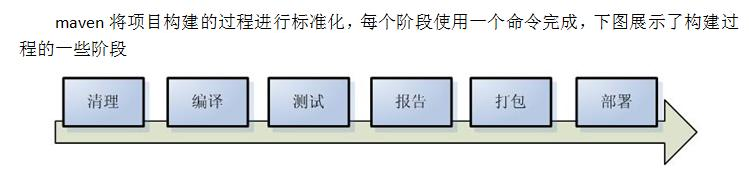

### 1. 概述


项目构建：将源代码生成可执行应用程序的过程，而构建过程包括：清理、编译、测试、报告、打包、部署





构建工具：构建工具是一个把源代码生成可执行应用程序的过程自动化的程序


**为什么使用项目构建工具**

- 它可以方便将整个项目划分不同模块,模块和模块之间是有一定联系，具有依赖、聚合...等特点

- 它为我们的jar文件提供一个统一的仓库,极大的方便我们对Jar依赖的引入

- 目录结构不同，项目构建工具让我们的目录结构标准化

#### 1.1. 主流的构建工具


- Apache Ant：用于自动化软件构建过程的软件工具，源于 2000 年初的的 Apache Tomcat 项目。

- Apache Maven：主要用于构建Java项目的自动化工具。

- Gradle：一个开源的自动化构建系统，建立在 Apache Ant 和 Maven Apache 概念的基础上，并引入了基于 Groovy 的特定领域语言（DSL），而不是使用 Apache Maven 宣布的项目配置XML 形式。

#### 1.2. 为什么是Maven

- 稳定可靠，插件众多。(这么多年版本一直维持在3.XX，而且很久才发布一次小更新，说明他稳定且bug较少)

- 配置简单，文档全面。学习成本低

#### 1.3. 什么是maven

Maven是 Apache 下的一个纯 **Java 开发的开源项目** ，是一个项目构建和管理的工具；它提供了帮助管理 构建、文档、报告、依赖、scms、发布、分发的方法。可以方便的编译代码、进行依赖管理、管理二进制库等等

### 2. 安装和运行Maven

- 官方网址：http://maven.apache.org

- 下载地址：http://maven.apache.org/download.cgi

- 历史版本：https://archive.apache.org/dist/maven/maven-3

> 注意：Maven3.3.x要求JDK版本必须是1.7及以上版本


#### 2.1. 安装

因为Maven本身就是基于Java编写的，所以需要先配置Java的环境变量，如果已经配置过了可跳过本步，具体步骤如下

- 新建JAVA_HOME变量其变量值指向JDK的安装目录：此电脑--->右击--->属性--->高级系统设置--->环境变量--->系统变量--->新建

- 将新建的JAVA_HOME变量追加到Path变量的值中：Path=%JAVA_HOME%\bin

- 在任意目录下(非JDK安装目录的bin目录下)打开控制台，执行命令：`java -version`，出现JDK的版本信息即为成功

将下载好的压缩包解压到任意目录下，**解压路径中不要出现中文**

配置M2_HOME环境变量，**此步不是必须**，如果需要在任意目录下执行Maven命令才需要配置

- 新建M2_HOME变量其变量值指向Maven的安装目录：此电脑--->右击--->属性--->高级系统设置--->环境变量--->系统变量--->新建

- 将新建的M2_HOME变量追加到Path变量的值中：Path=%M2_HOME%\bin

在任意目录下打开控制台，执行命令：`mvn -v `，如果出现Maven的版本信息即为成功


#### 2.2. 基础配置

Maven提倡的是**约定大于配置**，同时也为了消除各个开发工具目录的差异，所以对于项目的目录结果做了如下的标准

官方目录说明：http://maven.apache.org/guides/introduction/introduction-to-the-standard-directory-layout.html

| 目录名称             | 描述                                                         |
| :------------------- | :----------------------------------------------------------- |
| `src/main/java`      | Application/Library sources                                  |
| `src/main/resources` | Application/Library resources                                |
| `src/main/filters`   | Resource filter files                                        |
| `src/main/webapp`    | Web application sources                                      |
| `src/test/java`      | Test sources                                                 |
| `src/test/resources` | Test resources                                               |
| `src/test/filters`   | Test resource filter files                                   |
| `src/it`             | Integration Tests (primarily for plugins)                    |
| `src/assembly`       | Assembly descriptors                                         |
| `src/site`           | Site                                                         |
| `LICENSE.txt`        | Project's license                                            |
| `NOTICE.txt`         | Notices and attributions required by libraries that the project depends on |
| `README.txt`         | Project's readme                                             |

在Maven中提出了3种仓库的概念，具体的作用如下

| 仓库名称             | 作用                                                         |
| -------------------- | ------------------------------------------------------------ |
| 本地仓库             | 相当于缓存，工程第一次会从远程仓库（互联网）去下载jar 包，将jar包存在本地仓库（在程序员的电脑上）。第二次不需要从远程仓库去下载。先从本地仓库找，如果找不到才会去远程仓库找。 |
| 中央仓库（远程仓库） | 是一种远程仓库，仓库中的jar包由专业团队（maven团队）统一维护。里面存放了全世界大多数流行开源软件jar包 |
| 私服（远程仓库）     | 在公司内部架设一台私服，其它公司架设一台仓库，对外公开。     |

**关于坐标**

```
项目名称		模块命名			版本号

Groupid		Artifactid		SNAPSHOT(快照)	RELEASE(稳定版、发布版)
```

版本号的约定俗称，一般由3组数字组成，例如：1.2.3，具体含义如下

1：表示重大的变动，比如架构级别的修改

2：功能的的变动

3：bug的修复次数


**全局配置文件**

1. Maven默认读取的配置文件为当前用户目录(USER_HOME)/.m2文件夹下settings.xml

2. 将Maven安装目录下conf文件夹中的settings.xml复制到当前用户目录(USER_HOME)/.m2文件夹下

3. 修改配置文件：.m2/settings.xml


指定本地仓库位置

```xml
<localRepository>D:/maven-repository</localRepository>

```

配置镜像提升下载速度

```xml
<mirrors>
    <!-- 阿里云仓库 -->
    <mirror>
        <id>alimaven</id>
        <mirrorOf>central</mirrorOf>
        <name>aliyun maven</name>
        <url>http://maven.aliyun.com/nexus/content/repositories/central/</url>
    </mirror>
</mirrors>
```

#### 2.3. 创建Maven项目

使用Maven自带的骨架创建项目(注：仅仅做教学演示使用)

`mvn archetype:generate -DgroupId=com.coder163 -DartifactId=demo -DarchetypeArtifactId=maven-archetype-quickstart`

**常用命令**


| 命令        | 描述                                     |
| :---------- | :--------------------------------------- |
| mvn compile | 编译项目                                 |
| mvn test    | 编译项目并且进行单元测试                 |
| mvn clean   | 清除targe目录                            |
| mvn package | 将项目进行编译、测试、打包 jar\\war\\pom |
| mvn install | 将项目进行编译、测试、打包、发布到仓库中 |


### 3. POM文件详解

```xml
<project xmlns="http://maven.apache.org/POM/4.0.0" xmlns:xsi="http://www.w3.org/2001/XMLSchema-instance"
  xsi:schemaLocation="http://maven.apache.org/POM/4.0.0 http://maven.apache.org/maven-v4_0_0.xsd">
  <modelVersion>4.0.0</modelVersion>
  <groupId>com.coder163</groupId>
  <artifactId>demo</artifactId>
  <packaging>jar</packaging>
  <version>1.0-SNAPSHOT</version>
  <name>demo</name>
  <url>http://maven.apache.org</url>
  <dependencies>
    <dependency>
      <groupId>junit</groupId>
      <artifactId>junit</artifactId>
      <version>3.8.1</version>
      <scope>test</scope>
    </dependency>
  </dependencies>
</project>
```

#### 3.1. 基本标签

| 标签名称                             | 描述                                                         |
| :----------------------------------- | :----------------------------------------------------------- |
| `<modelVersion>4.0.0</modelVersion>` | maven的版本信息,固定值.不用管                               |
| `<groupId>`                          | 项目名称`<groupId>shop</groupId>`                            |
| `<artifactId>`                       | 模块的名称`<artifactId>user</artifactId>`                    |
| `<version>`                          | 项目发布的版本：测试版、快照版本、稳定版(发布版)             |
| `<packaging>`                        | 项目的打包方式：jar、war、pom                               |
| `<name>`                             | 随意                                                         |
| `<url>`                              | 仓库的地址,maven默认情况会先检查本地仓库,如果本地仓库没有所需要的jar,那么会去中央仓库下载 |
| `<dependencies>`                     | 依赖,所有的依赖包都需要写在这个标签之内                     |
| `<dependency>`                       | 具体的依赖                                                   |


> 注意：Maven在仓库中是通过坐标进行jar文件定位的

#### 3.2. 依赖范围

| scope的取值 | 描述                                                         |
| :---------- | :----------------------------------------------------------- |
| compile     | 默认值，表示编译依赖范围。即编译、测试、运行时都需要，会被打包;默认值compile表明该jar一直全程存在/需要 |
| test        | 表示测试依赖范围。即测试时需要，编译和运行时不需要，不会被打包。比如：junit |
| provided    | 表示已提供依赖范围。即编译、测试时需要，运行时不需要，不会被打包；比如：servlet-api和jsp-api被tomcat容器提供 |
| runtime     | 表示运行时提供依赖范围。即编译时不需要，运行和测试时需要，会被打包。比如：jstl、jdbc驱动 |
| system      | system范围依赖与provided类似，但是你必须显式的提供一个对于本地系统中JAR文件的路径，需要指定systemPath磁盘路径，system依赖不推荐使用 |


### 4. 插件

Maven的核心仅仅定义了抽象的生命周期，具体的任务都是交由插件完成的，每个插件都能实现多个功能，每个功能就是一个插件目标

Maven插件可以完成一些特定的功能。例如，集成jdk插件可以方便的修改项目的编译环境；集成tomcat插件后，无需安装tomcat服务器就可以运行tomcat进行项目的发布与测试。

在pom.xml中通过plugin标签引入maven的功能插件。

```xml

<plugins>

  <!-- 打包跳过Test -->
  <plugin>
    <groupId>org.apache.maven.plugins</groupId>
    <artifactId>maven-surefire-plugin</artifactId>
    <version>2.18.1</version>
    <configuration>
      <skipTests>true</skipTests>
    </configuration>
  </plugin>
    <plugin>
        <artifactId>maven-compiler-plugin</artifactId>
        <version>3.6.1</version>
        <configuration>
            <source>1.8</source>
            <target>1.8</target>
        </configuration>
    </plugin>
    <plugin>
        <artifactId>maven-assembly-plugin</artifactId>
        <configuration>
            <descriptorRefs>
                <descriptorRef>jar-with-dependencies</descriptorRef>
            </descriptorRefs>
        </configuration>
        <executions>
            <execution>
                <id>make-assembly</id>
                <phase>package</phase>
                <goals>
                    <goal>single</goal>
                </goals>
            </execution>
        </executions>
    </plugin>
</plugins>
```

### 5. 1．生命周期

Maven生命周期就是为了对所有的构建过程进行抽象和统一

包括项目清理，初始化，编译，打包，测试，部署等几乎所有构建步骤

Maven三大生命周期,生命周期Maven有三套相互独立的生命周期

- clean：在进行真正的构建之前进行一些清理工作

- default：构建的核心部分，编译，测试，打包，部署等等

- site：生成项目报告，站点，发布站点

#### 5.1. clean生命周期


每套生命周期都由一组阶段(Phase)组成，我们平时在命令行输入的命令总会对应于一个特定的阶段。比如，运行mvn clean ，这个的clean是Clean生命周期的一个阶段。有Clean生命周期，也有clean阶段。Clean生命周期一共包含了三个阶段

- pre-clean 执行一些需要在clean之前完成的工作
- clean 移除所有上一次构建生成的文件
- post-clean 执行一些需要在clean之后立刻完成的工作

mvn clean 中的clean就是上面的clean，在一个生命周期中，运行某个阶段的时候，它之前的所有阶段都会被运行，也就是说，mvn clean 等同于 mvn pre-clean clean ，如果我们运行 mvn post-clean ，那么 pre-clean，clean 都会被运行。这是Maven很重要的一个规则，可以大大简化命令行的输入。


#### 5.2. default生命周期

Default生命周期是Maven生命周期中最重要的一个，绝大部分工作都发生在这个生命周期中。这里，只解释一些比较重要和常用的阶段：


| 命令                   | 描述                                                     |
| :--------------------- | :------------------------------------------------------ |
| process-resources      | 复制并处理资源文件，至目标目录，准备打包。                   |
| compile                | 编译项目的源代码。                                        |
| process-test-resources | 复制并处理资源文件，至目标测试目录。                        |
| test-compile           | 编译测试源代码。                                          |
| test                   | 使用合适的单元测试框架运行测试。这些测试代码不会被打包或部署。 |
| package                | 接受编译好的代码，打包成可发布的格式，如 JAR                 |
| install                | 将包安装至本地仓库，以让其它项目依赖                        |
| deploy                 | 将最终的包复制到远程的仓库，以让其它开发人员与项目共享。      |


> - default生命周期中不包含clean,开发中如果修改代码后打包运行没有更改的效果,需要重新执行clean命令
> - 运行任何一个阶段的时候，它前面的所有阶段都会被运行

#### 5.3. site生命周期

pre-site 执行一些需要在生成站点文档之前完成的工作

site 生成项目的站点文档

post-site 执行一些需要在生成站点文档之后完成的工作，并且为部署做准备

site-deploy 将生成的站点文档部署到特定的服务器上

这里经常用到的是site阶段和site-deploy阶段，用以生成和发布Maven站点

### 6. 自定义骨架

虽然Maven官方通过插件给我们提供了大量的模板，但是这些模板或多或少的都存在一定的问题，无法满足我们实际的需求，所以我们需要根据自己的需求自定义模板出来


#### 6.1. 生成模板

根据已经存在的项目创建骨架，需要在pom.xml文件所在目录执行

```
mvn archetype:create-from-project
```

切换到生成的骨架项目目录

```
cd target\generated-sources\archetype
```

向本地仓库中发布

```
mvn install
```

#### 6.2. 使用模板

只要让我们的IDE能够找到archetype-catalog.xml文件即可

#### 6.3. 删除模板

Eclipse把和Maven的settings.xml在一起的archetype-catalog.xml删掉就可以了

IDEA：主要是要删除UserArchetypes.xml文件的内容。不同操作系统的位置不一样。

Mac系统：

- 一般是在${...}/.IntelliJIdea2018.3/Maven/Indices/UserArchetypes.xml

Linux系统：

- 一般是在${...}/.IntelliJIdea2018.3/system/Maven/Indices/UserArchetypes.xml

Windows系统：

- 一般是在${...}/.IntelliJIdea2018.3/system/Maven/Indices/UserArchetypes.xml


### 7. 高级特性


#### 7.1. 依赖

当一个工程依赖于另一工程时,可以将所依赖的工程发布到本地仓库中，在pom.xml添加依赖关系

```xml
<dependency>
  <groupId>jsxm</groupId>
  <artifactId>jsxm-user</artifactId>
  <version>1.0-SNAPSHOT</version>
</dependency>

```

#### 7.2. 继承

子模块引入父模块，父模块的打包方式必须是POM

```xml
<parent>
   <groupId>jsxm</groupId>
   <artifactId>jsxm-user</artifactId>
   <version>1.0-SNAPSHOT</version>
</parent>

```

#### 7.3. 聚合

父模块整合所有的子模块

```xml
<modules>
    <module>./../jsxm-factory</module>
    <module>./../jsxm-user</module>
</modules>

```
> 注意：以当前模块的pom.xml为起点查找子模块中的pom.xml的位置

### 8. 私服(nexus)

nexus是Maven仓库管理器(maven私服软件)，通过nexus可以搭建maven私服仓库，同时nexus还提供强大的仓库管理功能等。

#### 8.1. 安装

nexus下载地址：

- 3.x：https://help.sonatype.com/repomanager3/download

- 2.x：https://help.sonatype.com/repomanager2/download

nexus本身是一个免安装软件，所以不需要像普通的Windows软件一样安装，解压即可


> nexus2.X 默认的账号为admin    默认密码为admin123

> nexus3.x默认账号为admin，默认密码在${nexu_home}\sonatype-work\nexus\admin.password文件中存储

#### 8.2. 手动更新索引

> 仅适用于2.x版本

> nexus远程更新索引的速度太慢，所以需要我们手动更新


说明文档：http://maven.apache.org/repository/central-index.html

安装器下载地址：

https://repo.maven.apache.org/maven2/org/apache/maven/indexer/indexer-cli/5.1.1/indexer-cli-5.1.1.jar


索引包下载地址：

索引包：

- https://repo.maven.apache.org/maven2/.index/

需要下载的文件

- nexus-maven-repository-index.gz

- nexus-maven-repository-index.properties

> 把这几个文件放在同一个文件路径下面执行：java -jar indexer-cli-5.1.1.jar -u nexus-maven-repository-index.gz -d indexer

- 等待运行完后，在你运行那条命令的目录里面会出现：一个文件夹：indexer.

- 停止nexus服务，替换${nexu_home}\sonatype-work\nexus\indexer\central-ctx目录下的全部文件，然后启动nexus,到http://localhost:8081/nexus页面上就可以看到

#### 8.3. 仓库类型


| 名称          | 描述                                                                                                                   |
| :------------ | :--------------------------------------------------------------------------------------------------------------------- |
| hosted        | 宿主仓库:，部署自己的jar到这个类型的仓库，包括releases和snapshot两部分Releases公司内部发布版本仓库Snapshots 公司内部测试版本仓库 |
| proxy         | 代理仓库，用于代理远程的公共仓库，如maven中央仓库，用户连接私服，私服自动去中央仓库下载jar包或者插件                             |
| group         | 仓库组，用来合并多个hosted/proxy仓库，通常我们配置自己的maven连接仓库组                                                      |
| virtual(虚拟) | 兼容Maven1 版本的jar或者插件                                                                                             |


#### 8.4. 项目发布到私服

对远程nexus的一个操作：url、用户名、密码都得有，后续上传就是围绕这三个信息进行；

然后执行mvn deploy命令

1. Maven软件settings.xml中配置连接私服的用户名和密码（放在servers标签内）

```xml

<!--配置用户名密码开始-->
<server>
      <id>releases</id>
      <username>admin</username>
      <password>admin123</password>
 </server>
 <server>
      <id>snapshots</id>
      <username>admin</username>
      <password>admin123</password>
</server>
<!--配置用户名密码结束-->
```

2. 配置项目的pom.xml

```xml
<!--添加到要上传的项目pom中确定上传路径开始-->
 <distributionManagement>
      <repository>
          <id>releases</id>
          <url>http://localhost:8081/nexus/content/repositories/releases/</url>
      </repository>
      <snapshotRepository>
          <id>snapshots</id>
          <url>http://localhost:8081/nexus/content/repositories/snapshots/</url>
      </snapshotRepository>
  </distributionManagement>
<!--添加到要上传的项目pom中确定上传路径结束-->
```

> pom.xml这里id 和 settings.xml 配置 id对应

**把第三方依赖放入本地仓库或者私服**

第三方依赖放入本地仓库

```
 mvn install:install-file -Dfile=ojdbc14-10.2.0.4.0.jar -DgroupId=com.oracle -DartifactId=ojdbc14 -Dversion=10.2.0.4.0 -Dpackaging=jar
```

第三方依赖放入私服

maven的settings配置文件中配置第三方仓库的server信息

```xml
<server>
    <id>thirdparty</id>
    <username>admin</username>
    <password>admin123</password>
</server>
```

执行命令

```
mvn deploy:deploy-file -Dfile=ojdbc14-10.2.0.4.0.jar -DgroupId=com.oracle -DartifactId=ojdbc14 -Dversion=10.2.0.4.0 -Dpackaging=jar -Durl=http://localhost:8081/nexus/content/repositories/thirdparty/ -DrepositoryId=thirdparty
```

#### 8.5. 私服上下载依赖

在maven的settings.xml文件中配置下载模板（放在profiles标签内）

```xml
<profile>
<!--profile的id-->
<id>dev</id>
<repositories>
  <repository>
    <!--仓库id，repositories可以配置多个仓库，保证id不重复-->
    <id>nexus</id>
    <!--仓库地址，即nexus仓库组的地址-->
    <url>http://localhost:8081/nexus/content/groups/public/</url>
    <!--是否下载releases构件-->
    <releases>
      <enabled>true</enabled>
    </releases>
    <!--是否下载snapshots构件-->
    <snapshots>
      <enabled>true</enabled>
    </snapshots>
  </repository>
</repositories>
 <pluginRepositories>
    <!-- 插件仓库，maven的运行依赖插件，也需要从私服下载插件 -->
    <pluginRepository>
        <!-- 插件仓库的id不允许重复，如果重复后边配置会覆盖前边 -->
        <id>public</id>
        <name>Public Repositories</name>
        <url>http://localhost:8081/nexus/content/groups/public/</url>
    </pluginRepository>
</pluginRepositories>
</profile>
```

激活

```xml
<!--激活模板开始-->
  <activeProfiles>
    <activeProfile>dev</activeProfile>
  </activeProfiles>
<!--激活模板结束-->
```

### 9. 打包资源文件

```xml
<build>

    <resources>
        <resource>
            <directory>src/main/resources</directory>
            <includes>
                <include>**/*.properties</include>
                <include>**/*.xml</include>
            </includes>
            <filtering>false</filtering>
        </resource>
        <resource>
            <directory>src/main/java</directory>
            <includes>
                <include>**/*.properties</include>
                <include>**/*.xml</include>
            </includes>
            <filtering>false</filtering>
        </resource>
    </resources>
</build>
```