### 1. 概述

Hibernate是一个持久层的框架

是一个关系数据库ORM框架：

- ORM：对象关系映射
- ORM 就是通过将Java对象映射到数据库表，通过操作Java对象，就可以完成对数据表的操作

Hibernate提供了对关系型数据库增删改查操作

当前常用的ORM框架

- JPA: Java Persistence API.JPA通过JDK 5.0注解或XML描述对象－关系表的映射关系（只有接口规范）
- Mybatis(iBatis):本是apache的一个开源项目 iBatis，支持普通 SQL查询，存储过程和高级映射的优秀持久层框架
- Spring JDBCTemplate


为什么要使用Hibernate

Hibernate对JDBC访问数据库的代码做了封装，大大简化了数据访问层繁琐的重复性代码

- Hibernate是一个基于jdbc的主流持久化框架，是一个优秀的orm实现，它很大程度的简化了dao层编码工作

- **Hibernate使用Java的反射机制**，而不是字节码增强程序类实现透明性

- Hibernate的性能非常好，因为它是一个轻量级框架。映射的灵活性很出色。它支持很多关系型数据库，从一对一到多对多的各种复杂关系

Hibernate版本问题

- Hibernate3.x:主流版本

- Hibernate4.x:最新版本,该版本不是完全向下兼容,它跟Spring整合包括其中的一些API都有所变化

### 2. 入门案例

#### 2.1. 依赖
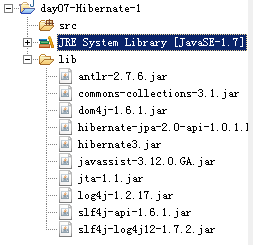

#### 2.2. Hibernate的核心配置

- 参考资料：Hibernate_HOME\project\etc\*

- 全局的核心配置文件：

- 该文件约束的参考文件：hibernate.properties
- 一般情况下该文件名固定：hibernate.cfg.xml

- 如果不是使用规范的名称需要单独的指定

- ava实体类和数据库表的映射配置文件

- 一般情况下的名称规范：Java实体类的名.hbm.xml


#### 2.3. 编码实现

编写数据库的表

```sql
create table t_user(
	uid varchar(255),
	uname varchar(30),
	sex varchar(3),
	primary key (uid)
);

```

编写跟表对应Java类

```java
	public class User implements Serializable{
	private String uid;
	private String name;
	private String sex;
}
```

编写映射文件：User.hbm.xml

```xml
<!DOCTYPE hibernate-mapping PUBLIC
    "-//Hibernate/Hibernate Mapping DTD 3.0//EN"
    "http://www.hibernate.org/dtd/hibernate-mapping-3.0.dtd">
<hibernate-mapping>
	<class name="domain.User" table="t_user">
		<!--绑定主键 -->
		<id column="uid" name="uid" >
			<!--主键生成策略  -->
			<generator class="native"/>
		</id>
		<!--绑定其他的普通属性  -->
		<property name="name" column="uname" />
		<property name="sex" column="sex" />
	</class>
	</hibernate-mapping>

```

编写核心配置文件

```xml
<hibernate-configuration>
	<session-factory >
		<!-- 连接数据库的必须的配置信息 -->
		<!--hibernate方言-->
		<property name="hibernate.dialect">org.hibernate.dialect.MySQLDialect</property>
		<!--驱动类  -->
		<property name="hibernate.connection.driver_class">com.mysql.jdbc.Driver</property>
		<!--连接路径：数据库  -->
		<property name="hibernate.connection.url">jdbc:mysql://localhost:3306/db_hibernate01</property>
		<!--用户名  -->
		<property name="hibernate.connection.username">root</property>
		<!--密码  -->
		<property name="hibernate.connection.password">123</property>

		<!--可选信息-->
		<!-- 显示SQL -->
		<property name="hibernate.show_sql">true</property>
		<!-- 格式化SQL -->
		<property name="hibernate.format_sql">true</property>
		<!-- hbm:映射 to DDL: create drop alter -->
		<property name="hibernate.hbm2ddl.auto">update</property>
	</session-factory>
</hibernate-configuration>

```

编写测试类

```java
public class Test01 {
	@Test
	public void findAll(){
		//加载全局的核心配置文件
		Configuration configuration=new Configuration().configure();
		//构建一个sessionfactory对象,类似于一个连接池
		SessionFactory factory=configuration.buildSessionFactory();
		//获取session对象，该对象类似于Connection对象
		Session session=factory.openSession();
		//通过session对象开启事务
		Transaction tx=session.beginTransaction();
		//查询单条记录
		//HQL hibernate	Query Lang
		Query query=session.createQuery("from domain.User");
		List<User> us=query.list();
		System.out.println(us);
		//通过session提交事务
		tx.commit();
		//释放资源
		session.close();
	}

	@Test
	public void findById(){
		//加载全局的核心配置文件
		Configuration configuration=new Configuration().configure();
		//构建一个sessionfactory对象,类似于一个连接池
		SessionFactory factory=configuration.buildSessionFactory();
		//获取session对象，该对象类似于Connection对象
		Session session=factory.openSession();
		//通过session对象开启事务
		Transaction tx=session.beginTransaction();
		//查询单条记录
		User u=(User) session.get(User.class, "1002");	//马上执行SQL并进行赋值
		//它不是马上执行,当使用该对象时再执行SQL赋值,延迟加载
		//使用类型不一样user_$$代理对象
		User u1=(User) session.load(User.class, "1003");

		System.out.println(u.getUid());
		//通过session提交事务
		tx.commit();
		//释放资源
		session.close();
	}
	@Test
	public void update(){
		//加载全局的核心配置文件
		Configuration configuration=new Configuration().configure();
		//构建一个sessionfactory对象,类似于一个连接池
		SessionFactory factory=configuration.buildSessionFactory();
		//获取session对象，该对象类似于Connection对象
		Session session=factory.openSession();
		//通过session对象开启事务
		Transaction tx=session.beginTransaction();
		//查询单条记录
		User u=(User) session.get(User.class, "1002");
		System.out.println(u);
		u.setName("小狗");
		//将查询出来的结果更改之后再次更新
		session.update(u);

		//通过session提交事务
		tx.commit();
		//释放资源
		session.close();
	}
	@Test
	public void delete(){
		//加载全局的核心配置文件
		Configuration configuration=new Configuration().configure();
		//构建一个sessionfactory对象,类似于一个连接池
		SessionFactory factory=configuration.buildSessionFactory();
		//获取session对象，该对象类似于Connection对象
		Session session=factory.openSession();
		//通过session对象开启事务
		Transaction tx=session.beginTransaction();
		User user=new User();
		user.setUid("a4d0dd4b-e7fa-4f33-99bf-54ee1e90f517");

		session.delete(user);

		//通过session提交事务
		tx.commit();
		//释放资源
		session.close();
	}
	@Test
	public void add(){
		//加载全局的核心配置文件
		Configuration configuration=new Configuration().configure();
		//构建一个sessionfactory对象,类似于一个连接池
		SessionFactory factory=configuration.buildSessionFactory();
		//获取session对象，该对象类似于Connection对象
		Session session=factory.openSession();
		//通过session对象开启事务
		Transaction tx=session.beginTransaction();
		//具体的添加操作
		User user=new User();
		user.setUid(UUID.randomUUID().toString());
		user.setSex("男");
		user.setName("小白1");
		//添加
		session.save(user);

		//通过session提交事务
		tx.commit();
		//释放资源
		session.close();

	}
}

```

### 3. 全局配置(org.hibernate.cfg.Configuration)

主要作用：就是加载配置文件,构建SessionFactory

#### 3.1. xml方式(主流)

加载配置文件的方式

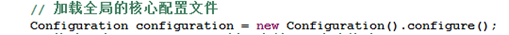

底层实现的源码
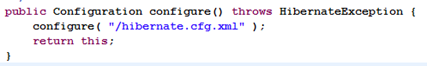


必须的配置项

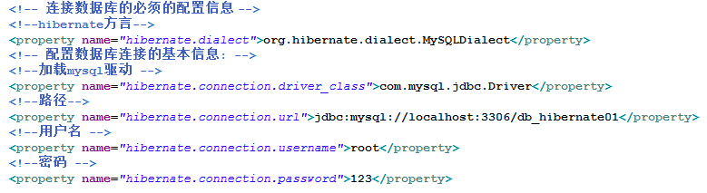


> 注意：方言的配置必须要和连接数据库类型保持一致,因为将来hibernate生成的sql语句就是依据该配置项

可选的配置项

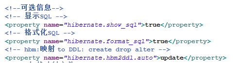


具体配置参考：Hibernate_HOME\hibernate-distribution-3.6.10.Final\project\etc\hibernate.properties

```xml
<property name="hibernate.hbm2ddl.auto">update</property>
```
该配置项允许接收的值解释

create:当hibernate框架被加载时,如果数据库中没有改表，它都会自动创建一个新表

create-drop：当hibernate框架被加载时,无论表是否存在，它都会自动创建一个新表

update：当hibernate框架被加载时,会检查表的结构是否一致,如果不同那么会更新表结构

validate：校验表结构,如果不一致就报错


#### 3.2. properties(非主流)

配置方式

- src下新建一个hibernate.properties文件

- 具体的配置：Hibernate_HOME\hibernate-distribution-3.6.10.Final\project\etc\hibernate.properties

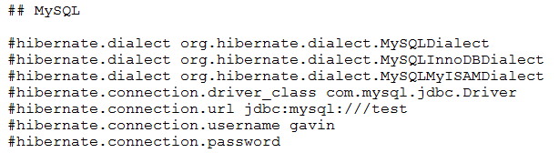


加载方式

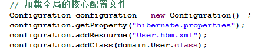


两种方式比较

- xml方式可以直接包含映射文件,而properties不行,必须要手动编码实现


#### 3.3. 核心类说明

org.hibernate.SessionFactory(会话工厂)

- 主要作用：类似于一个连接池,可以获取Session对象

org.hibernate.Session(会话)

- 主要作用：Hibernate中的所有CRUD操作都需要依靠该对象实现,它类似于一个JDBC中Connection对象

- 添加：
    - public Serializable save(Object object)throws HibernateException ：将某个对象执行添加操作,成功返回该对象的唯一标识
    - public Serializable save(String entityName, Object object)throws HibernateException

- 删除
    - 删除操作不一定是id ,将要删除的条件封装成一个对象然后进行删除
    - public void delete(Object object)throws HibernateException

- 修改
    - 修改操作切记是先查后改,默认情况下会将实体类的字段默认值作为修改的数据,这样容易导致数据错乱
    - public void update(Object object)②throws HibernateException

- 保存或者修改：
    - 要么保存或更新给定的实例,根据其标识符属性的值。默认实例总是保存
    - public void saveOrUpdate(Object object)throws HibernateException

org.hibernate.Transaction(事务)

- Hibernate默认情况下事务回滚

- 设置方式：

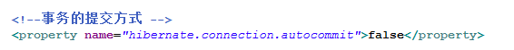

> 注意：如果没有开启事务，那么Session中的每个的操作，都相当于一个独立的事务

常用API

- commit：事务提交
- rollback()：事务回滚
- beginTransaction();	事务开启

org.hibernate.Query(执行HQL语句的对象)

- HQL是Hibernate Query Language缩写，语法很像SQL语法，但是完全面向对象的

- 常用方法：
    - setFirstResult(int firstResult)：设置返回结果从第几条开始
    - setMaxResults(int maxResults) ：设置本次返回结果记录条数
    - public List list()throws HibernateException：返回集合数据(多条记录)
    - public Object uniqueResult() throws HibernateException	：返回一条唯一的查询结果,失败返回null

具体使用规则

- 设置查询条件

    - 直接拼字符串

    - 使用？作为占位符
    - 使用:参数名作为占位符(推荐)

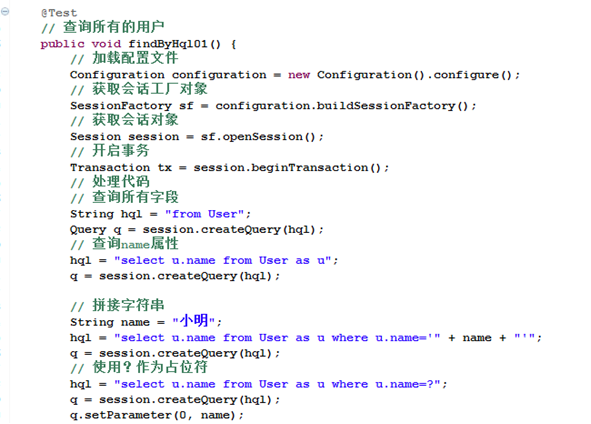
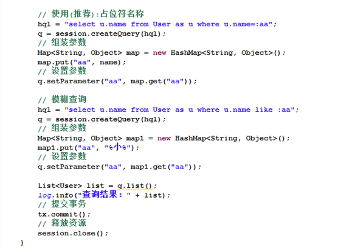

实际编程中使用的实例

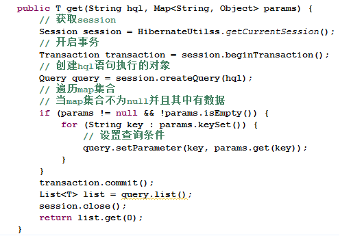


org.hibernate.Criteria(条件查询对象)

Criteria 是Hibernate提供的用于条件查询接口

获取对象：Criteria criteria = session.createCriteria(Object.class);

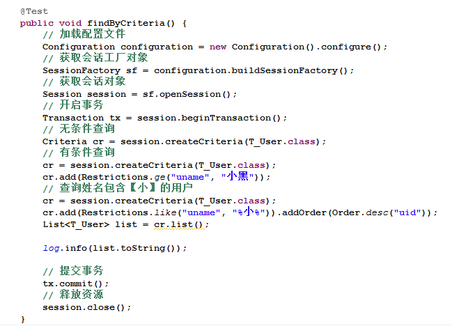


### 4. 映射文件(ClassName.hbm.xml)

DTD文件约束

```xml
<!DOCTYPE hibernate-mapping PUBLIC 
    "-//Hibernate/Hibernate Mapping DTD 3.0//EN"
"http://www.hibernate.org/dtd/hibernate-mapping-3.0.dtd">

```

#### 4.1. 命名规则

它不是固定的,名字任意即可

一般情况下我们会以：ClassName.hbm.xml的形式命名,其中ClassName实体类的名称


#### 4.2. 具体的配置项

```xml
<class name="domain.User" table="t_user" >
```
- class：表示实体类的名称

- table:表示该实体类所对应表的名称,可以省略不写,如果省略表示以类名作为表名

```xml
<property name="name" column="uname" />
```
- name表示字段名(实体类中的)

- column：表示列名(数据库表中),该列名可以省略


主键

- 自然主键：虽然满足主键的一切特点,但是具有一定的业务含义的主键称为自然主键

- 代理主键：满足主键一切特征,同时不具备任何业务含义，这样的主键我们称为代理主键

```xml
<id column="uid" name="uid" >
```

- name: 标识持久化类 OID 的属性名
- column: 设置标识属性所映射的数据列的列名(主键字段的名字)
- type:指定 Hibernate 映射类型. Hibernate 映射类型是 Java 类型与 SQL 类型的桥梁. 如果没有为某个属性显式设定映射类型, Hibernate 会运用反射机制先识别出持久化类的特定属性的 Java 类型, 然后自动使用与之对应的默认的 Hibernate 映射类型

    - 支持的类型
    - Java类型：java.lang.String
    - Hibernate类型：string
    - SQL类型：几乎不用,需要使用<type>标签进行声明

- Java 的基本数据类型和包装类型对应相同的 Hibernate 映射类型. 基本数据类型无法表达 null, 所以对于持久化类的 OID 推荐使用包装类型（integer，long，string等）

生成策略

```xml
<generator class="assigned"/>
```

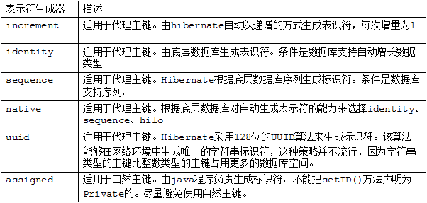


> 注意：
> - 对于主键生成策略我们一般使用的native,因为他会自动选择【identity、sequence】中的一种
> - Identity要求主键的类型是整数(Integer)


### 5. 持久化对象状态

为什么要划分状态

Hibernate为了方便管理(操作)持久化对象

#### 5.1. 瞬时态 transient

不存在持久化标识OID，尚未与Hibernate Session关联对象，被认为处于瞬时态，失去引用将被JVM回收

主要特征：无持久化标识OID，未与session关联


#### 5.2. 持久态 persistent

存在持久化标识OID，与当前session有关联，并且相关联的session没有关闭 ,并且事务未提交

主要特征：存在持久化标识OID，与session关联

#### 5.3. 脱管态 detached

存在持久化标识OID，但没有与当前session关联，脱管状态改变hibernate不能检测到

主要特征:存在持久化标识OID，未与session关联

#### 5.4. 名词解释

OID：简单的说就是某一个对象的唯一标识

session：类似于Connection对象，其中包含一系列用来操作数据库记录的方法和对象delete/get/Query


### 6. 缓存机制

所谓缓存就是将数据源(数据库、xml等)的数据临时存储在内存中某一个区域中,方便读写

Hibernate的缓存机制是为了提高操作数据的性能

#### 6.1. Hibernate中缓存的划分

一级缓存(session):Hibernate中自带，不可卸载,默认是开启状态

二级缓存(sessionFactory)：默认是关闭状态

#### 6.2. 一级缓存(session级别)

内部结构：  在 Session 接口的实现中包含一系列的 Java 集合, 这些 Java 集合构成了 Session 缓存,由缓存和快照两个区域组成

当session的save()方法持久化(保存)一个对象时

- 该对象被载入缓存(存入集合)，只要缓存不清空(没有清空集合中的数据)，该对象仍然处于生命周期中。
- 当试图get()、 load()该对象时，会判断缓存(集合)中是否存在该对象，有则返回，此时不查询数据库。没有再查询数据库

#### 6.3. 缓存数据刷出的时机

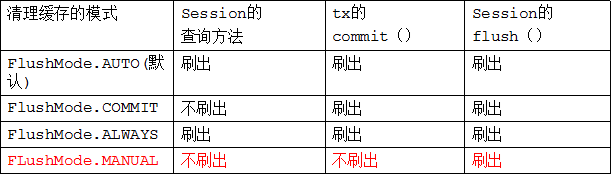

如何设置刷出时机：session.setFlushMode(FlushMode.AUTO);

#### 6.4. 快照区

当session加载了某个对象后，会为该对象的值类型的属性复制一份快照

当刷出缓存时，通过比较该对象的当前属性和快照区中的属性，如果不相同则发送update语句


### 7. 关联映射

#### 7.1. 一对多关联

多的一方

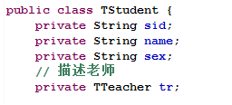

Student.hbm.xml

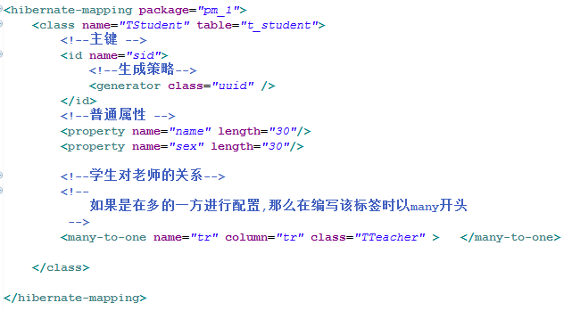

`<many-to-one>`的属性

- name：该属性对应的`<class>`类的中的字段
- column:外键字段名称,名称随意,但是要和TTeacher.hbm.xml<key>标签中的column中的配置对应
- class:tr字段对应的类型

一的一方

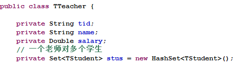

TTeacher.hbm.xml

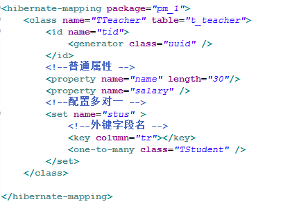

`<set>`

- name:指向所关联类的字段(属性)
- `<key>`:用来指定外键字段的名称,
- `<one-to-many>`：在一的一方配置关联关系
- class：说明`<set>`标签中name的类型


#### 7.2. 级联保存

方式1

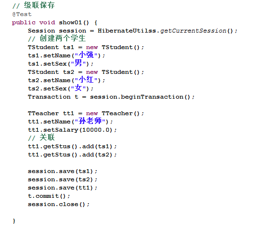


方式二：实现保存一方时,跟该记录关联的数据也可以自动保存

必须要进行配置

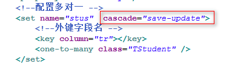

该配置项的值是固定值

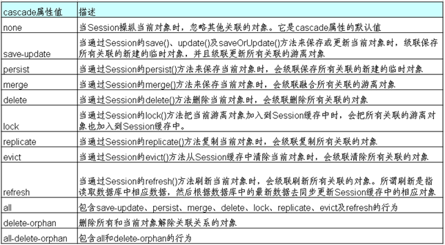


#### 7.3. 级联删除

级联删除时.注意必须要先查后删

默认情况下：会先将关联的外键值置空,然后删除指定的记录

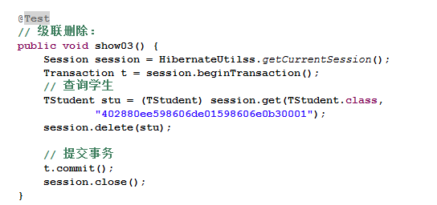


配置文件


#### 7.4. 多对多

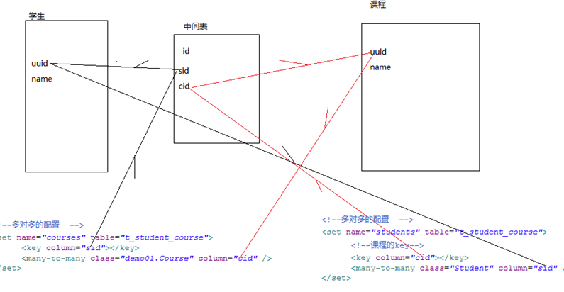


### 8. Hibernate的检索(查询)方式

#### 8.1. 基本的查询

导航对象图检索方式:  根据已经加载的对象导航到其他对象

OID 检索方式:  按照对象的 OID 来检索对象

HQL 检索方式:

- 使用面向对象的 HQL 查询语言

QBC 检索方式:

- 使用 QBC(Query By Criteria) API 来检索对象. 这种 API 封装了基于字符串形式的查询语句, 提供了更加面向对象的查询接口.

本地 SQL 检索方式: 使用本地数据库的 SQL 查询语句


#### 8.2. HQL的查询方式(重点)

HQL(Hibernate Query Language) 是面向对象的查询语言, 它和 SQL 查询语言有些相似. 在 Hibernate 提供的各种检索方式中, HQL 是使用最广的一种检索方式

支持投影查询, 即仅检索出对象的部分属性

- 不是查询所有的,而是查询一部分,例如：姓名    `hql = "select s.name  from demo01.Student s";`


通过 Session 的 createQuery() 方法创建一个 Query 对象

-  Qurey 接口支持方法链编程风格

HQL vs SQL:

**HQL 查询语句是面向对象的**, Hibernate 负责解析 HQL 查询语句, 然后根据对象-关系映射文件中的映射信息, 把 HQL 查询语句翻译成相应的 SQL 语句. HQL 查询语句中的主体是域模型中的类及类的属性

**SQL 查询语句是与关系数据库绑定在一起的**. SQL 查询语句中的主体是数据库表及表的字段.


#### 8.3. QBC的查询方式(次重点)

```java
	List<Student> list = session.createCriteria(Student.class).add(Restrictions.eq("name", "凤姐")).list();
```

排序

```java
Criteria c = session.createCriteria(Student.class);
c.addOrder(Order.asc("name"));
c.list();

```

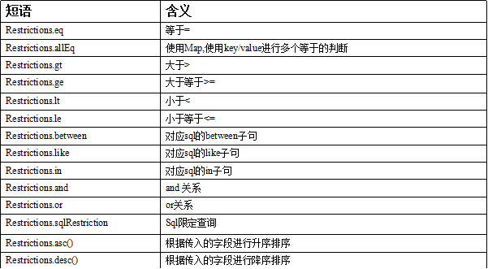


SQL的查询方式

```java
	SQLQuery sq = session.createSQLQuery("select * from t_student").addEntity(Student.class);
	log.info(sq.list());

```

#### 8.4. 多表查询

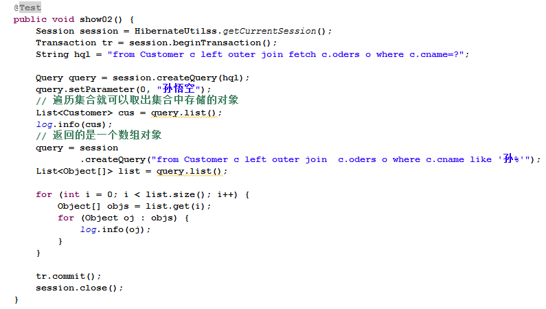


### 9. Hibernate通用Dao

```java

package com.coder163.main.dao;

import org.hibernate.criterion.DetachedCriteria;

import java.io.Serializable;
import java.util.Collection;
import java.util.List;

/**
 * 功能描述: Hibernate通用的持久层接口
 *
 * @author 侯叶飞
 * @create 2018-04-12 14:24
 **/
public interface BaseDaoI<T> {

    /**
     * 保存
     *
     * @param entity 对象
     *
     * @return id
     */
     Serializable save(T entity);
    /**
     * 将实体对象 集合保存到数据库中
     *
     * @param collection
     *            实体对象 集合
     */
     void saveAll(Collection<T> collection);

    /**
     * 更新
     *
     * @param entity 对象
     */
     void update(T entity);

    /**
     * 保存或更新
     *
     * @param entity 对象
     */
     void saveOrUpdate(T entity);

    /**
     * 删除
     *
     * @param entity 删除的对象
     */
     void delete(T entity);

    /**
     * 通过对象标识符获取对象
     *
     * @param id 主键
     * @return 标识符对应的对象，没找到则返回null
     */
     T findById(Serializable id);

    /**
     * 返回所有对象的列表
     *
     * @return
     */
     List<T> findAll();

    /**
     * 查找满足条件的总记录数
     *
     * @param detachedCriteria 查询条件
     * @return
     */
    Integer findRecordNumByPage(DetachedCriteria detachedCriteria);

    /**
     * 向分页对象中设置记录
     *
     * @param detachedCriteria
     *            离线查询对象
     * @param startIndex
     *            开始索引
     * @param pageSize
     *            每页记录数
     * @return
     */
    List<T> findByPage(DetachedCriteria detachedCriteria, Integer startIndex, Integer pageSize);

    /**
     * 通过条件查询
     *
     * @param detachedCriteria
     * @return
     */
    List<T> findByCriteria(DetachedCriteria detachedCriteria);

    /**
     * 通用更新方法
     *
     * @param queryName
     *            命名查询的名字，在映射文件中定义
     * @param objects
     *            参数列表
     */
     void executeUpdate(String queryName, Object... objects);

    /**
     * 按条件统计
     * @param deCriteria
     * @return
     */
    Integer count(DetachedCriteria deCriteria);
}


package com.coder163.main.dao;

import org.hibernate.Query;
import org.hibernate.Session;
import org.hibernate.criterion.DetachedCriteria;
import org.hibernate.criterion.Projections;

import java.io.Serializable;
import java.lang.reflect.ParameterizedType;
import java.lang.reflect.Type;
import java.util.Collection;
import java.util.List;

/**
 * 功能描述: Hibernate通用持久层接口实现类
 *
 * @author 侯叶飞
 * @date 2018-04-12 14:30
 **/
public class BaseDaoImpl<T>  extends HibernateDaoSupport implements BaseDaoI<T> {
    // 存储泛型的实际参数
    private Class entity;

    public BaseDaoImpl() {
        // 谁实现该类，这就是谁的类字节码
        Class c = this.getClass();
        // 返回表示此 Class 所表示的实体（类、接口、基本类型或 void）的直接超类的 Type
        Type type = c.getGenericSuperclass();
        // 将类型强转为参数化类型
        ParameterizedType pType = (ParameterizedType) type;
        // 获取该类的父类的所有实际类型参数，也就是泛型的实际参数
        // 这里也就是获取BaseDaoImpl的实际类型参数
        Type[] actualTypeArguments = pType.getActualTypeArguments();
        // 将实际类型参数赋值给成员变量
        entity = (Class) (actualTypeArguments[0]);
    }

    @Override
    public Serializable save(T entity) {
        return this.getHibernateTemplate().save(entity);
    }

    @Override
    public void saveAll(Collection<T> collection) {
        for (T t : collection) {
            this.getHibernateTemplate().save(t);
        }
    }

    @Override
    public void update(T entity) {
        this.getHibernateTemplate().update(entity);
    }

    @Override
    public void saveOrUpdate(T entity) {
        this.getHibernateTemplate().saveOrUpdate(entity);
    }

    @Override
    public void delete(T entity) {
        this.getHibernateTemplate().delete(entity);
    }

    @Override
    public T findById(Serializable id) {
        return (T) this.getHibernateTemplate().get(this.entity, id);
    }
    @Override
    public List<T> findAll() {
        StringBuffer hql = new StringBuffer("from ");

        hql.append(entity.getName());

        return this.getHibernateTemplate().find(hql.toString());
    }

    @Override
    public Integer findRecordNumByPage(DetachedCriteria detachedCriteria) {
        // 设置记录数投影
        detachedCriteria.setProjection(Projections.rowCount());
        List<Long> list = (List<Long>) this.getHibernateTemplate().findByCriteria(detachedCriteria);
        // 将投影置为空
        detachedCriteria.setProjection(null);
        if (list.size() > 0) {
            return list.get(0).intValue();
        }
        return null;
    }

    @Override
    public List<T> findByPage(DetachedCriteria detachedCriteria, Integer startIndex, Integer pageSize) {
        // 指定hibernate在连接查询时，只封装成一个对象
        detachedCriteria.setResultTransformer(DetachedCriteria.ROOT_ENTITY);
        return (List<T>) this.getHibernateTemplate().findByCriteria(detachedCriteria, startIndex, pageSize);
    }

    @Override
    public List<T> findByCriteria(DetachedCriteria detachedCriteria) {
        return (List<T>) this.getHibernateTemplate().findByCriteria(detachedCriteria);
    }

    @Override
    public void executeUpdate(String queryName, Object... objects) {
        // 获取当前session
        Session session = this.getSessionFactory().getCurrentSession();
        // 获取命名查询对象
        Query query = session.getNamedQuery(queryName);
        int i = 0;
        // 设置参数
        if (objects != null) {
            for (Object object : objects) {
                query.setParameter(i++, object);
            }
        }
        query.executeUpdate();
    }

    @Override
    public Integer count(DetachedCriteria deCriteria) {
        deCriteria.setProjection(Projections.rowCount());
        return Integer.parseInt(deCriteria.getExecutableCriteria(this.getSession()).uniqueResult().toString());
    }
}
```