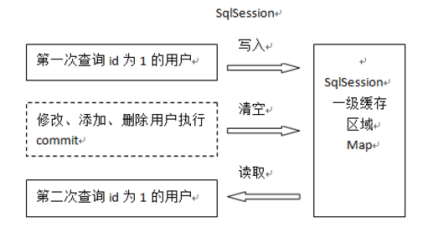

### 1. 概述

Mybatis原本是Apache软件基金会的一个开源项目叫做iBatis，2010年这个项目由Apache迁移到了goole code管理才改名为Mybatis，2013年又迁移到了GitHub。

Mybatis是一个优秀的持久层框架（Dao层框架），它是对JDBC的封装，使得开发者只需要关注Sql语句（业务）本身即可，无需开发者处理加载驱动、获取连接、创建Statement等繁琐的过程

Mybatis最大的特点是把Sql语句写在XML配置文件当中。而且Mybatis执行完Sql语句之后可以以对象形式返回（POJO/POJO集合等）

Mybatis是一个实现了ORM(Object/Relation Mapping 对象/关系映射)思想的持久层框架

> ORM思想：将数据库中的关系数据表映射为JAVA中的对象，把对数据表的操作转换为对对象的操作，实现面向对象编程。因此ORM的目的是使得开发人员以面向对象的思想来操作数据库


### 2. 原生JDBC操作数据库分析


```java
package com.ujiuye.mybatis.dao;
import com.ujiuye.mybatis.pojo.User;

import java.sql.Connection;
import java.sql.DriverManager;
import java.sql.PreparedStatement;
import java.sql.ResultSet;
import java.util.ArrayList;
import java.util.List;

public class UserDaoImpl implements UserDao {

    private String driver = "com.mysql.jdbc.Driver";
    private String url = "jdbc:mysql://localhost:3306/mybatis?characterEncoding=utf-8";
    private String username = "root";
    private String password = "root";


    public List<User> queryUserList() throws Exception {
        List<User> userList = new ArrayList<User>();

        Class.forName(driver);
        /**
         * 问题一：频繁获取/释放数据库连接，影响数据库和应用性能
         * 解决：数据库连接池技术，C3P0,DRUID（阿里巴巴荣誉出品，号称前无古人后无来者世界最强没有之一）
         */
        Connection connection = DriverManager.getConnection(url, username, password);
        /**
         * 问题二：sql语句硬编码，后期难以维护
         * 解决：若sql语句和java代码分离，比如sql写在配置文件中。Mybatis就是这么干的
         */
        String sql = "select * from user";
        /**
         * 问题三：sql语句where条件和占位符一一对应，后期难以维护
         */
        // String sql1 = "select * from user where username=? and id=?";
        PreparedStatement preparedStatement = connection.prepareStatement(sql);
        // preparedStatement.setInt(1,2);
        ResultSet resultSet = preparedStatement.executeQuery();
        User user = null;
        /**
         * 问题四：结果集解析麻烦，查询列硬编码
         * 期望：如果单条记录直接返回实体对象，如果多条记录返回实体的集合
         */
        while(resultSet.next()) {
            user = new User();
            user.setId(resultSet.getInt("id"));
            user.setUsername(resultSet.getString("username"));
            user.setSex(resultSet.getString("sex"));
            user.setBirthday(resultSet.getDate("birthday"));
            user.setAddress(resultSet.getString("address"));

            userList.add(user);
        }
        resultSet.close();
        preparedStatement.close();
        connection.close();
        return userList;
    }
}
```

### 3. 入门程序

实体类

```java
package com.offcn.domain;

import lombok.Data;

import java.io.Serializable;

@Data
public class User implements Serializable {

    private int uid;

    private String uname;

}
```

映射文件:UserMapper.xml

```xml
<?xml version="1.0" encoding="utf-8" ?>
<!DOCTYPE mapper
        PUBLIC "-//mybatis.org//DTD Mapper 3.0//EN"
        "http://mybatis.org/dtd/mybatis-3-mapper.dtd">
<mapper namespace="test">
    <select id="queryUserList" resultType="com.offcn.domain.User">
        select * from t_user
    </select>
</mapper>
```

全局配置文件：SqlMapConfig.xml

```xml
<?xml version="1.0" encoding="UTF-8" ?>
<!DOCTYPE configuration
        PUBLIC "-//mybatis.org//DTD Config 3.0//EN"
        "http://mybatis.org/dtd/mybatis-3-config.dtd">
<configuration>
    <environments default="development">
        <environment id="development">
            <transactionManager type="JDBC" />
            <dataSource type="POOLED">
                <property name="driver" value="com.mysql.jdbc.Driver" />
                <property name="url" value="jdbc:mysql://127.0.0.1:3306/mybatis?characterEncoding=utf8" />
                <property name="username" value="root" />
                <property name="password" value="123456" />
            </dataSource>
        </environment>
    </environments>

    <mappers>
        <mapper resource="mappers/UserMapper.xml"></mapper>
    </mappers>
</configuration>
```

测试

```java
package com.offcn;

import com.offcn.domain.User;
import org.apache.ibatis.io.Resources;
import org.apache.ibatis.session.SqlSession;
import org.apache.ibatis.session.SqlSessionFactory;
import org.apache.ibatis.session.SqlSessionFactoryBuilder;
import org.junit.Test;

import java.io.InputStream;
import java.util.List;

public class Application{

	@Test
	public void demo1() throws Exception{
		InputStream inputStream = Resources.getResourceAsStream("SqlMapConfig.xml");
		SqlSessionFactoryBuilder sqlSessionFactoryBuilder = new SqlSessionFactoryBuilder();
		SqlSessionFactory sqlSessionFactory = sqlSessionFactoryBuilder.build(inputStream);
		SqlSession sqlSession = sqlSessionFactory.openSession();
		List<User> list = sqlSession.selectList("test.queryUserList");
		if(list != null && list.size() > 0) {
			for (int i = 0; i < list.size(); i++) {
				User user =  list.get(i);
				System.out.println(user);
			}
		}
		sqlSession.close();
	}
}
```

### 4. 全局配置文件详解

在mybatis中一共有两种类型的配置文件，一个是全局的配置文件，相当于mybatis功能的总开关，另外一个则是存放SQL语句的配置文件我们称为映射文件，全局配置文件的内容如下


#### 4.1. properties(属性)

```xml
<!--引入外部属性文件-->
<properties resource="db.properties" />

```

```xml
<!-- 独立的定义某些属性-->
<properties>
    <property name="url" value="com.mysql.jdbc.Driver"/>
</properties>

```

```xml
<!--引用定义好的值-->
 <property name="driver" value="${url}"/>
```

#### 4.2. typeAliases

该标签的作用是用于定义别名，在实际开发中全类名一般都会很长，为了简化名称才采用别名的方式

```xml
<typeAliases>
    <!--
        type：给哪个类定义别名
        alias：别名名称
    -->
    <!--<mapper resource="mappers/UserMapper.xml"/>-->

    <!--<typeAlias type="com.ujiuye.mybatis.pojo.User" alias="user"/>-->

    <!--批量定义别名：package指定要扫描的包路径
        注意：
        1、package会扫描包及其子包下的所有类，不要类名相重复的情况，否则异常
        2、映射文件的文件名必须和接口类所在文件的文件名保持一致
        3、在批量定义之后的别名就是当前实体类的类名，忽略大小写
    -->
    <package name="com.ujiuye.mybatis.pojo"/>
</typeAliases>
```

#### 4.3. mappers

引入sql语句的xml配置文件，把sql语句加载到内存当中

`<mapper resource=""/>` 万能型选手，基础crud、原始dao开发、mapper开发都可以使用这种方式

```xml
<!--
    规范：编译之后，UserMapper接口类的class要和UserMapper.xml在同一个目录中，而且文件名相同
-->
<mapper class="com.ujiuye.mybatis.mapper.UserMapper"/>
<!--批量扫描mapper接口类，其实是扫描到包下面的一个个类，然后再按照<mapper class的形式去加载
    所以，package扫描的要求（规范）和直接使用class属性是一样的
-->
<package name="com.ujiuye.mybatis.mapper"/>

```

### 5. Mybatis的两种Dao开发方式

使用MyBatis开发DAO的方式实现以下的功能：

- 根据用户id查询一个用户信息


#### 5.1. 原始的Dao层开发方式

传统dao开发方式中的实现类其实起了一个连接、承上启下的作用，连接了接口和xml映射文件，效果就是调用接口方法时能够找到xml映射文件

定义接口（UserDao）

```java
package com.ujiuye.mybatis.dao;

import com.ujiuye.mybatis.pojo.User;

/**
 * 原始Dao开发方式接口定义
 */
public interface UserDao {
    User queryUserById(Integer id) throws Exception;
}
```

写实现类（UserDaoImpl）

```java
package com.ujiuye.mybatis.dao;

import com.ujiuye.mybatis.pojo.User;
import org.apache.ibatis.session.SqlSession;
import org.apache.ibatis.session.SqlSessionFactory;

public class UserDaoImpl implements UserDao {

    /**
     * 声明一个SqlSessionFactory变量，用于接收service层调用dao层时传入的工厂对象
     * 因为工厂对象全局唯一，对于全局唯一的对象，在分层的架构中，dao层使用时候应该由
     * 外部传入
     */
    private SqlSessionFactory sqlSessionFactory;
    public UserDaoImpl(SqlSessionFactory sqlSessionFactory) {
        this.sqlSessionFactory = sqlSessionFactory;
    }

    @Override
    public User queryUserById(Integer id) throws Exception {
        SqlSession sqlSession = sqlSessionFactory.openSession();
        User user = sqlSession.selectOne("test.queryUserById", id);
        sqlSession.close();
        return user;
    }
}
```

#### 5.2. Mapper开发方式

定义一个Mapper接口，这个接口其实和我们UserDao接口是一样的

从Mybatis框架中拿到一个代理对象（代理的是这个Mapper接口），通过代理对象调用接口当中的方法完成业务


Mapper接口中的接口方法被调用时候，最终要找到这个接口方法所使用的sql语句？那如何找到呢？

遵从下面4个规范即可

- sql映射文件的namespace必须和mapper接口的全限定类名保持一致

- mapper接口的接口方法名必须和xml中的sql语句id保持一致

- mapper接口的接口方法形参类型必须和sql语句的输入参数类型保持一致

- mapper接口的接口方法返回类型必须和sql语句的resultType保持一致

> 全限定类名=包名+类名（比如：com.ujiuye.bigdata.mybatis.pojo.User）可以快速拷贝一个类的全限定类名


> 原始的Dao形式和Mapper开发方式在企业中都很常见，**推荐使用Mapper开发模式**


### 6. Mybatis的输入类型和结果类型

#### 6.1. parameterType

传递简单数据类型（String、Int等，八种基本类型及其包装类型就叫做简单数据类型）

```xml
<select id="selectOne" resultType="com.offcn.mybatis.domain.User">
     SELECT   *  FROM  t_user where uid=#{id}
</select>
```

传递Pojo对象（保存用户，传入pojo对象）

```xml
<update id="update" parameterType="com.offcn.mybatis.domain.User">
    UPDATE t_user  SET  uname=#{uname} WHERE uid=#{uid}
</update>
```

传递参数为Map

```xml
<select id="findByMap" parameterType="map" resultType="user">
    select * from  t_user where  uname=#{name}
</select>
```

```java
 @Test
public void testFindByMap(){
    //注意当参数类型为Map时，参数名为map集合中的key的名字
    Map<String, Object> map = new HashMap<>();
    map.put("name", "xiaoheio");
    List<Object> objects = sqlSession.selectList("demo.findByMap", map);

    System.out.println(objects);
}
```

#### 6.2. resultType

输出简单类型

```xml
<!-- 查询user表总记录数 -->
<select id="count"  resultType="int">
    select count(uid) from  t_user
</select>

```

输出Pojo对象

```xml
<select id="selectOne" resultType="com.offcn.mybatis.domain.User">
     SELECT   *  FROM  t_user where uid=#{id}
</select>
```

输出Pojo列表

```xml
<!-- 当返回的是多条记录时，只需要指定容器的泛型即可-->
<select id="selectList" resultType="User">
    SELECT  * FROM t_user
</select>

```

输出Map集合

- 该方式同样可以作为查询指定字段使用

- 查询结果的列名即为Map集合的key

```xml
<select id="getMap"  resultType="map">
    select  * from  t_user where  uid=#{uid}
</select>
```

#### 6.3. resultMap

这种结果映射主要有两个作用

- 当多表关联查询时，可以使用resultMap做多表关联映射

- 当查询的列明和实体类的属性名不一致的情况，可以使用它单独的映射

```xml
<!--type为对应的结果集需要映射的实体类-->

<resultMap id="findByUserName" type="com.offcn.mybatis.domain.User">
    <!-- 该标签为映射主键字段，也可以使用result映射，只是mybatis在底层做了优化推荐使用ID标签 -->
    <id property="uid" column="id" />

    <!--普通字段的映射-->
    <result property="uname" column="name"/>
</resultMap>

<!-- resultMap：需要和上面resultMap标签的ID值保持一致   -->
<select id="findByUserNameWithResultMap"  resultMap=  "findByUserName">
    <!-- 表中字段较少以别名代替，但是实际效果是一样的   -->
    select  uid as id ,uname as name from  t_user
</select>
```

#### 6.4. 多表映射(重点)

- 查询所有部门及所属员工(一对多查询)

```java
package com.offcn;

import lombok.Data;

import java.util.List;

@Data
public class Dept {

    private int did;
    private String dname;
    private List<Emp> empList;
}

package com.offcn;

import lombok.Data;

@Data
public class Emp {
    private int eid;
    private String ename;

}


```

```xml
 <resultMap id="findEmpByDeptIdResultMap" type="com.offcn.Dept">
        <!--映射部门信息-->
        <id  property="did" column="did"/>

        <result property="dname" column="dname"/>

        <!--映射员工信息-->
        <collection property="empList" ofType="com.offcn.Emp">
            <id  property="eid" column="'eid"/>

            <result property="ename" column="ename"/>

        </collection>
    </resultMap>
    <select id="findEmpByDeptId" resultMap="findEmpByDeptIdResultMap">
           SELECT * FROM t_emp ,t_dept WHERE t_emp.`did`=t_dept.`did`
    </select>
```

- 查询员工及它所属部门(一对一查询  )

```java
@Data
public class Emp {
    private int eid;
    private String ename;
    private Dept dept;
}

@Data
public class Dept {

    private int did;
    private String dname;

}
```

```xml

<resultMap id="findEmpByDidResultMap" type="com.offcn.Emp">
    <!--映射员工信息-->
    <id column="eid" property="eid"/>
    <result column="ename" property="ename"/>
    <!--映射部门信息-->
    <association property="dept" javaType="com.offcn.Dept">
        <id column="did" property="did"/>
        <result column="dname" property="dname"/>
    </association>
</resultMap>
<select id="findEmpByDid" resultMap="findEmpByDidResultMap">
    SELECT * FROM t_emp ,t_dept WHERE t_emp.`eid`=t_dept.`eid`
</select>
```

### 7. SQL片段

避免使用select * 查询

- select * 会使得数据库的优化机制（索引机制失效）
-  可能我们用不到所有的字段，如果select * 会造成网络浪费、数据库资源浪费

引用sql片段使用include标签，refid指向sql片段的id，如果共享其他mapper文件当中的sql片段，只需要refid前面加上另外一个mapper映射文件的namespace即可

```xml
<sql id="sometable">
  ${prefix}Table
</sql>

<sql id="someinclude">
  from
    <include refid="${include_target}"/>
</sql>

<select id="select" resultType="map">
  select
    field1, field2, field3
  <include refid="someinclude">
    <property name="prefix" value="Some"/>
    <property name="include_target" value="sometable"/>
  </include>
</select>
```


### 8. 动态SQL

解决拼接SQL是容易出错的问题


#### 8.1. 标签：if

```xml

<select id="findByIf" resultType="dept" >
    SELECT did id FROM t_dept
        <!--当第一个条件不成立时，那么SQL拼接会出错 -->
     <if test="id!=1">
        did =#{id}
    </if>
    <!-- test里面使用名是属性名(参数名) -->
    <if test="name!=null">
        and dname=#{name}
    </if>

</select>
```

#### 8.2. 标签：where

该标签主要是用于去除在使用if标签拼接SQL时出现出现多余的and

```xml
    <select id="findByIf" resultType="dept">
        SELECT did id FROM t_dept

        <where>
            <!--当第一个条件不成立时，那么SQL拼接会出错 -->
            <if test="id!=1">
                did =#{id}
            </if>
            <!-- test里面使用名是属性名(参数名) -->
            <if test="name!=null">
                and dname=#{name}
            </if>
        </where>
    </select>
```

#### 8.3. 标签：trim和set

这两个标签都是用于去除在拼接SQL时多余的符号和关键字，trim相对来说比较灵活

```xml
<!-- 使用set标签去除多余的逗号 -->
<update id="updateAuthorIfNecessary">
  update Author
    <set>
      <if test="username != null">username=#{username},</if>
      <if test="password != null">password=#{password},</if>
      <if test="email != null">email=#{email},</if>
      <if test="bio != null">bio=#{bio}</if>
    </set>
  where id=#{id}
</update>
```
相同的功能使用trim来实现的结果如下

```xml
update user
    <!--
        prefix：前缀
        suffix：后缀
        suffixoverride：去掉最后一个逗号
    -->
　　<trim prefix="set" suffixoverride="," suffix=" where id = #{id} ">

　　   <if test="username != null">username=#{username},</if>
      <if test="password != null">password=#{password},</if>
      <if test="email != null">email=#{email},</if>
      <if test="bio != null">bio=#{bio}</if>

　　</trim>
```

使用trim去除多余的and

```xml
   select * from t_customer
     <trim prefix="where" prefixOverrides="AND |OR">
            <if test="username !=null and username !=''">
                  and username like concat('%',#{username}, '%')
            </if>
            <if test="jobs !=null and jobs !=''">
                  and jobs= #{jobs}
            </if>
     </trim>
```

#### 8.4. 标签：choose

该标签的作用就相当于Java中的switch语句，基本上跟JSTL中的choose的作用和用法是一样的

```xml
<select id="dynamicChooseTest" parameterType="Blog" resultType="Blog">
    select * from t_blog where 1 = 1
    <choose>
        <!--这里相当于switch中的case-->
        <when test="title != null">
            and title = #{title}
        </when>
        <when test="content != null">
            and content = #{content}
        </when>
        <otherwise>
            <!--这里相当于switch中的default-->
            and owner = "owner1"
        </otherwise>
    </choose>
</select>
```
#### 8.5. 标签：for

```xml
    <!--for-->
<select id="findByIds" resultType="dept" >
    SELECT did id FROM t_dept WHERE did in
    <!--遍历集合中数据作为参数-->
    <foreach collection="list" item="_id" open="(" separator="," close=")">
        #{_id}
    </foreach>
</select>
```

### 9. 缓存

Mybatis提供了缓存策略，通过缓存策略来减少数据库的查询次数，从而提高性能。

Mybatis中缓存分为一级缓存，二级缓存。Mybatis的二级缓存机制存在诸多问题，无法在企业开发中应用，不赘述。

Mybatis的一级缓存是SqlSession级别（在同一个sqlsession持续期间有效）的缓存，是默认开启的。

一级缓存是SqlSession范围的缓存，当调用SqlSession的修改，添加，删除，commit()，close()等方法时，就会清空一级缓存



### 10. 延迟加载

关联查询的关联对象，在较多的场合中并不需要的时候，只在少部分场合需要关联的那个对象数据，可以考虑开始使用延迟加载

延迟加载：用到主表对象数据的时候去查主表，用到关联对象数据的时候再去查关联表

#### 10.1. 实现延迟加载

- 分步查询，即将原来由一条SQL查询的关联查询拆分为两步或者多步
- 让两条sql自动产生联系，通过`<association column="" select=""/>` 或者`<collection column="" select =""/>`

全局延迟加载开关配置（一对一和一对多都需要开启），放在SqlMapConfig.xml文件中

```xml
<settings>
<!-- 开启延迟加载 -->
<setting name="lazyLoadingEnabled" value="true" />
<!-- 关闭立即加载 -->
<setting name="aggressiveLazyLoading" value="false" />
<!-- 设定tostring等方法延迟加载 -->
<setting name="lazyLoadTriggerMethods" value="true" />
</settings>
```


```xml
    <resultMap id="findEmpByDidResultMap2" type="com.offcn.Emp">

        <!--映射员工信息-->
        <id column="eid" property="eid"/>
        <result column="ename" property="ename"/>

        <!--映射部门信息
            column:为当前查询中那一列作为参数传递给findDeptBid这个查询语句
        -->
        <association property="dept" select="findDeptBid" column="did" fetchType="lazy">

        </association>
    </resultMap>
    <select id="findDeptBid" resultType="com.offcn.Dept">
        select * from t_dept where did=#{id};
    </select>
    <select id="findEmpByDid2" resultMap="findEmpByDidResultMap2">
       select * from t_emp
    </select>
```

```java
@Getter
@Setter
public class Emp {
    private int eid;
    private String ename;
    private Dept dept;
}
```

> 注意：如果使用@Data注解会重写ToString方法，可能会无法体现延迟加载的优势


