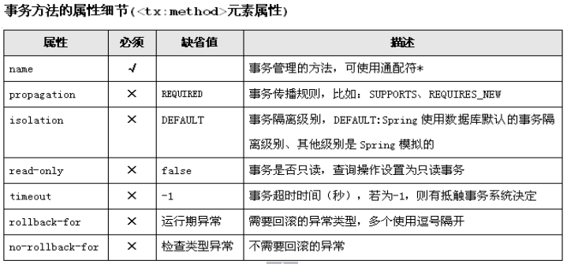

### 1. 概述
Spring是一个一站式/全栈式（full-stack）的开发框架

Spring框架可以用来开发web表现层、service层和Dao层，能够接收请求是因为Spring容器中有能够接收请求的对象

本质：对象的容器

官方描述

Spring是分层的 Java SE/EE应用 full-stack 轻量级开源框架，以 IoC（Inverse Of Control：反转控制）和 AOP（Aspect Oriented Programming：面向切面编程）为内核，提供了展现层 SpringMVC 和持久层 Spring JDBC 以及业务层事务管理等众多的企业级应用技术，还能整合开源世界众多著名的第三方框架和类库，逐渐成为使用最多的Java EE 企业应用开源框架


#### 1.1. Spring的优势

**方便解耦，简化开发**

通过Spring提供的IoC容器，我们可以将对象之间的依赖关系交由Spring进行控制，避免硬编码所造成的过度程序耦合。有了Spring，用户不必再为单实例模式类、属性文件解析等这些很底层的需求编写代码，可以更专注于上层的应用。

**AOP编程的支持**

通过Spring提供的AOP功能，方便进行面向切面的编程，许多不容易用传统OOP实现的功能可以通过AOP轻松应付。

**声明式事务的支持**

编程式：自己写代码逻辑

声明式：使用注解就完成相应的功能开发

在Spring中，我们可以从单调烦闷的事务管理代码中解脱出来，通过声明式方式灵活地进行事务的管理，提高开发效率和质量。

**方便程序的测试**

可以用非容器依赖的编程方式进行几乎所有的测试工作，在Spring里，测试不再是昂贵的操作，而是随手可做的事情。例如：Spring对Junit4支持，可以通过注解方便的测试Spring程序。

**方便集成各种优秀框架**

Spring不排斥各种优秀的开源框架，相反，Spring可以降低各种框架的使用难度，Spring提供了对各种优秀框架（如Struts,Hibernate、Hessian、Quartz）等的直接支持。

**降低Java EE API的使用难度**

Spring对很多难用的Java EE API（如JDBC，JavaMail，远程调用等）提供了一个薄薄的封装层，通过Spring的简易封装，这些Java EE API的使用难度大为降低。

**Java 源码是经典学习范例**

Spring的源码设计精妙、结构清晰、匠心独运，处处体现着大师对Java技术的高深造诣。Spring框架源码无疑是Java技术的最佳实践范例。如果想在短时间内迅速提高自己的Java技术水平和应用开发水平，学习和研究Spring源码将会使你收到意想不到的效果。

#### 1.2. Spring的体系结构


> Spring是一个模块化的框架，它的功能很强大，但是并不要求你完全都得用，图中每一个圆角矩形都代表一个jar，使用哪些模块引入哪些模块即可

### 2. IOC的概念和作用

Spring所使用的两大思想IOC和AOP，都不是Spring提出的，之前更倾向于理论化，Spring框架把这两大思想在技术上做了非常好的实现。

#### 2.1. IOC的概念

Interverse of control（控制反转或者反转控制），所谓正向：原来一个类在使用其他类的时候，我们自己在代码中new一个对象，这就叫做正向（创建对象的权利在我们自己手中）。反转指的是创建对象的权利不再我们这了，而是交给框架了，框架帮我们new对象并且管理对象。

我们丧失了一个创建对象的权利，但是我们得到了一个福利（不用考虑对象创建、销毁等各种问题

IOC本质：替代了我们原来的new对象，框架帮我们new


#### 2.2. IOC的作用

解决耦合问题

耦合：耦合度，为了完成一定的功能，一个类调用了另外一个类，所产生的影响，影响大小代表耦合度的高低

"高内聚、低耦合"，麻烦自己，方便别人，你修改时候，别人对你的调用就不用变动

> 耦合不能够绝对避免，耦合只能降低


### 3. BeanFactory类结构


#### 3.1. XmlBeanFactory和ApplicationContext的区别

- BeanFactory是Spring容器中的顶层接口。
- ApplicationContext：只要一读取配置文件，默认情况下就会创建对象。


#### 3.2. ApplicationContext接口的实现类

ClassPathXmlApplicationContext：从类的根路径下加载xml配置文件

AnnotationConfigApplicationContext：加载基于注解的配置

FileSystemXmlApplicationContext：从磁盘路径上加载配置文件，配置文件可以在磁盘的任意位置。


ApplicationContext和BeanFactory的区别如下

- ApplicationContext在启动SpringIOC容器的时候，会立即创建对象放入map（对象容器）中（不存在影响性能的问题）
- BeanFactory在启动SpringIOC容器的时候，不会立即创建对象，getBean使用对象的时候，Spring才去创建对象（类似于懒加载）

### 4. Bean管理

#### 4.1. Bean标签

id：标识符，定位对象的。id不能重复，没有mybatis中namespace之说了

class ：所创建对象的全限定类名，类似于：com.ujiuye.spring.dao.AccountDaoImpl，不能配置为接口，因为接口不能实例化

scope ：对象的作用范围，单例和多例，单例：内存中这个类只有这一个对象，创建之后一直使用这一个；多例：当你getBean的时候，每getBean一次都给你创建一个新的对象

- singleton：单例/单个的意思，默认bean的scope都是单例
- prototype：多例的意思，每getBean一次就new一个新的对象返回
- request：在web应用的一个request请求内有效，下个请求内就重新new一个对象
- session：在web应用的一个session会话内有效，下个会话重新new一个对象

#### 4.2. 生命周期属性

bean即对象，对象就有生命周期，生命周期就有开始和结束，有时候希望在对象创建之后立马做点啥，或者销毁之前做事情

> 注意：需要手动关闭容器，Scope需要设置为singleton

```xml
<bean id="accountDao" class="AccountDaoImpl" scope="singleton"
    init-method="init" destroy-method="destory">
</bean>

```

#### 4.3. 对象创建的三种方式

通过配置class全限定类名框架底层使用反射技术来创建对象(经常使用，推荐)

```xml
<bean id="accountService" class="AccountServiceImpl"/>
```

静态方法（自己new对象，然后加入到Spring的对象容器中管理）

```xml
<!--bean产生方式：静态方法-->
<bean id="accountService" class="com.ujiuye.spring.factory.StaticFactory" factory-method="createAccountService"/>

```

```java
package com.ujiuye.spring.factory;

import com.ujiuye.spring.service.AccountService;
import com.ujiuye.spring.service.AccountServiceImpl;

public class StaticFactory {

    public static AccountService createAccountService() {
        return new AccountServiceImpl();
    }
}
```

动态实例化方法（自己new对象，然后加入到Spring的对象容器中管理）（需要首先定义工厂的bean，然后通过工厂bean对象调用里面的方法返回具体对象）

```xml
<bean id="instanceFactory" class="com.ujiuye.spring.factory.InstanceFactory"></bean>

<bean id="accountService" factory-bean="instanceFactory" factory-method="createAccountService"/>
```

```java
package com.ujiuye.spring.factory;

import com.ujiuye.spring.service.AccountService;
import com.ujiuye.spring.service.AccountServiceImpl;

public class InstanceFactory {

    public AccountService createAccountService() {
        return new AccountServiceImpl();
    }
}
```


### 5. 依赖注入（DI）

所谓的依赖注入，即为类中的属性进行赋值

字面值：可用字符串表示的值，可以通过 `<value>` 元素标签或 value 属性进行注入。

基本数据类型及其封装类、String 等类型都可以采取字面值注入的方式

若字面值中包含特殊字符，可以使用 `<![CDATA[]]>` 把字面值包裹起来。

组成应用程序的 Bean 经常需要相互协作以完成应用程序的功能. 要使 Bean 能够相互访问, 就必须在 Bean 配置文件中指定对 Bean 的引用

在 Bean 的配置文件中, 可以通过 `<ref>`元素或 ref  属性为 Bean 的属性或构造器参数指定对 Bean 的引用

也可以在属性或构造器里包含 Bean 的声明, 这样的 Bean 称为内部 Bean


#### 5.1. Set注入

```xml
<!--通过set方法注入  -->
<bean id="user05" class="demo1.User">
	<property name="userNames" value="唐僧"></property>
</bean>
```

#### 5.2. 构造函数注入

```xml
<!--通过构造方法注入-->
<bean id="user04" class="demo1.User">
	<!--属性名称,类型，值  -->
	<constructor-arg name="userName" type="java.lang.String" value="孙悟空"> </constructor-arg>
</bean>
```

#### 5.3. 注入复杂类型

```xml
<!--注入复杂的类型-->
<bean id="student01" class="demo1.Student" ></bean>
<bean id="user06" class="demo1.User">
	<!-- 引用其他的bean -->
	<property name="stu" ref="student01"></property>
	<property name="hobbys">
		<array>
			<value>上班</value>
			<value>学习Java</value>
		</array>
	</property>
	<property name="address">
		<list>
			<value>花果山</value>
			<value>高老庄</value>
		</list>
	</property>
	<property name="menpai">
		<map>
			<entry key="武当七侠">
				<value>张翠山</value>
			</entry>
		</map>
	</property>
</bean>
```

### 6. 属性注入的一些细节

#### 6.1. 使用 utili scheme 定义集合

使用基本的集合标签定义集合时, 不能将集合作为独立的 Bean 定义, 导致其他 Bean 无法引用该集合, 所以无法在不同 Bean 之间共享集合.

可以使用 util schema 里的集合标签定义独立的集合 Bean. 需要注意的是, 必须在`<beans>` 根元素里添加 util schema 定义


```xml
<!-- 声明集合类型的 bean -->
<util:list id="cars">
	<ref bean="car"/>
	<ref bean="car2"/>
</util:list>

<bean id="user2" class="com.coder163.spring.helloworld.User">
	<property name="userName" value="Rose"></property>
	<!-- 引用外部声明的 list -->
	<property name="cars" ref="cars"></property>
</bean>
```
#### 6.2. 使用p命名空间

为了简化 XML 文件的配置，越来越多的 XML 文件采用属性而非子元素配置信息。

Spring 从 2.5 版本开始引入了一个新的 p 命名空间，可以通过 `<bean>`元素属性的方式配置 Bean 的属性。

使用 p 命名空间后，基于 XML 的配置方式将进一步简化

```xml
<bean id="user3" class="com.coder163.spring.helloworld.User" p:cars-ref="cars" p:userName="Titannic" />
```

#### 6.3. 级联属性赋值

```xml
<bean id="person" class="com.offcn.domain.Person">
    <property name="name" value="小强"/>
    <property name="age" value="18"/>
    <property name="address" >
        <bean class="com.offcn.domain.Address"/>
    </property>
    <property name="address.city" value="北京"/>
</bean>
```
#### 6.4. 继承 Bean 配置

Spring 允许继承 bean 的配置, 被继承的 bean 称为父 bean. 继承这个父 Bean 的 Bean 称为子 Bean

子 Bean 从父 Bean 中继承配置, 包括 Bean 的属性配置，子 Bean 也可以覆盖从父 Bean 继承过来的配置

父 Bean 可以作为配置模板, 也可以作为 Bean 实例. 若只想把父 Bean 作为模板, 可以设置 `<bean>` 的abstract 属性为 true, 这样 Spring 将不会实例化这个 Bean并不是 `<bean>` 元素里的所有属性都会被继承. 比如: autowire, abstract 等.

也可以忽略父 Bean 的 class 属性, 让子 Bean 指定自己的类, 而共享相同的属性配置. 但此时 **abstract 必须设为 true**

```xml
<bean id="person1" abstract="true">
        <property name="name" value="萧蔷"/>
        <property name="age" value="18"/>
    </bean>

<bean id="person2" class="com.offcn.domain.Person"  parent="person1"/>
```


### 7. SpEL(Spring 表达式语言)

是一个支持运行时查询和操作对象图的强大的表达式语言。

语法类似于 EL：SpEL 使用 #{…} 作为定界符，所有在大框号中的字符都将被认为是 SpEL


```xml
 <bean class="com.offcn.domain.Person" id="person3">
    <property name="age" value="#{18}"/>
    <!--引用其他Bean中的属性-->
    <property name="name" value="#{person2.name}"/>

    <property name="car">
        <bean class="com.offcn.domain.Car">
            <!--调用方法-->
            <property name="name" value="#{'fute'.toUpperCase()}"/>
            <!--通过 T() 调用一个类的静态方法，它将返回一个 Class Object，然后再调用相应的方法或属性-->
            <property name="area" value="#{T(java.lang.Math).PI}"/>
        </bean>

    </property>

    <property name="address">
        <bean class="com.offcn.domain.Address">
            <!-- 做判断-->
            <property name="city" value="#{address.city==null ? '北京':'上海'}"/>
        </bean>
    </property>

</bean>
```

> 小结
> - String可以使用单引号或者双引号作为字符串的定界符号
> - spel还支持一些运算：算数运算符、比较运算符( <, >, ==, <=, >=, lt, gt, eq, le, ge)、逻辑运算符号(and, or, not)


### 8.  自动装配


#### 8.1. XML方式实现

Spring IOC 容器可以自动装配 Bean. 需要做的仅仅是在 **`<bean>` 的 autowire 属性里指定自动装配的模式**

**byType(根据类型自动装配)**: 若 IOC 容器中有多个与目标 Bean 类型一致的 Bean. 在这种情况下, Spring 将无法判定哪个 Bean 最合适该属性, 所以不能执行自动装配.

**byName(根据名称自动装配)**: 必须将目标 Bean 的名称和属性名设置的完全相同.

constructor(通过构造器自动装配): 当 Bean 中存在多个构造器时, 此种自动装配方式将会很复杂. 不推荐使用


```xml
<!-- 自动装配: 只声明 bean, 而把 bean 之间的关系交给 IOC 容器来完成 -->
<!--
	byType: 根据类型进行自动装配. 但要求 IOC 容器中只有一个类型对应的 bean, 若有多个则无法完成自动装配.
	byName: 若属性名和某一个 bean 的 id 名一致, 即可完成自动装配. 若没有 id 一致的, 则无法完成自动装配
-->
<bean id="service" class="com.coder163.spring.ref.Service" autowire="byName"></bean>

<bean id="action" class="com.coder163.spring.ref.Action" autowire="byType"></bean>
```


#### 8.2. 注解方式实现

纯注解方式（不需要引入额外的jar包）

依赖注入所需要的注解如下：

- @AutoWired注解（Spring框架提供的，推荐使用）按照类型注入

    - 首先按照依赖对象的类型找，如果没有找到,默认会报错;如果找到一个匹配的对象,直接注入，如果在Spring上下文中找到多个匹配(2个或者2个以上)的类型，再按照名字去找，如果没有匹配则报错，也可以通过使用@Qualifier("otherBean")标签来规定依赖对象按照bean的id+类型去找；

    - @Qualifier("bookDao")：使用@Qualifier指定需要装配的组件的id，而不是使用属性名

    - @Primary：让Spring进行自动装配的时候，默认使用首选的bean；也可以继续使用@Qualifier指定需要装配的bean的名字

- @Resource注解（JDK提供）按照id注入

    - 不支持@Primary功能不具备类似@Autowired（reqiured=false）;的功能

    - 如果按照名字找不到,再按照类型去找,但如果找到多个类型匹配类型,报错，也可以直接使用name属性指定bean的名称;但是,如果指定的name,就只能按照name去找,如果找不到,就不会再按照类型去找;


- @Inject
    - @Inject 和 @Autowired 注解一样也是按类型匹配注入的 Bean， 但没有 reqired 属性,**不推荐**


```java
package com.ujiuye.spring.config;

import org.springframework.context.annotation.ComponentScan;
import org.springframework.context.annotation.Configuration;
import org.springframework.context.annotation.Import;
import org.springframework.context.annotation.PropertySource;

@Configuration  // 标识当前类是Spring的一个配置类
@ComponentScan(value = {"com.ujiuye.spring"})
public class SpringConfig {
}
```

```java
// 启动ioc容器（全注解模式）
ApplicationContext applicationContext = new AnnotationConfigApplicationContext(SpringConfig.class);

AccountService accountService = (AccountService) applicationContext.getBean("accountService");

Account account = accountService.saveAccount(new Account());

```


### 9. Spring对Junit的支持

Spring对junit支持所带来的好处

- 配置之后不需要我们去启动容器

- 测试哪个对象直接可以注入（使用注解）


#### 9.1. 纯注解启动的形式

```java
// 使用Spring自定义的junit运行器替换它默认的运行器
@RunWith(SpringJUnit4ClassRunner.class)
// 指定配置文件或者配置类
@ContextConfiguration(classes = {SpringConfig.class})
public class MainTest {

    @Autowired
    private AccountService accountService;

    @Test
    public void testQueryAccountById() throws Exception {
        Account account = accountService.queryAccountById(1);
        System.out.println(account);
    }
}
```

#### 9.2. 读取xml配置文件启动的形式

```java
import com.ujiuye.spring.anno.SpringConfig;
import com.ujiuye.spring.anno.pojo.Account;
import com.ujiuye.spring.anno.service.AccountService;
import org.junit.Test;
import org.junit.runner.RunWith;
import org.springframework.beans.factory.annotation.Autowired;
import org.springframework.test.context.ContextConfiguration;
import org.springframework.test.context.junit4.SpringJUnit4ClassRunner;

/**
 * @author liwenchuang
 * @date 2019/4/8 14:03
 * @description
 */
// 使用Spring自定义的junit运行器替换它默认的运行器
@RunWith(SpringJUnit4ClassRunner.class)
// 指定配置文件或者配置类
@ContextConfiguration(value = {"classpath:applicationContext.xml"})
public class JunitXmlTest {


    @Autowired
    private AccountService accountService;


    @Test
    public void testXml() throws Exception {
        accountService.saveAccount(new Account());
    }
}

```


### 10. 面向切面编程-AOP

AOP：Aspect Oriented Programming（面向切面编程/面向方面编程）

面向对象编程也好，面向切面编程也罢，他们的目的都是为了避免代码重复

#### 10.1. 纵向切分代码

这种方式的实现就是我们传统的面向对象编程中继承的方式，我们通过向上抽取公共代码，尽可能的减少重复代码，大多数情况下，使用面向对象(OOP)就可以解决问题（代码重复问题），在某一些情况下使用面向对象(OOP)解决不了代码的一个重复问题,这个时候我们就需要考虑使用横向切分代码的实现方式


#### 10.2. 横向切分代码

简单的描述所谓横向切分就是我们将重复代码单独抽取出来，在所有需要使用的位置插入

我们期望的结果是：在不改变原有业务逻辑的情况下，悄无声息的把横切逻辑代码应用在业务逻辑代码上，达到和原本一样的效果，这才是AOP真正发挥功力的地方


#### 10.3. 静态代理

在程序运行前就已经存在代理类的字节码文件，代理对象和真实对象的关系在运行前就确定了。

优点：

1. 业务类只需要关注业务逻辑本身，保证了业务类的重用性。

2. 把真实对象隐藏起来了,保护真实对象


缺点：

1. 代理对象的某个接口只服务于某一种类型的对象，也就是说每一个真实对象都得创建一个代理对象。

2. 如果需要代理的方法很多，则要为每一种方法都进行代理处理。

3. 如果接口增加一个方法，除了所有实现类需要实现这个方法外，所有代理类也需要实现此方法。增加了代码维护的复杂度。

编码实现

```java

@Slf4j
public class StaticProxy {

    private ProductServiceImpl productService;

    public StaticProxy(ProductServiceImpl productService){
        this.productService = productService;
    }

    public void proxyFindAll(){
        log.info("日志记录");
        productService.findAll();
    }
}
```

测试

```java
@Test
public void testStaticProxy(){
    new StaticProxy(new ProductServiceImpl()).proxyFindAll();
}
```


#### 10.4. 动态代理

动态代理是在程序运行期间由JVM通过反射等机制动态的创建出代理对象的字节码。代理对象和真实对象的关系是在程序运行时才确定的。

**JDK动态代理**

Java 动态代理机制生成的所有动态代理类的父类，它提供了一组静态方法来为一组接口动态地生成代理类及其对象。

jdk动态代理操作步骤

1. 实现InvocationHandler接口，创建自己增强代码的处理器。
2. 给Proxy类提供ClassLoader对象和代理接口类型数组，创建动态代理对象。
3. 在处理器中实现增强操作

```java

import lombok.extern.slf4j.Slf4j;
import java.lang.reflect.InvocationHandler;
import java.lang.reflect.Method;
import java.lang.reflect.Proxy;

@Slf4j
public class PersonProxy implements InvocationHandler {

    private UserService userService;

    public  PersonProxy(UserService userService){
        this.userService = userService;
    }

    public UserService newInstance(){
        //类加载器
        ClassLoader loader=userService.getClass().getClassLoader();
        //父接口的类型,因为有可能一个类实现多个接口所以是个数组
        Class<?>[] interfaces=userService.getClass().getInterfaces();
        //因为本类实现了InvocationHandler接口，所以直接传本类对象即可
        InvocationHandler h=this;
       return  (UserService)Proxy.newProxyInstance(loader, interfaces, h);
    }

    //当findAll方法执行时，会回调该方法,所以实际增强的效果是在这里
    @Override
    public Object invoke(Object proxy, Method method, Object[] args) throws Throwable {

        if ("findAll".equals(method.getName())) {
            log.info("这是添加的日志记录功能");
        }

        return method.invoke(userService,args);
    }
}
```

```java
@Test
public void testProxy(){
    new PersonProxy(new UserServiceImpl()).newInstance().findAll();
}
```

接口和实现类

```java
public interface UserService {

    /**
     * 该方法仅仅为了演示
     */
     void findAll();
}


public class UserServiceImpl implements UserService{
    @Override
    public void findAll() {

        System.out.println("执行查询");
    }
}
```


**CGLIB代理**

针对于没有接口的类,如何做代理:cglib都是针对没有接口,做动态代理的.

原理是对指定的目标类生成一个子类，并覆盖其中方法实现增强，但因为采用的是继承，所以不能对final修饰的类进行代理。


1. CGLIB可以生成目标类的子类，并重写父类非final修饰符的方法。

2. 要求类不能是final的，要拦截的方法要是非final、非static、非private的。

3. 动态代理的最小单位是类(所有类中的方法都会被处理);


```java

@Slf4j
public class ProductProxyWithCglib implements MethodInterceptor {


    private ProductServiceImpl productService;

    public ProductProxyWithCglib(ProductServiceImpl productService){
        this.productService = productService;
    }

    //创建代理对象
    public ProductServiceImpl createProxy(){

        Enhancer enhancer = new Enhancer();
        //设置被代理类为当前类的父类
        enhancer.setSuperclass(ProductServiceImpl.class);
        //设置回调
        enhancer.setCallback(this);

        return (ProductServiceImpl) enhancer.create();
    }
    //创建增强功能的方法
    @Override
    public Object intercept(Object o, Method method, Object[] objects, MethodProxy methodProxy) throws Throwable {

        log.info("{}",o);

        if ("findAll".equals(method.getName())) {
            log.info("这是添加的日志记录功能");
        }

        return method.invoke(productService,objects);
    }
}
```

测试

```java
@Test
public void testProxyWithCglib(){
   new ProductProxyWithCglib(new ProductServiceImpl()).createProxy().findAll();
}
```
### 11. AOP概述


在Spring中AOP是基于动态代理实现的，其实现原理如下：

- 若目标对象实现了若干接口，Spring就会使用JDK动态代理。

- 若目标对象没有实现任何接口，Spring就使用CGLIB库生成目标对象的子类。

对接口创建代理优于对类创建代理，因为会产生更加松耦合的系统，也更符合面向接口编程规范。

AOP全称Aspect oritention programming(面向切面编程)

把一个个的横切关注点（这些零散存在于业务方法中的功能代码，我们称之为横切面关注点）放到某个模块中去，称之为切面。那么每一个的切面都能影响业务的某一种功能，切面的目的就是功能增强，如日志切面就是一个横切关注点，应用中许多方法需要做日志记录的只需要插入日志的切面即可。这种面向切面编程的思想就是AOP思想了。

**AOP的目的：**

AOP能够将那些与业务无关，却为业务模块所共同调用的逻辑或责任（例如事务处理、日志管理、权限控制等）封装起来，
便于减少系统的重复代码，降低模块间的耦合度，并有利于未来的可拓展性和可维护性。

**AOP的优势：**

降低模块的耦合度、使系统容易扩展、更好的代码复用性，就是把多个方法前/后的共同代码抽离出来,使用动态代理机制来控制,先执行抽离出来的代码,再执行每一个真实方法.


#### 11.1. AOP术语

Joinpoint:连接点，哪些包中的哪些类中的哪些方法，可认为是连接点的集合。where:去哪些地方做增强


Pointcut：切入点，被拦截到需要被增强的方法。where：去哪里做增强

Advice：增强，当拦截到Joinpoint之后，在方法执行的什么时机（when）做什么样(what)的增强。

Aspect：切面，Pointcut+Advice，去哪些地方+在什么时候+做什么增强

Weaving：织入，把Advice加到Target上之后，创建出Proxy对象的过程。


#### 11.2. Pointcut语法


AOP思想本应该由SUN公司来制定规范,但是被AOP联盟捷足先登了.

AOP联盟制定AOP规范，首先就要解决一个问题，怎么表示在哪些方法上增强—— AspectJ(语言)。

AspectJ切入点语法如下：

execution(modifiers-pattern? ret-type-pattern declaring-type-pattern? name-pattern(param-pattern)throws-pattern?)

翻译成中文：

execution(<访问修饰符>? <返回类型> <声明类型>? <方法名>(<参数>) <异常>?)

举例：

public static Class java.lang.Class.forName(String className)throws ClassNotFoundException


通配符:

- *：匹配任何部分,只能表示一个单词
- ..  : 可用于全限定名中和方法参数中，分别表示子包和0到N个参数







通知或者增强的类型有以下几种


>使用AOP功能需要添加对应的依赖

```xml
<dependency>
  <groupId>org.aspectj</groupId>
  <artifactId>aspectjweaver</artifactId>
  <version>1.9.4</version>
</dependency>
```
#### 11.3. XML方式实现

用于增强的功能

```java
@Slf4j
public class Increase {

    public void recordLog(){
        log.info("记录日志.............");
    }
}
```

需要被增强的功能

```java
package com.offcn.aop;

public class ProductServiceImpl {

    public void findAll(){
        System.out.println("演示的方法");
    }

}
```

xml 配置文件


```xml
<?xml version="1.0" encoding="UTF-8"?>
<beans xmlns="http://www.springframework.org/schema/beans"
       xmlns:xsi="http://www.w3.org/2001/XMLSchema-instance" xmlns:aop="http://www.springframework.org/schema/aop"
       xsi:schemaLocation="http://www.springframework.org/schema/beans http://www.springframework.org/schema/beans/spring-beans.xsd http://www.springframework.org/schema/aop https://www.springframework.org/schema/aop/spring-aop.xsd">

    <!--定义被代理类-->
    <bean class="com.offcn.aop.ProductServiceImpl" id="productService"/>

    <!--定义代理类-->
    <bean class="com.offcn.aop.Increase" id="increase"/>

    <!--配置切面-->
    <aop:config>
        <!--定义切点-->
        <aop:pointcut id="mypointcout" expression="execution(* com.offcn.aop.*.find*(..))"/>
        <!--定义通知-->
        <aop:aspect ref="increase">
            <!--前置通知-->
            <aop:before method="recordLog" pointcut-ref="mypointcout"/>
            <!--后置通知-->
            <aop:after method="recordLog" pointcut-ref="mypointcout"/>
        </aop:aspect>

    </aop:config>
</beans>
```


#### 11.4. 注解方式实现

用于增强的代码

```java


@Order(2)
@Aspect
@Slf4j
@Component
public class IncreaseWithLog {

    //该方法只是用于提取切点表达式的功能，所以建议不要在方法体中编写代码
    @Pointcut("execution(public int com.offcn.aop.UserServiceImpl.insert(String))")
    public void show(){};


    /**
     * 在方法开始执行之前
     */
    @Before("show()")
    public void befor(JoinPoint joinPoint){
        log.info("befor 【{}】开始记录日志{}",joinPoint.getSignature().getName(),joinPoint.getArgs());
    }

    /*
    * 最终增强：在方法结束之前执行
    * */
    @After("show()")
    public void after(){
        log.info("after 开始记录日志");
    }

    /*
    * 后置通知：一般用于获取方法的返回值
    * */
    @AfterReturning(value = "execution(public int com.offcn.aop.UserServiceImpl.insert(String))",returning = "result")
    public void Returning(JoinPoint joinPoint,int result){

        String methodName = joinPoint.getSignature().getName();
        Object[] args = joinPoint.getArgs();

        log.info("Returning 开始记录日志,方法名【{}】,传递的参数{}，返回值【{}】",methodName,args,result);
    }
    /*
        异常通知
    */

    @AfterThrowing( value = "execution(public int com.offcn.aop.UserServiceImpl.insert(String))",throwing = "e")
    public void throwing(Exception e){
        log.info("AfterThrowing 开始记录日志{}",e.getMessage());
    }

    /*
    * 环绕通知
    *  1、返回值不能是void
    *
    *  2、在方法体中继续传递(调用)原来的方法
    *
    *  3、使用频率较低
    *
    * */
   /* @Around( value = "execution(public int com.offcn.aop.UserServiceImpl.insert(String))")
    public Object around(ProceedingJoinPoint joinPoint){
        //相当于我们的前置通知
       log.info("around runing  start");

        Object proceed = null;
        try {
            //调用原来的方法(原生的方法)
            proceed = joinPoint.proceed();
            //相当于后置通知
            log.info("around runing end");
        } catch (Throwable throwable) {
            //相当于异常通知
            log.info("around runing Exception ....");
        }

        log.info("around runing end。。。。");

        return proceed;
    }*/
}

```

被增强的代码

```java
public class ProductServiceImpl {

    public void findAll(){
        System.out.println("演示的方法");
    }

}
```

xml配置

```xml
   <!--定义被代理类-->
    <bean class="com.offcn.aop.ProductServiceImpl" id="productService"/>
    <!--定义代理类-->
    <bean class="com.offcn.aop.Increase" id="increase"/>
    <!--开启注解方式-->
    <aop:aspectj-autoproxy/>
    <!--包扫描-->
    <context:component-scan base-package="com.offcn.aop"/>
```

### 12. 事务管理

**脏读**：发生在一个事务读取了另一个事务改写但尚未提交的数据．

**不可重复读**：在一个事务执行相同的查询两次或两次以上，每次得到的数据不同．

**幻读**：与不可重复读类似，发生在一个事务读取多行数据，接着另一个并发事务插入一些数据，随后查询中，第一个事务发现多了一些原本不存在的数据．


Spring的事务管理主要包括3个接口：

- TransactionDefinition：封装事务的隔离级别,超时时间，是否为只读事务和事务的传播规则等事务属性，可通过XML配置具体信息。

- PlatformTransactionManager：根据TransactionDefinition提供的事务属性配置信息，创建事务。

- TransactionStatus：封装了事务的具体运行状态。比如，是否是新开启事务，是否已经提交事务，设置当前事务为rollback-only等。

编程式事务：在业务代码中添加事务控制代码，这样的事务控制机制，叫做编程式事务

声明式事务：通过xml配置或者注解方式就达到事务控制的目的，叫做声明式事务

事务传播行为

事务往往在service层进行控制，如果出现service层方法A调用了另外一个service层方法B，A和B方法本身都已经被添加了事务控制，那么A调用B的时候，就需要进行事务的一些协商，这就叫做事务的传播行为。


#### 12.1. 事务方法的属性配置




事务方法属性：

1. name:匹配到的方法模式

2. read-only:如果为true，开启一个只读事务，只读事务的性能较高，但是不能在只读事务中，使用DML；

3. isolation:代表数据库事务隔离级别(就使用默认),DEFAULT:让spring使用数据库默认的事务隔离级别，其他:spring模拟;

| 级别                       | 描述                                                                                      |
| :------------------------- | :---------------------------------------------------------------------------------------- |
| ISOLATION_DEFAULT          | 使用后端数据库默认的隔离级别，大多数数据库系统的默认隔离级别是READ COMMITTED                     |
| ISOLATION_READ_UNCOMMITTED | 允许读取未提交的数据变更，可能会导致脏读，幻读或不可重复读                                      |
| ISOLATION_READ_COMMITTD    | 允许读取为提交数据,可以阻止脏读，当时幻读或不可重复读仍可能发生                                  |
| ISOLATION_REPEATABLE_READ  | 对统一字段多次读取结果是一致的，除非数据是被本事务自己修改．可以阻止脏读，不可重复读，但幻读可能发生 |
| ISOLATION_SERIALIZABLE     | 完全服从ACID                                                                               |


4. no-rollback-for: 如果遇到的异常是匹配的异常类型,就不回滚事务;

5. rollback-for:如果遇到的异常是指定匹配的异常类型,才回滚事务，spring默认情况下,spring只会去回滚RuntimeException及其子类,不会回滚Exception和Thowable.

6. propagation:事务的传播方式(当一个方法已经在一个开启的事务当中了，应该怎么处理自身的事务),一共有以下7种取值

| 级别          | 描述                                                                                 |
| :------------ | :---------------------------------------------------------------------------------- |
| REQUIRED      | 支持当前事务，如果当前没有事务，就新建一个事务。这是最常见的选择。                          |
| SUPPORTS      | 支持当前事务，如果当前没有事务，就以非事务方式执行。                                      |
| MANDATORY     | 支持当前事务，如果当前没有事务，就抛出异常。                                             |
| REQUIRES_NEW  | 新建事务，如果当前存在事务，把当前事务挂起。                                             |
| NOT_SUPPORTED | 以非事务方式执行操作，如果当前存在事务，就把当前事务挂起                                   |
| NEVER         | 以非事务方式执行，如果当前存在事务，则抛出异常。                                          |
| NESTED        | 如果当前存在事务,则在嵌套事务内执行.如果当前没有事务,则进行与PROPAGATION_REQUIRED类似的操作 |


### 13. 声明式事务

**所需要的依赖**

```xml
<dependency>
    <groupId>org.springframework</groupId>
    <artifactId>spring-jdbc</artifactId>
    <version>5.0.2.RELEASE</version>
</dependency>
<dependency>
    <groupId>org.springframework</groupId>
    <artifactId>spring-tx</artifactId>
    <version>5.0.2.RELEASE</version>
</dependency>
<dependency>
    <groupId>org.springframework</groupId>
    <artifactId>spring-aop</artifactId>
    <version>5.0.2.RELEASE</version>
</dependency>
<dependency>
    <groupId>org.aspectj</groupId>
    <artifactId>aspectjweaver</artifactId>
    <version>1.8.9</version>
</dependency>
```


#### 13.1. xml方式实现

事务管理器类，就是关于事务的横切逻辑，我们使用jdbc/jdbcTemplate/mybatis使用的是Spring提供的DataSourceTransactionMannager事务管理类，这个类就如同自定义AOP中开发的TransactionMannager类

> Spring DataSourceTransactionManager事务管理器仅jdbc/Spring JdbcTemplate工具（和DButils使用很相似）/Mybatis。不支持Dbutils的事务管理

```xml
<?xml version="1.0" encoding="UTF-8"?>
<beans xmlns="http://www.springframework.org/schema/beans"
       xmlns:context="http://www.springframework.org/schema/context"
       xmlns:aop="http://www.springframework.org/schema/aop"
       xmlns:tx="http://www.springframework.org/schema/tx"
       xmlns:xsi="http://www.w3.org/2001/XMLSchema-instance"
       xsi:schemaLocation="
       http://www.springframework.org/schema/beans
       http://www.springframework.org/schema/beans/spring-beans.xsd
       http://www.springframework.org/schema/context
       http://www.springframework.org/schema/context/spring-context.xsd
       http://www.springframework.org/schema/aop
       http://www.springframework.org/schema/aop/spring-aop.xsd
       http://www.springframework.org/schema/tx
       http://www.springframework.org/schema/tx/spring-tx.xsd
">

    <context:component-scan base-package="com.ujiuye.spring"/>

    <context:property-placeholder location="classpath:db.properties"/>


    <!--定义jdbcTemplate对象-->
    <bean id="jdbcTemplate" class="org.springframework.jdbc.core.JdbcTemplate">
        <property name="dataSource" ref="dataSource"/>
    </bean>
    <!--Spring的声明式事务是基于AOP技术实现
        横切逻辑单独定义为一个bean
        事务管理器底层还需要数据库连接池的支持
    -->
    <bean id="transactionManager" class="org.springframework.jdbc.datasource.DataSourceTransactionManager">
        <property name="dataSource" ref="dataSource"/>
    </bean>
    <tx:advice id="txAdvice" transaction-manager="transactionManager">

        <!--tx:attributes允许我们对事务细节进行配置-->
        <tx:attributes>
            <!--CRUD中只有查询是只读事务，其他都是非只读事务
                所以在这里可以首先配置所有方法都是非只读事务
                然后单独配置查询方法为只读事务，覆盖上面的配置
                这样，简化配置量
                read-only：是否只读
                propagation：事务传播行为
                isolation：事务隔离级别，默认defalut
                timeout：超时时间，-1没有限制，单位秒
                rollback-for：出现什么异常的时候回滚事务，往往不需要配置，有异常就回滚
                no-rollback-for：出现什么异常的时候不回滚事务，往往不需要配置，有异常就回滚
            -->
            <tx:method name="*" read-only="false" propagation="REQUIRED" isolation="DEFAULT" timeout="-1" />
            <!--查询操作为只读事务即可，事务传播行为为SUPPORTS，有事务就用，没有就不用-->
            <tx:method name="query*" read-only="true" propagation="SUPPORTS"/>
        </tx:attributes>
    </tx:advice>


    <aop:config>
        <!--Spring声明式事务使用aop:advisor替代aop中的aop:aspect
            至于方位信息不需要指定了（对于事务来说）
        -->
        <aop:advisor advice-ref="txAdvice" pointcut="execution(* com.ujiuye.spring.service.*.*(..))"/>
    </aop:config>
</beans>
```


#### 13.2. 注解方式

半xml半注解

- 使用@Transactional注解，同时在配置文件中  打开注解扫描`<tx:annotation-driven/>`

全注解形式开启开关

-  和上面在配置文件的道理是一样的，仅仅是换成了注解而已

```java
@EnableTransactionManagement
public class AppTest {}


@Service
@Transactional(propagation = Propagation.REQUIRED)
public class UserServiceImpl implements UserService {

    @Autowired
    private UserMapper userMapper;

    @Transactional(readOnly = true)
    @Override
    public List<User> findAll() {
        return userMapper.findAll();
    }

    @Override
    public int add(User user) {
        int i=userMapper.add(user);
        System.out.println(1/0);
        return i ;
    }
}
```
### 14. Spring和Mybatis整合

下面的整合方式全部是基于Mapper接口的方式

#### 14.1. 需要的依赖：pom.xml

```xml
  <properties>
        <project.build.sourceEncoding>UTF-8</project.build.sourceEncoding>
        <maven.compiler.source>1.8</maven.compiler.source>
        <maven.compiler.target>1.8</maven.compiler.target>
        <!--spring版本-->
        <spring-version>5.2.0.RELEASE</spring-version>
        <!--MySQL驱动版本-->
        <mysql-version>5.1.38</mysql-version>
    </properties>

    <dependencies>
        <dependency>
            <groupId>junit</groupId>
            <artifactId>junit</artifactId>
            <version>4.12</version>
            <scope>test</scope>
        </dependency>
        <!-- 省略get、set -->
        <dependency>
            <groupId>org.projectlombok</groupId>
            <artifactId>lombok</artifactId>
            <version>1.18.8</version>
            <scope>provided</scope>
        </dependency>
        <!--日志依赖-->
        <dependency>
            <groupId>ch.qos.logback</groupId>
            <artifactId>logback-classic</artifactId>
            <version>1.2.3</version>
        </dependency>
        <!--Mysql驱动-->
        <dependency>
            <groupId>mysql</groupId>
            <artifactId>mysql-connector-java</artifactId>
            <version>${mysql-version}</version>
        </dependency>
        <!--连接池,传说中最快的连接池-->
        <dependency>
            <groupId>com.zaxxer</groupId>
            <artifactId>HikariCP</artifactId>
            <version>3.4.1</version>
        </dependency>
        <!--mybatis核心依赖-->
        <dependency>
            <groupId>org.mybatis</groupId>
            <artifactId>mybatis</artifactId>
            <version>3.4.6</version>
        </dependency>
        <!-- 插件通用Mapper(非必须) -->
        <dependency>
            <groupId>tk.mybatis</groupId>
            <artifactId>mapper</artifactId>
            <version>4.1.1</version>
        </dependency>
        <!--分页插件(非必须)-->
        <dependency>
            <groupId>com.github.pagehelper</groupId>
            <artifactId>pagehelper</artifactId>
            <version>5.1.10</version>
        </dependency>
        <!--spring和mybatis的整合包-->
        <dependency>
            <groupId>org.mybatis</groupId>
            <artifactId>mybatis-spring</artifactId>
            <version>2.0.2</version>
        </dependency>
        <!-- Spring依赖 -->
        <dependency>
            <groupId>org.springframework</groupId>
            <artifactId>spring-context</artifactId>
            <version>${spring-version}</version>
        </dependency>
        <!-- Spring整合Junit依赖-->
        <dependency>
            <groupId>org.springframework</groupId>
            <artifactId>spring-test</artifactId>
            <version>${spring-version}</version>
            <scope>test</scope>
        </dependency>
        <!--Spring事务管理依赖-->
        <dependency>
            <groupId>org.springframework</groupId>
            <artifactId>spring-tx</artifactId>
            <version>${spring-version}</version>
        </dependency>

        <dependency>
            <groupId>org.springframework</groupId>
            <artifactId>spring-aspects</artifactId>
            <version>${spring-version}</version>
        </dependency>
        <dependency>
            <groupId>org.springframework</groupId>
            <artifactId>spring-jdbc</artifactId>
            <version>${spring-version}</version>
        </dependency>
        <dependency>
            <groupId>org.springframework</groupId>
            <artifactId>spring-orm</artifactId>
            <version>${spring-version}</version>
        </dependency>


    </dependencies>

    <build>
        <resources>
            <resource>
                <directory>src/main/resources</directory>
                <includes>
                    <include>**/*.properties</include>
                    <include>**/*.xml</include>
                </includes>
                <filtering>false</filtering>
            </resource>
            <resource>
                <directory>src/main/java</directory>
                <includes>
                    <include>**/*.properties</include>
                    <include>**/*.xml</include>
                </includes>
                <filtering>false</filtering>
            </resource>
        </resources>
     <build>
```

#### 14.2. 核心配置文件

```xml
<?xml version="1.0" encoding="UTF-8"?>
<beans xmlns="http://www.springframework.org/schema/beans"
       xmlns:xsi="http://www.w3.org/2001/XMLSchema-instance"
       xmlns:context="http://www.springframework.org/schema/context"
       xmlns:aop="http://www.springframework.org/schema/aop"
       xmlns:tx="http://www.springframework.org/schema/tx"
       xsi:schemaLocation="
         http://www.springframework.org/schema/tx
            http://www.springframework.org/schema/tx/spring-tx.xsd
       http://www.springframework.org/schema/beans  http://www.springframework.org/schema/beans/spring-beans.xsd http://www.springframework.org/schema/context https://www.springframework.org/schema/context/spring-context.xsd http://www.springframework.org/schema/aop https://www.springframework.org/schema/aop/spring-aop.xsd">

    <!--Spring的扫描器-->
    <context:component-scan base-package="com.offcn.spring.mybatis"/>
    <!--引入属性文件-->
    <context:property-placeholder location="db.properties"/>

    <!--构建连接池-->
    <bean id="dataSource" class="com.zaxxer.hikari.HikariDataSource">
        <property name="driverClassName" value="${dataSource.driver}"/>
        <property name="jdbcUrl" value="${dataSource.jdbcUrl}"/>
        <property name="username" value="${dataSource.username}"/>
        <property name="password" value="${dataSource.password}"/>
    </bean>

    <!--dao接口的扫描，注意这里使用的通用Mapper插件-->
    <bean class="tk.mybatis.spring.mapper.MapperScannerConfigurer">
        <property name="basePackage" value="com.offcn.spring.mybatis.mapper"/>
    </bean>
    <!--构建会话工厂-->
    <bean id="sqlSessionFactory" class="org.mybatis.spring.SqlSessionFactoryBean">
        <!--连接池-->
        <property name="dataSource" ref="dataSource"/>
        <!--扫描对应的xml映射文件-->
        <property name="mapperLocations" value="classpath*:mappers/*.xml" />
        <!--配置分页插件-->
        <property name="plugins">
            <array>
                <bean class="com.github.pagehelper.PageInterceptor"/>
            </array>
        </property>
    </bean>

    <!--事务配置-->
    <bean id="transactionManager" class="org.springframework.jdbc.datasource.DataSourceTransactionManager">
        <constructor-arg ref="dataSource" />
    </bean>

    <!--定义通知-->
    <tx:advice id="advice" transaction-manager="transactionManager">
        <tx:attributes>
            <!--以find*开始的方法-->
            <tx:method name="find*" read-only="true"/>
            <tx:method name="del*" propagation="REQUIRED" rollback-for="Exception"/>
            <tx:method name="update*" propagation="REQUIRED" />
            <tx:method name="add*" propagation="REQUIRED" rollback-for="Exception"/>
        </tx:attributes>
    </tx:advice>

    <!-- 配置切面 -->
    <aop:config>
        <aop:advisor advice-ref="advice" pointcut="execution(* com.offcn.spring.mybatis.service.*.*(..))" />
    </aop:config>
</beans>
```


#### 14.3. 无集成插件的配置方式

```xml
<?xml version="1.0" encoding="UTF-8"?>
<beans xmlns="http://www.springframework.org/schema/beans"
       xmlns:xsi="http://www.w3.org/2001/XMLSchema-instance"
       xmlns:context="http://www.springframework.org/schema/context"
       xmlns:aop="http://www.springframework.org/schema/aop"
       xmlns:tx="http://www.springframework.org/schema/tx"
       xsi:schemaLocation="
         http://www.springframework.org/schema/tx
            http://www.springframework.org/schema/tx/spring-tx.xsd
       http://www.springframework.org/schema/beans  http://www.springframework.org/schema/beans/spring-beans.xsd http://www.springframework.org/schema/context https://www.springframework.org/schema/context/spring-context.xsd http://www.springframework.org/schema/aop https://www.springframework.org/schema/aop/spring-aop.xsd">

    <!--Spring的扫描器-->
    <context:component-scan base-package="com.offcn.spring.mybatis"/>
    <!--引入属性文件-->
    <context:property-placeholder location="db.properties"/>

    <!--构建连接池-->
    <bean id="dataSource" class="com.zaxxer.hikari.HikariDataSource">
        <property name="driverClassName" value="${dataSource.driver}"/>
        <property name="jdbcUrl" value="${dataSource.jdbcUrl}"/>
        <property name="username" value="${dataSource.username}"/>
        <property name="password" value="${dataSource.password}"/>
    </bean>

    <!--构建SqlSessionFactoryBean-->
    <bean id="sqlSessionFactory" class="org.mybatis.spring.SqlSessionFactoryBean">
        <property name="dataSource" ref="dataSource" />
        <property name="mapperLocations" value="classpath*:mappers/*.xml" />
    </bean>
    <!--扫描Mapper接口-->
    <bean class="org.mybatis.spring.mapper.MapperScannerConfigurer">
        <property name="basePackage" value="com.offcn.spring.mybatis.mapper" />
    </bean>

    <!--事务配置-->
    <bean id="transactionManager" class="org.springframework.jdbc.datasource.DataSourceTransactionManager">
        <constructor-arg ref="dataSource" />
    </bean>

    <!--定义通知-->
    <tx:advice id="advice" transaction-manager="transactionManager">
        <tx:attributes>
            <!--以find*开始的方法-->
            <tx:method name="find*" read-only="true"/>
            <tx:method name="del*" propagation="REQUIRED" rollback-for="Exception"/>
            <tx:method name="update*" propagation="REQUIRED" />
            <tx:method name="add*" propagation="REQUIRED" rollback-for="Exception"/>
        </tx:attributes>
    </tx:advice>

    <!-- 配置切面 -->
    <aop:config>
        <aop:advisor advice-ref="advice" pointcut="execution(* com.offcn.spring.mybatis.service.*.*(..))" />
    </aop:config>
</beans>
```

#### 14.4. db.properties

```properties
dataSource.jdbcUrl=jdbc:mysql://localhost:3306/mybatis
dataSource.username=root
dataSource.password=123456
dataSource.driver=com.mysql.jdbc.Driver
```