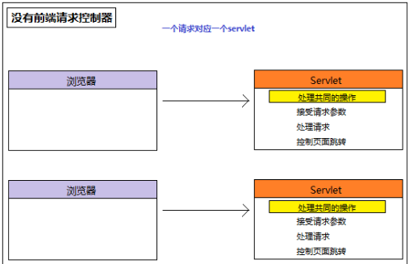
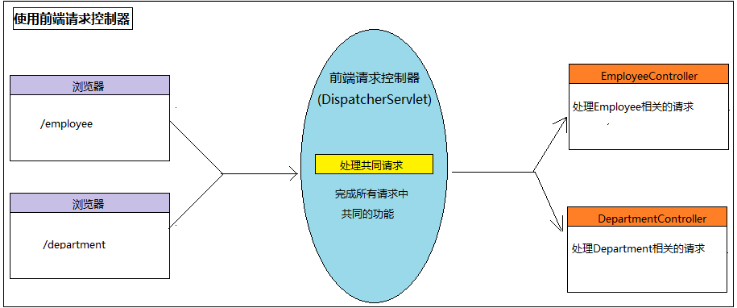
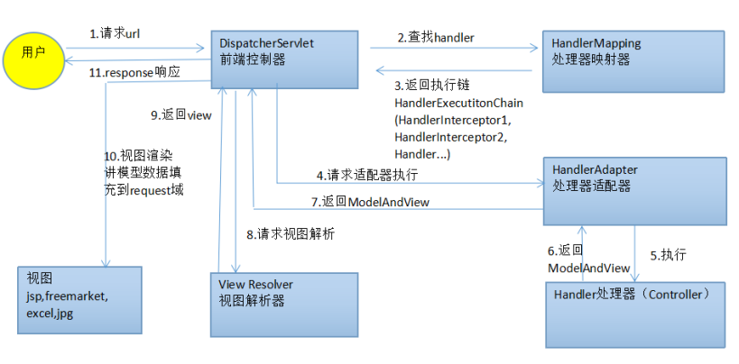

### 1. 概述

MVC框架，它解决WEB开发中常见的问题(参数接收、页面跳转 、文件上传、表单验证、国际化、等等)，而且使用简单，与Spring无缝集成

Spring3.0 后全面超越 Struts2，成为最优秀的 MVC 框架 （更安全，性能更好，更简单）。

支持 RESTful风格的 URL 请求 。

采用了松散耦合可插拔组件结构，比其他 MVC 框架更具扩展性和灵活性。







### 2. HelloWorld

准备依赖

```xml
<dependency>
    <groupId>org.springframework</groupId>
    <artifactId>spring-web</artifactId>
    <version>5.1.8.RELEASE</version>
</dependency>

<dependency>
    <groupId>org.springframework</groupId>
    <artifactId>spring-webmvc</artifactId>
    <version>5.1.8.RELEASE</version>
</dependency>

<!--Servlet和JSP相关依赖  -->
<dependency>
  <groupId>javax.servlet</groupId>
  <artifactId>javax.servlet-api</artifactId>
  <version>4.0.1</version>
  <scope>provided</scope>
</dependency>

<dependency>
  <groupId>javax.servlet.jsp</groupId>
  <artifactId>jsp-api</artifactId>
  <version>2.1</version>
  <scope>provided</scope>
</dependency>

<dependency>
  <groupId>javax.servlet</groupId>
  <artifactId>jstl</artifactId>
  <version>1.2</version>
</dependency>
```

开发步骤：

- 配置前端控制器：DispatcherServlet

- 配置处理器映射器：BeanNameUrlHandlerMapping	使用处理器的name作为url进行查找

- 配置处理器适配器：SimpleControllerHandlerAdapter

    - 要求所有的适配器需要实现HandlerAdapter借口

    - 要求所有的处理器实现Controller接口

-  配置视图解析器：InternalResourceViewResolver将逻辑视图转换为物理视图

- 开发和配置控制器：HelloController(处理请求的对象)

- 前端控制器关联SpringMVC配置文件

#### 2.1. 代码实现

**开发控制器**

```java
public class Application implements Controller {


	@Override
	public ModelAndView handleRequest(HttpServletRequest request, HttpServletResponse response) throws Exception {
		System.out.println("HelloWorld with mvc");

		ModelAndView mv = new ModelAndView();
		mv.setViewName("/index.jsp");
		return mv;
	}
}
```

**配置控制器**

```xml
<bean name="/hello" class="com.offcn.Application"/>

```


**前端控制器关联SpringMVC配置文件**

```xml
<servlet>
  <servlet-name>mvc</servlet-name>
  <servlet-class>org.springframework.web.servlet.DispatcherServlet</servlet-class>
  <init-param>
    <param-name>contextConfigLocation</param-name>
    <param-value>classpath:spring-mvc-config.xml</param-value>
  </init-param>
</servlet>
<servlet-mapping>
    <servlet-name>mvc</servlet-name>
    <url-pattern>/</url-pattern>
</servlet-mapping>
```

> 通常情况下我们还会在SpringMVC配置文件中配置视图解析器

```xml
<!-- 配置视图解析器 -->
<bean class="org.springframework.web.servlet.view.InternalResourceViewResolver">
 <property name="prefix" value="/WEB-INF/pages/"></property>
 <property name="suffix" value=".jsp"></property>
</bean>
```
### 3. SpringMVC执行流程

用户发送出请求到前端控制器DispatcherServlet。

DispatcherServlet收到请求调用HandlerMapping（处理器映射器）。

HandlerMapping找到具体的控制器(可查找xml配置或注解配置)，生成处理器对象的执行链(如果有)，再一起返回给DispatcherServlet。

DispatcherServlet调用HandlerAdapter（处理器适配器）。

HandlerAdapter经过适配调用具体的处理器（controller）。

Controller执行完成返回ModelAndView对象。

HandlerAdapter将Controller执行结果ModelAndView返回给DispatcherServlet。

DispatcherServlet将ModelAndView传给ViewReslover（视图解析器）。

ViewReslover解析后返回具体View（视图）。

DispatcherServlet根据View进行渲染视图（即将模型数据填充至视图中）。

DispatcherServlet响应用户。




#### 3.1. SpringMVC中重要的组件

**前端控制器(DispatcherServlet)**

又叫中央处理器，用来接收请求，响应结果，相当于转发器。有了DispatcherServlet减少了其它组件之间的耦合度。它就相当于MVC中的C，它来调用其他各个组件来处理用户的请求。

**处理器映射器(HandlerMapping)**

处理器映射器负责根据用户请求的url查找对应的Handler，即处理器。在SpringMVC当中提供了多种实现处理器的方式，包括：基于配置文件方式实现、实现指定接口实现及基于注解实现。


**处理器适配器(HandlerAdapter)**

处理器适配器按照HandlerAdapter要求的规则去执行Handler，通过HandlerAdapter对处理器进行执行，这是适配器模式最典型的应用，通过扩展适配器就可以达到对更多类型的处理器进行执行的目的。

**处理器(Handler)**

处理器是继DispatcherServlet前端控制器的后端控制器，在前端控制器的控制下Handler对用户请求进行具体的处理。因Handler涉及到具体的用户业务请求，故该组件一般情况是需要工程师根据业务需求开发的。我们在编写Handler时要按照HandlerAdapter的要求去做，这样适配器才可以去正确执行Handler。

**视图解析器(ViewResolver)**

它主要用来视图解析，根据逻辑视图名解析成真正的视图。视图解析器首先根据逻辑视图名解析成物理视图名即具体的页面地址，再生成View视图对象，最后对View进行渲染并将处理结果通过页面展示给用户。 SpringMVC框架提供了多种类型的View视图，包括：jstlView、freemarkerView、pdfView等等。一般情况下需要通过页面标签或页面模版技术将模型数据通过页面展示给用户，需要由工程师根据业务需求开发具体的页面。

**视图(View)**

视图是一个接口，具有支持不同的View类型的实现类 jstlView、freemarkerView、pdfView等等。


### 4. 静态资源访问

问题：

在Web根路径添加index.html,然后不能访问,原因是什么呢？为什么此时在配置前端控制器的URL模式（`<url-pattern>`）写成 / 就不行呢？

原因：

Tomcat中处理静态资源访问的servlet（default）的**映射路径为/.**

在启动项目的时候，在Tomcat中的web.xml是先加载的,项目的web.xml是后加载的，如果配置了相同的映射路径，后面的会覆盖前者.也就是说，SpringMVC中的DispatcherServlet的映射路径覆盖了Tomcat默认对静态资源的处理的路径。如果SpringMVC要配置为/,那么就得设置Dispatcherservlet对静态资源进行支持。

解决方案:

第一种：

需要在SpringMVC的配置文件中添加对静态资源的访问`<mvc:default-servlet-handler/>`

`<mvc:default-servlet-handler/>` 将在 SpringMVC 上下文中定义一个 DefaultServletHttpRequestHandler，它会对进入 DispatcherServlet  的请求进行筛查，如果发现是没有经过映射的请求，就将该请求交由 Tomcat默认的 Servlet 处理，如果不是静态资源的请求，才由DispatcherServlet  继续处理

第二种：

在 springmvc 的配置文件中可以配置，静态资源不过滤：

```xml
<!-- location 表示路径，mapping 表示文件，**表示该目录下的文件以及子目录的文件 -->
<mvc:resources location="/css/" mapping="/css/**"/>
<mvc:resources location="/images/" mapping="/images/**"/>
<mvc:resources location="/scripts/" mapping="/javascript/**"/>
```


#### 4.1. /和/*的区别

/  会匹配url请求/index等 ,也会匹配静态资源*.js,*.html等, 但不会匹配*.jsp文件。

/* 会匹配url请求/index等 ,也会匹配静态资源*.js,*.html等,    会匹配*.jsp文件。如果使用JSP,直接响应JSP代码,没有渲染.

### 5. 注解-@RequestMapping

使用注解开发SpringMVC必须首先要配置mvc的注解解析器和IoC的注解解析器

@RequestMapping注解用于指定对应的url请求路径,value的值表示路径,路径通常以"/"开头,"/"可以省略.

@RequestMapping可以标注在类中,用于窄化请求映射.此时访问资源的路径为:"/类的路径/方法的路径"

@RequestMapping可以添加method属性,用于限定请求请求后台资源的方法.

```java
@RequestMapping(value = "gotoResultSameUrl",method = {RequestMethod.GET})
public ModelAndView gotoResultSameUrlGet(ModelAndView modelAndView) {
    Date date = new Date();
    modelAndView.addObject("nowDate",date + "--->>>gotoResultSameUrlGet");
    modelAndView.setViewName("result");
    return modelAndView;
}
```
### 6. 响应值方式

转发和重定向

controller 方法在提供了 String 类型的返回值之后，默认就是请求转发。需要注意的是，如果用了 **formward**：

则路径必须写成实际视图 url，不能写逻辑视图。它相当于“request.getRequestDispatcher("url").forward(request,response)”。使用请求转发，既可以转发到 jsp，也可以转发到其他的控制器方法

contrller 方法提供了一个 String 类型返回值之后，它需要在返回值里使用: **redirect:**

它相当于“response.sendRedirect(url)”。需要注意的是，如果是重定向到 jsp 页面，则 jsp 页面不能写在 WEB-INF 目录中，否则无法找到

#### 6.1. void类型


在Controller方法形参上可以定义request和response，使用request或response指定响应结果：

使用request请求转发页面：

- request.getRequestDispatcher("页面路径").forward(request, response);

通过response重定向页面：

- response.sendRedirect("url")

```java
@RequestMapping(value = "/demo2", method = RequestMethod.GET)
public void demo2(HttpServletRequest request, HttpServletResponse response) throws ServletException, IOException {

    //我们可以利用原生的对象实现页面跳转
    request.getRequestDispatcher("/index.jsp").forward(request,response);
}
```


> 在使用框架之后不建议使用原生的API，特殊情况除外


#### 6.2. ModelAndView类型

Controller方法中定义ModelAndView对象并返回，对象中设置model数据、指定view。

Controller方法返回字符串表示逻辑视图名，通过视图解析器解析为物理视图地址。此时默认的物理视图地址为：视图前缀+逻辑视图名称+视图后缀.

```java
@RequestMapping(value = "/demo3", method = RequestMethod.GET)
public ModelAndView demo3(){
    ModelAndView modelAndView = new ModelAndView();

    modelAndView.setViewName("/index.jsp");

    return modelAndView;
}
```

#### 6.3. String类型

SpringMVC中默认情况下使用的是请求转发


```java
 @RequestMapping(value = "/demo1", method = RequestMethod.GET)
public String demo1() {

    System.out.println("**********");

    return "redirect:/index.jsp";
}
```


#### 6.4. 对象类型

如果需要返回对象类型的话，一般情况都是需要返回JSON格式的数据

JSON数据是企业级开发数据交互经常使用的一种方式，它比较轻量级，格式比较清晰(系统间接口调用/前后端调用，json数据格式都广为使用)

将对象转换为json的方法有很多,可以使用工具类处理，有两种,一种是springMVC底层使用的jackson，另外一个中为阿里出品,fastjson

#### 6.5. 注解-@RequestBody

作用：

用于获取请求体内容。直接使用得到是 key=value&key=value...结构的数据。

get 请求方式不适用

属性：

required：是否必须有请求体。默认值是:true。当取值为 true 时,get 请求方式会报错。如果取值为 false，get 请求得到是 null

```html
<!-- request body 注解 -->
<form action="springmvc/useRequestBody" method="post">
    用户名称：<input type="text" name="username" ><br/>
    用户密码：<input type="password" name="password" ><br/>
    用户年龄：<input type="text" name="age" ><br/>
    <input type="submit" value="保存">
</form>

<a href="springmvc/useRequestBody?body=test">requestBody 注解 get 请求</a>
```

```java
@RequestMapping("/useRequestBody")
public String useRequestBody(@RequestBody(required=false) String body){
    System.out.println(body);
    return "success";
}
```
#### 6.6. 注解-@ResponseBody

该注解用于将Controller的方法返回的对象转换为json字符串返回给客户端代码


#### 6.7. 依赖-jackson

**如果使用这两个注解必须添加如下依赖**


```xml

<dependency>
    <groupId>com.fasterxml.jackson.core</groupId>
    <artifactId>jackson-annotations</artifactId>
    <version>2.9.6</version>
</dependency>

<dependency>
    <groupId>com.fasterxml.jackson.core</groupId>
    <artifactId>jackson-core</artifactId>
    <version>2.9.6</version>
</dependency>

<dependency>
    <groupId>com.fasterxml.jackson.core</groupId>
    <artifactId>jackson-databind</artifactId>
    <version>2.9.6</version>
</dependency>

```

```java
//一般情况下返回对象都是JSON
@RequestMapping(value = "/demo4", method = RequestMethod.GET)
@ResponseBody
public User demo4(){

    User user = new User();
    user.setUid(UUID.randomUUID().toString());
    user.setUname("xiaohei");
    user.setAge(18);

    return user;
}}
```


> PS：如果使用阿里的fastjson则不需要使用以上的注解，但是需要设置响应头的类型为：Content-Type=application/json，否则在页面获取到的是字符串


### 7. 请求参数

我们都知道，表单中请求参数都是基于 key=value 的。SpringMVC 绑定请求参数的过程是通过把表单提交请求参数，作为控制器中方法参数进行绑定的。

```html
<a href="account/findAccount?accountId=10">查询账户</a>
```

```java
/**
* 查询账户
* @return
*/
@RequestMapping("/findAccount")
public String findAccount(Integer accountId) {
    System.out.println("查询了账户。。。。"+accountId);
    return "success";
}
```

SpringMVC **绑定请求参数是自动实现的**，但是要想使用，**必须遵循使用要求**

**基本类型或者 String 类型：**

- 要求我们的参数名称必须和控制器中方法的形参名称保持一致。(严格区分大小写)

**POJO 类型，或者它的关联对象：**

- 要求表单中参数名称和 POJO 类的属性名称保持一致。并且控制器方法的参数类型是 POJO 类型。


**集合类型,有两种方式：**

1. 要求集合类型的请求参数必须在 POJO 中。在表单中请求参数名称要和 POJO 中集合属性名称相同。

- 给 List 集合中的元素赋值，使用下标

- 给 Map 集合中的元素赋值，使用键值对。

2. 接收的请求参数是 json 格式数据。需要借助一个注解实现


> - 它还可以实现一些数据类型自动转换。内置转换器全都在：org.springframework.core.convert.support 包下。
> - 如遇特殊类型转换要求，需要我们自己编写自定义类型转换器


#### 7.1. 传统的request

最传统的方式,方法参数中带入request,通过request.getParameter("参数名"),再封装到JavaBean中

```java
//传统的request
@GetMapping(value = "/demo1")
public Object demo1(HttpServletRequest request) {

    System.out.println(request.getParameter("uname"));

    return "OK";
}
```

> 和页面跳转是一个道理，除非特殊情况下，否则不推荐使用原生API


#### 7.2. 简单类型参数和RequestParam注解

如果请求参数和Controller方法的形参同名.  可以直接接收.

如果请求参数和Controller方法的形参不同名. 使用@RequestParam注解贴在形参前,设置对应的请求参数名称.

```java
//参数名不一致,默认值
@GetMapping(value = "/demo3")
public Object demo3(@RequestParam(name = "name",defaultValue = "1") String uname){
    System.out.println(uname);
    return "Hello";
}
```
#### 7.3. 对象类型

能够自动把请求参数封装到声明在形参上的对象中,此时请求参数必须和对象的属性同名

注意:此时,SpringMVC会将对象参数直接放入request的作用域中,名称为类型首字母小写

```html
<!-- pojo 类型演示 -->
<form action="account/saveAccount" method="post">
    账户名称：<input type="text" name="name" ><br/>
    账户金额：<input type="text" name="money" ><br/>
    账户省份：<input type="text" name="address.provinceName" ><br/>
    账户城市：<input type="text" name="address.cityName" ><br/>
    <input type="submit" value="保存">
</form>
```
```java
  //对象传参数
@RequestMapping("/saveAccount")
public String saveAccount(Account account) {
    System.out.println("保存了账户。。。。"+account);
    return "success";
}

//账户实体类
public class Account implements Serializable {
    private Integer id;
    private String name;
    private Float money;
    private Address address;
    //getters and setters
}

//地址实体类
public class Address implements Serializable {
    private String provinceName;
    private String cityName;
    //getters and setters
}
```


@ModelAttribute作用如下：

- 设置请求参数绑定到Model对象中并传到视图页面的key名.

- 将方法返回值或请求参数绑定到Model对象中并传到视图页面,设置key名.


#### 7.4. 数组和集合

```java
//接收数组类型参数:浏览器请求URL:/test4?ids=1&ids=2&ids=3

@RequestMapping("/test4")
public String test4(Long[] ids){
    System.out.println(Arrays.asList(ids));
    return null;
}
```

```java
//接收List类型参数:
//不能直接获取,只能通过对象封装List集合.
@Getter
@Setter
public class User {
    private List<Long> ids= new ArrayList<Long>();
}

@RequestMapping("/test6")
public ModelAndView test6(User u){
    System.out.println(u);
    return null;
}
//浏览器请求URL:/request/test6.do?ids[0]=1&ids[1]=2&ids[2]=3   可以指定元素的索引

```

**POJO 类中包含集合类型参数**

```java
//用户实体类
public class User implements Serializable {

    private String username;
    private String password;
    private Integer age;
    private List<Account> accounts;
    private Map<String,Account> accountMap;
    //getters and setters
}
```
```html
<form action="account/updateAccount" method="post">

    用户名称：<input type="text" name="username" ><br/>
    用户密码：<input type="password" name="password" ><br/>
    用户年龄：<input type="text" name="age" ><br/>
    账户 1 名称：<input type="text" name="accounts[0].name" ><br/>
    账户 1 金额：<input type="text" name="accounts[0].money" ><br/>
    账户 2 名称：<input type="text" name="accounts[1].name" ><br/>
    账户 2 金额：<input type="text" name="accounts[1].money" ><br/>
    账户 3 名称：<input type="text" name="accountMap['one'].name" ><br/>
    账户 3 金额：<input type="text" name="accountMap['one'].money" ><br/>
    账户 4 名称：<input type="text" name="accountMap['two'].name" ><br/>
    账户 4 金额：<input type="text" name="accountMap['two'].money" ><br/>
    <input type="submit" value="保存">
</form>
```

```java
@RequestMapping("/updateAccount")
public String updateAccount(User user) {
    System.out.println("更新了账户。。。。"+user);
    return "success";
}
```

#### 7.5. 请求参数乱码问题

**POST请求方式**

```xml
在 web.xml 中配置一个过滤器
<!-- 配置 springMVC 编码过滤器 -->
<filter>
    <filter-name>CharacterEncodingFilter</filter-name>
    <filter-class>org.springframework.web.filter.CharacterEncodingFilter </filter-class>

    <!-- 设置过滤器中的属性值 -->
    <init-param>
        <param-name>encoding</param-name>
         <param-value>UTF-8</param-value>
    </init-param>
    <!-- 启动过滤器 -->
    <init-param>
        <param-name>forceEncoding</param-name>
         <param-value>true</param-value>
    </init-param>
</filter>
<!-- 过滤所有请求 -->
<filter-mapping>
    <filter-name>CharacterEncodingFilter</filter-name>
    <url-pattern>/*</url-pattern>
</filter-mapping
```

**GET请求方式**

tomacat 对 GET 和 POST 请求处理方式是不同的，GET 请求的编码问题，要改 tomcat 的 server.xml配置文件，如下：

```xml
<Connector connectionTimeout="20000" port="8080"protocol="HTTP/1.1" redirectPort="8443"/>
```

改为：

```xml
<Connector connectionTimeout="20000" port="8080"protocol="HTTP/1.1" redirectPort="8443"useBodyEncodingForURI="true"/>
```

> 如果遇到 ajax 请求仍然乱码，请把：useBodyEncodingForURI="true"改为 URIEncoding="UTF-8"即可。


#### 7.6. 日期类型

页面提交过来的任何类型的参数最终都是以String类型来获取，SpringMVC将类型进行了对应的转换，而日期类型因为格式的问题所以相对于其他来类型来说稍微有点麻烦，比较推荐的解决方法如下

在对象字段或Controller形参上添加上@DateTimeFormat(pattern="yyyy-MM-dd")

```java
@RequestMapping("/test8")
public ModelAndView test8(User u) {
    System.out.println("d = [" + u + "]");
    return null;
}
class User{
 @DateTimeFormat(pattern = "yyyy-MM-dd")
  private Date d
}

@RequestMapping(value = "/demo1", method = RequestMethod.GET)

public String demo1(@DateTimeFormat(pattern = "yyyy-MM-dd") Date date) {

    System.out.println("**********" + date);
    return "index";
}
```

**实现自定义类型转换器**

```xml
<!--创建工厂类的对象-->
<bean id="aaa" class="org.springframework.context.support.ConversionServiceFactoryBean">
	<!--该类的属性-->
	<property name="converters">
		<list>
			<!--创建我们自己类型转换器的对象-->
			<bean class="com.demos.demo1.DateConverter"/>
		</list>

	</property>
</bean>
<!-- 启用注解驱动，绑定更新之后的类型转换器工厂 -->
<mvc:annotation-driven conversion-service="aaa" validator="validatorFactoryBean"/>
```

```java
////第一个参数:表示接受的类型，第二个参数：表示目标类型
public class DateConverter implements Converter<String, Date> {
    @Override
    public Date convert(String source) {

        DateFormat format=new SimpleDateFormat("yyyy-MM-dd");
        System.out.println("*************");

        try {
            return format.parse(source);
        } catch (ParseException e) {
            e.printStackTrace();
        }
        return new Date();
    }
}
```
### 8. RESTful

REST（英文：Representational State Transfer，简称 REST）描述了一个架构样式的网络系统，比如 web 应用程序。它首次出现在 2000 年 Roy Fielding 的博士论文中，他是 HTTP 规范的主要编写者之一。在目前主流的三种 Web 服务交互方案中，REST 相比于 SOAP（Simple Object Access protocol，简单对象访问协议）以及 XML-RPC 更加简单明了，无论是对 URL 的处理还是对 Payload 的编码，REST 都倾向于用更加简单轻量的方法设计和实现。值得注意的是 REST 并没有一个明确的标准，而更像是一种设计的风格

它本身并没有什么实用性，其核心价值在于如何设计出符合 REST 风格的网络接口。

**restful 的优点**

它结构清晰、符合标准、易于理解、扩展方便，所以正得到越来越多网站的采用

**restful 的特性**

**资源（Resources）**：网络上的一个实体，或者说是网络上的一个具体信息。

它可以是一段文本、一张图片、一首歌曲、一种服务，总之就是一个具体的存在。可以用一个 URI（统一
资源定位符）指向它，每种资源对应一个特定的 URI 。要获取这个资源，访问它的 URI 就可以，因此 **URI 即为每一个资源的独一无二的识别符**

**表现层（Representation）**：**把资源具体呈现出来的形式**，叫做它的表现层 （Representation）。

比如，文本可以用 txt 格式表现，也可以用 HTML 格式、XML 格式、JSON 格式表现，甚至可以采用二进制格式

**状态转化（State Transfer）**：每 发出一个请求，就代表了客户端和服务器的一次交互过程

HTTP 协议，是一个无状态协议，即所有的状态都保存在服务器端。因此，如果客户端想要操作服务器，必须通过某种手段，让服务器端发生“状态转化”（State Transfer）。而这种转化是建立在表现层之上的，所以就是 “表现层状态转化”。具体说，就是 **HTTP 协议里面，四个表示操作方式的动词：GET 、POST 、PUT、DELETE。它们分别对应四种基本操作：GET 用来获取资源，POST 用来新建资源，PUT 用来更新资源，DELETE 用来删除资源。**


**restful 的示例：**

```
/account/1 HTTP GET ：     得到 id = 1 的 account

/account/1 HTTP DELETE：   删除 id = 1 的 account

/account/1 HTTP PUT：      更新 id = 1 的 account

/account HTTP POST：       新增 account
```

```java
@RequestMapping("/delete/{id}")
public ModelAndView value4(@PathVariable("id")Long id){
	System.out.println("delete");
	System.out.println(id);
	return null;
}
```

**HiddentHttpMethodFilter**

由于浏览器 form 表单只支持 GET 与 POST 请求，而 DELETE、PUT 等 method 并不支持，Spring3.0 添加了一个过滤器，可以将浏览器请求改为指定的请求方式，发送给我们的控制器方法，使得支持 GET、POST、PUT与 DELETE 请求。

**使用方法**

第一步：在 web.xml 中配置该过滤器。

第二步：请求方式必须使用 post 请求。

第三步：按照要求提供_method 请求参数，该参数的取值就是我们需要的请求方式。

```xml
 <!--RESTful请求过滤-->
  <filter>
    <filter-name>HiddenHttpMethodFilter</filter-name>
    <filter-class>org.springframework.web.filter.HiddenHttpMethodFilter</filter-class>
  </filter>
  <filter-mapping>
    <filter-name>HiddenHttpMethodFilter</filter-name>
    <url-pattern>/*</url-pattern>
  </filter-mapping>
```

```html
<!-- 保存 -->
<form action="springmvc/testRestPOST" method="post">
    用户名称：<input type="text" name="username"><br/>
    <!-- <input type="hidden" name="_method" value="POST"> -->
    <input type="submit" value="保存">
</form>
<hr/>
<!-- 更新 -->
<form action="springmvc/testRestPUT/1" method="post">
    用户名称：<input type="text" name="username"><br/>
    <input type="hidden" name="_method" value="PUT">
    <input type="submit" value="更新">
</form>
<hr/>
<!-- 删除 -->
<form action="springmvc/testRestDELETE/1" method="post">
    <input type="hidden" name="_method" value="DELETE">
    <input type="submit" value="删除">
</form>
<hr/>
<!-- 查询一个 -->
<form action="springmvc/testRestGET/1" method="post">
    <input type="hidden" name="_method" value="GET">
    <input type="submit" value="查询">
</form>
```

```java
/**
* post 请求：保存
* @param username
* @return
*/
@RequestMapping(value="/testRestPOST",method=RequestMethod.POST)
public String testRestfulURLPOST(User user){
    System.out.println("rest post"+user);
    return "success";
}
/**
* put 请求：更新
* @param username
* @return
*/
@RequestMapping(value="/testRestPUT/{id}",method=RequestMethod.PUT)
public String testRestfulURLPUT(@PathVariable("id")Integer id,User user){
    System.out.println("rest put "+id+","+user);
    return "success";
}
/**
* post 请求：删除
* @param username
* @return
*/
@RequestMapping(value="/testRestDELETE/{id}",method=RequestMethod.DELETE)
public String testRestfulURLDELETE(@PathVariable("id")Integer id){
    System.out.println("rest delete "+id);
    return "success";
}

/**
* post 请求：查询
* @param username
* @return
*/
@RequestMapping(value="/testRestGET/{id}",method=RequestMethod.GET)
public String testRestfulURLGET(@PathVariable("id")Integer id){
    System.out.println("rest get "+id);
    return "success";
}
```
### 9. 常用注解

#### 9.1. 注解-RequestParam

作用：把请求中指定名称的参数给控制器中的形参赋值。

属性：

value：请求参数中的名称。

required：请求参数中是否必须提供此参数。默认值：true。表示必须提供，如果不提供将报错

```html
<!-- requestParams 注解的使用 -->
<a href="springmvc/useRequestParam?name=test">requestParam 注解</a>
```

```java
@RequestMapping("/useRequestParam")
public String useRequestParam(@RequestParam("name")String username@RequestParam(value="age",required=false)Integer age){

    System.out.println(username+","+age);
    return "success";
}

```


#### 9.2. 注解-PathVaribale

作用：

用于绑定 url 中的占位符。例如：请求 url 中 /delete/{id}，这个{id}就是 url 占位符。

url 支持占位符是 spring3.0 之后加入的。是 springmvc 支持 rest 风格 URL 的一个重要标志。

属性：

value：用于指定 url 中占位符名称。

required：是否必须提供占位符

```html
<!-- PathVariable 注解 -->
<a href="springmvc/usePathVariable/100">pathVariable 注解</a>
```

```java
@RequestMapping("/usePathVariable/{id}")
public String usePathVariable(@PathVariable("id") Integer id){

    System.out.println(id);
    return "success";
}
```

#### 9.3. 注解-CookieValue

作用：

用于把指定 cookie 名称的值传入控制器方法参数。

属性：

value：指定 cookie 的名称。

required：是否必须有此 cookie。

```html
<!--CookieValue 注解 -->

<a href="springmvc/useCookieValue">绑定 cookie 的值</a>
```

```java
@RequestMapping("/useCookieValue")
public String useCookieValue(@CookieValue(value="JSESSIONID",required=false) String cookieValue){
    System.out.println(cookieValue);
    return "success";
}
```


#### 9.4. 注解-SessionAttribute

作用：

用于多次执行控制器方法间的参数共享。

属性：

value：用于指定存入的属性名称

type：用于指定存入的数据类型。


```html
<!-- SessionAttribute 注解的使用 -->
<a href="springmvc/testPut">存入 SessionAttribute</a>
<hr/>
<a href="springmvc/testGet">取出 SessionAttribute</a>
<hr/>
<a href="springmvc/testClean">清除 SessionAttribute</a>
```

```java
@Controller("sessionAttributeController")
@RequestMapping("/springmvc")
@SessionAttributes(value ={"username","password"},types={Integer.class})
public class SessionAttributeController {
    /**
    * 把数据存入 SessionAttribute
    * @param model
    * @return
    * Model 是 spring 提供的一个接口，该接口有一个实现类 ExtendedModelMap
    * 该类继承了 ModelMap，而 ModelMap 就是 LinkedHashMap 子类
    */
    @RequestMapping("/testPut")
    public String testPut(Model model){
         model.addAttribute("username", "泰斯特");
         model.addAttribute("password","123456");
         model.addAttribute("age", 31);
         //跳转之前将数据保存到 username、password 和 age 中，因为注解@SessionAttribute 中有这几个参数
         return "success";
     }

     @RequestMapping("/testGet")
     public String testGet(ModelMap model){

        System.out.println(model.get("username")+";"+model.get("password")+";"+model.get("age"));
         return "success";
     }

     @RequestMapping("/testClean")
     public String complete(SessionStatus sessionStatus){
         sessionStatus.setComplete();
         return "success";
     }
}
```
### 10. 文件上传

**文件上传的必要前提**

form 表单的 enctype 取值必须是：**multipart/form-data**

- 默认值是:application/x-www-form-urlencoded
- enctype:是表单请求正文的类型

method 属性取值必须是 Post

提供一个文件选择域`<input type=”file” />`


传统方式的文件上传，指的是我们上传的文件和访问的应用存在于同一台服务器上。并且上传完成之后，浏览器可能跳转


#### 10.1. 实现步骤

**第一步：添加依赖**

```xml
<dependency>
    <groupId>commons-fileupload</groupId>
    <artifactId>commons-fileupload</artifactId>
    <version>1.3.1</version>
</dependency>

<dependency>
    <groupId>commons-io</groupId>
    <artifactId>commons-io</artifactId>
    <version>2.4</version>
</dependency>
```

**第二步：编写 jsp 页面**

```html
<form action="/fileUpload" method="post" enctype="multipart/form-data">
    名称：<input type="text" name="picname"/><br/>
    图片：<input type="file" name="uploadFile"/><br/>
    <input type="submit" value="上传"/>
</form>
```

**第三步：编写控制器**

```java
/**
 * 文件上传的的控制器
 *
 */
@Controller("fileUploadController")
public class FileUploadController {
    /**
     * 文件上传
     */
    @RequestMapping("/fileUpload")
    public String testResponseJson(String picname, MultipartFile
            uploadFile, HttpServletRequest request) throws Exception {
        //定义文件名
        String fileName = "";
        //1.获取原始文件名
        String uploadFileName = uploadFile.getOriginalFilename();
        //2.截取文件扩展名
        String extendName =
                uploadFileName.substring(uploadFileName.lastIndexOf(".") + 1,
                        uploadFileName.length());
        //3.把文件加上随机数，防止文件重复
        String uuid = UUID.randomUUID().toString().replace("-", "").toUpperCase();
        //4.判断是否输入了文件名
        if (!StringUtils.isEmpty(picname)) {
            fileName = uuid + "_" + picname + "." + extendName;
        } else {
            fileName = uuid + "_" + uploadFileName;
        }
        System.out.println(fileName);
        //2.获取文件路径
        ServletContext context = request.getServletContext();
        String basePath = context.getRealPath("/uploads");
        //3.解决同一文件夹中文件过多问题
        String datePath = new SimpleDateFormat("yyyy-MM-dd").format(new Date());
        //4.判断路径是否存在
        File file = new File(basePath + "/" + datePath);
        if (!file.exists()) {
            file.mkdirs();
        }
        //5.使用 MulitpartFile 接口中方法，把上传的文件写到指定位置
        uploadFile.transferTo(new File(file, fileName));
        return "success";
    }
}
```

**第四步：配置文件解析器**

```xml
<!-- 配置文件上传解析器 -->
<!-- id 的值是固定的-->
<bean id="multipartResolver" class="org.springframework.web.multipart.commons.CommonsMultipartResolver">
    <!-- 设置上传文件的最大尺寸为 5MB -->
    <property name="maxUploadSize">
        <value>5242880</value>
    </property>
</bean>
```
> 文件上传的解析器 id 是固定的，不能起别的名称，否则无法实现请求参数的绑定。（不光是文件，其他字段也将无法绑定）


### 11. 文件下载


#### 11.1. 传统方式

```java
@RequestMapping("/download")
public String download( String fileName ,String filePath, HttpServletRequest request, HttpServletResponse response){
    //设置响应编码
    response.setContentType("text/html;charset=utf-8");
    try {
        request.setCharacterEncoding("UTF-8");
    } catch (UnsupportedEncodingException e1) {
        e1.printStackTrace();
    }
    java.io.BufferedInputStream bis = null;
    java.io.BufferedOutputStream bos = null;

    String downLoadPath = filePath;  //注意不同系统的分隔符

    System.out.println(downLoadPath);

    try {
        long fileLength = new File(downLoadPath).length();
        //设置响应头，通知浏览器以附件的方式打开文件
        response.setContentType("application/x-msdownload;");
        response.setHeader("Content-disposition", "attachment; filename=" + new String(fileName.getBytes("utf-8"), "ISO8859-1"));
        response.setHeader("Content-Length", String.valueOf(fileLength));
        //创建字节输入输出流，将数据写出到客户端
        bis = new BufferedInputStream(new FileInputStream(downLoadPath));
        bos = new BufferedOutputStream(response.getOutputStream());
        byte[] buff = new byte[2048];
        int bytesRead;
        while (-1 != (bytesRead = bis.read(buff, 0, buff.length))) {
            bos.write(buff, 0, bytesRead);
        }
    } catch (Exception e) {
        e.printStackTrace();
    } finally {
        if (bis != null)
            try {
                bis.close();
            } catch (IOException e) {
                e.printStackTrace();
            }
        if (bos != null)
            try {
                bos.close();
            } catch (IOException e) {
                e.printStackTrace();
            }
    }
    return null;
}
```

#### 11.2. SpringMVC方式

```java
@RequestMapping("/download")
public ResponseEntity<byte[]> download() throws IOException {

    HttpHeaders headers = new HttpHeaders();
    File file = new File("F:\\笔记\\课堂笔记\\_vnote.json");

    headers.setContentType(MediaType.APPLICATION_OCTET_STREAM);
    headers.setContentDispositionFormData("attachment", file.getName());

    return new ResponseEntity<byte[]>(FileUtils.readFileToByteArray(file), headers, HttpStatus.CREATED);

}
```

### 12. 异常处理

系统中异常包括两类：预期异常和运行时异常 RuntimeException，前者通过捕获异常从而获取异常信息，后者主要通过规范代码开发、测试通过手段减少运行时异常的发生

系统的 dao、service、controller 出现都通过 throws Exception 向上抛出，最后由 springmvc 前端控制器交由异常处理器进行异常处理，如下图：

#### 12.1. 实现步骤

**编写异常类和错误页面**

```java
/**
* 自定义异常
*/
public class CustomException extends Exception {
    private String message;
    public CustomException(String message) {
        this.message = message;
    }
    public String getMessage() {
        return message;
    }
}
```

```html

<%@ page language="java" contentType="text/html; charset=UTF-8"
pageEncoding="UTF-8"%>
<!DOCTYPE html PUBLIC "-//W3C//DTD HTML 4.01 Transitional//EN"
"http://www.w3.org/TR/html4/loose.dtd">
<html>
<head>
    <meta http-equiv="Content-Type" content="text/html; charset=UTF-8">
    <title>执行失败</title>
</head>
<body>
    执行失败！
    ${message }
</body>
</html>
```

**自定义异常处理器**


```java
/***
自定义异常处理器
*/
public class CustomExceptionResolver implements HandlerExceptionResolver {

    @Override
    public ModelAndView resolveException(HttpServletRequest request,
        HttpServletResponse response, Object handler, Exception ex) {
        ex.printStackTrace();
        CustomException customException = null;
        //如果抛出的是系统自定义异常则直接转换
        if(ex instanceof CustomException){
        customException = (CustomException)ex;
        }else{
        //如果抛出的不是系统自定义异常则重新构造一个系统错误异常。
        customException = new CustomException("系统错误，请与系统管理 员联系！");
        }
        ModelAndView modelAndView = new ModelAndView();
        modelAndView.addObject("message", customException.getMessage());
        modelAndView.setViewName("error");
        return modelAndView;
    }
}
```

**配置异常处理器**

```xml
<!-- 配置自定义异常处理器 -->
<bean id="handlerExceptionResolver" class="com. .exception.CustomExceptionResolver"/>
```


### 13. 拦截器

Spring MVC 的处理器拦截器类似于 Servlet 开发中的过滤器 Filter，用于对处理器进行预处理和后处理。

用户可以自己定义一些拦截器来实现特定的功能。

拦截器链：

拦截器链就是将拦截器按一定的顺序联结成一条链。在访问被拦截的方法或字段时，拦截器链中的拦截器就会按其之前定义的顺序被调用。

拦截器和过滤器的区别

**过滤器**是 servlet 规范中的一部分，任何 java web 工程都可以使用

**拦截器**是 SpringMVC 框架自己的，只有使用了 SpringMVC 框架的工程才能用。

**过滤器**在 url-pattern 中配置了/*之后，可以对所有要访问的资源拦截。

**拦截器**它是只会拦截访问的控制器方法，如果访问的是 jsp，html,css,image 或者 js 是不会进行拦截的

它也是 AOP 思想的具体应用。

我们要想自定义拦截器， 要求必须实现：**HandlerInterceptor 接口**

#### 13.1. 实现步骤

**第一步：实现 HandlerInterceptor 接口**

```java
/**
* 自定义拦截器
*/
public class HandlerInterceptorDemo1 implements HandlerInterceptor {
    @Override
    public boolean preHandle(HttpServletRequest request, HttpServletResponse response, Object handler)
        throws Exception {
        System.out.println("preHandle 拦截器拦截了");
        return true;
    }
    @Override
    public void postHandle(HttpServletRequest request, HttpServletResponse response,Object handler,ModelAndView modelAndView) throws Exception {
        System.out.println("postHandle 方法执行了");
    }

    @Override
    public void afterCompletion(HttpServletRequest request, HttpServletResponse response, Object handler, Exception ex)   throws Exception {
        System.out.println("afterCompletion 方法执行了");
    }
}
```

**第二步：配置拦截器**

```xml
<!-- 配置拦截器 -->
<mvc:interceptors>
    <mvc:interceptor>
        <mvc:mapping path="/**"/>
        <bean id="handlerInterceptorDemo1" class="com. .web.interceptor.HandlerInterceptorDemo1"></bean>
    </mvc:interceptor>
</mvc:interceptors>
```

#### 13.2. 拦截器的细节

**拦截器的放行**

放行的含义是指，如果有下一个拦截器就执行下一个，如果该拦截器处于拦截器链的最后一个，则执行控制器中的方法

**拦截器中方法的说明**

```java
public interface HandlerInterceptor {
    /**
    * 如何调用：
    *     按拦截器定义顺序调用
    * 何时调用：
    *     只要配置了都会调用
    * 有什么用：
    *     如果程序员决定该拦截器对请求进行拦截处理后还要调用其他的拦截器，或者是业务处理器去进行处理，则返回 true。
    *
    *     如果程序员决定不需要再调用其他的组件去处理请求，则返回 false。
    */
    default boolean preHandle(HttpServletRequest request, HttpServletResponse response, Object handler)throws Exception {
        return true;
    }

    /**
    * 如何调用：
    *     按拦截器定义逆序调用
    * 何时调用：
    *     在拦截器链内所有拦截器返成功调用
    * 有什么用：
    *     在业务处理器处理完请求后，但是 DispatcherServlet 向客户端返回响应前被调用，在该方法中对用户请求 request 进行处理。
    *
    */
    default void postHandle(HttpServletRequest request, HttpServletResponse response, Object handler,@Nullable ModelAndView modelAndView) throws Exception {

    }
    /**
    * 如何调用：
    *     按拦截器定义逆序调用
    * 何时调用：
    *     只有 preHandle 返回 true 才调用
    * 有什么用：
    *     在 DispatcherServlet 完全处理完请求后被调用，可以在该方法中进行一些资源清理的操作
    *
    */
    default void afterCompletion(HttpServletRequest request, HttpServletResponse response, Object handler,@Nullable Exception ex) throws Exception {
    }
}
```

#### 13.3. 拦截器的作用路径

```xml
<!-- 配置拦截器的作用范围 -->
<mvc:interceptors>
    <mvc:interceptor>
        <mvc:mapping path="/**" /><!-- 用于指定对拦截的 url -->
        <mvc:exclude-mapping path=""/><!-- 用于指定排除的 url-->
        <bean id="handlerInterceptorDemo1" class="com.web.interceptor.HandlerInterceptorDemo1"></bean>
    </mvc:interceptor>
</mvc:interceptors>
```

### 14. SSM框架整合

框架整合的整体思路是

1. 构建数据源
2. 构建事务管理器，将数据源关联
3. 构建SqlSessionFactory，用于设置全局配置
4. 构建Mapper接口扫描器

#### 14.1. 依赖

```xml
<?xml version="1.0" encoding="UTF-8"?>
<project xmlns="http://maven.apache.org/POM/4.0.0" xmlns:xsi="http://www.w3.org/2001/XMLSchema-instance"
         xsi:schemaLocation="http://maven.apache.org/POM/4.0.0 http://maven.apache.org/xsd/maven-4.0.0.xsd">
    <modelVersion>4.0.0</modelVersion>

    <groupId>com.offcn</groupId>
    <artifactId>ssm-annotation</artifactId>
    <version>1.0-SNAPSHOT</version>
    <packaging>war</packaging>


    <properties>
        <project.build.sourceEncoding>UTF-8</project.build.sourceEncoding>
        <maven.compiler.source>1.8</maven.compiler.source>
        <maven.compiler.target>1.8</maven.compiler.target>
        <spring.version>1</spring.version>
        <commons.fileupload.version>1.3.1</commons.fileupload.version>
        <commons.io.version>2.4</commons.io.version>
        <junit.version>4.12</junit.version>
        <lombok.version>1.18.8</lombok.version>
        <logback.classic.version>1.2.3</logback.classic.version>
        <spring.version>5.1.8.RELEASE</spring.version>
        <servlet.version>4.0.1</servlet.version>
        <jsp.api.version>2.1</jsp.api.version>
        <jstl.version>1.2</jstl.version>
        <jackson.version>2.9.6</jackson.version>
        <mybatis.spring.version>2.0.2</mybatis.spring.version>
        <HikariCP.version>3.4.1</HikariCP.version>
        <mysql.version>5.1.38</mysql.version>
        <mapper.version>4.1.1</mapper.version>
        <pagehelper.version>5.1.10</pagehelper.version>
        <mybatis.version>3.4.6</mybatis.version>
    </properties>

    <dependencies>
        <!--文件上传-->
        <dependency>
            <groupId>commons-fileupload</groupId>
            <artifactId>commons-fileupload</artifactId>
            <version>${commons.fileupload.version}</version>
        </dependency>
        <dependency>
            <groupId>commons-io</groupId>
            <artifactId>commons-io</artifactId>
            <version>${commons.io.version}</version>
        </dependency>
        <!--单元测试-->
        <dependency>
            <groupId>junit</groupId>
            <artifactId>junit</artifactId>
            <version>${junit.version}</version>
            <scope>test</scope>
        </dependency>
        <!-- 省略get、set -->
        <dependency>
            <groupId>org.projectlombok</groupId>
            <artifactId>lombok</artifactId>
            <version>${lombok.version}</version>
            <scope>provided</scope>
        </dependency>
        <!--日志依赖-->
        <dependency>
            <groupId>ch.qos.logback</groupId>
            <artifactId>logback-classic</artifactId>
            <version>${logback.classic.version}</version>
        </dependency>
        <!--springmvc-->
        <dependency>
            <groupId>org.springframework</groupId>
            <artifactId>spring-web</artifactId>
            <version>${spring.version}</version>
        </dependency>
        <dependency>
            <groupId>org.springframework</groupId>
            <artifactId>spring-webmvc</artifactId>
            <version>${spring.version}</version>
            <!--排除多余的依赖-->
            <exclusions>
                <exclusion>
                    <groupId>org.springframework</groupId>
                    <artifactId>spring-beans</artifactId>
                </exclusion>
            </exclusions>
        </dependency>

        <!--Servlet和JSP相关依赖  -->
        <dependency>
            <groupId>javax.servlet</groupId>
            <artifactId>javax.servlet-api</artifactId>
            <version>${servlet.version}</version>
            <scope>provided</scope>
        </dependency>
        <dependency>
            <groupId>javax.servlet.jsp</groupId>
            <artifactId>jsp-api</artifactId>
            <version>${jsp.api.version}</version>
            <scope>provided</scope>
        </dependency>

        <dependency>
            <groupId>javax.servlet</groupId>
            <artifactId>jstl</artifactId>
            <version>${jstl.version}</version>
        </dependency>
        <!--springmvc处理JSON格式数据转换-->
        <dependency>
            <groupId>com.fasterxml.jackson.core</groupId>
            <artifactId>jackson-annotations</artifactId>
            <version>${jackson.version}</version>
        </dependency>
        <dependency>
            <groupId>com.fasterxml.jackson.core</groupId>
            <artifactId>jackson-core</artifactId>
            <version>${jackson.version}</version>
        </dependency>
        <dependency>
            <groupId>com.fasterxml.jackson.core</groupId>
            <artifactId>jackson-databind</artifactId>
            <version>${jackson.version}</version>
        </dependency>

        <!--mybatis-spring-->
        <!--spring和mybatis的整合包-->
        <dependency>
            <groupId>org.mybatis</groupId>
            <artifactId>mybatis-spring</artifactId>
            <version>${mybatis.spring.version}</version>
        </dependency>
        <!--连接池,传说中最快的连接池-->
        <dependency>
            <groupId>com.zaxxer</groupId>
            <artifactId>HikariCP</artifactId>
            <version>${HikariCP.version}</version>
        </dependency>
        <!--Mysql驱动-->
        <dependency>
            <groupId>mysql</groupId>
            <artifactId>mysql-connector-java</artifactId>
            <version>${mysql.version}</version>
        </dependency>
        <!-- 插件通用Mapper -->
        <dependency>
            <groupId>tk.mybatis</groupId>
            <artifactId>mapper</artifactId>
            <version>${mapper.version}</version>
        </dependency>
        <!--分页插件-->
        <dependency>
            <groupId>com.github.pagehelper</groupId>
            <artifactId>pagehelper</artifactId>
            <version>${pagehelper.version}</version>
        </dependency>
        <!--mybatis核心依赖-->
        <dependency>
            <groupId>org.mybatis</groupId>
            <artifactId>mybatis</artifactId>
            <version>${mybatis.version}</version>
        </dependency>
        <!--Spring事务管理依赖-->
        <dependency>
            <groupId>org.springframework</groupId>
            <artifactId>spring-tx</artifactId>
            <version>${spring.version}</version>
        </dependency>

        <dependency>
            <groupId>org.springframework</groupId>
            <artifactId>spring-aspects</artifactId>
            <version>${spring.version}</version>
        </dependency>
        <dependency>
            <groupId>org.springframework</groupId>
            <artifactId>spring-jdbc</artifactId>
            <version>${spring.version}</version>
        </dependency>
        <dependency>
            <groupId>org.springframework</groupId>
            <artifactId>spring-orm</artifactId>
            <version>${spring.version}</version>
        </dependency>
        <!-- Spring整合Junit依赖-->
        <dependency>
            <groupId>org.springframework</groupId>
            <artifactId>spring-test</artifactId>
            <version>${spring.version}</version>
            <scope>test</scope>
        </dependency>

    </dependencies>

    <build>
        <resources>
            <resource>
                <directory>src/main/resources</directory>
                <includes>
                    <include>**/*.properties</include>
                    <include>**/*.xml</include>
                </includes>
                <filtering>false</filtering>
            </resource>
            <resource>
                <directory>src/main/java</directory>
                <includes>
                    <include>**/*.properties</include>
                    <include>**/*.xml</include>
                </includes>
                <filtering>false</filtering>
            </resource>
        </resources>

    </build>
</project>

```
#### 14.2. xml版

**spring-mybatis.xml**

```xml
<?xml version="1.0" encoding="UTF-8"?>
<beans xmlns="http://www.springframework.org/schema/beans"
       xmlns:xsi="http://www.w3.org/2001/XMLSchema-instance"
       xmlns:context="http://www.springframework.org/schema/context" xmlns:tx="http://www.springframework.org/schema/tx"
       xmlns:aop="http://www.springframework.org/schema/aop"
       xsi:schemaLocation="http://www.springframework.org/schema/beans  http://www.springframework.org/schema/beans/spring-beans.xsd http://www.springframework.org/schema/context https://www.springframework.org/schema/context/spring-context.xsd http://www.springframework.org/schema/tx http://www.springframework.org/schema/tx/spring-tx.xsd http://www.springframework.org/schema/aop https://www.springframework.org/schema/aop/spring-aop.xsd">

    <!-- 连接池-->
    <!--引入属性文件-->
    <!--<context:property-placeholder location="db.properties"/>-->

    <!--构建连接池-->
    <bean id="dataSource" class="com.zaxxer.hikari.HikariDataSource">
        <property name="driverClassName" value="com.mysql.jdbc.Driver"/>
        <property name="jdbcUrl" value="jdbc:mysql://localhost:3306/jdbctemplate"/>
        <property name="username" value="root"/>
        <property name="password" value="123456"/>
    </bean>

    <!--b)构建SqlSessionFactory-->
    <bean id="sqlSessionFactory" class="org.mybatis.spring.SqlSessionFactoryBean">
        <property name="dataSource" ref="dataSource" />
        <property name="mapperLocations" value="classpath*:mappers/**/*.xml" />

        <!--配置分页插件-->
        <property name="plugins">
            <array>
                <bean class="com.github.pagehelper.PageInterceptor"/>
            </array>
        </property>
    </bean>
    <!--c)构建Mapper接口的扫描器-->
    <bean  class="tk.mybatis.spring.mapper.MapperScannerConfigurer">
        <property name="basePackage" value="com.offcn.mapper" />
    </bean>
    <!--d)构建一个事务管理器-->
    <bean id="transactionManager" class="org.springframework.jdbc.datasource.DataSourceTransactionManager">
        <property name="dataSource" ref="dataSource"/>
    </bean>
    <!--事务管理-->
    <tx:advice transaction-manager="transactionManager" id="adiv">
        <tx:attributes>
            <!--name:方法名-->
            <tx:method name="find*" read-only="true"/>
            <tx:method name="del*" propagation="REQUIRED" rollback-for="Exception"/>
            <tx:method name="update*" propagation="REQUIRED" />
            <tx:method name="add*" propagation="REQUIRED" rollback-for="Exception"/>
        </tx:attributes>
    </tx:advice>
    <aop:config>
        <aop:pointcut id="p" expression="execution(* com.offcn.service.*.*(..))"/>
        <aop:advisor advice-ref="adiv" pointcut-ref="p"/>
    </aop:config>
    <!--spring组件扫描-->
    <context:component-scan base-package="com.offcn"/>
</beans>
```

**spring-springmvc.xml**

```xml
<?xml version="1.0" encoding="UTF-8"?>
<beans xmlns="http://www.springframework.org/schema/beans"
       xmlns:xsi="http://www.w3.org/2001/XMLSchema-instance" xmlns:mvc="http://www.springframework.org/schema/mvc"
       xmlns:context="http://www.springframework.org/schema/context"
       xsi:schemaLocation="http://www.springframework.org/schema/beans http://www.springframework.org/schema/beans/spring-beans.xsd http://www.springframework.org/schema/mvc https://www.springframework.org/schema/mvc/spring-mvc.xsd http://www.springframework.org/schema/context https://www.springframework.org/schema/context/spring-context.xsd">

    <!--导入spring-mybatis的配置-->
    <import resource="spring-mybatis.xml"/>

    <!--开启springMVc的注解支持-->
    <mvc:annotation-driven/>
    <mvc:default-servlet-handler/>
    <!-- 配置视图解析器 -->
    <bean class="org.springframework.web.servlet.view.InternalResourceViewResolver">
        <!--视图的前缀-->
        <property name="prefix" value="/"/>
        <!--视图的后缀-->
        <property name="suffix" value=".jsp"/>
    </bean>

</beans>
```

**web.xml**

```xml
<?xml version="1.0" encoding="UTF-8"?>
<web-app xmlns="http://xmlns.jcp.org/xml/ns/javaee"
         xmlns:xsi="http://www.w3.org/2001/XMLSchema-instance"
         xsi:schemaLocation="http://xmlns.jcp.org/xml/ns/javaee
                  http://xmlns.jcp.org/xml/ns/javaee/web-app_4_0.xsd"
         version="4.0">

  <display-name>Archetype Created Web Application</display-name>
  <!--配置前端控制器-->
  <servlet>
    <servlet-name>app</servlet-name>
    <servlet-class>org.springframework.web.servlet.DispatcherServlet</servlet-class>
    <!--针对某一个Servlet的配置参数-->
    <init-param>
      <param-name>contextConfigLocation</param-name>
      <param-value>classpath:spring-springmvc.xml</param-value>
    </init-param>
    <!--初始化Servlet的时机-->
    <load-on-startup>1</load-on-startup>
  </servlet>
  <servlet-mapping>
    <servlet-name>app</servlet-name>
    <!--当用户发送那些请求时由SpringMVC来进行控制-->
    <url-pattern>/</url-pattern>
  </servlet-mapping>

  <!-- 配置 springMVC 编码过滤器 -->
  <filter>
    <filter-name>CharacterEncodingFilter</filter-name>
    <filter-class>org.springframework.web.filter.CharacterEncodingFilter</filter-class>

    <!-- 设置过滤器中的属性值 -->
    <init-param>
      <param-name>encoding</param-name>
      <param-value>UTF-8</param-value>
    </init-param>
    <!-- 启动过滤器 -->
    <init-param>
      <param-name>forceEncoding</param-name>
      <param-value>true</param-value>
    </init-param>
  </filter>
  <!-- 过滤所有请求 -->
  <filter-mapping>
    <filter-name>CharacterEncodingFilter</filter-name>
    <url-pattern>/*</url-pattern>
  </filter-mapping>


  <!--RESTful请求过滤-->
  <filter>
    <filter-name>HiddenHttpMethodFilter</filter-name>
    <filter-class>org.springframework.web.filter.HiddenHttpMethodFilter</filter-class>
  </filter>
  <filter-mapping>
    <filter-name>HiddenHttpMethodFilter</filter-name>
    <url-pattern>/*</url-pattern>
  </filter-mapping>
</web-app>

```


#### 14.3. 注解版


**启动类：用于代替web.xml**
```java

/*
* SpringMVC中用于替代web.xml的
* */
public class MyWebApplicationInitializer02 extends AbstractAnnotationConfigDispatcherServletInitializer {

    //加载我们的配置类
    @Override
    protected Class<?>[] getRootConfigClasses() {
        return new Class[]{SpringMvcConfig.class};
    }

    //前端控制器
    @Override
    protected Class<?>[] getServletConfigClasses() {
        return new Class[]{DispatcherServlet.class};
    }

    /*路径映射*/
    @Override
    protected String[] getServletMappings() {
        return new String[]{"/"};
    }

    //添加过滤器
    @Override
    protected Filter[] getServletFilters() {
        CharacterEncodingFilter encodingFilter=new CharacterEncodingFilter();
        encodingFilter.setEncoding("utf-8");

        return new Filter[]{encodingFilter};

    }
}

```


**SpringConfig**

```java

@Configuration
@EnableTransactionManagement        //启用注解事务支持
public class SpringConfig {
    @Bean
    public DataSource dataSource() {
        HikariDataSource hikariDataSource = new HikariDataSource();

        hikariDataSource.setUsername("root");
        hikariDataSource.setPassword("123456");
        hikariDataSource.setJdbcUrl("jdbc:mysql://localhost:3306/jdbctemplate");
        //一般新的连接池都可以省略
        hikariDataSource.setDriverClassName("com.mysql.jdbc.Driver");
        return hikariDataSource;
    }

    /*构建一个事务管理器*/
    @Bean
    public DataSourceTransactionManager transactionManager(DataSource dataSource) {

        DataSourceTransactionManager dtm = new DataSourceTransactionManager();
        dtm.setDataSource(dataSource);

        return dtm;
    }

    /*构建SqlSessionFactory*/
    @Bean
    public SqlSessionFactoryBean sqlSessionFactory() throws IOException {
        SqlSessionFactoryBean sessionFactory = new SqlSessionFactoryBean();
        //设置连接池
        sessionFactory.setDataSource(dataSource());
        //加载映射配置
        Resource[] resources = new PathMatchingResourcePatternResolver().getResources("classpath*:mappers/**/*.xml");
        sessionFactory.setMapperLocations(resources);
//        配置分页插件
        sessionFactory.setPlugins(new PageInterceptor());
        return sessionFactory;
    }

    @Bean
    public MapperScannerConfigurer mapperScannerConfigurer(){
        MapperScannerConfigurer msc=new MapperScannerConfigurer();
        msc.setBasePackage("com.offcn.mapper");
        return msc;

    }
}
```

**SpringMvcConfig**

```java
@EnableWebMvc       //相当于 <mvc:annotation-driven/>
@Configuration
@Import(SpringConfig.class)     //<import resource="spring-mybatis.xml"/>
@ComponentScan(basePackages = {"com.offcn"})                //    <context:component-scan base-package="com.offcn"/>
public class SpringMvcConfig implements WebMvcConfigurer{
    //类似于<bean>
    @Bean
    public InternalResourceViewResolver internalResourceViewResolver(){
        InternalResourceViewResolver resolver=new InternalResourceViewResolver();
        resolver.setPrefix("/");
        resolver.setSuffix(".jsp");
        return resolver;
    }

    //<mvc:default-servlet-handler/>
    @Override
    public void configureDefaultServletHandling(DefaultServletHandlerConfigurer configurer) {
        configurer.enable();
    }
}
```

**日志配置文件：logback.xml**

```xml
<?xml version="1.0" encoding="UTF-8" ?>

<configuration>
    <!--禁止logback默认显示的日志信息-->
    <statusListener class="ch.qos.logback.core.status.NopStatusListener" />
    <!--定义一个带颜色的控制台输出日志PATTERN-->
    <property name="CONSOLE_LOG_PATTERN"
              value="时间:%date{yyyy-MM-dd HH:mm:ss} 级别: %highlight(%-5level) 进程: %boldYellow(%thread) 类: %boldGreen(%logger) 信息: %msg%n"/>
    <!--定义一个不带颜色的文件日志输出格式,因为文件不能带颜色-->
    <property name="ERRINFOFILE_LOG_PATTERN" value="时间:%date{yyyy-MM-dd HH:mm:ss} 级别: %-5level 进程: %thread 类: %logger 信息: %msg%n"/>

    <appender name="consoleLog" class="ch.qos.logback.core.ConsoleAppender">
        <layout class="ch.qos.logback.classic.PatternLayout">
            <pattern>
                ${CONSOLE_LOG_PATTERN}
            </pattern>
        </layout>
    </appender>

    <root level="info">
        <appender-ref ref="consoleLog" />

    </root>
    <!--针对DAO中所有类的日志级别-->
    <logger name="com.offcn.mapper" level="DEBUG" />
    <!--提升Spring测试环境中的日志级别-->
    <logger name="org.springframework.test.context.support.DefaultTestContextBootstrapper" level="error" />
</configuration>
```