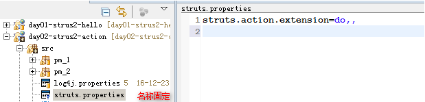

### 1. Strus2概述

Struts2 是一个非常优秀的MVC框架，用于表现层的框架

由传统Struts1和WebWork两个经典框架发展而来

#### 1.1. 核心功能

允许POJO（Plain Old Java Objects）对象 作为Action

Action的execute 方法不再与Servlet API耦合，更易测试

支持更多视图技术（JSP、FreeMarker、Velocity）

基于Spring AOP思想的拦截器机制，更易扩展

更强大、更易用输入校验功能

整合Ajax、JSON支持

#### 1.2. 其他

下载地址：http://struts.apache.org/download.cgi


Struts运行必要jar包

struts2-core-2.3.1.1.jar：Struts 2框架的核心类库

xwork-core-2.3.1.1.jar：Command模式框架,WebWork和Struts2都基于xwork

ognl-3.0.3.jar：对象图导航语言(Object Graph Navigation Language), struts2框架通过其读写对象的属性

freemarker-2.3.18.jar：Struts 2的UI标签的模板使用FreeMarker编写

commons-logging-1.1.x.jar：ASF出品的日志包，Struts 2框架使用这个日志包来支持Log4J和JDK 1.4+的日志记录。

commons-fileupload-1.2.2.jar： 文件上传组件，2.1.6版本后需要加入此文件

commons-io-2.0.1.jar：传文件依赖的jar包

commons-lang-2.5.jar：对java.lang包的增强


### 2. 入门案例


导入jar,从官方示例中复制一个strus.xml，修改其配置项内容

```xml
<?xml version="1.0" encoding="UTF-8" ?>
<!DOCTYPE struts PUBLIC
	"-//Apache Software Foundation//DTD Struts Configuration 2.3//EN"
	"http://struts.apache.org/dtds/struts-2.3.dtd">

<struts>
    <package name="default" namespace="/" extends="struts-default">
       <action name="indexStrus2" class="pm_2.HelloStrus2" method="hlloStrus2">
            <result name="index">/success.jsp</result>
        </action>
    </package>
	</struts>

```

创建一个类(POJO)，编写一个方法(helloStrus)

```java
package pm_2;

public class HelloStrus2  {

    public String hlloStrus2() throws Exception {
    	System.out.println("HelloStrus2...........");
        return "index";
    }

}


```

在web.xml中配置strus2的核心拦截器

```xml
<filter>
        <filter-name>struts2</filter-name>
        	<filter-class>org.apache.struts2.dispatcher.ng.filter.StrutsPrepareAndExecuteFilter</filter-class>
</filter>

<filter-mapping>
    <filter-name>struts2</filter-name>
    <url-pattern>/*</url-pattern>
</filter-mapping>

```

### 3. 访问流程解析


### 4. strus.xml配置详解

#### 4.1. action

```xml
<action name="indexStrus2" class="pm_2.HelloStrus2" method="hlloStrus2">

```

- name:请求时使用的名称

- class:接收到请求之后需要处理的Java类,注意需要全类名

- method：处理该请求的方法名


#### 4.2. result

```xml
<result name="index">/success.jsp</result>
```

name:视图名，对应Java类中方法的返回值

标签体：跟该视图名对应的JSP文件

type:跳转的方式,默认的跳转方式是【请求转发】


常用的跳转方式


| 方式           | 描述                                    |
| :------------- | :------------------------------------- |
| chain          | 请求转发,只是action之间的跳转            |
| dispatcher：   | 请求转发,用于action和jsp之间的跳转,默认值 |
| redirect       | 重定向：用于action和JSP之间的跳转        |
| redirectAction | 重定向：用于action和action之间的跳转     |
| stream         | 流类型,一般用于文件的上传、下载           |


### 5. Action类创建方式


#### 5.1. POJO类方式创建(实际开发中使用频率较低)

所谓的POJO类就是一个没有继承任何其他类(Object除外),没有实现任何接口

```java
public class HelloStrus2  {
    public String hlloStrus2() throws Exception {
    	System.out.println("HelloStrus2...........");
        return "index";
    }
}

```

优点：无耦合

缺点：所有的功能都要自己写


#### 5.2. 实现Action接口创建

action类

```java
public class ActionImplement  implements Action{
	/*该方法是来自接口中的,所以在stuts.xml中可以不进行配置*/
	public String execute() throws Exception {
		return "success";
	}
}

```

struts.xml

```xml
 <!--action中method属性默认值execute  -->
<action  name="helloAction" class="pm_1.ActionImplement" >
		<!--如果没有指定name属性值则默认为success-->
    <result >/success.jsp</result>
</action>

```

Action接口中定义五个常量和一个方法

```java
public static final String SUCCESS = "success";

public static final String NONE = "none";		//null

public static final String ERROR = "error";

public static final String INPUT = "input";

public static final String LOGIN = "login";

public String execute() throws Exception;

```

优点:低耦合

缺点：虽然有一些简单的功能,但是还是需要我们去编写大部分的功能


#### 5.3. 继承com.opensymphony.xwork2.ActionSupport类创建

该类的结构体系

```java
public class ActionSupport
implements Action, Validateable, ValidationAware, TextProvider, LocaleProvider, Serializable {}

```

Action类

```java
import com.opensymphony.xwork2.ActionSupport;

public class ActionExtends extends ActionSupport {

	@Override
	public String execute() throws Exception {

		return SUCCESS;

	}
}

```

优点：省事儿，表单域校验、错误信息设置和获得国际化信息

缺点：耦合度高，侵入式的框架开发


### 6. Action和ServletAPI

ActionContext类的作用,注意是间接获取

```java
//返回ActionContext实例对象
public static ActionContext getContext()

//返回一个Map对象，存取ServletContext属性
public java.util.Map<java.lang.String,java.lang.Object> getApplication()
//返回一个Map对象，存取HttpSession属性
public java.util.Map<java.lang.String,java.lang.Object> getSession()
//类似调用HttpServletRequest的getParameterMap()方法
public java.util.Map<java.lang.String,java.lang.Object> getParameters()
//将该Map实例里key-value保存为ServletContext的属性名、属性值
public void setApplication(java.util.Map<java.lang.String,java.lang.Object> application)
//将该Map实例里key-value保持为HttpSession的属性名、属性值
public void setSession(java.util.Map<java.lang.String,java.lang.Object> session)
```
应用实例

```java
public class ActionExtends extends ActionSupport {
	@Override
	public String execute() throws Exception {
		/*获取actionContext对象*/
		ActionContext context=ActionContext.getContext();
		context.getSession().put("name", "小黑");
		return SUCCESS;

	}
}

```

通过实现一些接口获取Servlet中的API对象

```java
//ServletContextAware
void setServletContext(javax.servlet.ServletContext context)
//ServletRequestAware
//void setServletRequest(javax.servlet.http.HttpServletRequest request)
//ServletResponseAware
void setServletResponse(javax.servlet.http.HttpServletResponse response)

```

代码清单

```java
public class ActionExtends01 extends ActionSupport implements ServletRequestAware{
	private HttpServletRequest request;
	@Override
	public String execute() throws Exception {
		System.out.println(request.getParameter("name"));
		request.setAttribute("name","小白");
		return SUCCESS;

	}
	public void setServletRequest(HttpServletRequest request) {
		this.request=request;
	}
}

```

ServletActionContext

常用方法

- public static javax.servlet.http.HttpServletRequest getRequest()

- public static javax.servlet.http.HttpServletResponse getResponse()

- public static javax.servlet.ServletContext getServletContext()


> 注意：strus2中虽然可以获取Servlet中的API，但是能不用就尽量不用


### 7. 访问Action中的方法

#### 7.1. 普通方式

```java
public class Test02 extends ActionSupport{

	public String add(){
		System.out.println("Test01的add");
		return NONE;
	}
	public String delete(){
		System.out.println("Test01的delete");
		return NONE;
	}
	public String update(){
		System.out.println("Test01的update");
		return NONE;
	}
	public String find(){
		System.out.println("Test01的find");
		return NONE;
	}

}

```

struts.xml

```xml
 <package name="default" namespace="/" extends="struts-default">
    	<action name="Test02_add" class="pm_2.Test02" method="add"></action>
    	<action name="Test02_delete" class="pm_2.Test02" method="delete"></action>
    	<action name="Test02_update" class="pm_2.Test02" method="update"></action>
    	<action name="Test02_find" class="pm_2.Test02" method="find"></action>
	</package>

```

#### 7.2. 通配符


代码清单

```xml
<action name="*_*" class="pm_2.{1}" method="{2}"></action>
```

动态调用

格式：访问路径+action的名字+!方法名,具体代码如下：

http://localhost/day02-strus2-action/Test02Action!delete

分模块编写配置文件

```xml
<struts>
	<include file="test02.xml"></include>
</struts>
```


### 8. Strus2中常用常量的配置

#### 8.1. 常用配置项

默认的编码格式:

- struts.i18n.encoding=UTF-8

默认访问的后缀名：

- struts.action.extension=action,,

是否禁用缓存：

- struts.serve.static.browserCache=true

当struts的配置文件修改后,系统是否自动重新加载该文件,默认值为false(生产环境下使用),开发阶段最好打开 

- struts.i18n.reload=false

上传文件的大小限制

- struts.multipart.maxSize=2097152

上传的目录：

- struts.multipart.saveDir=

与spring集成时，指定由spring负责action对象的创建

- struts.objectFactory.spring.autoWire = name

是否开启动态方法调用

- struts.enable.DynamicMethodInvocation = true

常量列表的属性文件


#### 8.2. 修改常量值

strus.xml

```xml
<struts>
	<constant name="struts.action.extension" value="do,,"/>
</struts>

```

web.xml

```xml
<filter>
  <filter-name>struts2</filter-name>       		<filter-class>org.apache.struts2.dispatcher.ng.filter.StrutsPrepareAndExecuteFilter</filter-class>
    	<!--配置参数-->
    	<init-param>
    		<param-name>struts.action.extension</param-name>
    		<param-value>do,,</param-value>
    	</init-param>
    </filter>

```

属性文件



### 9. 封装请求参数

#### 9.1. 属性驱动

优点：封装简单

缺点：当字段多了之后,因为该action作为一个model对象在用。无法继续向后传递


```java
	public class UserAction extends ActionSupport{
	private String username;
	private String password;

	public void setUsername(String username) {
		this.username = username;
	}
	public void setPassword(String password) {
		this.password = password;
	}
	@Override
	public String execute() throws Exception {
		System.out.println(username+","+password);

		return SUCCESS;

	}
}

```

#### 9.2. 第二种方式(使用频率较高)

优点：方便

缺点：因为要使用ognl表达式,使我们的页面和struts2紧密耦合

JSP代码

```jsp
<form action="${pageContext.request.contextPath}/login.action" method="post">
	账号：<input type="text" name="user.username" /><br />
	密码:<input type="password" name="user.password"><br />
	<input type="submit" />
</form>

```

Action代码

```java
public class UserAction1 extends ActionSupport{
	private User user;
	public User getUser() {
		return user;
	}

	public void setUser(User user) {
		this.user = user;
	}
	@Override
	public String execute() throws Exception {

		System.out.println(user);
		return SUCCESS;

	}
}
```

#### 9.3. 模型驱动

如果action中只封装一个对象,我们推荐使用该方式

优点：页面不需要使用OGNL表达式,提高了页面的通用性

缺点：无法封装多个model对象

JSP代码

```jsp
<form action="${pageContext.request.contextPath}/login.action" method="post">
	账号：<input type="text" name="username" /><br />
	密码:<input type="password" name="password"><br />
	<input type="submit" />
</form>

```

Action类代码

```java
public class UserAction2 extends ActionSupport implements ModelDriven<User>{
	private User user=new User();

	//重写父类的方法
	public User getModel() {

		return user;
	}
	@Override
	public String execute() throws Exception {
		System.out.println(user);
		return SUCCESS;

	}


}

```

> 注意：提交的参数名称必须要和JavaBean中的字段名完全一致,否则封装失败


#### 9.4. 数据类型转换

Struts2中提供的类型转换种类已经基本上满足日常开发需求

- boolean 和 Boolean

- char和 Character

- int 和 Integer

- long 和 Long

- float 和 Float

- double 和 Double

- Date 可以接收 yyyy-MM-dd格式字符串

- 数组  可以将多个同名参数，转换到数组中

- 集合  支持将数据保存到 List 或者 Map 集合


#### 9.5. 类型转换器的创建方式

类型转换出错的提示：**No result defined for action action.UserAction3 and result input **

第一种 实现TypeConverter接口 ，所有类型转换器的顶级接口

convertValue(java.util.Map<java.lang.String,java.lang.Object> context, java.lang.Object target, java.lang.reflect.Member member, java.lang.String propertyName, java.lang.Object value, java.lang.Class toType)

参数太多

第二种：继承 DefaultTypeConverter,顶级接口下的实现类(使用频率较高)

convertValue(java.util.Map<java.lang.String,java.lang.Object> context, java.lang.Object value, java.lang.Class toType)

参数适中,在该类中将接口中convertValue重新封装

第三种：继承 StrutsTypeConverter，是DefaultTypeConverter类的子类(使用频率其次)

convertFromString(java.util.Map context, java.lang.String[] values, java.lang.Class toClass) -- 请求封装

convertToString(java.util.Map context, java.lang.Object o)   --- 数据回显 

参数较少,实现了封装和回显的分离

#### 9.6. 配置自定义类型转换器

局部配置：只针对某一个action生效

- 在Action类所在包 创建 Action类名-conversion.properties
- 格式 ： 属性名称=类型转换器的全类名

全局配置：针对所有action中匹配类型生效

- 在src下创建 xwork-conversion.properties
- 格式 ： 待转换的类型=类型转换器的全类名

代码实例

```java
package action;

import java.text.DateFormat;
import java.text.ParseException;
import java.text.SimpleDateFormat;
import java.util.Date;
import java.util.Map;

import org.apache.struts2.util.StrutsTypeConverter;

public class MyConvertType extends StrutsTypeConverter{
	//从页面传过来的参数
	@Override
	public Object convertFromString(Map map, String[] params, Class type) {
	
		//1984/02/04
		//请求参数的内容
		String dateStr=params[0];
		//要转成的类型
		DateFormat dateFormat = new SimpleDateFormat("yyyy/MM/dd");
		Date date=null;
		if(type==Date.class){
			try {
				 date=dateFormat.parse(dateStr);
			} catch (ParseException e) {
				e.printStackTrace();
			}
		}
		return date;
	}
	//从后台向前台传递
	@Override
	public String convertToString(Map map, Object value) {
		//判断该对象是否是日期对象,如果是则转成字符串
		if(value instanceof Date){
			System.out.println("************************");
			return new SimpleDateFormat("yyyy/MM/dd").format((Date)value);
		}
		return null;
	}

}

```

属性文件(src/action/UserAction4-conversion.properties)

birthday=action.MyConvertType

全局的属性文件(/src/xwork-conversion.properties)

java.util.Date=action.MyConvertType

### 10. 数据校验

校验的种类

客户端校验：javascript

服务器端校验：使用框架内置校验功能 （struts2 内置校验功能 ） ----- 必须的


#### 10.1. struts2 支持校验方式

代码校验 ：在服务器端通过编写java代码，完成数据校验

实现Validateable或者继承ActionSupport

在Action类中重写public void validate(){}

- Validate方法是针对当前action中所有方法的校验

- 如果只想针对某一个方法校验时,需要使用：validate+方法名()


配置校验 ：XML配置校验（主流） 和 注解配置校验

全部的校验规则存在的文件：xwork-core-2.3.15.1.jar\com.opensymphony.xwork2.validator.validators\default.xml

Struts2内置的校验规则

- required (必填校验器,要求被校验的属性值不能为null)

- requiredstring (必填字符串校验器,要求被校验的属性值不能为null，并且长度大于0,默认情况下会对字符串去前后空格)

- stringlength (字符串长度校验器，要求被校验的属性值必须在指定的范围内，否则校验失败,minLength参数指定最小长度，maxLength参数指定最大长度，trim参数指定校验field之前是否去除字符串前后的空格)

- regex (正则表达式校验器，检查被校验的属性值是否匹配一个正则表达式，expression参数指定正则表达式，caseSensitive参数指定进行正则表达式匹配时，是否区分大小写,默认值为true)

- int(整数校验器，要求field的整数值必须在指定范围内，min指定最小值，max指定最大值)

- double(双精度浮点数校验器,要求field的双精度浮点数必须在指定范围内,min指定最小值,max指定最大值)

- fieldexpression (字段OGNL表达式校验器,要求field满足一个ognl表达式，expression参数指定ognl表达式,该逻辑表达式基于ValueStack进行求值,返回true时校验通过，否则不通过)

- email(邮件地址校验器，要求如果被校验的属性值非空，则必须是合法的邮件地址)

- url(网址校验器,要求如果被校验的属性值非空,则必须是合法的url地址)

- date(日期校验器,要求field的日期值必须在指定范围内,min指定最小值,max指定最大值)


#### 10.2. 代码实例

在action包下创建一个action类名-validation.xml文件

```xml
<?xml version="1.0" encoding="UTF-8"?>
<!DOCTYPE validators PUBLIC
  		"-//Apache Struts//XWork Validator 1.0.3//EN"
  		"http://struts.apache.org/dtds/xwork-validator-1.0.3.dtd">
<validators>
	<!-- 需要校验的字段-->
	<field name="user.birthday">
		<field-validator type="date">
 			<param name="min">1866-01-01</param>
 			<param name="max">2016-01-01</param>
 			<message>生日必须在${min}和${max}之间</message>
		</field-validator>
	</field>
</validators>

```

完整的校验规则示例

```xml
 <validators>
 <!-- 用户名不能为空 -->
 	<field name="user.username" >
 		<field-validator type="requiredstring">
 			<param name="trim">true</param>
 			<message>用户名不能为空!!!</message>
 		</field-validator>
 		<field-validator type="stringlength" >
 		<!-- 字符串长度 -->
 			<param name="maxLength">20</param>
 			<param name="minLength">3</param>
 			<message>用户名在3-20之间!!!</message>
 		</field-validator>
 	</field>
 	<!--密码 -->
 	<field name="user.psw">
 		<field-validator type="requiredstring">
 			<message>密码不能为空</message>
 		</field-validator>	
 		<field-validator type="stringlength">
 			<param name="maxLength">20</param>
 			<param name="minLength">3</param>
 			<message>密码在3-20个字符之间</message>
 		</field-validator>
 	</field>
 	<!-- 确认密码 -->
 	<field name="user.repsw">
 		<field-validator type="fieldexpression">
 			<param name="expression">(user.psw eq user.repsw)</param>
 			<message>两次密码不一致</message>
 		</field-validator>
 	</field>
 	<!-- 邮箱地址 -->
 	<field name="user.email">
 		<field-validator type="email">
 			<message>邮箱地址有误</message>
 		</field-validator>
 	</field>
 	<!-- 年龄 -->
 	<field name="user.age">
 		<field-validator type="int">
 			<param name="min">1</param>
 			<param name="max">150</param>
 			<message>年龄必须在1 到150岁之间</message>
 		</field-validator>
 	</field>
 	<!-- 生日 -->
 	<field name="user.birth">
 		<field-validator type="date">
 			<param name="min">1866-01-01</param>
 			<param name="max">2016-01-01</param>
 			<message>生日必须在${min}和${max}之间</message>
 		</field-validator>
 	</field>
 	<!-- 电话 -->
 	<field name="user.phone">
 		<field-validator type="regex">
 			<param name="regexExpression">^15\d{9}$</param>
 			<message>手机号不符合规则</message>
 		</field-validator>
 	</field>
 </validators>

```

### 11. 拦截器

拦截器在访问某个 Action 方法之前或之后实施拦截(面向切面编程) ,是可插拔的, 拦截器是 AOP 的一种实现

拦截器栈(Interceptor Stack)

- 将拦截器按一定的顺序联结成一条链. 在访问被拦截的方法时, Struts2拦截器链中的拦截器就会按其之前定义的顺序被依次调用

Struts2中所有的拦截器声明位置

- 当我们使用默认配置时,struts2默认加载了18个拦截器

- 常用的拦截器

```xml
<interceptor-ref name="modelDriven"/> 模型驱动
<interceptor-ref name="fileUpload"/> 文件上传
<interceptor-ref name="params"> 参数解析封装
<interceptor-ref name="conversionError"/> 类型转换错误
<interceptor-ref name="validation"> 请求参数校验
<interceptor-ref name="workflow"> 拦截跳转 input 视图
```


#### 11.1. 自定义拦截器

通过查看源码,发现所有的拦截器顶级接口是：com.opensymphony.xwork2.interceptor.Interceptor

编写一个Java类,去实现Interceptor接口

```java
import com.opensymphony.xwork2.ActionInvocation;
import com.opensymphony.xwork2.interceptor.Interceptor;

public class MyInterceptor implements Interceptor{
	public void destroy() {
		System.out.println("MyInterceptor 销毁");
	}
	public void init() {
		System.out.println("MyInterceptor 初始化");
	}
	public String intercept(ActionInvocation invocation) throws Exception {
		System.out.println("MyInterceptor 拦截");
		return null;
	}
}

```

声明一个拦截器,参考struts-default.xml

```xml
<package name="default" namespace="/" extends="struts-default">
       <interceptors>
       		<!--声明一个拦截器-->
       		<interceptor name="my" class="action.MyInterceptor" />
       </interceptors>
</package>

```

在某一个action中使用拦截器

```xml
 <action name="userAction" class="action.UserAction">
    <result>/success.jsp</result>
    <interceptor-ref name="my" />
</action>

```

当我们显式声明了一个拦截器之后,那么默认的拦截器就不再生效

解决办法：就是自己声明一个拦截器栈,在栈中引入官方默认的拦截器栈

```xml
<package name="default" namespace="/" extends="struts-default">
		<interceptors>
			<!--声明一个拦截器 -->
			<interceptor name="my" class="action.MyInterceptor" />
			<!-- 模拟官方实例编写一个拦截器栈 -->
			<interceptor-stack name="mystack">
				<interceptor-ref name="my" />
				<interceptor-ref name="defaultStack" />
			</interceptor-stack>
		</interceptors>
		<action name="userAction" class="action.UserAction">
			<result>/success.jsp</result>
			<interceptor-ref name="mystack"/>
		</action>
</package>

```

#### 11.2. Struts2中的拦截器和过滤器有什么区别

底层执行的原理不同,拦截器基于反射机制而过滤器是基于函数回调机制

过滤器依赖于servlet容器，而拦截器不依赖于servlet容器。

拦截器只能对Action请求起作用，而过滤器则可以对几乎所有请求起作用。

拦截器可以访问Action上下文、值栈里的对象，而过滤器不能。

在Action的生命周期中，拦截器可以多次调用，而过滤器只能在容器初始化时被调用一次。


#### 11.3. 拦截器案例

权限校验

- 如果是查询的话不拦截.如果是添加、删除、修改则需要登录之后才可以操作

思路

- 自定义拦截器
    - 在拦截器中从域中获取登录人的信息,如果获取的是null表示没有登录,那么拦截
    - 如果登录成功,则所有请求都不拦截

编码实现

```java
	//实施拦截的方法
	@Override
	protected String doIntercept(ActionInvocation invocation) throws Exception {
		//从Session域中获取key是username的值
		String username=(String) ActionContext.getContext().getSession().get("username");

		if(username==null||username.trim().length()==0){
			//获取当前的action对象
			MainAction mainAction=(MainAction) invocation.getAction();
			//设置提示信息
			mainAction.addActionError("权限不足,.需要登录");
			return ActionSupport.LOGIN;
		}
		return invocation.invoke();
	}

```

struts.xml

```xml
<action name="main_*" class="action.MainAction" method="{1}">
		<interceptor-ref name="LimitsInterceptor" >
			<param name="includeMethods">add,update,delete</param>
		</interceptor-ref>
		<interceptor-ref name="defaultStack" />
</action>
```

### 12. 国际化

国际化英文单词为：Internationalization，又称I18N，I为单词的第一个字母，18为这个单词的长度，而N代表这个单词的最后一个字母。

软件系统往往都是一个开放系统，需要面对来自全世界各个地方的浏览者，当不同地点的用户访问时，以不同的语言显示，比如同一个网站，在美国访问时显示“helloworld”，在中国访问时显示“世界你好”，这就是国际化

软件国际化:一个软件针对不同的语言和国家提供不同语言的支持


#### 12.1. 实现国际化

拦截器

```xml
<interceptor name="i18n" class="com.opensymphony.xwork2.interceptor.I18nInterceptor"/>
```

```java
public static final String DEFAULT_PARAMETER = "request_locale";
```

让该拦截器读取我们自己的语言包,在default.properties中关于语言资源的常量

- 本地语言包：# struts.locale=en_US

- 使用的编码：struts.i18n.encoding=UTF-8

- 语言包资源：# struts.custom.i18n.resources=testmessages,testmessages2

编写JSP页面

- 实现两套语言的界面：(借助struts2的标签库)

准备语言资源文件(全局的国际化)

在src下新建两个文件

- 中国大陆： 	loginResource_zh_CN.properties

- 美国： 		loginResource_en_US.properties

在两个文件中分别编写内容

loginResource_zh_CN.properties

- login.username=账号：

- login.password=密码：

- login.submit=登录

loginResource_en_US.properties

- login.username=UserName:

- login.password=Password:

- login.submit=Login


在struts.xml中指定资源文件

```xml
<constant name="struts.custom.i18n.resources" value="loginResource" />
```

JSP中使用

```jsp
<!--引入struts2的标签库  -->
<%@taglib prefix="s" uri="/struts-tags" %>
  		<a href="${pageContext.request.contextPath}/change?request_locale=zh_CN">中文</a>
  		<a href="${pageContext.request.contextPath}/change?request_locale=en_US">English</a>
   		<s:form>
   			<s:textfield  key="login.username"></s:textfield>
   			<s:textfield key="login.password"></s:textfield>
   			<s:submit key="login.submit"></s:submit>
</s:form>

```

Action中使用

```java
public class ChangeAction extends ActionSupport{
	@Override
	public String execute() throws Exception {
		System.out.println(getText("login.username"));;
		return SUCCESS;
	}
}
```

#### 12.2. 国际化—Action范围资源文件

在一个大型应用中，整个应用有大量的内容需要实现国际化，如果我们把国际化的内容都放置在全局资源属性文件中，显然会导致资源文件变的过于庞大、臃肿，不便于维护，这个时候我们可以针对不同模块，使用包范围来组织国际化文件。

在java的包下放置package_language_country.properties资源文件，package为固定写法，处于该包及子包下的action都可以访问该资源。当查找指定key的消息时，系统会先从package资源文件查找，当找不到对应的key时，才会从常量struts.custom.i18n.resources指定的资源文件中寻找


JSP代码

```jsp
<form action="${pageContext.request.contextPath}/userlogin?request_locale=zh_CN" method="post">
			<input type="text" name="username">
	<input type="submit" />
</form>
```

直接获取语言包中的信息

Jsp:使用`<s:i18n>`标签我们可以直接从类路径下的某个资源文件中获取国际化数据，而无需任何配置

```xml
<s:i18n name="action/users/user/package">
	  	<s:text name="nameerror"></s:text>
</s:i18n>

```

#### 12.3. 输出带有占位符的国际化信息

所谓的占位符{编号}

```properties

login.msg=\u6B22\u8FCE{0}\uFF01\u4F7F\u7528{1}\u7CFB\u7EDF

```

在action中如何使用

```java
getText("login.msg",new String[]{"小黑","学生管理"})
```
JSP

```jsp
<!-- s:text相当于<lable>-->
<s:text name="login.msg">
	<!--参数 -->
	<s:param>小黑</s:param>
	<s:param>学生信息管理</s:param>
</s:text>

```

### 13. 上传和下载

#### 13.1. 单文件上传

客户端

提交方式改post

enctype 属性设置为 multipart/form-data

```html
<input type=“file”>
```

服务器端

拦截器

```xml
	<interceptor name="fileUpload" class="org.apache.struts2.interceptor.FileUploadInterceptor"/>
```

Action


我们在拦截器中能够看到

- 表示上传时struts2获取文件的类型及文件的名称时是拼接的一个字符串


```java
public String execute() throws Exception {
	// 获取Servlet的上下文对象
	ServletContext sc = ServletActionContext.getServletContext();
	// 通过上下文对象获取一个相对路径
	String realpath = sc.getRealPath("/uploadfile");
	System.out.println(realpath);
	try {
		//组装路径和文件名,形成一个类似于d:/1.txt
		File destFile = new File(realpath, fileuploadFileName);
		//复制用户上传的文件内容,同时写入到指定的文件夹中
		FileUtils.copyFile(fileupload, destFile);
	} catch (IOException e) {
		e.printStackTrace();
	}

	return SUCCESS;
}

```

该路径表示的当前工程在服务器端的磁盘路径(绝对路径):

D:\apache-tomcat-6.0.37X86\apache-tomcat-6.0.37\webapps\day04-struts2-3\uploadfile


#### 13.2. 多文件上传

处理请求的代码

```java
public String execute() throws Exception {
		// 获取Servlet的上下文对象
		ServletContext sc = ServletActionContext.getServletContext();
		// 通过上下文对象获取一个相对路径
		String realpath = sc.getRealPath("/uploadfile");
		try {
			for(int i=0;i<fileupload.size();i++){
				System.out.println("***********************");
				//组装路径和文件名,形成一个类似于d:/1.txt
				File destFile = new File(realpath, fileuploadFileName.get(i));
				//复制用户上传的文件内容,同时写入到指定的文件夹中
				FileUtils.copyFile(fileupload.get(i), destFile);
			}

		} catch (IOException e) {
			e.printStackTrace();
		}

		return SUCCESS;
}

```

字段设置

```java
public class FilesUploadAction extends ActionSupport {
	// 上传的文件
	private List<File> fileupload;
	// 上传的文件的类型
	private List<String> fileuploadContentType;
	// 上传文件的名称
    private List<String> fileuploadFileName;
}

```

文件上传的细节

在default.propertiesstruts2的默认设置

- struts.multipart.saveDir=

- struts.multipart.maxSize=2097152

- 修改常量值(这种方式修改是上传文件的总大小)：

```xml
	<constant name="struts.multipart.maxSize" value="20000000"></constant>
```

在拦截器中有三个属性

```java
public class FileUploadInterceptor extends AbstractInterceptor {
    	protected Long maximumSize;
    	protected Set<String> allowedTypesSet = Collections.emptySet();
        protected Set<String> allowedExtensionsSet = Collections.emptySet();
}

```

*  maximumSize: 上传文件的最大长度(以字节为单位), 默认值为 2 MB

*  allowedTypes: 允许上传文件的类型, 各类型之间以逗号分隔

*  allowedExtensions: 允许上传文件扩展名, 各扩展名之间以逗号分隔

在struts.xml中配置参数

```xml
<action name="uploadss" class="action.FilesUploadAction">
			<interceptor-ref name="defaultStack">
				<param name="fileUpload.maximumSize">200</param>
				<param name="fileUpload.allowedExtensions">txt,png</param>
			</interceptor-ref>
			<result>/success.jsp</result>
			<result name="input">/input.jsp</result>
</action>

```

注意：
> - 我们填写参数时,写的是set方法的名
> - 我们在默认的拦截器栈中给某个拦截器添加参数

Struts2支持的上传技术

#struts.multipart.parser=cos

#struts.multipart.parser=pell

struts.multipart.parser=jakarta

配置上传错误后的提示信息

在struts.xml中修改国际化的常量值

```xml
<!--设置国际化文件-->
<constant name="struts.custom.i18n.resources" value="message"></constant>

```

默认信息：struts-messages.properties 文件里预定义 上传错误信息，通过覆盖对应key 显示中文信息

struts.messages.error.uploading=Error uploading: {0}

struts.messages.error.file.too.large=The file is to large to be uploaded: {0} "{1}" "{2}" {3}

struts.messages.error.content.type.not.allowed=Content-Type not allowed: {0} "{1}" "{2}" {3}

struts.messages.error.file.extension.not.allowed=File extension not allowed: {0} "{1}" "{2}" {3}

修改为

struts.messages.error.uploading=上传错误: {0}

struts.messages.error.file.too.large=上传文件太大: {0} "{1}" "{2}" {3}

struts.messages.error.content.type.not.allowed=上传文件的类型不允许: {0} "{1}" "{2}" {3}

struts.messages.error.file.extension.not.allowed=上传文件的后缀名不允许: {0} "{1}" "{2}" {3}


#### 13.3. 下载

浏览器端：

- 由用户指定文件名

服务器端

- 获取文件名

- 封装一个流对象,该对象应该包含文件和路径(相对路径、绝对路径)

- 指定浏览器打开文件的方式：inline(在线打开)、attachment(以附件的形式打开)

编码实现

结果集类型:在struts-default.xml中

```xml
<result-type name="stream" class="org.apache.struts2.dispatcher.StreamResult"/>
```

```java
public class StreamResult extends StrutsResultSupport {
    public static final String DEFAULT_PARAM = "inputName";
    protected String contentType = "text/plain";
    protected String contentLength;
    protected String contentDisposition = "inline";
    protected String contentCharSet ;
    protected String inputName = "inputStream";
    protected InputStream inputStream;
    protected int bufferSize = 1024;
}

```

```jsp
<body>
  		<a href="${pageContext.request.contextPath}/dowload.action?fileName=a.txt">a.txt</a>
</body>

```

Struts.xml

```xml
<!--下载 -->
<action name="dowload" class="action.DowloadFile">
	<result type="stream">
		<!--下载文件的类型-->
		<param name="contentType">contentType</param>
		<!--字节输入流对象-->
		<param name="inputStream">${inputStream}</param>
		<!--浏览器打开文件的方式-->
		<param name="contentDisposition">attachment;fileName=${downloadFileName}</param>
	</result>
</action>

```

Action

```java
public class DowloadFile extends ActionSupport{
	private String fileName;

	public String getFileName() {
		return fileName;
	}

	public void setFileName(String fileName) {
		this.fileName = fileName;
	}

	// 设置下载文件mimeType类型
	public String getContentType() {
		String mimeType = ServletActionContext.getServletContext().getMimeType(fileName);
		System.out.println(mimeType);
		return mimeType;

	}

	// 获取下载文件名称
	public String getDownloadFileName() throws UnsupportedEncodingException {

		return DownloadUtils.getDownloadFileName(ServletActionContext
				.getRequest().getHeader("user-agent"), fileName);
	}

	public InputStream getInputStream() throws FileNotFoundException,
			UnsupportedEncodingException {
		// 解决中文名称乱码.
		fileName = new String(fileName.getBytes("iso8859-1"), "utf-8");
		//字节输入流对象
		FileInputStream fis = new FileInputStream("c:/TDDownloadss/" + fileName);
		return fis;
	}
	@Override
	public String execute() throws Exception {
		return SUCCESS;

	}
}
public class DownloadUtils {

	public static String getDownloadFileName(String agent, String filename) throws UnsupportedEncodingException {
		if (agent.contains("MSIE")) {
			// IE浏览器
			filename = URLEncoder.encode(filename, "utf-8");

		} else if (agent.contains("Firefox")) {
			// 火狐浏览器
			BASE64Encoder base64Encoder = new BASE64Encoder();
			filename = "=?utf-8?B?"
					+ base64Encoder.encode(filename.getBytes("utf-8")) + "?=";
		} else {
			// 其它浏览器
			filename = URLEncoder.encode(filename, "utf-8");
		}

		return filename;
	}
}

```

### 14. OGNL表达式(重点)

OGNL表达式是(Object-Graph Navigation Language)是对象图形化导航语言。

struts2中默认使用OGNL表达式语言来显示数据。与serlvet中的el表达式的作用是一样的。

OGNL表达式有下面以下特点：

- 支持对象方法调用，例如：objName.methodName();`<s:property value="'aaa'.length()"/>`

- 支持类静态的方法调用和值访问，表达式的格式为 [类全名（包括包路经）][方法名 |  值名]

- 注意调用静态需要设置常量：

```xml
<constant name="struts.ognl.allowStaticMethodAccess" value="true"/>
```
java.lang.String@format('foo%s','bar')

tutorial.MyConstant@APP_NAME；

支持赋值操作和表达式串联，`price=100, discount=0.8, calculatePrice()，这个表达式会返回80；`

- 访问OGNL上下文（OGNL context）和ActionContext

- 操作集合对象

#### 14.1. 基础语法

`#`

- `#`  代表 ActionContext.getContext() 上下文

- 不写# 默认在 值栈中root中进行查找

- 进行投影映射(结合复杂对象遍历)

- 使用#构造map集合


%

- 主要作用：就是用于设定当前是否要解析其为 ognl表达式.

- %{表达式}  当前表达式会被做为ognl解析.

- %{'表达式'} 当前表达式不会被做为ognl解析。

$

- 主要作用：就是在配置文件中使用ognl表达式来获取valueStack中数据.
- 例如：`<param name="inputStream">${inputStream}</param>`


#### 14.2. OGNL简单的使用

```jsp
<s:property value="'aaa'.length()"/>
<s:property value="@utils.OgnlTest01@say()"/>
```

### 15. Struts2中的OGNL

#### 15.1. 什么是valueStack(值栈)

本身是一个接口：com.opensymphony.xwork2.util.ValueStack,实现类：com.opensymphony.xwork2.ognl.OgnlValueStack

生命周期：一个request,一个action，一个valueStack, valueStack生命周期就是request生命周期。

valueStack中存储了当前action对象以及其它常用web对象**(request,session,application.parameters)**

struts2框架将valueStack以“struts.valueStack”为名存储到request域中。

#### 15.2. valueStack(值栈)结构

```java
public class OgnlValueStack implements Serializable, ValueStack, ClearableValueStack, MemberAccessValueStack {
 						CompoundRoot root;
Map<String, Object> context;
}
public class CompoundRoot extends ArrayList

```

值栈被划分成两块

- root:存储当前action的相关信息
- context：存储各种映射关系和一些常用WEB对象
    - paramters：参数
    - request：请求域
    - session：会话域
    - application：最大的域
    - attr：从域中检索数据


#### 15.3. 获取值栈对象的方式

通过 request获取

ValueStack vs=(ValueStack) ServletActionContext.getRequest().getAttribute(ServletActionContext.STRUTS_VALUESTACK_KEY);

public static final String STRUTS_VALUESTACK_KEY = "struts.valueStack";

通过ActionContext获取(推荐)

ValueStack vs=ActionContext.getContext().getValueStack();

JSP中获取值栈数据：root中数据不需要#，而context中数据需要#

EL表达式可以获取值栈中数据的原因是：

- struts2框架中所使用的request对象，是增强后的request对象。
- 增强后的request,会首先在request域范围查找，如果查找不到，会在valueStack中查找。

#### 15.4. 向值栈中存储数据

push(Object obj)：底层就是 root.add(0,obj) 将数据存储到栈顶。

set(String name,Object obj);底层是将数据封装到HashMap中，在将这个HashMap通过push存储


### 16. 标签库

**表单的数据回显**

对页面进行布局和排版(主题)

标签的属性可以被赋值为一个静态的值或一个 OGNL 表达式. 如果在赋值时使用了一个 OGNL 表达式并把它用 %{} 括起来, 这个表达式将会被求值.


#### 16.1. 通用标签

```JSP
<!--引入struts的标签库-->
<%@taglib prefix="s" uri="/struts-tags"%>
	s:property标签:用来输出值栈中的一个属性值.

	 从root(栈顶)中获取值：
	<s:property value="username" />
	 从context(map)中获取值:
	<s:property value="#session.name" />

	 s:url标签用来动态地创建一个 URL

	<s:url action="index1" namespace="/" method="login" />

	<s:url var="ur"></s:url>

	<s:property value="ur" />

	 s:set 标签用来在以下 Map 对象里创建一个键值对:

	<s:set name="user" value="'小崔'" scope="session"></s:set>
	 ${sessionScope.user}

	 s:push 标签在标签起始时把一个对象压入栈, 标签结束时将对象弹出栈.%{'aa'}

	<s:push value="'HelloWorld'">
		<s:property value="[0].top" />
	</s:push>

	 s:if, s:else 和 s:elseif 标签


	<s:if test="18<10">
			s:if
	</s:if>
	<s:elseif test="18==18">
		elseif 标签
	</s:elseif>
	<s:else>
			s:else
	</s:else>
	<%
		List<Person> persons = new ArrayList<Person>();
		persons.add(new Person("aa", "11"));
		persons.add(new Person("bb", "22"));
		persons.add(new Person("ee", "55"));
		persons.add(new Person("cc", "33"));
		persons.add(new Person("dd", "44"));

		request.getSession().setAttribute("prs", persons);
	%>
	 s:iterator 标签用来遍历一个数组, Collection 或一个 Map,
	并把这个可遍历对象里的每一个元素依次压入和弹出 ValueStack 栈

	<s:iterator value="#session.prs" var="pr" status="st">
		name:<s:property value="name" />
		sex:<s:property value="sex" />
		${st.index }
	</s:iterator>
	 s:sort 标签用来对一个可遍历对象里的元素进行排序.
	<%
		List<Person> pers = new ArrayList<Person>();
		pers.add(new Person("cc", "33", 13));
		pers.add(new Person("aa", "11", 10));
		pers.add(new Person("bb", "22", 11));
		pers.add(new Person("ee", "55", 15));
		pers.add(new Person("dd", "44", 12));
		request.getSession().setAttribute("pers", pers);

		request.getSession().setAttribute("mycom", new MyCompar());
	%>
	<s:sort comparator="#session.mycom" source="#session.pers">
		<s:iterator>
			<s:property value="name" />
			<s:property value="sex" />
			<s:property value="age" />
		</s:iterator>
	</s:sort>
	<%
		request.getSession().setAttribute("date", new Date());
	%>
	s:date 标签用来对 Date 对象进行排版
	 ${date}
	<s:date name="#session.date" format="yyyy年MM月dd日" />

	 s:a 标签将呈现为一个 HTML 连接. 这个标签可以接受 HTML 语言中的 a 元素所能接受的所有属性.

	<a href="${pageContext.request.contextPath }/indexaction.action">cc</a>
	<s:a action="indexaction">aaa</s:a>

	<hr />

	<s:debug />

```

#### 16.2. 表单标签

```jsp
<s:form action="regist" method="post">
		<s:textfield label="账号" name="username"></s:textfield>
		<s:password label="密码" name="password" showPassword="true"/>
		<s:textfield label="电话" name="phone" />
		<s:textarea label="个人描述" name="desc"/>
		<s:radio list="#{'1':'男','0':'女' }" name="sex"></s:radio>
		<!-- 多选框列表-->
		<!-- list
		<s:checkboxlist list="{'吃饭','睡觉','打游戏'}" name="hobby"/> -->
		<!-- map-->
		<s:checkboxlist list="#{'eat':'吃饭','sleep':'睡觉','playgame':'打游戏'}" name="hobby"/>
		<s:select label="住址" list="#{'0':'请选择','1':'北京','2':'上海'}" name="address" ></s:select>
		<!--多选框-->
		<s:checkbox label="同意协议" name="agree"/>

		<s:submit value="保存"></s:submit>
	</s:form>

```


#### 16.3. 主题

为了让所有的 UI 标签能够产生同样的视觉效果而归集到一起的一组模板. 即风格相近的模板被打包为一个主题

Struts2中有四种主题

- simple: 把 UI 标签翻译成最简单的 HTML 对应元素, 而且会忽视行标属性

- xhtml: xhtml 是默认的主题. 这个主题的模板通过使用一个布局表格提供了一种自动化的排版机制.

- css_xhtml: 这个主题里的模板与 xhtml 主题里的模板很相似, 但它们将使用 css 来进行布局和排版

- ajax: 这个主题里的模板以 xhtml 主题里德模板为基础, 但增加了一些 Ajax 功能.


修改主题:

- 通过 UI 标签的 theme 属性

- 在一个表单里, 若没有给出某个 UI 标签的 theme 属性, 它将使用这个表单的主题

- 在 page, request, session 或 application 中添加一个 theme 属性

- 在struts.xml中<constant name="struts.ui.theme" value="simple"></constant>

- 注意在此处做的修改是全局性质的


#### 16.4. Struts2内置的JSON插件

 常用JSON插件

- Jsonlib

- Fastjson(推荐)

- struts2-json-plugin-2.3.15.1


导入jar：struts2_Home\lib\struts2-json-plugin-2.3.15.1

在struts.xml中进行配置


注意事项：

- 默认情况下,该插件会将action类中的所有字段(全局变量)封装成一个json对象


修改方式：使用`<param>`标签修改root的值

主要这个参数标签书写的位置,如果是ajax请求的话,那么不需要返回具体的视图(JSP)的页面

