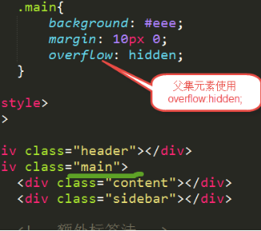
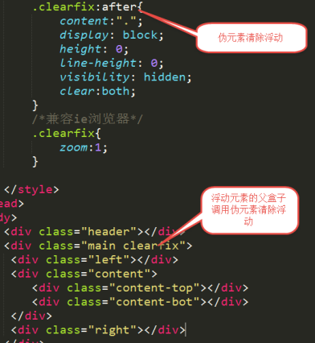
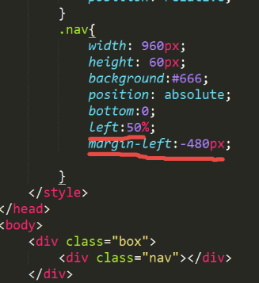

### 1. CSS基础

CSS 指层叠样式表 (Cascading Style Sheets)(级联样式表)

CSS是用来美化html标签的，相当于页面化妆。


#### 1.1. 样式表书写位置

##### 1.1.1. 内嵌式写法

```html
<head>
    <style type=”text/css”>
        /*样式表写法*/
    </style>
</head>
```

##### 1.1.2. 外链式写法

写在head里，<link rel=”stylesheet” href=”1.css”>

```html
<head>
    <link rel=”stylesheet” href=”1.css”>
</head>
```

##### 1.1.3. 行内样式表

```html
<!-- 行内样式 -->
<h1 style="font-size:30px;color:red"> HelloWord </h1>

```

##### 1.1.4. 三种写法特点

- 内嵌式写法，样式只作用于当前文件，没有真正实现结构表现分离。

- 外链式写法，作用范围是当前站点，谁调用谁生效，范围广，真正实现结构表现分离。

- 行内样式表，作用范围仅限于当前标签，范围小，结构表现混在一起。  （不推荐使用）


#### 1.2. 基础选择器

##### 1.2.1. 标签选择器

特点：

标签选择器定义之后，会将页面所有的元素都执行这个标签样式。

写法

标签{属性：值;}


##### 1.2.2. 颜色的显示方式

直接写颜色的名称


十六进制显示颜色

#000000; 前2为代表红色，中间2位代表绿色，后边2位代表蓝色。

-  `color:rgb(120,120,120)`
- `color:rgba(120,120,120,0.5)` a代表alpha 不透明度   值 0-1


##### 1.2.3. 类选择器

特点：

- 谁调用，谁生效。
- 一个标签可以调用多个类选择器。
- 多个标签可以调用同一个类选择器。

类选择器命名规则

- 不能用纯数字或者数字开头来定义类名
- 不能使用特殊符号或者特殊符号开头来定义类名
- 不建议使用汉字来定义类名
- 不推荐使用属性或者属性的值来定义类名

写法

自定义类名{属性:值;  属性:值；}

##### 1.2.4. ID选择器


特点：

- 一个ID选择器在一个页面只能调用一次。如果使用2次或者2次以上，不符合w3c规范，JS调用会出问题。

- 一个标签只能调用一个ID选择器。

- 一个标签可以同时调用类选择器和ID选择器。

##### 1.2.5. 通配符选择器

写法

*{属性:值;}

特点：

给所有的标签都使用相同的样式

> PS：不推荐使用，增加浏览器和服务器负担。


#### 1.3. 复合选择器


两个或者两个以上的基础选择器通过不同的方式连接在一起。


##### 1.3.1. 交集选择器

写法

标签+类（ID）选择器{属性：值；}

特点：

即要满足使用了某个标签，还要满足使用了类（id）选择器。


##### 1.3.2. 后代选择器

写法

选择器+空格+选择器{属性：值;}

特点：

- 无限制隔代

- 只要能代表标签，标签、类选择器、ID选择器自由组合

- 后代选择器首选要满足包含（嵌套）关系

- 父集元素在前边，子集元素在后边


##### 1.3.3. 子代选择器

写法

选择器>选择器{属性:值;}

特点：

选中直接下一代元素


##### 1.3.4. 并集选择器

写法

选择器+，+选择器+，选择器{属性:值;}


#### 1.4. 文本元素

##### 1.4.1. 属性

- font-size:16px;  文字大小

- Font-weight: 700	;   值从100-900，文字粗细，不推荐使用font-weight:bold;

- Font-family:微软雅黑;  文本的字体

- Font-style: normal | italic;      normal 默认值  italic  斜体

- line-height: 行高

```css
div{
    font-size:16px;
    font-weight:700;
}
```

##### 1.4.2. 文本属性连写

font:后边写属性的值。一定按照书写顺序。

font: font-style font-weight  font-size/line-height  font-family;

文本属性连写文字大小和字体为必写项


#### 1.5. CSS三大特性


##### 1.5.1. 层叠性

当多个样式作用于同一个（同一类）标签时，样式发生了冲突，总是执行后边的代码(后边代码层叠前边的代码)。和标签调用选择器的顺序没有关系。


##### 1.5.2. 继承性

继承性发生的前提是包含(嵌套关系)

- 文字颜色可以继承

- 文字大小可以继承

- 字体可以继续

- 字体粗细可以继承

- 文字风格可以继承

- 行高可以继承

总结：文字的所有属性都可以继承。

特殊情况：

- h系列不能继承文字大小。

- a标签不能继承文字颜色。


##### 1.5.3. 优先级

继承的权重为0

权重会叠加

```
默认样式<标签选择器<类选择器<id选择器<行内样式<!important
0         1          10     100    1000     1000以上
```


#### 1.6. 链接伪类

a:link{属性:值;}  a{属性:值}效果是一样的

| 写法                | 描述                   |
| :----------------- | :--------------------- |
| a:link{属性:值;}    | 链接默认状态            |
| a:visited{属性:值;} | 链接访问之后的状态      |
| a:hover{属性:值;}   | 鼠标放到链接上显示的状态 |
| a:active{属性:值;}  | 链接激活的状态          |
| ：focus{属性:值；}  | 获取焦点                |


#### 1.7. 背景属性


方位值只写一个的时候，另外一个值默认居中

```CSS
background-position: right;
```

写2个方位值的时候，顺序没有要求

```css
background-position: right bottom;
```


写2个具体值的时候，第一个值代表水平方向，第二个值代表垂直方向。

```css
background-position: right bottom;
```


#### 1.8. 行高

- 浏览器默认文字大小：16px

- 行高：是基线与基线之间的距离

- 行高=文字高度+上下边距


- 一行文字行高和父元素高度一致的时候，垂直居中显示。

行高的单位


| 行高单位 | 文字大小 |  值  |
| ------- | ------- | ---- |
| 20px    | 20px    | 20px |
| 2em     | 20px    | 40px |
| 150%    | 20px    | 30px |
| 2       | 20px    | 40px |


总结:

单位除了像素以为，行高都是与文字大小乘积。

不带单位时，行高是和子元素文字大小相乘，em和%的行高是和父元素文字大小相乘。行高以像素为单位，就是定义的行高值。

推荐行高使用像素为单位。


#### 1.9. 盒子模型

##### 1.9.1. 边框  border

特点：

没有顺序要求，线型为必写项。

```css
border: 1px solid red;
```

边框合并

```css

table{
    width: 300px;
    height: 500px;
    border: 1px solid red;
    border-collapse:collapse;
}

```


##### 1.9.2. 内边距

padding-left   |   right    |  top  |  bottom

padding连写

padding: 20px;   上右下左内边距都是20px

padding: 20px 30px;   上下20px   左右30px

padding: 20px  30px  40px;   上内边距为20px  左右内边距为30px   下内边距为40

padding:  20px  30px   40px  50px;   上20px 右30px  下40px  左  50px


##### 1.9.3. 内边距撑大盒子的问题

- 影响盒子宽度的因素

- 内边距影响盒子的宽度

- 边框影响盒子的宽度

盒子的宽度=定义的宽度+边框宽度+左右内边距

包含（嵌套）的盒子，如果子盒子没有定义宽度，给子盒子设置左右内边距，一般不会撑大盒子。


##### 1.9.4. 外边距


margin-left   | right  |  top  |  bottom

外边距连写

- margin: 20px;    上下左右外边距20PX

- margin: 20px 30px;   上下20px  左右30px
- margin: 20px  30px  40px;     上20px  左右30px   下  40px
- margin: 20px  30px   40px  50px; 上20px   右30px   下40px  左50px


##### 1.9.5. 垂直方向外边距合并

两个盒子垂直一个设置上外边距，一个设置下外边距，取的设置较大的值。

##### 1.9.6. 嵌套的盒子外边距塌陷

解决方法:

- 给父盒子设置边框

- 给父盒子overflow:hidden;   bfc   格式化上下文


行内元素可以定义左右的内外边距，上下会被忽略掉。


#### 1.10. 浮动布局

float:  left   |   right


特点：

- 元素浮动之后不占据原来的位置（脱标）

- 浮动的盒子在一行上显示

- 行内元素浮动之后转换为行内块元素。（不推荐使用，转行内元素最好使用display: inline-block;）

浮动的作用

- 文本绕图

- 制作导航

- 网页布局


#### 1.11. 清除浮动

当父盒子没有定义高度，嵌套的盒子浮动之后，下边的元素发生位置错误。

- 清除浮动不是不用浮动，清除浮动产生的不利影响。
- 清除浮动的方法:`clear: left  |  right  | both`
- 工作里用的最多的是clear:both;

##### 1.11.1. 额外标签法

在最后一个浮动元素后添加标签,。

```html

<div class="main">

    <div clss="content"> </div>
    <div class="sidebar"> </div>
    <!--额外标签法-->
    <div style="clear:both;"> </div>
</div>
```

##### 1.11.2. 给父集元素使用overflow:hidden;

如果有内容出了盒子，不能使用这个方法。



##### 1.11.3. 伪元素清除浮动  推荐使用




#### 1.12. 定位

定位方向: left  | right  | top  | bottom


position:static;  静态定位。默认值，就是文档流。


##### 1.12.1. 绝对定位

position:absolute;

特点：

- 元素使用绝对定位之后不占据原来的位置（脱标）

- 元素使用绝对定位，位置是从浏览器出发。

- 嵌套的盒子，父盒子没有使用定位，子盒子绝对定位，子盒子位置是从浏览器出发。

- 嵌套的盒子，父盒子使用定位，子盒子绝对定位，子盒子位置是从父元素位置出发。

- 给行内元素使用绝对定位之后，转换为行内块。（不推荐使用，推荐使用display:inline-block;）

##### 1.12.2. 相对定位

position: relative;

特点：

- 使用相对定位，位置从自身出发。

- 还占据原来的位置。

- 子绝父相（父元素相对定位，子元素绝对定位）

- 行内元素使用相对定位不能转行内块

##### 1.12.3. 固定定位

Position:fixed;

特点：

- 固定定位之后，不占据原来的位置（脱标）

- 元素使用固定定位之后，位置从浏览器出发。

- 元素使用固定定位之后，会转化为行内块（不推荐，推荐使用display:inline-block;）


> PS: 文档流,元素自上而下，自左而右，块元素独占一行，行内元素在一行上显示，碰到父集元素的边框换行。


#### 1.13. 定位的盒子居中显示

margin:0 auto;  只能让标准流的盒子居中对齐。

定位的盒子居中：先左右走父元素盒子的一半50%，在向左走子盒子的一半(margin-left:负值)



#### 1.14. 标签包含规范

- div可以包含所有的标签。

- p标签不能包含div h1等标签。

- h1可以包含p，div等标签。

- 行内元素尽量包含行内元素，行内元素不要包含块元素。


#### 1.15. 可见性

- overflow:hidden;   溢出隐藏

- visibility:hidden;   隐藏元素    隐藏之后还占据原来的位置。

- display:none;      隐藏元素    隐藏之后不占据原来的位置。

- display:block;     元素可见

- display:none  和display:block  常配合js使用。


#### 1.16. 块元素

典型代表: Div , h1-h6 , p , ul , li

特点:

- 独占一行

- 可以设置宽高

- 嵌套（包含）下，子块元素宽度（没有定义情况下）和父块元素宽度默认一致。

##### 1.16.1. 行内元素

行内大多为描述性标记

典型代表 span  ,a,  ,strong , em,  del,  ins


特点：

1. 和其他元素都在一行

2. 高度、宽度以及内边距都是不可控的

3. 宽高就是内容的高度，不可以改变

4. 行内元素只能行内元素，不能包含块级元素


```html
<span>...</span>

  <a>...</a>  链接

  <br>  换行

  <b>...</b>  加粗

  <strong>...</strong>  加粗

    图片

  <sup>...</sup>  上标

  <sub>...</sub>  下标

  <i>...</i>  斜体

  <em>...</em>  斜体

  <del>...</del>  删除线

  <u>...</u>  下划线

  <input>...</input>  文本框

  <textarea>...</textarea>  多行文本

  <select>...</select>  下拉列表
```

#### 1.17. 块级元素

块级大多为结构性标记

特点：

1. 总是从新的一行开始

2. 高度、宽度都是可控的

3. 宽度没有设置时，默认为100%

4. 块级元素中可以包含块级元素和行内元素


```html

  <address>...</adderss>

  <center>...</center>  地址文字

  <h1>...</h1>  标题一级

  <h2>...</h2>  标题二级

  <h3>...</h3>  标题三级

  <h4>...</h4>  标题四级

  <h5>...</h5>  标题五级

  <h6>...</h6>  标题六级

  <hr>  水平分割线

  <p>...</p>  段落

  <pre>...</pre>  预格式化

  <blockquote>...</blockquote>  段落缩进   前后5个字符

  <marquee>...</marquee>  滚动文本

  <ul>...</ul>  无序列表

  <ol>...</ol>  有序列表

  <dl>...</dl>  定义列表

  <table>...</table>  表格

  <form>...</form>  表单

  <div>...</div>
```

##### 1.17.1. 行内块元素(内联元素)


典型代表  input  img

特点：

- 在一行上显示

- 可以设置宽高

#### 1.18. 块元素和行内元素转换

```CSS
/*块元素转行内元素*/
div,p{

    display:inline;
}
/*行内元素转块元素*/
span{

    display:block;
}

/*块和行内元素转行内块元素*/
div ,a,span,strong{
    display:inline-block;
    width:200px;
    height:200px;
    background-color:yellow;
    text-align:center;
}
```


