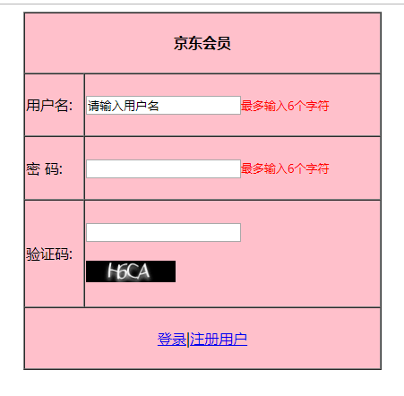

### 1. HTML基础


#### 1.1. 开发工具

文本编辑器

Editplugs、Notepad++、Sublime、VSCode等等

集成开发工具(IDE)

HBuilder、WebStorm、IDEA、DW、Eclipse等等


#### 1.2. 标准

- w3c 万维网联盟组织用来制定web标准的机构（组织）
- web标准：制作网页要遵循的规范
- web标准规范的分类：  结构标准(HTML)              表现标准(CSS)            行为标准(javascript)


#### 1.3. 浏览器介绍


浏览器是网页运行的平台，常用的浏览器有IE、火狐（Firefox）、谷歌（Chrome）、Safari和Opera等

浏览器内核：也就是浏览器所采用的渲染引擎，渲染引擎决定了浏览器如何显示网页的内 ，容以及页面的格式信息，由于渲染方式的不同意味着浏览器兼容性问题的出现

浏览器内核：

| IE       | 谷歌  | 火狐   | 苹果    |
| :------ | :---- | :------ | :------- |
|          |        |         |          |
| trident | blink | gecko | webkit |


#### 1.4. 浏览器与服务器

浏览器向服务器发送请求（通过http协议）

http协议：超文本传输协议，也就是浏览器和服务器端的网页传输数据的约束和规范

url协议:平时我们写的网址就是url地址

- 协议规定格式：  scheme://host.domain:port/path/filename
    - scheme: 定义因特网服务的类型  。常见的就是http

    - host：  定义域主机（http 的默认主机是www）

    - domain: 定义因特网域名  比如：w3school.com.cn

    - :port   定义端口号（网页默认端口 :80）

    - path:   网页所在服务器上的路径

    - filename:   文件名称

#### 1.5. HTML简介

HTML (Hyper   Text    Markup   Language )   中文译为“超文本标记语言”，主要是通过html标记对网页中的文本，图片，声音等内容进行描述

HTML之所以称为超文本标记语言，不仅是因为他通过标记描述网页内容，同时也由于文本中包含了所谓的“超级链接”，通过超链接可以实现网页的跳转。从而构成了丰富多彩的Web页面。


#### 1.6. HTML结构

##### 1.6.1. 基本的文档格式

学习任何一门语言，都要首先掌握它的基本格式，就像写信需要符合书信的格式要求一样。HTML标记语言也不例外，同样需要遵从一定的规范。

```html
<!DOCTYPE html>
<html lang="en">
<head>
    <meta charset="UTF-8">
    <title>Title</title>
</head>
<body>

</body>
</html>
```

##### 1.6.2. `<html>` 标记

`<html>`称为根标记，用于告知浏览器其自身是一个 HTML 文档， `<html>`标记标志着HTML文档的开始，`</html>`标记标志着HTML文档的结束，在他们之间的是文档的头部和主体内容。

`<html  lang="en"> `  向搜索引擎表示该页面是html语言，并且语言为英文网站，其"lang"的意思就是“language”，语言的意思，而“en”即表示english

这个主要是给搜索引擎看的，搜索引擎不会去判断该站点是中文站还是英文站，所以这句话就是让搜索引擎知道，你的站点是中文站，对html页面本身不会有影响


##### 1.6.3. `<head>` 标记

`<head>`标记用于定义HTML文档的头部信息，也称为头部标记，紧跟在`<html>`标记之后，主要用来封装其他位于文档头部的标记。


一个HTML文档只能含有一对`<head>`标记，绝大多数文档头部包含的数据都不会真正作为内容显示在页面中。

##### 1.6.4. `<title>`标记

`<title>`标记用于定义HTML页面的标题，即给网页取一个名字，必须位于`<head>`标记之内。一个HTML文档只能含有一对`<title></title>`标记，

`<title></title>`之间的内容将显示在浏览器窗口的标题栏中。其基本语法格式如下：

```html
<title>网页名称</title>
```

##### 1.6.5. `<body>` 标记

`<body>`标记用于定义HTML文档所要显示的内容，也称为主体标记。浏览器中显示的所有文本、图像、音频和视频等信息都必须位于`<body>`标记内，`<body>`标记中的信息才是最终展示给用户看的。


一个HTML文档只能含有一对`<body>`标记，且`<body>`标记必须在`<html>`标记内，位于`<head>`头部标记之后

#### 1.7. 标签关系

- 嵌套关系：类似父亲和儿子之间的关系

```html
<html>
    <head></head>
    <body></body>
</html>
```

- 并列关系：类似与兄弟之间的关系

```html
<head></head>
<body></body>
```

#### 1.8. 标签分类

##### 1.8.1. 双标记

双标记也称体标记，是指由开始和结束两个标记符组成的标记。其基本语法格式：<标记名></标记名>

该语法中“<标记名>”表示该标记的作用开始，一般称为“开始标记（start tag）”，“</标记名>” 表示该标记的作用结束，一般称为“结束标记（end tag）”。和开始标记相比，结束标记只是在前面加了一个关闭符“/”

##### 1.8.2. 单标记

单标记也称空标记，是指用一个标记符号即可完整地描述某个功能的标记。其基本语法格式如下：

<标记名/>


#### 1.9. 单标记详解


##### 1.9.1. 水平线标记`<hr />`

在网页中常常看到一些水平线将段落与段落之间隔开，使得文档结构清晰，层次分明。这些水平线可以通过插入图片实现，也可以简单地通过标记来完成，`<hr />`就是创建横跨网页水平线的标记。其基本语法格式如下：

```html
 <hr />是单标记，在网页中输入一个<hr />，就添加了一条默认样式的水平线。
```

##### 1.9.2. 注释标记

在HTML中还有一种特殊的标记——注释标记。如果需要在HTML文档中添加一些便于阅读和理解但又不需要显示在页面中的注释文字，就需要使用注释标记。其基本语法格式如下：

**`<!-- 注释语句 -->`**

注释内容不会显示在浏览器窗口中，但是作为HTML文档内容的一部分，也会被下载到用户的计算机上，查看源代码时就可以看到。


##### 1.9.3. 换行标记`<br />`

在HTML中，一个段落中的文字会从左到右依次排列，直到浏览器窗口的右端，然后自动换行。如果希望某段文本强制换行显示，就需要使用换行标记`<br />`，这时如果还像在word中直接敲回车键换行就不起作用了。

##### 1.9.4. 图像标记``

HTML网页中任何元素的实现都要依靠HTML标记，要想在网页中显示图像就需要使用图像标记，接下来将详细介绍图像标记``以及和他相关的属性。其基本语法格式如下：

```html

```

该语法中src属性用于指定图像文件的路径和文件名，他是img标记的必需属性。

| 属性   | 属性值 | 描述                   |
| :----- | :---- | :-------------------- |
| src    | URL   | 图像的路径             |
| alt    | 文本   | 图像不能显示时的替换文本 |
| title  | 文本   | 鼠标悬停时显示的内容     |
| width  | 像素   | 设置图像的宽度          |
| height | 像素   | 设置图像的高度          |


#### 1.10. 相对路径

相对路径不带有盘符，通常是以HTML网页文件为起点，通过层级关系描述目标图像的位置。

例如：` `

##### 1.10.1. 相对路径设置分为以下三种：


- 图像文件和html文件位于同一文件夹：只需输入图像文件的名称即可，如：``

- 图像文件位于html文件的下一级文件夹：输入文件夹名和文件名，之间用“/”隔开，如：``
- 图像文件位于html文件的上一级文件夹：在文件名之前加入“../” ，如果是上两级，则需要使用 “../ ../”，以此类推，如：``

#### 1.11. 绝对路径

 绝对路径一般是指带有盘符的路径。例如：

- “D:\HTML+CSS网页制作\chapter02\img\logo.gif”

- 完整的网络地址，例如“http://www.coder163.com/images/logo.gif”。


#### 1.12. 双标记详解

##### 1.12.1. 段落标记

在网页中要把文字有条理地显示出来，离不开段落标记，就如同我们平常写文章一样，整个网页也可以分为若干个段落，而段落的标记就是`<p>`。

`<p>`是HTML文档中最常见的标记，默认情况下，文本在一个段落中会根据浏览器窗口的大小自动换行。

##### 1.12.2. 标题标记

为了使网页更具有语义化，我们经常会在页面中用到标题标记，HTML提供了6个等级的标题，即`<h1>`、`<h2>`、`<h3>`、`<h4>`、`<h5>`和`<h6>`，从`<h1>`到`<h6>`重要性递减。其基本语法格式如下：

```html
<hn>标题文本</hn>
```

##### 1.12.3. 文本样式标记

多种多样的文字效果可以使网页变得更加绚丽，为此HTML提供了文本样式标记<font>，用来控制网页中文本的字体、字号和颜色。其基本语法格式如下：


```html
<font>文本内容</font>
```

##### 1.12.4. 文本格式化标记

在网页中，有时需要为文字设置粗体、斜体或下划线效果，这时就需要用到HTML中的文本格式化标记，使文字以特殊的方式显示。


文本格式化常用标记

| 标记                           | 显示效果                                |
| :----------------------------- | :------------------------------------- |
| `<b></b>`和`<strong></strong>`	 | 文字以粗体方式显示（XHTML推荐使用strong） |
| `<i></i>`和`<em></em>`         | 文字以斜体方式显示（XHTML推荐使用em）     |
| `<s></s>`和`<del></del>`       | 文字以加删除线方式显示（XHTML推荐使用del） |
| `<u></u>`和`<ins></ins>`       | 文字以加下划线方式显示（XHTML不赞成使用u）    |


案例展示


##### 1.12.5. 换行标记`<br />`

在HTML中，一个段落中的文字会从左到右依次排列，直到浏览器窗口的右端，然后自动换行。如果希望某段文本强制换行显示，就需要使用换行标记`<br />`，这时如果还像在word中直接敲回车键换行就不起作用了。

##### 1.12.6. 图像标记``

HTML网页中任何元素的实现都要依靠HTML标记，要想在网页中显示图像就需要使用图像标记，接下来将详细介绍图像标记``以及和他相关的属性。其基本语法格式如下：

```html

```

该语法中src属性用于指定图像文件的路径和文件名，他是img标记的必需属性。

| 属性   | 属性值 | 描述                   |
| :----- | :---- | :-------------------- |
| src    | URL   | 图像的路径             |
| alt    | 文本   | 图像不能显示时的替换文本 |
| title  | 文本   | 鼠标悬停时显示的内容     |
| width  | 像素   | 设置图像的宽度          |
| height | 像素   | 设置图像的高度          |


#### 1.13. 相对路径

相对路径不带有盘符，通常是以HTML网页文件为起点，通过层级关系描述目标图像的位置。

例如：` `

##### 1.13.1. 相对路径设置分为以下三种：


- 图像文件和html文件位于同一文件夹：只需输入图像文件的名称即可，如：``

- 图像文件位于html文件的下一级文件夹：输入文件夹名和文件名，之间用“/”隔开，如：``
- 图像文件位于html文件的上一级文件夹：在文件名之前加入“../” ，如果是上两级，则需要使用 “../ ../”，以此类推，如：``

#### 1.14. 绝对路径

 绝对路径一般是指带有盘符的路径。例如：

- “D:\HTML+CSS网页制作\chapter02\img\logo.gif”

- 完整的网络地址，例如“http://www.coder163.com/images/logo.gif”。


#### 1.15. 双标记详解

##### 1.15.1. 段落标记

在网页中要把文字有条理地显示出来，离不开段落标记，就如同我们平常写文章一样，整个网页也可以分为若干个段落，而段落的标记就是`<p>`。

`<p>`是HTML文档中最常见的标记，默认情况下，文本在一个段落中会根据浏览器窗口的大小自动换行。

##### 1.15.2. 标题标记

为了使网页更具有语义化，我们经常会在页面中用到标题标记，HTML提供了6个等级的标题，即`<h1>`、`<h2>`、`<h3>`、`<h4>`、`<h5>`和`<h6>`，从`<h1>`到`<h6>`重要性递减。其基本语法格式如下：

```html
<hn>标题文本</hn>
```

##### 1.15.3. 文本样式标记

多种多样的文字效果可以使网页变得更加绚丽，为此HTML提供了文本样式标记<font>，用来控制网页中文本的字体、字号和颜色。其基本语法格式如下：


```html
<font>文本内容</font>
```

##### 1.15.4. 文本格式化标记

在网页中，有时需要为文字设置粗体、斜体或下划线效果，这时就需要用到HTML中的文本格式化标记，使文字以特殊的方式显示。


文本格式化常用标记

| 标记                           | 显示效果                                |
| :----------------------------- | :------------------------------------- |
| `<b></b>`和`<strong></strong>`	 | 文字以粗体方式显示（XHTML推荐使用strong） |
| `<i></i>`和`<em></em>`         | 文字以斜体方式显示（XHTML推荐使用em）     |
| `<s></s>`和`<del></del>`       | 文字以加删除线方式显示（XHTML推荐使用del） |
| `<u></u>`和`<ins></ins>`       | 文字以加下划线方式显示（XHTML不赞成使用u）    |


案例展示


#### 1.16. 列表

无序列表

```html
<ul>
    <li></li>
    <li></li>
    <li></li>
</ul>
```

有序列表

```html
<ol>
   <li></li>
   <li></li>
    <li></li>
</ol>
```

自定义列表

```html
<dl>
    <dt></dt>
    <dd></dd>
    <dd></dd>
</dl>
```


#### 1.17. 表格

展示数据。 是对网页重构的一个有益补充。


```html
<table border="1" width="500" height="300" cellspacing="0" cellpadding="0" align="center" bgcolor="yellow">
    <tr align="center">
        <td>张三</td>
        <td>18</td>
        <td>挖掘机</td>
    </tr>
</table>
```

- border=”1”   边框
- width=”500”  宽度
- height=”300” 高
- cellspacing=”2”    单元格与单元格的距离
- cellpadding=”2”    内容距边框的距离
- align=”left  |  right  |  center"
- bgcolor=”red”    背景颜色。

> PS:如果直接给表格用align=”center”  表格居中,如果给tr或者td使用   ，tr或者td内容居中。

##### 1.17.1. 表格的标准结构

```html
<table>
    <thead>
        <tr>
            <td></td>
            <td></td>
        </tr>
    </thead>
    <tbody>
        <tr>
            <td></td>
            <td></td>
        </tr>
    </tbody>
    <tfoot>
        <tr>
            <td></td>
            <td></td>
        </tr>
    </tfoot>
</table>
```

##### 1.17.2. 表头和单元格合并

表头  `<caption></caption>`

colspan=”2”  合并同一行上的单元格

rowspan=”2”  合并同一列上的单元格

##### 1.17.3. 表格标题、边框颜色、内容垂直对齐


表格标题 `<th></th>`用法和td一样

```html
<tr>
    <th></th>
</tr>
```

标题的文字自动加粗水平居中对齐

```html
<tr>
    <th>张三</th>
    <th>20</th>
    <th>大前端</th>
</tr>
```


边框颜色

```
bordercolor="red"
```


内容垂直对齐方式

```html
<td valign="bottom"> 张三</td>
```

valign="top   |  middle   |  bottom"


#### 1.18. 表单

表单的作用是收集信息。


##### 1.18.1. 表单控件


##### 1.18.2. 表单域

```html
<form action="1.action" method="post">
```

- action:处理信息
- Method="get | post"
- get通过地址栏提供（传输）信息，安全性差。
- post 通过1.php来处理信息，安全性高。

##### 1.18.3. 文本输入框

- maxlength="6"    限制输入字符长度
- readonly=”readonly”  将输入框设置为只读状态（不能编辑）
- disabled="disabled"  输入框未激活状态
- name="username"   输入框的名称
- value="大前端"     将输入框的内容传给处理文件

```html
用户名：<input type="text" maxlength="6" readonly="readonly"  disabled="disabled"  name="username" value="大前端">
```

##### 1.18.4. 密码输入框

```html
密码：<input type="password"   name="pwd">
```


> PS:文本输入框的所有属性对密码输入框都有效


##### 1.18.5. 单选框


> PS:只有将name的值设置相同的时候，才能实现单选效果。checked=”checked” 设置默认选择项。


##### 1.18.6. 下拉列表

```HTML
<select>
    <option>下拉列表选项</option>
    <option>下拉列表选项</option>
</select>
```


- multiple=”multiple”  将下拉列表设置为多选项
- selected=”selected”  设置默认选中项目


- `<optgroup></optgroup>`   对下拉列表进行分组。
- Label=””  分组名称。


##### 1.18.7. 多选框


checked=”checked” 设置默认选中项


##### 1.18.8. 多行文本框


- cols  控制输入字符的长度。
- rows  控制输入的行数

##### 1.18.9. 文件上传控件


##### 1.18.10. 文件提交按钮


> PS 可以实现信息提交功能


##### 1.18.11. 普通按钮


> PS:不能提交信息，配合JS使用。


##### 1.18.12. 图片按钮


> PS:图片按钮可实现信息提交功能


##### 1.18.13. 重置按钮


> PS:将信息重置到默认状态


##### 1.18.14. 表单信息分组


- `<fieldset></fieldset>`    对表单信息分组
- `<legend></legend>`      表单信息分组名称


##### 1.18.15. H5补充表单控件


#### 1.19. 标签语义化

好的语义化的网站标准就是去掉样式表文件之后，结构依然很清晰。

标签语义化概念：根据内容的结构化（内容语义化），选择合适的标签（代码语义化）

标签语义化意义：

- 网页结构合理

- 有利于seo:和搜索引擎建立良好沟通，有了良好的结构和语义你的网页内容自然容易被搜索引擎抓取；

- 方便其他设备解析（如屏幕阅读器、盲人阅读器、移动设备）

- 便于团队开发和维护


尽可能少的使用无语义的标签div和span；

在语义不明显时，既可以使用div或者p时，尽量用p, 因为p在默认情况下有上下间距，对兼容特殊终端有利；

不要使用纯样式标签，如：b、font、u等，改用css设置。

需要强调的文本，可以包含在strong或者em标签中strong默认样式是加粗（不要用b），em是斜体（不用i）；

#### 1.20. 综合案例





