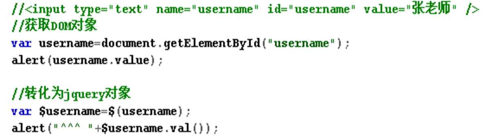
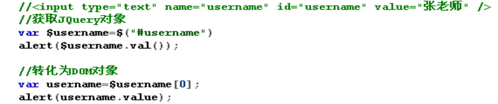
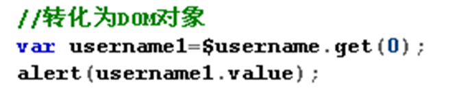

#### 1. 概述

为了简化 JavaScript 的开发, 一些 JavsScript 库诞生了。JavaScript 库封装了很多预定义的对象和实用函数。能帮助使用者建立有高难度交互的 Web2.0 特性的富客户端页面, 并且兼容各大浏览器。

当前流行的 JavaScript 库有：jQuery、MooTools、Prototype、Dojo、YUI、EXT_JS、DWR

jQuery是继prototype之后又一个优秀的Javascript库，是一个由John Resig创建于2006年1月的开源项目。

现在的jQuery团队主要包括核心库、UI和插件等。

jQuery凭借着简洁的语法和跨平台的兼容性，极大地简化了javascript开发人员遍历HTML文档、操作DOM、处理事件、执行动画和开发Ajax的操作。


##### 1.1. jQuery的优势

jQuery的宗旨是——WRITE LESS,DO MORE,写更少的代码,做更多的事情。


轻量级

- jQuery非常轻巧，采用Dean Edwards编写的Packer（http://dean.edwards.name/packer/）压缩后，大小不到30KB。如果使用Min版并且在服务器端启用Gzip压缩后，大小只有18KB。

强大的选择器

- jQuery允许开发者使用从CSS1到CSS3几乎所有的选择器，以及jQuery独创的高级而复杂的选择器。另外还可以加入插件使其支持XPath选择器，甚至开发者可以编写属于自己的选择器。

出色的DOM操作的封装

- jQuery封装了大量常用的DOM操作，使开发者在编写DOM操作相关程序的时候能够得心应手。

可靠的事件处理机制

- 吸收了javascript专家Dean Edwards编写的事件处理函数的精华，使得jQuery在处理事件绑定的时候非常可靠。在预留退路、循序渐进以及非入侵式变成思想方面，jQuery做得非常不错。

完善的Ajax

- 使开发者处理Ajax的时候能够专心处理业务逻辑而无需关心复杂的浏览器兼容性和XMLHttpRequest对象的创建和使用的问题。

不污染顶级变量

- jQuery只建立一个名为jQuery对象，其所有的函数方法都在这个对象之下。

出色的浏览器兼容性

- jQuery修复了一些浏览器之间的差异，使开发者不必在开展项目前建立浏览器兼容库。


#### 2. jQuery对象

jQuery对象就是通过jQuery包装DOM对象后产生的对象。jQuery 对象是 jQuery 独有的。

虽然jQuery对象是包装DOM对象后产生的，但是jQuery无法使用DOM对象的任何方法，同理DOM对象也不能使用jQuery里的方法。乱使用会报错。

约定：如果获取的是 jQuery 对象, 那么要在变量前面加上 $。


##### 2.1. DOM对象转成jQuery对象

对于已经是一个DOM对象，只需要用$()把DOM对象包装起来，就可以获得一个jQuery对象了。$(DOM对象) 转换后就可以使用 jQuery 中的方法了




##### 2.2. jQuery对象转成DOM对象

两种转换方式将一个jQuery对象转换成DOM对象：[index]和.get(index);

- jQuery对象是一个数组对象，可以通过[index]的方法，来得到相应的DOM对象




- jQuery本身提供，通过.get(index)方法，得到相应的DOM对象




#### 3. jQuery选择器

##### 3.1. 基本选择器

是 jQuery 中最常用的选择器, 也是最简单的选择器, 它通过元素 id, class 和标签名来查找 DOM 元素(在网页中 id 只能使用一次, class 允许重复使用)


- #id
    - 用法: $("#myDiv");    返回值  单个元素的组成的集合
    - 说明: 这个就是直接选择html中的id="myDiv"

- Element
    - 用法: $("div")     返回值  集合元素
    - 说明: element的英文翻译过来是”元素”,所以element其实就是html已经定义的标签元素,例如 div, input, a等等.

- class
    - 用法: $(".myClass")      返回值  集合元素
    - 说明: 这个标签是直接选择html代码中class=”myClass”的元素或元素组(因为在同一html页面中class是可以存在多个同样值的).

- `*`
    - 用法: $("*")      返回值  集合元素
    - 说明: 匹配所有元素,多用于结合上下文来搜索

- selector1, selector2, selectorN
    - 用法: $("div,span,p.myClass")    返回值  集合元素
    - 说明: 将每一个选择器匹配到的元素合并后一起返回.你可以指定任意多个选择器, 并将匹配到的元素合并到一个结果内.其中p.myClass是表示匹配元素p class=”myClass”

##### 3.2. 层次选择器

如果想通过 DOM 元素之间的层次关系来获取特定元素, 例如后代元素, 子元素, 相邻元素, 兄弟元素等, 则需要使用层次选择器.

- ancestor descendant
    - 用法: $(”form input”) ;   返回值  集合元素
    - 说明: 在给定的祖先元素下匹配所有后代元素.这个要下面讲的”parent > child”区分开

- parent > child
    - 用法: $(”form > input”) ;    返回值  集合元素
    - 说明: 在给定的父元素下匹配所有子元素.注意:要区分好后代元素与子元素

- prev + next
    - 用法: $(”label + input”) ;   返回值  集合元素
    - 说明: 匹配所有紧接在 prev 元素后的 next 元素

- prev ~ siblings
    - 用法: $(”form ~ input”) ;    返回值  集合元素
    - 说明: 匹配 prev 元素之后的所有 siblings 元素.注意:是匹配之后的元素,不包含该元素在内,并且siblings匹配的是和prev同辈的元素,其后辈元素不被匹配.

> 注意:  (“prev ~ div”) 选择器只能选择 “# prev ” 元素后面的同辈元素; 而 jQuery 中的方法 siblings() 与前后位置无关, 只要是同辈节点就可以选取


##### 3.3. 过滤选择器

**过滤选择器**主要是通过特定的过滤规则来筛选出所需的 DOM 元素, 该选择器**都以 “:” 开头**

按照不同的过滤规则, 过滤选择器可以分为基本过滤, 内容过滤, 可见性过滤, 属性过滤, 子元素过滤和表单对象属性过滤选择器。


###### 3.3.1. 基础过滤选择器

- :first
    - 用法: $(”tr:first”) ;   返回值  单个元素的组成的集合
    - 说明: 匹配找到的第一个元素

- :last
    - 用法: $(”tr:last”)   返回值  集合元素
    - 说明: 匹配找到的最后一个元素.与 :first 相对应.

- :not(selector)
    - 用法: $(”input:not(:checked)”)返回值  集合元素
    - 说明: 去除所有与给定选择器匹配的元素.有点类似于”非”,意思是没有被选中的input(当input的type=”checkbox”).

- :even
    - 用法: $(”tr:even”)   返回值  集合元素
    - 说明: 匹配所有索引值为偶数的元素，从 0 开始计数.js的数组都是从0开始计数的.例如要选择table中的行,因为是从0开始计数,所以table中的第一个tr就为偶数0.

- : odd
    - 用法: $(”tr:odd”) 返回值  集合元素
    - 说明: 匹配所有索引值为奇数的元素,和:even对应,从 0 开始计数.


- :eq(index)
    - 用法: $(”tr:eq(0)”)    返回值  集合元素
    - 说明: 匹配一个给定索引值的元素.eq(0)就是获取第一个tr元素.括号里面的是索引值,不是元素排列数.

- :gt(index)
    - 用法: $(”tr:gt(0)”)    返回值  集合元素
    - 说明: 匹配所有大于给定索引值的元素.

- :lt(index)
    - 用法: $(”tr:lt(2)”)    返回值  集合元素
    - 说明: 匹配所有小于给定索引值的元素.

- :header(固定写法)
    - 用法: $(”:header”).css(”background”, “#EEE”)    返回值  集合元素
    - 说明: 匹配如 h1, h2, h3之类的标题元素.这个是专门用来获取h1,h2这样的标题元素.

- :animated(固定写法)   返回值  集合元素
    - 说明: 匹配所有正在执行动画效果的元素

###### 3.3.2. 内容过滤选择器

内容过滤选择器的过滤规则主要**体现在它所包含的子元素和文本内容上**

- :contains(text)
    - 用法: $(”div:contains(’John’)”)    返回值  集合元素
    - 说明: 匹配包含给定文本的元素.这个选择器比较有用，当我们要选择的不是dom标签元素时,它就派上了用场了,它的作用是查找被标签”围”起来的文本内容是否符合指定的内容的.

- :empty
    - 用法: $(”td:empty”)   返回值  集合元素
    - 说明: 匹配所有不包含子元素或者文本的空元素


- :has(selector)
    - 用法: $(”div:has(p)”).addClass(”test”)    返回值  集合元素
    - 说明: 匹配含有选择器所匹配的元素的元素.这个解释需要好好琢磨,但是一旦看了使用的例子就完全清楚了:给所有包含p元素的div标签加上class=”test”.

- :parent
    - 用法: $(”td:parent”)   返回值  集合元素
    - 说明: **匹配含有子元素或者文本的元素**.注意:这里是”:parent”,可不是”.parent”哦!感觉与上面讲的”:empty”形成反义词.


###### 3.3.3. 可见度过滤选择器

可见度过滤选择器是**根据元素的可见和不可见状态**来选择相应的元素

- :hidden
    - 用法: $(”tr:hidden”)  返回值  集合元素
    - 说明: 匹配所有的不可见元素，input 元素的 type 属性为 “hidden” 的话也会被匹配到.意思是css中display:none和input type=”hidden”的都会被匹配到.同样,要在脑海中彻底分清楚冒号”:”, 点号”.”和逗号”,”的区别.

- :visible
    - 用法: $(”tr:visible”)  返回值  集合元素
    - 说明: 匹配所有的可见元素.


###### 3.3.4. 属性过滤选择器

属性过滤选择器的过滤规则是通过元素的属性来获取相应的元素


- [attribute]
    - 用法: $(”div[id]“) ;  返回值  集合元素
    - 说明: 匹配包含给定属性的元素. 例子中是选取了所有带”id”属性的div标签.

- [attribute=value]
    - 用法: $(”input[name='newsletter']“).attr(”checked”, true);    返回值  集合元素
    - 说明: 匹配给定的属性是某个特定值的元素.例子中选取了所有 name 属性是 newsletter 的 input 元素.

- [attribute!=value]
    - 用法: $(”input[name!='newsletter']“).attr(”checked”, true);    返回值  集合元素
    - 说明: 匹配所有不含有指定的属性，或者属性不等于特定值的元素.此选择器等价于:not([attr=value]),要匹配含有特定属性但不等于特定值的元素,请使用[attr]:not([attr=value]).之前看到的 :not 派上了用场.

- [attribute^=value]
    - 用法: $(”input[name^=‘news’]“)  返回值  集合元素
    - 说明: 匹配给定的属性是以某些值开始的元素.,我们又见到了这几个类似于正则匹配的符号.现在想忘都忘不掉了吧?!


- [attribute$=value]
    - 用法: $(”input[name$=‘letter’]“)  返回值  集合元素
    - 说明: 匹配给定的属性是以某些值结尾的元素.

- [attribute*=value]
    - 用法: $(”input[name*=‘man’]“)   返回值  集合元素
    - 说明: 匹配给定的属性是以包含某些值的元素.

- [attributeFilter1][attributeFilter2][attributeFilterN]
    - 用法: $(”input[id][name$=‘man’]“)  返回值  集合元素
    - 说明: 复合属性选择器,需要同时满足多个条件时使用.又是一个组合,这种情况我们实际使用的时候很常用.这个例子中选择的是所有含有 id 属性,并且它的 name 属性是以 man 结尾的元素.


###### 3.3.5. 子元素过滤选择器

- :nth-child(index/even/odd/equation)
    - 用法: $(”ul li:nth-child(2)”)   返回值  集合元素
    - 说明: 匹配其父元素下的第N个子或奇偶元素.这个选择器和之前说的基础过滤(Basic Filters)中的 eq() 有些类似,不同的地方就是前者是从0开始,后者是从1开始.
- :first-child
    - 用法: $(”ul li:first-child”)    返回值  集合元素
    - 说明: 匹配第一个子元素.’:first’ 只匹配一个元素,而此选择符将为每个父元素匹配一个子元素.这里需要特别点的记忆下区别.
- :last-child
    - 用法: $(”ul li:last-child”)      返回值  集合元素
    - 说明: 匹配最后一个子元素.’:last’只匹配一个元素,而此选择符将为每个父元素匹配一个子元素.
- : only-child
    - 用法: $(”ul li:only-child”)   返回值  集合元素
     - 说明: 如果某个元素是父元素中唯一的子元素,那将会被匹配.如果父元素中含有其他元素,那将不会被匹配.意思就是:只有一个子元素的才会被匹配!


#### 4. 校验插件

参考网站：https://www.runoob.com/jquery/jquery-plugin-validate.html

该站点有详细的函数及校验规则说明

需要了解默认的校验规则有哪些和如何自定义校验规则

```html
<!DOCTYPE html>
<html>

<head>
    <meta charset="UTF-8">
    <meta name="viewport" content="width=device-width, initial-scale=1.0">
    <meta http-equiv="X-UA-Compatible" content="ie=edge">
    <title>Document</title>
</head>

<body>
    <form id="login-form">
        账号：<input type="text" name="uname" required>
        密码：<input type="text" name="pass" required>
        <input type="button" value="登录">
    </form>

    <script src="./js/jquery-validation-1.14.0/lib/jquery-1.9.1.js"></script>
    <script src="./js/jquery-validation-1.14.0/dist/jquery.validate.js"></script>
    <script src="./js/jquery-validation-1.14.0/dist/localization/messages_zh.js"></script>
    <script>
        $("input[type='button']").on("click", function () {

            //获取校验结果
            console.log($("#login-form").valid());
        });
    </script>
</body>

</html>
```

> 备注：Validator 对象有很多方法可以用来引发校验程序或者改变 form 的内容