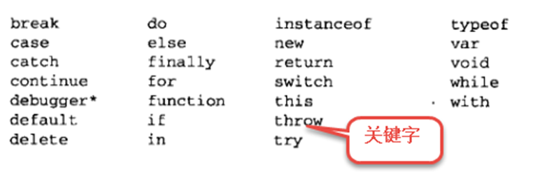

### 1. JavaScript初识

#### 1.1. 历史

1995年5月，网景公司做出决策，未来的网页脚本语言必须"看上去与Java足够相似"，但是比Java简单，使得非专业的网页作者也能很快上手。

他只用10天时间就把Javascript设计出来。

1995.2月 Netscape公司发布LiveScript，后临时改为JavaScript，为了赶上Java的热浪。
欧洲计算机制造商协会（ECMA）英文名称是European Computer Manufacturers Association

1997 年，以JavaScript 1.1 为基础。由来自 Netscape、Sun、微软、Borland 和其他一些对脚本编程感兴趣的公司的程序员组成的 TC39（ECMA的小组） 锤炼出了 ECMA-262，也就是ECMAScript1.0。

1998年6月，ECMAScript 2.0版发布。

1999年12月，ECMAScript 3.0版发布，成为JavaScript的通行标准，得到了广泛支持。

2007年10月，ECMAScript 4.0版草案发布：分歧太大，失败告终。

2009年12月，ECMAScript 5.0版正式发布

**2015年6月17日，ECMAScript 6发布正式版本，即ECMAScript 2015。**

#### 1.2. 今天的JavaScript

2003年之前，JavaScript被认为“牛皮鲜”，用来制作页面上的广告，弹窗、漂浮的广告。什么东西让人烦，什么东西就是JavaScript开发的。所以浏览器就推出了屏蔽广告功能。

2004年JavaScript命运开始改变了，那一年谷歌公司，开始带头使用Ajax技术了，Ajax技术就是JavaScript的一个应用。并且，那时候人们逐渐开始提升用户体验了。


2010年的时候，人们更加了解HTML5技术了，HTML5推出了一个东西叫做Canvas（画布），工程师可以在Canvas上进行游戏制作，利用的就是JavaScript。

2011年，Node.js诞生，使JavaScript能够开发服务器程序了。

今天，JavaScript工程师是绝对的吃香，能够和iOS、Android工程师比肩，毫不逊色的。

现在，公司都流行WebApp，就是用网页技术开发手机应用。什么意思呢？手机系统有iOS、安卓、windows phone。那么公司比如说开发一个“携程网”APP，就需要招聘三队人马，比如iOS工程师10人，安卓工程师10人，windows工程师10人。共30人，工资开销大。并且，如果要改版，要改3个版本。所以，现在公司，都用web技术，用html+css+javascript技术来开发app。好处是不用招聘那么多工程师，只需要几个前端开发工程师即可。并且也易于迭代，就是网页一改变，所有的终端都变了。


#### 1.3. 初识

**JavaScript是一种网页编程技术**，其功能强大，实现简单方便，入门简单，即使是程序设计新手也可以非常快速容易地使用JavaScript进行简单的编程。

**JavaScript就是一种基于对象和事件驱动**，并具有安全性能的脚本语言，脚本语言简单理解就是在客户端的浏览器就可以互动响应处理程序的语言，而不需要服务器的处理和响应，当然JavaScript也可以做到与服务器的交互响应，而相对的服务器语言像asp php jsp等需要将命令上传服务器，由服务器处理后回传处理结果。

**JavaScript可以被嵌入到HTML文件中，不需要经过Web服务器就可以对用户操作作出响应**，使网页更好地与用户交互；在利用客户端个人电脑性能资源的同时，适当减小服务器端的压力，并减少用户等待时间。


#### 1.4. 组成

- ECMAScript：JavaScript的语法标准。

- DOM：JavaScript操作网页上的元素的API

- BOM：JavaScript操作浏览器的部分功能的API


#### 1.5. 特点


简单易用

- 可以使用任何文本编辑工具编写
- 只需要浏览器就可以执行程序

解释执行（解释语言）

- 事先不编译
- 逐行执行
- 无需进行严格的变量声明

基于对象

- 内置大量现成对象，编写少量程序可以完成目标


#### 1.6. JavaScript和ECMAScript的关系

ECMAScript是一种由Ecma国际前身为欧洲计算机制造商协会,英文名称是European Computer Manufacturers Association，制定的标准。

**简单来说ECMAScript不是一门语言，而是一个标准** ， 符合这个标准的比较常见的有：JavaScript、Action Script（Flash中用的语言）。就是说，你JavaScript学完了，Flash中的程序也会写了。


ECMAScript在2015年6月，发布了ECMAScript 6版本，语言的能力更强。但是，浏览器的厂商不能那么快的去追上这个标准。


#### 1.7. 书写位置


- 与css类似，直接嵌入到html页面中

```html
<head>
    <meta charset="UTF-8">
    <script type="text/javascript">
        //书写JS代码
        alert("HelloWorld");
    </script>
</head>
```


- 文件调用：JavaScript代码写到另一个文件当中（其后缀通常为".js"），然后用以下标记把它嵌入到文档中


```html
<head>
    <meta charset="UTF-8">
    <script src="demo.js" type="text/javascript"></script>
</head>
```

> PS：写js代码的时候，分号不能省略

> PS：推荐将JS代码写在html结束标签后边，将多个JS文件合成为一个JS文件

#### 1.8. 输出消息的几种方式

- alert()  在页面弹出一个对话框，早期JS调试使用。

- confirm()  在页面弹出一个对话框, 常配合if判断使用。

- console.log()  将信息输入到控制台，用于js调试。

- prompt() 弹出对话框，用于接收用户输入的信息。

- document.write()在页面输出消息，该写法不仅能输出信息，还能输出标签。

```js
document.write("宝塔镇河妖<br/>小鸡炖蘑菇");
```


#### 1.9. 注释

单行注释   // 注释内容

多行注释  /* 注释内容  */


#### 1.10. 变量

变量定义：   var    自定义名称;

```js
var uname="小黑";
```

> PS： =    为赋值符号，不是我们理解的等号


##### 1.10.1. 命名规范：

- 变量名只能以字符或下划线“_”开头

- 变量可以包含数字、从A至Z的大小字母

- JavaScript严格区分大小写，computer和Computer是两个完全不同的变量

- 禁止使用javascript的保留关键字作为变量名（见下面的保留关键字图）


关键字：JavaScript语言用于程序控制或者执行特定操作的英语单词。




保留字：ECMAScript规范中，预留的某些词汇，以便于以后某个时间会用于关键字。


> PS：我们写的代码起名字的时候不能用跟关键字和保留字重名。不然会报错。

##### 1.10.2. 变量的作用域

块级作用域

- 在其它语言中，任何一对花括号中的语句都属于一个块，在这之中定义的所有变量在代码块外都是不可见的

- JavaScript中没有块级作用域

全局变量

- 定义在script或者不属于某个函数的变量

局部变量

- 定义在函数内部的变量

其他

- 函数内部可以访问到该函数所属的外部作用域的变量(作用域链)

- 不使用var声明的变量是全局变量，不推荐使用。

- 变量退出作用域之后会销毁，全局变量关闭网页或浏览器才会销毁


#### 1.11. 数据类型

变量名  a  和变量名  b  保存的数据是否一样？

```js
var a=1;
var b="1";
```


##### 1.11.1. 简单数据类型

- Number:数字类型

```js
//十进制表示法
var n1=1234;

//十六进制，从0-9，a(A)-f(F)表示数字。以0x开头
var n2=0x1234;

//八进制表示法，0开头，0-7组成
var n3=01234;

```

- String:字符串类型


```js
//凡是用双引号或者单引号引起的都是字符串
var uname="小黑";
var msg='HelloWorld';

```

- Boolean:布尔类型

```js
 //只有两个值一个是true, 一个是false.   实际运算中true=1,false=0
var a=1;
var b=2;

console.log(a==b);
console.log(a>=b);

```


- undefined:变量未初始化

```js
var s1;
// undefined定义了变量，没有给变量赋值，变量在内存中是存在的
console.log(s1);
```

- null：空类型

```js
//变量未引用  值为空   object
var s1=null;

```

##### 1.11.2. 复杂数据类型

复杂数据类型又称为复合数据类型或者引用数据类型

- Object:对象（引用）

- Array:数组


> PS：使用typeof(变量名)可以获取该变量的数据类型


#### 1.12. 运算符

| 运算符 | 描述                                                          |
| :---- | :------------------------------------------------------------ |
| +     | 1. 实现加法运算(数字与数字)2.字符串链接(字符串与字符串或者数字相加) |
| -     | 减法运算                                                      |
| *     | 乘法运算                                                      |
| /     | 除法运算                                                      |
| %     | 获取余数(求模或者称为求余)                                      |
| ()    | 优先级                                                        |
| +=    | a+=b等价于a=a+b                                               |
| -=    | a-=b等价于a=a-b                                               |
| /=    | a`/`=b等价于a=a`/`b                                            |
| ++    | i++等价于 i=i+1                                                |
| --    | i--等价于i=i-1                                                |

> PS：NaN:  Not  a Number      表示不是一个数字，判断是不是一个数字使用：   isNaN(变量名)

> PS：Infinity： 无穷大          例如： var   number=7/0 

逻辑运算符


#### 1.13. 数据类型转换

将数字类型转换为字符串类型

- 隐式类型转换
- 强制类型转换（String(),  变量.tostring()）

将字符串转换为数字类型

- 隐式类型转换
- 强制类型转换(Number(),parseInt(),      parseFloat())

将其他数据类型转换为布尔类型

- 强制类型转换 :Boolean()
- 数字0转换为false


#### 1.14. if语句

由运算符和操作数组成的合法序列称为语句

根据语句执行的流程划分为顺序结构、选择结构和循环结构

写法：

```
If(判断条件)｛

    判断条件成立时执行语句;
｝

```

```
If(判断条件)｛
    判断条件成立时执行语句

｝else{
    判断条件不成立时执行
}
```


实例：

```js
var age=22;

if (age>30){

    document.write("岁数太大了");
}else{
    document.write("年轻有为，有钱途！");
}
```

##### 1.14.1. 案例练习

当点击确定，弹出消息提示"您已退出"     当点击取消  弹出消息“您已取消退出”


接收用户输入一个数字，判断是否是偶数，如果是偶数那么在控制台中将该数字输出，如果不是偶数那么在控制台中提示该数字不是偶数


接收用户输入一个数字，判断当前数字是否在20到70之间，如果在该数字范围内，请将该数字输出，否则提示不在该范围内。

写一个程序接收用户输入的值，该值和随机产生的随机数（0-99  包含0 和99）做比较，如果用户输入的值大于随机数输出：您赢了，否则您输了


##### 1.14.2. if..else嵌套


##### 1.14.3. 案例练习

- 接收用户输入年龄。判断当前年龄所属于哪个间断？

    - 比如：年龄20  所处的阶段为青年

    - 注意：以10岁为一个年龄段

- 接收用户输入的成绩和姓名，每15分为一个档。以50分为起点， 判断当前学生成绩在哪个范围并只给出提示信息（优，良，差，）同时如果成绩正好为90分，还要在控制台中输出当前学生的姓名及提示信息（优，良，差）。

#### 1.15. switch语句

写法

```js
var age=15;

switch(age){

    case 1:
    console.log("现在是1岁");
    case 2:
    console.log("现在是2岁");
    break;
    default:
    console.log("以上情况都不成立");
}
```


> 该语句属于将某个变量所有可能的值进行逐一判断，慎用

> 该语句存在case穿透情况

##### 1.15.1. 案例练习


- 在网页中获取用户输入的成绩信息，每20分算一个等级，不同等级显示不同的评语，在控制台中输出信息。

    - 比如：输入20      弹出消息框成绩20        输入  40   弹出消息框40

- 根据用户输入月份，显示对应的季节（例如：3,4,5为春季）


#### 1.16. 三元运算符

语法：

条件表达式?结果1:结果2

含义：

问号前面的位置是判断的条件，判断结果为boolean型，为true时执行结果1，为false时执行结果2。

##### 1.16.1. 小案例热热身

请用三元运算符完成案例

- 接收用户输入的数字，如果是偶数在页面中提示该数字为偶数，如果是奇数那么提示该数字为奇数
- 写一个程序接收用户输入的值，该值和随机产生的随机数（0-99）做比较，如果用户输入的值大于随机数输出：您赢了，否则您输了
- 当点击确定，弹出消息提示“您已退出”     当点击取消  弹出消息“您已取消退出”


#### 1.17. 多练练总没坏处

一个加油站为了鼓励车主多加油，所以加的多有优惠。

- 92号汽油，每升6元；如果大于等于20升，那么每升5.9；

- 97号汽油，每升7元；如果大于等于30升，那么每升6.95

- 编写JS程序，用户输入自己的汽油编号，然后输入自己加多少升，弹出价格。


首先接收用户输入的用户名，判断该用户名是否是admin,如果不是直接程序终止，如果是那么再次提示让用户输入密码,如果密码是88888,那么提示登录成功，否则提示登录失败。


写一个程序，接收用户输入的三个数字，使用三元运算表达式找出最大值


#### 1.18. while循环

while循环重复执行一段代码，直到某个条件不再满足


语法定义

```
 while(判断条件)
 {
         循环代码
 }

```


#### 1.19. do while循环

do while结构的基本原理和while结构是基本相同的，但是它保证循环体至少被执行一次。因为它是先执行代码，后判断条件

语法定义：

```
do{
      循环代码;
}while(条件)
```


#### 1.20. for 循环


语法

```
for (初始化;条件;增量)
{
    循环代码;
}

```


##### 1.20.1. 案例练习

- 计算1到100的和

- 将1到100之间所有是6的倍数的数字输出到控制台中

- 在页面中打印两行10颗 *

- 在页面中打印一个直角三角形


- 在页面中打印99乘法表


#### 1.21. break语句

有时候在循环体内，需要立即跳出循环或跳过循环体内其余代码而进行下一次循环。这个时候需要   break和continue

break语句是彻底结束当前循环，直接执行循环外后面的代码。格式如下：

```js
while(i<10){
    if(特殊情况){
        break;

    }
    //循环代码
}
```


#### 1.22. continue语句

continue的作用是仅仅跳过本次循环，而整个循环体继续执行。它的格式如下：

```js
while(i<10){
    if(特殊情况){
        continue;
    }
    //循环代码
}
```

##### 1.22.1. 案例练习

- 请将1到100之间所有数字输出，排除是3的倍数的数字

- 接收用户输入的用户名和密码，如果用户名不是admin或者密码不是888，就一直提示用户重新输入，如果用户名和密码都正确，那么程序立马停止（使用while循环做）


#### 1.23. 数组

如果，要保存一个数据，我们可以定义一个变量去保存。那么我要保存100个数据呢？亲我需要定义一百个变量么？


数组变量可以存放多个数据。好比一个团，团里有很多人


##### 1.23.1. 数组定义

```js
var  myarray=new Array();
```


##### 1.23.2. 数组赋值


```js
//创建数组同时赋值
var myarray = new Array(66,80,90,77,59);

//直接输入一个数组(称 "字面量数组")
 var myarray = [66,80,90,77,59];

```

> PS：数组存储的数据可以是任何类型（数字、字符、布尔值等）


##### 1.23.3. 数组遍历

Length属性表示数组的长度，即数组中元素的个数

遍历就是获取组的每一项


```js
for （var I =0; i < arr.length; i++）{
    console.log( arr[ i ] );
}
```


##### 1.23.4. 案例练习

- 1-100之间能被3整除的数值放到数组中

- 求一个数组中的和和平均值

- 求数组中最大值和最小值和其位置

- 将数组中值为0的去掉，剩下的存到新数组

- 反转数组

- 将数组中的数字按照从小到大排序


#### 1.24. 函数(方法)function

通常情况下，函数是完成特定功能的一段代码


作用：

将复杂的事情简单化。将重复使用的代码进行调用


##### 1.24.1. 定义一个函数


函数声明

JavaScript解析器首先会把当前作用域的函数声明提前到整个作用域的最前面。

```js

 function 函数名（）{
    方法体
 }
```

函数表达式

```js
//myFun和f等价
var myFun = function (a,b){
    return a + b;
}
console.log(myFun(6,7));

```

匿名函数

没有命名的函数,一般用在绑定事件的时候

```js
function(){

}
```


##### 1.24.2. 案例练习

- 请写出一个判断一个数是不是偶数的函数

- 请模拟写出一个Math.max(x,y)  的函数


##### 1.24.3. 参数

形参

```js
//a,b是形参，占位用，函数定义时形参无值
function f(a,b){

}
```


实参

```js
/*
x,y实参，有具体的值，会把x,y复制一份给函数内部的a和b，函数内部的值是复制的新值，无法修改外部的x,y
*/
var x= 5,y=6;

f(x,y);
```

JavaScript中的函数相对于其它语言的函数比较灵(特)活(殊)

- 在其它语言中实参个数必须和形参个数一致，但是JavaScript中没有函数签名的概念，实参个数和形参个数可以不相等


##### 1.24.4. 返回值

- 函数程序运行后的结果外部需要使用的时候，我们不能直接给与，需要通过return返回。

- 总结：函数内部，return后面的值就是返回值；

- 作用：函数执行后剩下结果就是返回值。

- 函数执行完毕，会不会留下点儿什么，取决于有没有返回值

> var  temp   =    函数名()    =   该函数的返回值;


JavaScript中的函数比较奇葩

- 如果函数没有显示的使用 return语句 ，那么函数有默认的返回值：undefined

- 如果函数使用 return语句，那么跟再return后面的值，就成了函数的返回值

- 如果函数使用 return语句，但是return后面没有任何值，那么函数的返回值也是：undefined

- 函数使用return语句后，这个函数会在执行完 return 语句之后停止并立即退出，也就是说return后面的所有其他代码都不会再执行。

- 推荐的做法是要么让函数始终都返回一个值，要么永远都不要返回值。


##### 1.24.5. this

- this 引用的是一个对象。对于最外层代码与函数内部的情况，其引用目标是不同的。

- 此外，即使在函数内部，根据函数调用方式的不同，引用对象也会有所不同。需要注意的是，this 引用会根据代码的上下文语境自动改变其引用对象(谁调用this就是谁)。

- 构造函数中的this，始终是new的当前对象


```js
function test() {
console.log(this);
}
//上面的this是window，实际是window调用test()
test();  //window.test();


p1.sayHi();
//sayHi()中的this，是p1，此时是p1调用sayHi()
```

##### 1.24.6. 案例练习

- 翻转数组，返回一个新数组

- 求2个数中的最大值


##### 1.24.7. 回调函数

简单理解：就是函数做为参数。（这样的......）

复杂理解：回调函数就是一个通过函数调用的函数。如果你把函数的指针（地址）作为参数传递给另一个函数，当这个指针被用来调用其所指向的函数时，我们就说这是回调函数。


### 2. JavaScript基础

#### 2.1. JSON

- JavaScript Object Notation（JavaScript对象表示形式）

- JavaScript的子集

JSON和对象字面量的区别

- JSON的属性必须用双引号引号引起来，对象字面量可以省略

- var o = {};  对象字面量

```js
{
    "name" : "zs",
    "age" : 18,
    "sex" : true,
    "sayHi" : function() {
        console.log(this.name);
    }
};

```

如果JSON的格式不标准可能会出错

举例：

```js
var str = "{'name':18}";

//JSON.parse()  把JSON形式的字符串解析成对象,如果传递的参数不是标准的JSON格式的字符串，parse()会出错
console.log(JSON.parse(str));
```


#### 2.2. 对象


生活中的对象，一个车、一个手机

对象具有特征和行为

面向对象和基于对象

- 面向对象：
    - 可以创建自定义的类型、很好的支持继承和多态。面向对象的语言c++/java/c#...
    - 面向对象的特征：封装、继承、多态
    - 万物皆对象：世间的一切事物都可以用对象来描述
- 基于对象：
    - 无法创建自定义的类型、不能很好的支持继承和多态。基于对象的语言JavaScript

##### 2.2.1. 内置对象


##### 2.2.2. Object对象

Object类型，我们也称为一个对象。是JavaScript中的引用数据类型。

它是一种复合值，它将很多值聚合到一起，可以通过名字访问这些值。

对象也可以看做是属性的无序集合，每个属性都是一个名/值对。

对象除了可以创建自有属性，还可以通过从一个名为原型的对象那里继承属性

除了字符串、数字、true、false、null和undefined之外，JS中的值都是对象。

##### 2.2.3. 创建对象

第一种方式

```js
var person=new Object();

person.name='孙悟空';

person.age=18;

```

第二种方式

```js
var person={
    name:"孙悟空",
    age:18
};
```

对象属性的访问

- 对象.属性名

- 对象[‘属性名’]


##### 2.2.4. 构造函数

构造函数是用于生成对象的函数，像之前调用的Object()就是一个构造函数。

```js
//创建一个构造函数
function MyClass(x,y) {
    this.x = x;
    this.y = y;
}
```

调用构造函数：

- 构造函数本身和普通的函数声明形式相同。

- 构造函数通过 new 关键字来调用，new 关键字会新创建一个对象并返回。

- 通过 new关键字调用的构造函数内的 this 引用引用了（被新生成的）对象。


#### 2.3. new关键字

使用new关键字执行一个构造函数时：

- 首先，会先创建一个空的对象。

- 然后，会执行相应的构造函数。构造函数中的this将会引用这个新对象

- 最后，将对象作为执行结果返回。

构造函数总是由new关键字调用。

构造函数和普通函数的区别就在于调用方式的不同。

任何函数都可以通过new来调用，所以函数都可以是构造函数。

在开发中，通常会区分用于执行的函数和构造函数。

构造函数的首字母要大写


#### 2.4. 属性的访问

在对象中保存的数据或者说是变量，我们称为是一个对象的属性。

读取对象的属性有两种方式：

- 对象.属性名
- 对象['属性名']

修改属性值也很简单：

- 对象.属性名 = 属性值

删除属性

- delete 对象.属性名

constructor

- 每个对象中都有一个constructor属性，它引用了当前对象的构造函数。


#### 2.5. 原型继承

JS是一门面向对象的语言，而且它还是一个基于原型的面向对象的语言。

所谓的原型实际上指的是，在构造函数中存在着一个名为原型的(prototype)对象，这个对象中保存着一些属性，凡是通过该构造函数创建的对象都可以访问存在于原型中的属性。

最典型的原型中的属性就是toString()函数，实际上我们的对象中并没有定义这个函数，但是却可以调用，那是因为这个函数存在于Object对应的原型中。


##### 2.5.1. 设置原型

原型就是一个对象，和其他对象没有任何区别，可以通过构造函数来获取原型对象。

- 构造函数. prototype

和其他对象一样我们可以添加修改删除原型中的属性，也可以修改原型对象的引用。

需要注意的是prototype属性只存在于函数对象中，其他对象是没有prototype属性的。

每一个对象都有原型，包括原型对象也有原型。特殊的是Object的原型对象没有原型


##### 2.5.2. 获取原型对象的方法


除了可以通过构造函数获取原型对象以外，还可以通过具体的对象来获取原型对象。

- Object.getPrototypeOf(对象)
- 对象.__proto__
- 对象. constructor.prototype

需要注意的是，我们可以获取到Object的原型对象，也可以对它的属性进行操作，但是我们不能修改Object原型对象的引用。

##### 2.5.3. 原型链

基于我们上边所说的，每个对象都有原型对象，原型对象也有原型对象。

由此，我们的对象，和对象的原型，以及原型的原型，就构成了一个原型链。

比如这么一个对象：

```js
var mc = new MyClass(123,456);
```

- 这个对象本身，原型MyClass.proprototype原型对象的原型对象是Object，Object对象还有其原型。这组对象就构成了一个原型链。

- 这个链的次序是：mc对象、mc对象原型、原型的原型（Object）、Object的原型

当从一个对象中获取属性时，会首先从当前对象中查找，如果没有则顺着向上查找原型对象，直到找到Object对象的原型位置，找到则返回，找不到则返回undefined

#### 2.6. instanceof

之前学习基本数据类型时我们学习了typeof用来检查一个变量的类型。

但是typeof对于对象来说却不是那么好用，因为任何对象使用typeof都会返回Object。而我们想要获取的是对象的具体类型。

这时就需要使用instanceof运算符了，它主要用来检查一个对象的具体类型。

语法

- var result = 变量 instanceof 类型

#### 2.7. BOM

ECMAScript无疑是JavaScript的核心，但是要想在浏览器中使用JavaScript，那么BOM（浏览器对象模型）才是真正的核心。

BOM 提供了很多对象，用于访问浏览器的功能，这些功能与任何网页内容无关。BOM将浏览器中的各个部分转换成了一个一个的对象，我们通过修改这些对象的属性，调用他们的方法，从而控制浏览器的各种行为。

##### 2.7.1. Window对象

window对象是BOM的核心，它表示一个浏览器的实例。在浏览器中我们可以通过window对象来访问操作浏览器，同时window也是作为全局对象存在的。

全局作用域：

- window对象是浏览器中的全局对象，因此所有在全局作用域中声明的变量、对象、函数都会变成window对象的属性和方法。

- 浏览器中提供了四个属性用来确定窗口的大小：

    - 网页窗口的大小：innerWidth、innerHeight
    - 浏览器本身的尺寸：outerWidth、outerHeight

使用 window.open() 方法既可以导航到一个特定的 URL，也可以打开一个新的浏览器窗口。这个方法需要四个参数：

- 需要加载的url地址

- 窗口的目标

- 一个特性的字符串

- 是否创建新的历史记录

超时调用：超过一定时间以后执行指定函数

setTimeout()

需要两个参数：

- 要执行的内容

-  超过的时间

取消超时调用：clearTimeout()

> 超时调用都是在全局作用域中执行的

间歇调用：每隔一段时间执行指定代码

setInterval()

需要两个参数

- 要执行的代码

- 间隔的时间

取消间隔调用：clearInterval()


##### 2.7.2. Location对象

location对象提供了与当前窗口中加载的文档有关的信息，还提供了一些导航功能。

href属性：

- href属性可以获取或修改当前页面的完整的URL地址，使浏览器跳转到指定页面。


assign() 方法

- 所用和href一样，使浏览器跳转页面，新地址错误参数传递到assign ()方法中

replace()方法

- 功能一样，只不过使用replace方法跳转地址不会体现到历史记录中。

reload() 方法

- 用于强制刷新当前页面


##### 2.7.3. Navigator对象


navigator 对象包含了浏览器的版本、浏览器所支持的插件、浏览器所使用的语言等各种与浏览器相关的信息。我们有时会使用navigator的userAgent属性来检查用户浏览器的版本。


##### 2.7.4. Screen对象


screen 对象基本上只用来表明客户端的能力，其中包括浏览器窗口外部的显示器的信息，如像素宽度和高度等。该对象作用不大，我们一般不太使用。


##### 2.7.5. History对象

history 对象保存着用户上网的历史记录，从窗口被打开的那一刻算起。

go() 方法可以在用户的历史记录中任意跳转，可以向后也可以向前。


向后跳转：back()

向前跳转：forward()

##### 2.7.6. Document


document对象也是window的一个属性，这个对象代表的是整个网页的文档对象。

我们对网页的大部分操作都需要以document对象作为起点。

#### 2.8. DOM

DOM，全称Document Object Model文档对象模型。

JS中通过DOM来对HTML文档进行操作。只要理解了DOM就可以随心所欲的操作WEB页面。

文档

- 文档表示的就是整个的HTML网页文档

对象

- 对象表示将网页中的每一个部分都转换为了一个对象。

模型

- 使用模型来表示对象之间的关系，这样方便我们获取对象。


##### 2.8.1. 节点

节点Node，是构成我们网页的最基本的组成部分，网页中的每一个部分都可以称为是一个节点。比如：html标签、属性、文本、注释、整个文档等都是一个节点。

虽然都是节点，但是实际上他们的具体类型是不同的。比如：标签我们称为元素节点、属性称为属性节点、文本称为文本节点、文档称为文档节点。节点的类型不同，属性和方法也都不尽相同。

常用节点分为四类

- 文档节点：整个HTML文档

- 元素节点：HTML文档中的HTML标签

- 属性节点：元素的属性

- 文本节点：HTML标签中的文本内容


##### 2.8.2. 节点属性


**文档节点(document)**

代表的是整个HTML文档，网页中的所有节点都是它的子节点。document对象作为window对象的属性存在的，我们不用获取可以直接使用。

通过该对象我们可以在整个文档访问内查找节点对象，并可以通过该对象创建各种节点对象。

**元素节点(Element)**

HTML中的各种标签都是元素节点，这也是我们最常用的一个节点。浏览器会将页面中所有的标签都转换为一个元素节点，我们可以通过document的方法来获取元素节点。比如：

```js
//根据id属性值获取一个元素节点对象。
document.getElementById()
```

**文本节点(Text)**

文本节点表示的是HTML标签以外的文本内容，任意非HTML的文本都是文本节点。它包括可以字面解释的纯文本内容。

文本节点一般是作为元素节点的子节点存在的。获取文本节点时，一般先要获取元素节点。在通过元素节点获取文本节点。例如：

- 元素节点.firstChild;

- 获取元素节点的第一个子节点，一般为文本节点

**属性节点**

属性节点表示的是标签中的一个一个的属性，这里要注意的是属性节点并非是元素节点的子节点，而是元素节点的一部分。

可以通过元素节点来获取指定的属性节点。例如：元素节点.getAttributeNode("属性名");

> 注意：我们一般不使用属性节点。

##### 2.8.3. 获取元素节点

通过document对象调用

```js
//通过id属性获取一个元素节点对象
document.getElementById();

//通过标签名获取一组元素节点对象
document.getElementsByTagName();

//通过name属性获取一组元素节点对象

document.getElementsByName();


```

通过具体的元素节点调用

```js
//返回当前节点的指定标签名后代节点
var div=document.getElementsByTagName("div");

//属性，表示当前节点的所有子节点
var nodes=div.childNodes;

//属性，表示当前节点的第一个子节点
var fnode=div.firstChild;

//属性，表示当前节点的最后一个子节点
var lnode=div.lastChild;

//属性，表示当前节点的父节点
var pnode=div.parentNode;

//属性，表示当前节点的前一个兄弟节点
var prenode=div.previousSibling;

//属性，表示当前节点的后一个兄弟节点
var nnode=div.nextSibling;

```


##### 2.8.4. 元素节点的属性

获取，元素对象.属性名

```js
var element=document.getElementById("mydiv");
//获取节点属性
element.value

element.id

element.className

```

设置，元素对象.属性名=新的值

```js
var element=document.getElementById("mydiv");
//设置节点属性
element.value ="hello";
element.id = "id01";
element.className = "newClass";

```

##### 2.8.5. 其他属性

nodeValue

- 文本节点可以通过nodeValue属性获取和设置文本节点的内容

innerHTML

- 元素节点通过该属性获取和设置标签内部的html代码

##### 2.8.6. 使用CSS选择器进行查询

querySelector()

querySelectorAll()

这两个方法都是用document对象来调用，两个方法使用相同，都是传递一个选择器字符串作为参数，方法会自动根据选择器字符串去网页中查找元素。

不同的地方是querySelector()只会返回找到的第一个元素，而querySelectorAll()会返回所有符合条件的元素。

##### 2.8.7. 节点的修改

创建节点：document.createElement(标签名)

删除节点：父节点.removeChild(子节点)

替换节点：父节点.replaceChild(新节点, 旧节点)

插入节点：

- 父节点.appendChild(子节点)

- 父节点.insertBefore(新节点 , 旧节点)


#### 2.9. 事件

就是文档或浏览器窗口中发生的一些特定的交互瞬间。

JavaScript 与 HTML 之间的交互是通过事件实现的。对于 Web 应用来说，有下面这些代表性的事件：点击某个元素、将鼠标移动至某个元素上方、按下键盘上某个键，等等。

我们通过为指定事件绑定回调函数的形式来处理事件，当指定事件触发以后我们的回调函数就会被调用，这样我们的页面就可以完成和用户的交互了。

##### 2.9.1. 事件处理程序

我们可以通过两种方式为一个元素绑定事件处理程序：

- 通过HTML元素指定事件属性来绑定
- 通过DOM对象指定的属性来绑定

这两种方式都是我们日常用的比较多的，但是更推荐使用第二种方式。还有一种方式比较特殊我们称为设置事件监听器。使用如下方式：

- 元素对象.addEventListener()

**通过HTML标签的属性设置**

通过HTML属性来绑定事件处理程序是最简单的方式。`<button onclick="alert('hello');alert('world')">按钮</button>`

这种方式当我们点击按钮以后，onclick属性中对应的JS代码将会执行，也就是点击按钮以后，页面中会弹出两个提示框。这种方式我们直接将代码编写到了onclick属性中，可以编写多行js代码，当然也可以事先在外部定义好函数。

这种方式的优点在于，设定步骤非常简单，并且能够确保事件处理程序会在载入时被设定。如果在函数的最后return false则会取消元素的默认行为

**通过DOM对象的属性绑定**

上面的写法虽然简单，但却将JS和HTML的代码编写到了一起，并不推荐使用，我们更推荐如下的写法：

```js
var btn = document.getElementById('btn');

btn.onclick = function(){
    alert("hello");
};
```
这种写法将HTML代码和JS写在不同的位置，维护起来更加容易。


##### 2.9.2. 事件监听器

前边两种方式都可以绑定事件处理程序，但是它们都有一个缺点就是都只能绑定一个程序，而不能为一个事件绑定多个程序。这是我们就可以使用addEventListener()来处理，这个方法需要两个参数：一个是事件字符串，一个是响应函数。

```js
btn.addEventListener('click' , function(){
    alert("hello");
});
```
但是要注意的是ie8以下的浏览器是不支持上边的方法的，需要使用attachEvent代替。也可以使用removeEventListener()和detachEvent()移除事件。


**事件处理中的this**

在事件处理程序内的 this 所引用的对象即是设定了该事件处理程序的元素。也就是事件是给那个对象绑定的this就是哪个对象。


##### 2.9.3. 事件对象

在DOM对象上的某个事件被触发时，会产生一个事件对象Event，这个对象中包含着所有事件有关的信息。包括导致事件的元素、事件的类型以及其他与特定事件相关的信息。例如，鼠标操作导致的事件对象中，会包含鼠标位置的信息，而键盘操作导致的事件对象中，会包含与按下的键有关的信息。所有浏览器都支持 event对象，但支持方式不同。


DOM标准的浏览器会将一个event对象传入到事件的处理程序当中。无论事件处理程序是什么都会传入一个event对象。可以通过这种方式获取：

```js
btn.onclick = function(event){
    alert(event.type);
};
```

Event对象包含与创建它的特定事件有关的属性和方法。触发的事件类型不一样，可用的属性和方法也不一样。

Event对象的通用属性/方法


##### 2.9.4. IE中的事件对象

与访问 DOM 中的 event 对象不同，要访问 IE 中的 event 对象有几种不同的方式，取决于指定事件处理程序的方法。

在IE中event对象作为window对象的属性存在的，可以使用window.event来获取event对象。在使用attachEvent()的情况下，也会在处理程序中传递一个event对象，也可以按照前边的方式使用。

Event对象的通用属性/方法（IE）


##### 2.9.5. 事件的三个阶段

1、事件执行的三个阶段依次为：事件捕获、执行当前点击的元素、事件冒泡

```html

    <!-- 当我们给这三个元素绑定事件时，会依次从内到外执行事件，这种情况称为事件冒泡 -->
    <div id="div3">
        <div id="div2">
            <div id="div1">最内侧的DIV</div>
        </div>
    </div>

    <script type="text/javascript">
        var div1=document.getElementById("div1");
        //第三个参数的含义为产生事件冒泡，如果值为true则为产生事件捕获
        div.addEventListener("click",function(){},false)
    </script>


```

> 给某个元素绑定事件(onclick)没有办法产生捕获，只能实现事件冒泡

2、事件委托：当前处理事件的对象无法处理或者不进行处理，将事件的处理交由其他对象对象来处理事件


```html

<ul id="ul">
    <li>事件委托</li>
    <li>事件委托</li>
    <li>事件委托</li>
</ul>

<script type="text/javascript">
    var div1=document.getElementById("ul");
    //第三个参数的含义为产生事件冒泡，如果值为true则为产生事件捕获
    ul.onclick=function(e){

        //e为事件对象，当事件发生时可以通过该对象获取一些和事件相关的数据
        //e.target 为真正出发事件的对象(可以理解为事件源)

        e.target.style.color="red";
    }
</script>

```

##### 2.9.6. 事件的触发

事件的发生主要是由用户操作引起的。比如mousemove这个事件就是由于用户移动鼠标引起的，在鼠标指针移动的过程中该事件会持续发生。

当指定事件被触发时，浏览器就会调用对应的函数去响应事件，一般情况下事件没触发一次，函数就会执行一次。因此设置鼠标移动的事件可能会影响到鼠标的移动速度。
所以设置该类事件时一定要谨慎。


##### 2.9.7. 事件的传播

关于事件传播网景和微软的不同理解

- 微软公司认为事件是由内向外传播，也就是当事件触发时，应该先触发当前元素上的事件然后依次向祖先元素传播

- 网景公司认为事件是由外向内传播，也就是当事件触发时，应该先触发最顶层的祖先元素然后一直 到当前元素

- W3C综合了两个公司的方案将事件分为三个阶段

- 捕获阶段
    - 在捕获阶段时，从最外层的祖先元素向目标元素进行事件捕获，但是默认不会触发事件

- 目标阶段
    - 事件捕获到目标元素，捕获结束开始在目标元素上触发事件

- 事件冒泡
    - 事件从目标元素向祖先元素传递，依次触发祖先元素的事件

> - 注意：如果希望在捕获阶段就触发事件，可以将addEventListener的第三个参数设置为true
> - IE8及以下版本不支持事件捕获

在网页中标签与标签之间是有嵌套关系的，比如这样一个页面：

```html
<html>
    <body>
        <div id="foo">
            <button id="bar">sample</button>
        </div>
    </body>
</html>
```
如果这时用户点击了sample按钮，则会以该按钮作为事件目标触发一次点击事件。这时，事件的处理将会分为捕获阶段、目标阶段、事件冒泡这三个阶段。

事件传播流程


捕获阶段：这一阶段会从window对象开始向下一直遍历到目标对象，如果发现有对象绑定了响应事件则做相应的处理。

目标阶段：这一阶段已经遍历结束，则会执行目标对象上绑定的响应函数。

事件冒泡阶段

这一阶段，事件的传播方式和捕获阶段正好相反，会从事件目标一直向上遍历，直至window对象结束，这时对象上绑定的响应函数也会执行。


##### 2.9.8. 取消事件传播

我们可以使用event对象的两个方法完成：

- stopPropagation()

- stopImmediatePropagation()

取消默认行为：

- preventDefault()

