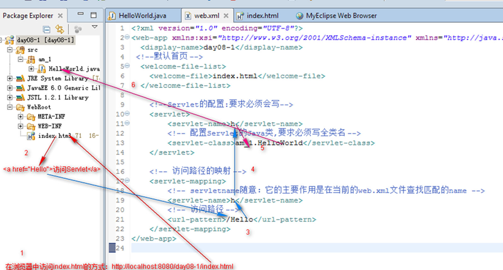
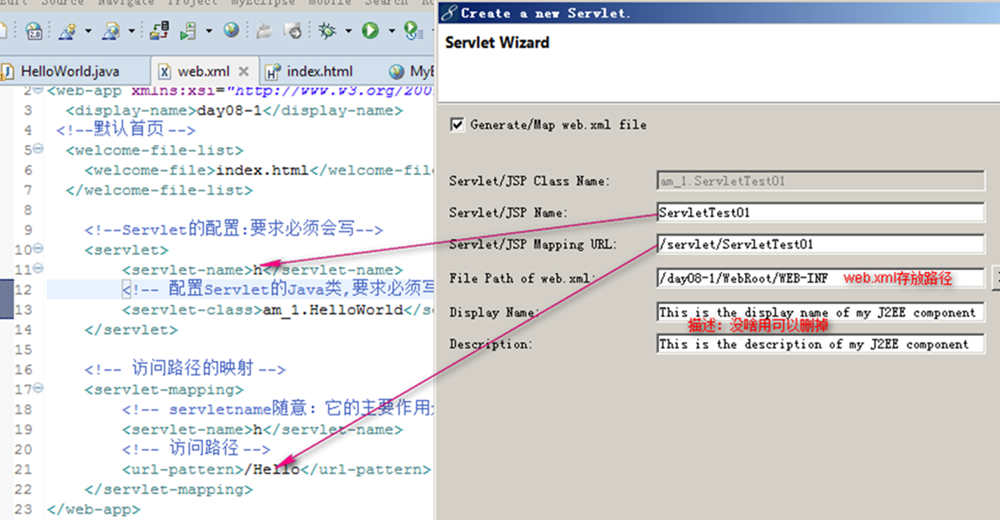
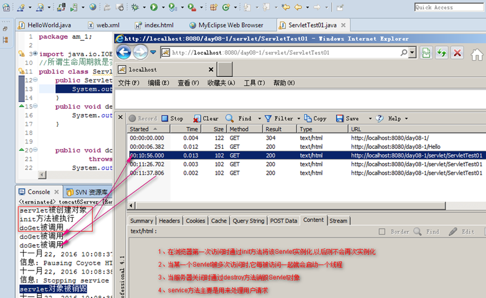
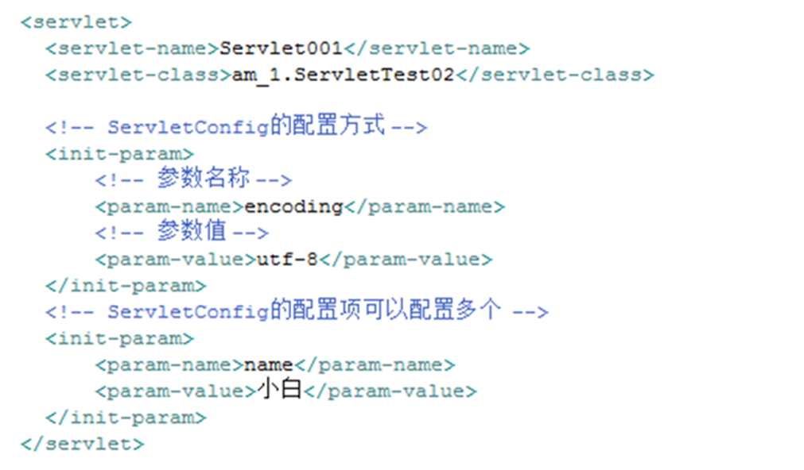
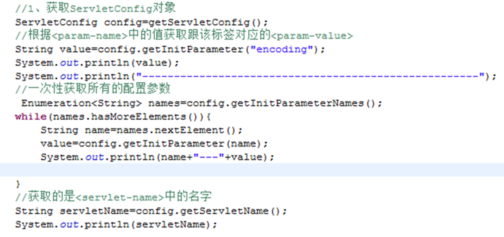
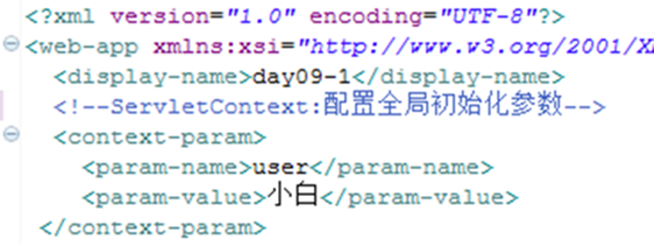
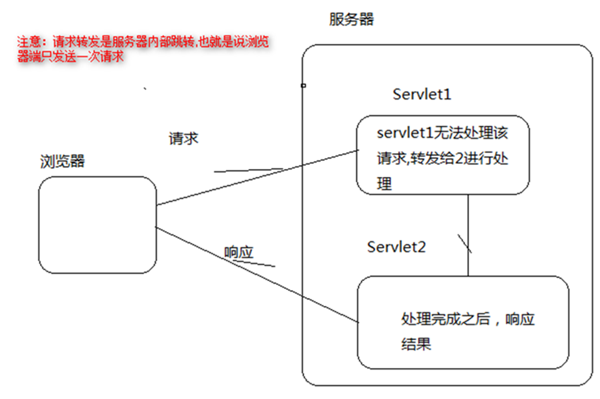
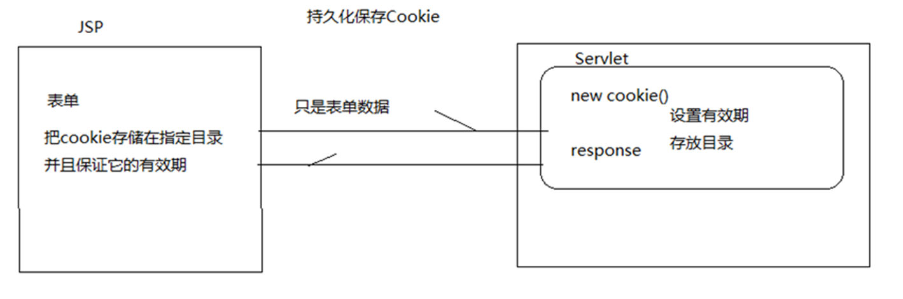

### 1. WEB编程-Servlet详解

Servlet是sun公司提供的一门用于开发动态web资源的技术

Servlet技术基于Request-Response编程模型

Sun公司在其API中提供了一个servlet接口，用户若想要开发一个动态web资源，需要完成以下2个步骤：

- 编写一个Java类，实现servlet接口

- 把开发好的Java类部署到web服务器中

Servlet其实说白了就是Java代码,只是它的运行在服务器端


#### 1.1. HelloWorld案例

##### 1.1.1. 访问流程




##### 1.1.2. 使用菜单创建Servlet



#### 1.2. Servlet生命周期

##### 1.2.1. 流程图



##### 1.2.2. 注意事项

- init()方法:服务器调用该方法初始化Servlet

- service()方法:初始化完毕，服务器调用该方法响应客户的请求

- destroy()方法:服务器调用该方法消灭servlet对象

- init()方法只在Servlet第一次被请求加载的时候被调用一次，当有客户再请求Servlet服务时，Web服务器将启动一个新的线程，在该线程中调用service方法响应客户的请求

- Servlet是线程不安全的,所以尽量避免在Servlet中创建全局变量

#### 1.3. Servlet的体系结构

简单的体系结构

- MyServlet--->javax.servlet.http.HttpServlet--->javax.servlet.GenericServlet--->Servlet

HttpServlet是带有http协议的Servlet

GenericServlet是不带有协议的Servlet

Servlet接口SUN公司提供Servlet规范


#### 1.4. Servlet中的常用对象


##### 1.4.1. ServletConfig对象

javax.servlet.GenericServlet中init方法：

```java
public void init(ServletConfig config) throws ServletException
```

我们自己的servlet中的init方法

```java
public void init() throws ServletException
```

**概述**


在Servlet的配置文件中，可以使用一个或多个`<init-param>`标签为servlet配置一些初始化参数。

当servlet配置了初始化参数后，web容器在创建servlet实例对象时，会自动将这些初始化参数封装到ServletConfig对象中，并在调用servlet的init方法时，将ServletConfig对象传递给servlet。进而，程序员通过ServletConfig对象就可以得到当前servlet的初始化参数信息。


ServletConfig 配置参数 相当于当前Servlet 局部变量，无法被其它Servlet访问的

**配置方式**



**获取配置参数:ServletConfig可以为某个Servlet提供一个初始化的配置参数**




##### 1.4.2. ServletContext

概述

服务器在启动时，它会为每个WEB应用程序(工程)都创建一个对应的ServletContext对象，它代表当前web应用。

由于一个WEB应用中的所有Servlet共享同一个ServletContext对象，因此Servlet对象之间可以通过ServletContext对象来实现通讯


域对象

域：范围,域对象指在一定范围内生效的对象

特征：所有的域对象都可以存(set)、取(get)、删除(remove)数据

ServletContext是四大域对象之一,它的作用范围是当前的WEB应用


Context的主要作用

- 获取WEB应用的全局初始化参数:通过在web.xml中进行配置




对应的方法

```java

public java.util.Enumeration getInitParameterNames()

public java.lang.String getInitParameter(java.lang.String name)
```

##### 1.4.3. 通过ServletContext对象实现数据共享

- 因为它本身是域对象,作用范围是整个的WEB应用,也就是说所有的Servlet都可以使用同一个对象

方法总结：

```java
//向域中存入数据
public void setAttribute(java.lang.String name,java.lang.Object object)

//从域中根据名字删除数据
public void removeAttribute(java.lang.String name)

//根据指定的名字获取对应的值
public java.lang.Object getAttribute(java.lang.String name)

//获取域中所有的名字
public java.util.Enumeration getAttributeNames()

```

##### 1.4.4. 利用ServletContext对象读取资源文件

方法总结

```java
//D:\Tomcat64\apache-tomcat-6.0.37\webapps\day09-1\
String path1=getServletContext().getRealPath("/");

//jndi:/localhost/day09-1/
System.out.println(getServletContext().getResource("/"));

//【/】表示工程的根目录
getServletContext().getResourceAsStream("/");

```


##### 1.4.5. HttpServletRequest(请求)

概述

- Request对象它携带了所有客户端信息的一个对象,服务器端如果想获取客户端请求信息的话就使用该对象

- 它是一个域对象,作用范围是一次请求,也就是说request每次请求都是一个新的对象

> 注意：请求信息包括两部分，在服务器端通过request对象能够获取请求头和请求正文


主要作用

- 获取请求头的信息

```java
//根据头名称获取值
public java.lang.String getHeader(java.lang.String name)

//返回包含指定请求消息头的所有值。
public java.util.Enumeration getHeaders(java.lang.String name)

//获取所有请求的名称
public java.util.Enumeration getHeaderNames()

//获取一个指定的请求消息头的整数值。
public int getIntHeader(java.lang.String name)
```

- 获取资源路径

```java
//【/day09-1/servlet/ServletDemo1】获取请求的路径,但是不包含主机部分【http://localhost:8080/】
System.out.println(request.getRequestURI());

//【/servlet/ServletDemo1】获取的是  <url-pattern>/servlet/ServletDemo1</url-pattern>
System.out.println(request.getServletPath());

//【/day09-1】获取当前的应用(工程)名称
System.out.println(request.getContextPath());

```


- 域对象的传值

```java

//向域中存入数据
public void setAttribute(java.lang.String name,java.lang.Object object)

//从域中根据名字删除数据
public void removeAttribute(java.lang.String name)

//根据指定的名字获取对应的值
public java.lang.Object getAttribute(java.lang.String name)

//获取域中所有的名字
public java.util.Enumeration getAttributeNames()

```


- **请求转发**




```java
//定位一个文件
public RequestDispatcher getRequestDispatcher(java.lang.String path)

//将请求转向之前指定文件
public void forward(ServletRequest request,ServletResponse response)
```

> 在服务器上将一个请求从一个servlet转到另一个资源 (servlet, JSP文件， 或HTML文件)

> 浏览器端只发送一次请求,而服务器内部实现了多次的跳转


- **获取请求参数**


    - 数据的请求格式：POST/GET

    - 提交的方法

    - http://localhost:8080/工程名/资源名?参数名1=参数值1&参数名2=参数值2

    - 除了表单中的数据提交可以是post外其他的任何提交方式都是get

```java
//根据key获取与之对应的value，如果提交的是表单,那么key表示是标签的name属性值
public java.lang.String getParameter(java.lang.String name)

//获取所有提交的参数名称
public java.util.Enumeration getParameterNames()

//获取指定key的多个value
public java.lang.String[] getParameterValues(java.lang.String name)
```

获取中文的请求参数(中文乱码)

提交方式是post

```java
//设置提交参数的编码格式，只对提交方式是post可以解决中文乱码
request.setCharacterEncoding("utf-8");

```

提交方式是get

```java
String str=request.getParameter("a");
//如果提交方式是get并且其中有中文,那么需要进行转码操作
//ISO-8859-1服务器的默认编码，我们自己工程编码utf-8
String a=new String(str.getBytes("ISO-8859-1"),"utf-8");

```

> 注意：转码过程中容易丢失字符,所以尽量做到编码统一,减少转码次数

##### 1.4.6. HttpServletResponse(响应)

概述

- HttpServletResponse包含了所有响应的信息

- 该对象也是每一次响应都是一个新的对象

> 注意：响应信息包含状态码、响应头、响应正文,头信息全部由浏览器解析执行,不会在页面上显示

主要作用

- 重定向
    - 一个web资源收到客户端请求后，通知客户端去访问另外一个web资源，这称之为请求重定向
    - 实现方式

```java
//重定向
response.setStatus(302);

//成功则转向main.html
response.sendRedirect(request.getContextPath()+"/main.html");

```

- 设置响应内容

```java
//只是设置响应回去的内容是utf-8的编码格式
//response.setCharacterEncoding("utf-8");
//通知浏览器使用utf-8的编码格式进行我们响应内容的解析
response.setContentType("text/html;charset=utf-8");
//在页面上显示登录结果
//获取打印流对象
PrintWriter pw=response.getWriter();
pw.write("<h3 style='color:red;'>登录成功</h3>");
pw.flush();
pw.close();

```

- 设置头信息

```java
//通过控制头,实现定时跳转
response.setHeader("refresh", "3; url=http://www.baidu.com");

```

#### 1.5. 会话

##### 1.5.1. Cookie

- Cookie是客户端技术,把用户的数据写给用户的浏览器。

- 一个WEB站点可以给一个WEB浏览器发送多个Cookie

- 浏览器一般只允许存放300个Cookie，每个站点最多存放20个Cookie，每个Cookie的大小限制为4KB。

- 如果创建了一个cookie，并将他发送到浏览器，默认情况下它是一个会话级别的cookie（即存储在浏览器的内存中），用户退出浏览器之后即被删除。若希望浏览器将该cookie存储在磁盘上，则需要使用maxAge，并给出一个以秒为单位的时间

- 删除持久cookie，可以将cookie最大时效设为0，注意，删除cookie时，path必须一致，否则不会删除

- -1代表的是浏览器关闭后失效.


##### 1.5.2. Session(域对象)

**Session是服务器端技术，把用户的数据写到用户独占的session中（服务器端）。**

服务器可以为每个用户浏览器创建一个会话对象

一个浏览器独占一个session对象

**Session对象由服务器创建**，开发人员可以调用request对象的getSession方法得到session对象。


##### 1.5.3. Session对象如何创建以及如何保证唯一：request.getSession();

第一次访问：先判断有没有JSESSIONID=4668F417CDE02D21C98FF803BD235B7B

- 没有：创建session对象,同时服务器做出响应时,将该对象的JSESSIONID携带浏览器端

第二次访问：先判断有没有JSESSIONID=4668F417CDE02D21C98FF803BD235B7B

- 有：直接获取这个对象,注意这个时候不会再重新创建

##### 1.5.4. 生命周期

Cookie

- 该对象可以直接new

- 默认情况下浏览器关闭,就会销毁

- 如果设置cookie的最大存活时间cookie.setMaxAge(时间),需要单独将它的存活时间清零cookie.setMaxAge(0)

Session

- 浏览器第一次访问服务器(Servlet),并且该Servlet中调用request.getSession()方法时,由服务器创建Session对象

- 对象是当服务器关闭时才会销毁

#### 1.6. 会话实例

##### 1.6.1. 保存账号密码一周(cookie)

流程图




**JSP**

```jsp

<body>
	<%
		Cookie cookies[]=request.getCookies();
		Cookie uCookie=CookieUtils.getCookie("user", cookies);
		Cookie pwdCookie=CookieUtils.getCookie("pwd", cookies);
		Cookie saveCookie=CookieUtils.getCookie("save", cookies);

		//三目运算符
		String user=uCookie!=null?uCookie.getValue():"";
		String passwrod=uCookie!=null?uCookie.getValue():"";
		String save=uCookie!=null?uCookie.getValue():"";
		String checked=!("".equals(save))?"checked":"";

	%>
	<!-- 数据回显 -->
		<form action="servlet/ServletTest02" method="post">
			账号：<input type="text" name="username"  value="<%=user%>"/><br/>
			密码：<input type="password" name="password" value="<%=passwrod%>"/><br/>
			<input type="checkbox" name="save" <%=checked%>>记住账号密码<br/>
			<input type="submit" value="登录" />
		</form>
</body>

```

**Servlet**

```java
public void doPost(HttpServletRequest request, HttpServletResponse response)
			throws ServletException, IOException {
		//设置接收参数的编码
		request.setCharacterEncoding("utf-8");
		//获取提交参数
		String userName=request.getParameter("username");
		String password=request.getParameter("password");
		String save=request.getParameter("save");
		System.out.println(userName+","+password+","+save);
		//判断账号密码是否正确,多选框是否选择
		if("admin".equals(userName)&&"123456".equals(password)&&save.equals("on")){
			//创建一个Cookie,绑定账号密码
			Cookie userCookie=new Cookie("user", "admin");
			Cookie pCookie=new Cookie("pwd", "123456");
			Cookie sCookie=new Cookie("save", "on");
			//设置cookie的最长存活时间(有效期)
			userCookie.setMaxAge(1000*60*60*24);
			pCookie.setMaxAge(1000*60*60*24);
			sCookie.setMaxAge(1000*60*60*24);
			//设置存储路径
			userCookie.setPath("/");
			pCookie.setPath("/");
			sCookie.setPath("/");
			//响应,将之前的Cookie对象携带到浏览器端,存储在的指定的路径中
			response.addCookie(userCookie);
			response.addCookie(pCookie);
			response.addCookie(sCookie);

		}

}

```

**CookieUtils**


```java
public static Cookie getCookie(String name,Cookie cookies[]){
		if(cookies==null||cookies.length<=0){
			return null;
		}
		//如果上面没有终止那么表示cookie数组中有东西
		for(Cookie ck:cookies){
			ck.setPath(ck.getPath());
			//输出cookie的值
			System.out.println(ck.getName()+":::"+ck.getValue());
			if(ck.getName().equals(name)){
				return ck;
			}
		}
		return null;
}

```

##### 1.6.2. 购物车功能(seesion)

**商品列表**

```html
<table border="1px" cellpadding="0px" cellspacing="0px">
  			<tr>
  				<td>编号</td>
  				<td>名称</td>
  				<td>价格</td>
  				<td>操作</td>
  			</tr>

		<%
			Map<String,Product> map=(Map<String,Product>)application.getAttribute("products");
			//遍历map
			Set<String> keys=map.keySet();
			Iterator<String> it=keys.iterator();
			while(it.hasNext()){
				Product product=map.get(it.next());
				%>
				<tr>
					<td><%=product.getId()%></td>
					<td><%=product.getName()%></td>
					<td><%=product.getPrice()%></td>
					<td><a href="servlet/CartServlet?id=<%=product.getId()%>">加入购物车</a></td>
				</tr>
				<%
			}
		%>
</table>

```

**购物车列表**

```html
		<h4>当前购物车中有以下商品</h4>
  	<table border="1px" cellpadding="0px" cellspacing="0px">
  			<tr>
  				<td>编号</td>
  				<td>名称</td>
  				<td>价格</td>
  			</tr>
		<%
			Object obj=session.getAttribute("cart");
			if(obj!=null){
				List<Product> pros=(List<Product>)obj;
				//将购物车中所有商品显示在页面上
				for(Product product:pros){
					%>
					<tr>
						<td><%=product.getId()%></td>
						<td><%=product.getName()%></td>
						<td><%=product.getPrice()%></td>
					</tr>

					<%
				}

			}
		%>
	</table>

```

**商品数据**

```java
public class ProductData {
	private static  Map<String,Product> map=new HashMap<String, Product>();
	static{
		Product pr1=new Product(UUID.randomUUID().toString(), "苹果4S", 800);
		Product pr2=new Product(UUID.randomUUID().toString(), "苹果5S", 1500);
		Product pr3=new Product(UUID.randomUUID().toString(), "苹果6S", 3200);
		Product pr4=new Product(UUID.randomUUID().toString(), "苹果7S", 5288);
		Product pr5=new Product(UUID.randomUUID().toString(), "苹果8", 600);
		map.put(pr1.getId(), pr1);
		map.put(pr2.getId(), pr2);
		map.put(pr3.getId(), pr3);
		map.put(pr4.getId(), pr4);
		map.put(pr5.getId(), pr5);
	}
	public ProductData() {
	}
	public Map<String, Product> getMap() {
		return map;
	}
	public void setMap(Map<String, Product> map) {
		this.map = map;
	}

}

```


**商品列表Servlet**

```java
public class ProductListServlet extends HttpServlet {

	public void doGet(HttpServletRequest request, HttpServletResponse response)
			throws ServletException, IOException {
		doPost(request, response);
	}

	public void doPost(HttpServletRequest request, HttpServletResponse response)
			throws ServletException, IOException {
		getServletContext().setAttribute("products", new ProductData().getMap());
		//将所有的商品信息存入域中，重定向
		response.setStatus(302);
		response.sendRedirect("list.jsp");
	}

}

```

**购物车Servlet**

```java
public void doPost(HttpServletRequest request, HttpServletResponse response)
			throws ServletException, IOException {
		//获取商品id
		request.setCharacterEncoding("utf-8");
		String id=request.getParameter("id");
		//获取该商品的信息对象
		Map<String , Product> map=new ProductData().getMap();
		Product pro=map.get(id);
		HttpSession session=request.getSession();
		//如果是首次购买,域中没有数据，返回的null
		Object obj= session.getAttribute("cart");
		if(obj==null){
			List<Product> cart=new ArrayList<Product>();
			cart.add(pro);
			//将该商品对象存入购物车(session)
			session.setAttribute("cart", cart);
		}else{
			//不是首次购买
			List<Product> cart=(List<Product>)obj;
			cart.add(pro);
			session.setAttribute("cart", cart);

		}

		response.setContentType("text/html;charset=utf-8");
		response.getWriter().write("加入购物车成功！<a href='"+getServletContext().getContextPath()+"/list.jsp'>继续购买</a>  <a href='"+getServletContext().getContextPath()+"/Cart.jsp'>结账</a>");
	}

```


#### 1.7. 过滤器(Filter)

用户在访问某个目标资源之前，对访问的请求和响应进行拦截

ServletAPI中提供了一个Filter接口，开发web应用时，如果编写的Java类实现了这个接口，则把这个java类称之为过滤器Filter。


##### 1.7.1. url-pattern路径的常见写法

- 绝对匹配		/aaa

- 路径匹配		/aa/*

- 后缀名匹配	*.abc

##### 1.7.2. Filter的创建步骤

1. 编写一个Java类,实现javax.servlet.Filter接口

2. 在web.xml中进行配置,配置方式如下：

```xml
<filter>
  	<filter-name>myfilter</filter-name>
  	<filter-class>pm_1.MyFilter</filter-class>
  </filter>
  <filter-mapping>
  		<filter-name>myfilter</filter-name>
  		 <!--需要拦截的路径-->
  		<url-pattern>*.abc</url-pattern>
  </filter-mapping>

```

3. 重写接口中的抽象方法

```java
public class MyFilter implements Filter{
	//销毁
	public void destroy() {
		System.out.println("拦截器被销毁......................");
	}
	//核心：拦截
	public void doFilter(ServletRequest request, ServletResponse response,
			FilterChain chain) throws IOException, ServletException {
		System.out.println("拦截");
		//放行
		chain.doFilter(request, response);
	}
	//初始化
	public void init(FilterConfig filterConfig) throws ServletException {
		System.out.println("拦截器被初始化................................");
	}

}

```


##### 1.7.3. 中文乱码的终极解决方案

```html
	<a href="servlet/ServletTest01?name=小黑&address=海淀">发送</a>
```

web.xml

```xml
 <!--过滤器的配置-->
  <filter>
  	<filter-name>myfilter</filter-name>
  	<filter-class>pm_1.MyFilter</filter-class>
  	<!-- 配置过滤器的初始化参数-->
  	<init-param>
  		<param-name>encoding</param-name>
  		<param-value>utf-8</param-value>
  	</init-param>

  </filter>
  <filter-mapping>
  		<filter-name>myfilter</filter-name>
  	<!-- 	需要哪些请求进行拦截 -->
  		<url-pattern>/*</url-pattern>
  </filter-mapping>

```


Servlet

```java
public class ServletTest01 extends HttpServlet {

	public void doGet(HttpServletRequest request, HttpServletResponse response)
			throws ServletException, IOException {
		doPost(request, response);
	}

	public void doPost(HttpServletRequest request, HttpServletResponse response)
			throws ServletException, IOException {
		String name=request.getParameter("name");
		String address=request.getParameter("address");
		System.out.println(name+","+address);
	}

}

```

##### 1.7.4. 自定义拦截器

```java
public class MyFilter implements Filter{
	private String encoding="utf-8";	//doFilter方法要使用
	//初始化
	public void init(FilterConfig filterConfig) throws ServletException {
		//读取配置文件(web.xml)中编码
		encoding=filterConfig.getInitParameter("encoding");
	}
	//核心：拦截
	public void doFilter(ServletRequest request, ServletResponse response,
			FilterChain chain) throws IOException, ServletException {
		//将ServletRequest强转成子类的类型
		HttpServletRequest re=(HttpServletRequest) request;
		//设置请求编码为我们配置项中的编码
		request.setCharacterEncoding(encoding);
		//将配置好编码的请求对象传递过去
		MyRequest req=new MyRequest(re);
		//放行
		chain.doFilter(req, response);

	}

	//销毁
	public void destroy() {
		System.out.println("拦截器被销毁......................");
	}
}

```

包装请求对象

```java
public class MyRequest extends HttpServletRequestWrapper{
	//request对象是从MyFilter中传递过来的
	private HttpServletRequest request;

	public MyRequest(HttpServletRequest request) {
		super(request);
		this.request=request;
	}
	//重写获取参数的方法
	@Override
	public String getParameter(String name) {
		//解决没有参数
		if("".equals(name)||null==name){
			return null;
		}
		String value=request.getParameter(name);
		if("GET".equals(request.getMethod())){
			//转码,容易造成字符丢失,所以表单提交还是推荐POST
			try {
				//将get方式请求参数编码修改成web.xml中配置编码
				//iso8859-1该编码只是Tomcat服务器的默认编码
				value=new String(value.getBytes("iso8859-1"),request.getCharacterEncoding());
			} catch (UnsupportedEncodingException e) {
				e.printStackTrace();
			}
		}

		return value;
	}

}

```

#### 1.8. 监听器

监听ServletContext,HttpSession,ServletRequest三个对象实例的创建和销毁

- ServletContextListener:监听context的创建和销毁

- HttpSessionListener:监听Session的创建和销毁

- ServletRequestListener:监听request的创建和销毁:应用场景:统计页面的访问次数.

监听servletContext,HttpSession,ServletRequest三个域对象数据变化(增,改,删)的监听器

- ServletContextAttributeListener:

- HttpSessionAttributeListener:

- ServletRequestAttributeListener:

感知型监听器(不需要注册)

- HttpSessionBindingListener:监听自身是否加到HttpSession中去了

- HttpSessionActivationListener:监听自身何时钝化和激活.

#### 1.9. ServletContext监听实例(改写购物车的案例)

##### 1.9.1. 配置web.xml

```xml
 <!--配置监听器-->
 <listener>
 	<listener-class>listeners.MyServletContextListener</listener-class>
 </listener>

```

##### 1.9.2. 编写一个类,实现ServletContextListener，在ServletContext创建时，我们将数据存入该域中(实现一个数据初始化)

```java
import javax.servlet.ServletContextEvent;
import javax.servlet.ServletContextListener;

import web.ProductData;

public class MyServletContextListener implements ServletContextListener{
	//销毁
	public void contextDestroyed(ServletContextEvent sce) {
		System.out.println("销毁");
	}
	//初始化
	public void contextInitialized(ServletContextEvent sce) {
    //在ServletContext域创建时,就将商品信息存入域中
		sce.getServletContext().setAttribute("products", new ProductData().getMap());
	}

	}

```