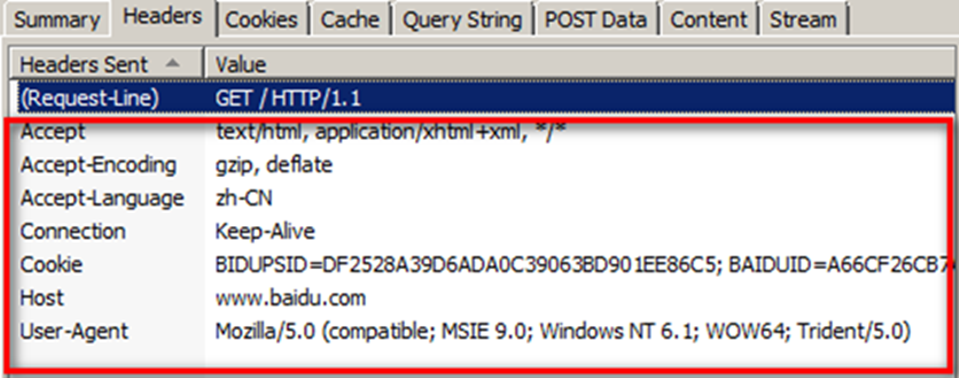
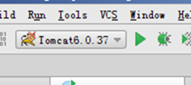
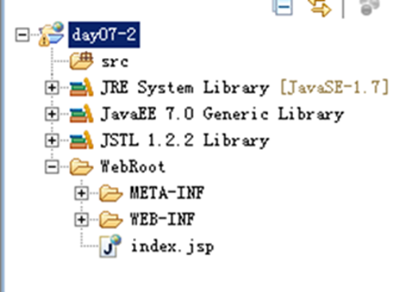
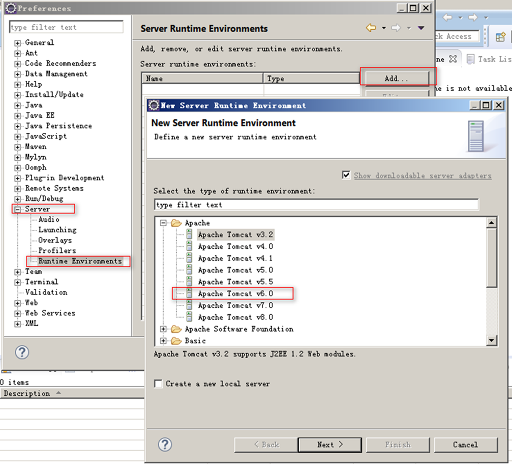
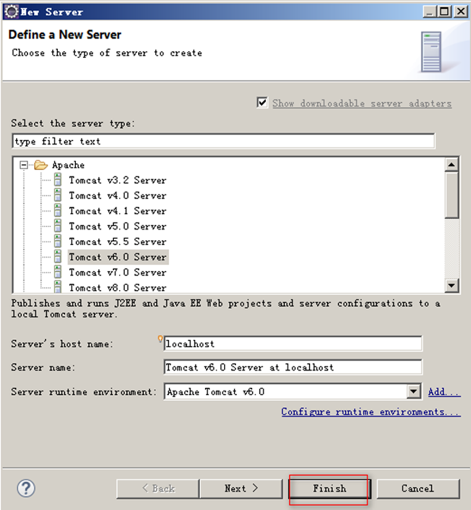

### 1. WEB编程-环境部署

#### 1.1. 软件开发模式

B/S(浏览器/服务器)：我们主要做这个

C/S(客户端/服务器)


#### 1.2.  通讯协议

通讯要素：我们通过IP可以定位一台计算机,通过IP和端口可以定位一台计算机上的软件

网络通讯协议：所谓的通讯协议，就是数据在网络传输中遵循的规范(规定)	例如：打电话拨区号

##### 1.2.1. TCP/IP

- 使用TCP协议前，须先建立TCP连接，形成传输数据通道

- 传输前，采用“三次握手”方式，是可靠的

- TCP协议进行通信的两个应用进程：客户端、服务端

- 在连接中可进行大数据量的传输

- 传输完毕，需释放已建立的连接，效率低

##### 1.2.2. UDP

- 将数据、源、目的封装成数据包，不需要建立连接

- 每个数据报的大小限制在64K内

- 因无需连接，故是不可靠的

- 发送数据结束时无需释放资源，速度快


> 注意：端口号的取值是0~65535，其中0~1023之间全部被预定义


#### 1.3. 名词解释

域名：coder163.com		其实映射的是一个ip

域名解析：当在连接网络时输入一个主机的域名后，域名服务器（DNS）负责将域名转化成IP地址，这样才能和主机建立连接。

备案：在工信部将该域名和你的个人信息存档


#### 1.4. Java中的网络编程

ServerSocket(服务器类)

Socket(客户端)

#### 1.5. HTTP协议


HTTP是HyperText Transfer Protocol(超文本传输协议)的简写，它是TCP/IP协议的一个应用层协议，用于定义WEB浏览器与WEB服务器之间交换数据的过程及数据本身的格式。

协议版本：HTTP/1.0、HTTP/1.1

1.0和1.1的区别


#### 1.6. HTTP协议的组成

**请求：用户获取服务器资源的指令**

- 请求行：请求方式、协议、协议版本


- 请求头：请求的数据编码、cookie(会话标示)、主机.....



- 请求正文：我们向服务器发送请求的数据


**响应：服务器根据用户的请求指令返回的具体结果**


- 响应行：协议、协议版本、状态码、描述			404

- 响应头：响应的编码合适.....

- 响应正文：浏览器中用户能够看到的数据


#### 1.7. 部署服务器

WEB资源的划分

- 静态web资源（如html 页面）：指web页面中供人们浏览的数据始终是不变。

- 动态web资源：指web页面中供人们浏览的数据是由程序产生的，不同时间点访问web页面看到的内容各不相同。


动态页面(WEB)开发技术

- JSP/Servlet(是我们要学习)、ASP(非主流)、PHP(流行)等

Tomcat的目录结构


WEB应用的目录结构

工程名：该目录我们一般称为工程的根目录

```
|--WEB-INF：该目录下的所有文件无法通过浏览器直接访问
    |--classes:存放class文件的目录
    |--lib
    |--web.xml：页面和java代码交互所需要的配置项全部写在该文件中
|--index.html:存放在该目录下的所有文件都可以通过浏览器直接访问

```

#### 1.8. Tomcat整合各种IDE

##### 1.8.1. IDEA整合Tomcat

IDEA创建的是Tomcat的副本,是将WEB工程部署在副本中的


如果看到这个图标一般表示成功！




##### 1.8.2. 在IDEA中创建WEB工程


##### 1.8.3. 将工程部署到Tomcat中


启动成功


访问：http://localhost:8080/day07-1/index.jsp


#### 1.9. MyEclipse整合Tomcat

MyEclipse:直接将工程部署到Tomcat的webapps目录下的


##### 1.9.1. 创建WEB工程





#### 1.10. Eclipse整合Tomcat

Eclipse:创建的是Tomcat的副本,是将WEB工程部署在副本中的








##### 1.10.1. 创建WEB工程


##### 1.10.2. 部署工程


