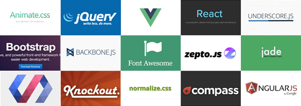
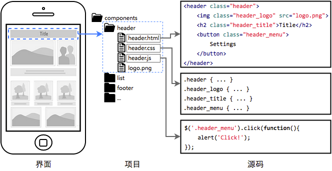
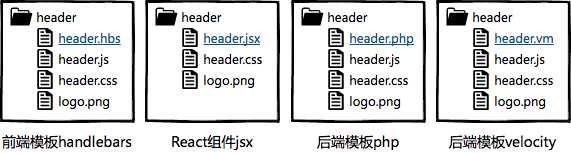
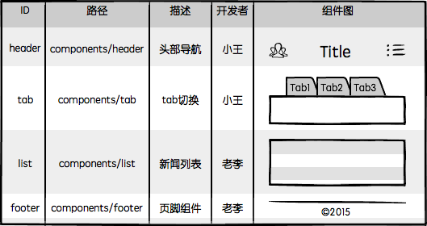
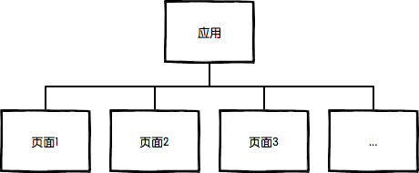
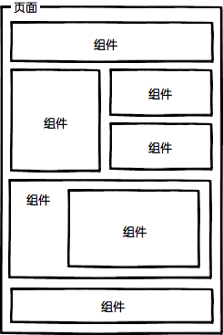
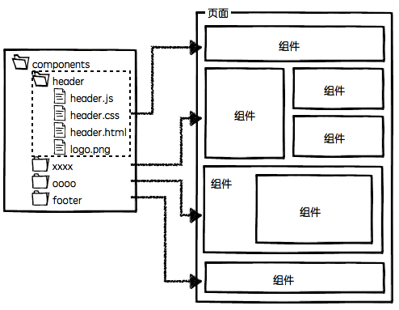
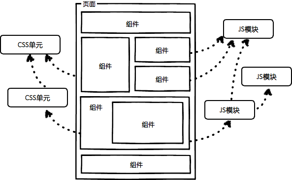
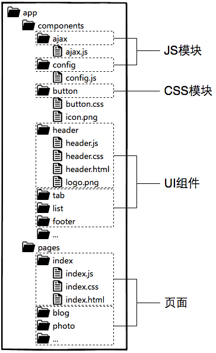

### 1. 前端工程的三个阶段

现在的前端开发倒也并非一无所有，回顾一下曾经经历过或听闻过的项目，为了提升其前端开发效率和运行性能，前端团队的工程建设大致会经历三个阶段：


#### 1.1. 第一阶段：库/框架选型



前端工程建设的第一项任务就是根据项目特征进行技术选型。

基本上现在没有人完全从0开始做网站，哪怕是政府项目用个jquery都很正常吧，React/Angularjs等框架横空出世，解放了不少生产力，合理的技术选型可以为项目节省许多工程量这点毋庸置疑。

#### 1.2. 第二阶段：简单构建优化


选型之后基本上就可以开始敲码了，不过光解决开发效率还不够，必须要兼顾运行性能。前端工程进行到第二阶段会选型一种构建工具，对代码进行压缩，校验，之后再以页面为单位进行简单的资源合并。


#### 1.3. 第三阶段：JS/CSS模块化开发


分而治之是软件工程中的重要思想，是复杂系统开发和维护的基石，这点放在前端开发中同样适用。在解决了基本开发效率运行效率问题之后，前端团队开始思考维护效率，模块化是目前前端最流行的分治手段。

JS模块化方案很多，AMD/CommonJS/UMD/ES6 Module等，对应的框架和工具也一大堆，CSS模块化开发基本都是在less、sass、stylus等预处理器的import/mixin特性支持下实现的。

#### 1.4. 第四阶段

> 前端是一种技术问题较少、工程问题较多的软件开发领域。

当我们要开发一款完整的Web应用时，前端将面临更多的工程问题，比如：

- 大体量：多功能、多页面、多状态、多系统；

- 大规模：多人甚至多团队合作开发；

- 高性能：CDN部署、缓存控制、文件指纹、缓存复用、请求合并、按需加载、同步/异步加载、移动端首屏CSS内嵌、HTTP 2.0服务端资源推送。

这些无疑是一系列严肃的系统工程问题。

### 2. 组件化开发

分治的确是非常重要的工程优化手段。前端作为一种GUI软件，光有JS/CSS的模块化还不够，对于UI组件的分治也有着同样迫切的需求：




如上图，这是前端组件化开发理念，简单解读一下：

- 页面上的每个 **独立的** 可视/可交互区域视为一个组件；

- **每个组件对应一个工程目录**，组件所需的各种资源都在这个目录下就近维护；

- 由于组件具有独立性，因此组件与组件之间可以 **自由组合**；

- 页面只不过是组件的容器，负责组合组件形成功能完整的界面；

- 当不需要某个组件，或者想要替换组件时，可以整个目录删除/替换。

其中第二项描述的就近维护原则，它为前端开发提供了很好的分治策略，每个开发者都将清楚的知道，自己所开发维护的功能单元，其代码必然存在于对应的组件目录中，在那个目录下能找到有关这个功能单元的所有内部逻辑，样式也好，JS也好，页面结构也好，都在那里。


组件化开发具有较高的通用性，无论是前端渲染的单页面应用，还是后端模板渲染的多页面应用，组件化开发的概念都能适用。组件HTML部分根据业务选型的不同，可以是静态的HTML文件，可以是前端模板，也可以是后端模板：



> 不同的技术选型决定了不同的组件封装和调用策略。

基于这样的工程理念，我们很容易将系统以独立的组件为单元进行分工划分：



由于系统功能被分治到独立的模块或组件中，粒度比较精细，组织形式松散，开发者之间不会产生开发时序的依赖，大幅提升并行的开发效率，理论上允许随时加入新成员认领组件开发或维护工作，也更容易支持多个团队共同维护一个大型站点的开发。

结合前面提到的模块化开发，整个前端项目可以划分为这么几种开发概念：


|  名称   |                    说明                    |                                                 举例                                                  |
| ------- | ------------------------------------------ | ----------------------------------------------------------------------------------------------------- |
| JS模块  | 独立的算法和数据单元                         | 浏览器环境检测(detect)，网络请求(ajax)，应用配置(config)，DOM操作(dom)，工具函数(utils)，以及组件里的JS单元 |
| CSS模块 | 独立的功能性样式单元                         | 栅格系统(grid)，字体图标(icon-fonts)，动画样式(animate)，以及组件里的CSS单元                              |
| UI组件  | 独立的可视/可交互功能单元                    | 页头(header)，页尾(footer)，导航栏(nav)，搜索框(search)                                                 |
| 页面    | 前端这种GUI软件的界面状态，是UI组件的容器     | 首页(index)，列表页(list)，用户管理(user)                                                               |
| 应用    | 整个项目或整个站点被称之为应用，由多个页面组成 |                                                                                                       |


以上5种开发概念以相对较少的规则组成了前端开发的基本工程结构，基于这些理念，前端开发就成了这个样子：

|                   示意图                    |                          描述                          |
| ------------------------------------------ | ------------------------------------------------------ |
|  | 整个Web应用由页面组成                                   |
|  | 页面由组件组成                                          |
|   | 一个组件一个目录，资源就近维护                           |
|  | 组件可组合，组件的JS可依赖其他JS模块，CSS可依赖其他CSS单元 |


综合上面的描述，对于一般中小规模的项目，大致可以规划出这样的源码目录结构：




如果项目规模较大，涉及多个团队协作，还可以将具有相关业务功能的页面组织在一起，形成一个子系统，进一步将整个站点拆分出多个子系统来分配给不同团队维护


### 3. Webpack基础

webpack是基于nodejs实现的， Node.js 是前端工程化的重要支柱之一，所以想使用webpack构建项目，首先需要做的是理清楚npm、NodeJS以及Webpack他们之间的关系

- NodeJS是JavaScript编写服务器端代码的一个运行环境，类似于Java的JDK

- npm是NodeJS的一个功能模块，主要用于安装依赖

- Webpack是基于NodeJS实现的一个软件，所以它里面所有功能(loader、plugins)都是通过npm进行安装的

- npm的服务器在国外，因为防火墙的原因，所以下载东西速度会很慢，cnpm是淘宝提供的npm国内版本，服务器在国内，他们两个唯一的区别就是下载速度不同

- yarn 和npm一样，也是基于NodeJS实现的一个依赖管理工具，因为内部机制不同所以只是下载速度和信息提示相对npm来说更友好一点


本质上，webpack 是一个现代 JavaScript 应用程序的静态模块打包器(module bundler)。当 webpack 处理应用程序时，它会递归地构建一个依赖关系图(dependency graph)，其中包含应用程序需要的每个模块，然后将所有这些模块打包成一个或多个 bundle。


从 webpack v4.0.0 开始，可以不用引入一个配置文件。然而，webpack 仍然还是高度可配置的。在开始前你需要先理解四个核心概念：

- 入口(entry)

入口起点(entry point)指示 webpack 应该使用哪个模块，来作为构建其内部依赖图的开始。进入入口起点后，webpack 会找出有哪些模块和库是入口起点（直接和间接）依赖的。

- 输出(output)

output 属性告诉 webpack 在哪里输出它所创建的 bundles，以及如何命名这些文件，默认值为 ./dist。基本上，整个应用程序结构，都会被编译到你指定的输出路径的文件夹中。你可以通过在配置中指定一个 output 字段，来配置这些处理过程

- loader

loader 让 webpack 能够去处理那些非 JavaScript 文件（webpack 自身只理解 JavaScript）。loader 可以将所有类型的文件转换为 webpack 能够处理的有效模块，然后你就可以利用 webpack 的打包能力，对它们进行处理。


- 插件(plugins)

loader 被用于转换某些类型的模块，而插件则可以用于执行范围更广的任务。插件的范围包括，从打包优化和压缩，一直到重新定义环境中的变量。插件接口功能极其强大，可以用来处理各种各样的任务。

想要使用一个插件，你只需要 require() 它，然后把它添加到 plugins 数组中。多数插件可以通过选项(option)自定义。你也可以在一个配置文件中因为不同目的而多次使用同一个插件，这时需要通过使用 new 操作符来创建它的一个实例。

参考地址列表：

- npm：https://www.npmjs.com.cn/getting-started/what-is-npm

- cnpm：https://npm.taobao.org

- yarn：https://yarn.bootcss.com

- webpack：https://www.webpackjs.com

- NodeJS：http://nodejs.cn

#### 3.1. npm常用命令

安装 `npm install xxx`

> install 可以简写为i，命令演化为：`npm i xxx`

#### 3.2. install 常用参数

全局安装(-g)命令格式如下

```shell

npm install jquery -g

```

> 备注：如果全局安装的话在任何目录中都可以使用，但是不推荐,容易造成版本冲突


局部安装

这种安装方式一般是和package.json配合使用，该文件是NodeJS项目中的依赖管理文件，其中将所有的依赖划分为两种生产依赖和开发依赖

开发依赖(devDependencies)：即在开发阶段需要的一些工具类依赖而正式的生产环境不再需要，例如：webpack、babel等

生产依赖(Dependencies)：即正式的服务器环境依然需要的一些依赖，例如：NodeJS


> 我们在安装依赖时为了保证团队中所有依赖版本的统一，会将这些依赖的版本写入配置文件(package.json)中

完整的package.json内容如下：

```json
{
  "name": "demo1",
  "version": "1.0.0",
  "description": "",
  "scripts": {
   "build": " webpack --config webpack.config.js --progress  --colors ",
    "dev": "webpack-dev-server --inline --colors --progress"
  },
  "keywords": [],
  "author": "",
  "license": "ISC",
  "devDependencies": {
    "webpack": "^4.30.0",
    "webpack-cli": "^3.3.2",
    "webpack-dev-server": "^3.3.1"
  },
  "dependencies": {

    "jquery": "^3.4.1"
  }
}

```

核心内容说明：

- name：用于标明项目名称，该属性必须存在，同时要求名称中不能出现大写字母

- version：用于标明项目的版本号，该属性必须存在，版本号一般有三部分组成：主版本.次版本.bug修复版本

- scripts：我们可以借助npm执行一些复杂的命令,而为了避免每次都输入这些复杂的命令，可以借助该属性将这些复杂的命令做成小脚本,运行其中某个脚本的命令如下：`npm run 脚本名称` 例如：`npm run dev`

- devDependencies：用于记录在开发环境中依赖的版本和名称，使用`npm i jquery --save-dev`就可以把依赖信息写入。在新版本的npm中已经可以使用-D来代替--save-dev，完整的例子：`npm i jquery -D`

- Dependencies：用于记录在生产环境中依赖的版本和名称。使用`npm i jquery --save`就可以把依赖信息写入


#### 3.3. 动态拼装入口和出口文件

```js

function configEntry(globPath) {
    let entries = {}
    glob.sync(globPath).forEach(function (entry) {
        basename = path.basename(entry, path.extname(entry));
        //动态拼装一个JSON对象
        entries[basename] = entry;

    });
    console.log("-------------------------开始拼装entry--------------------")
    console.log(entries);

    return entries;
}

//动态创建HTML模板
function configHtmlWebpackPlugin(globPath) {
    console.log("---------------开始拼装HTML模板---------------------------")
    glob.sync(globPath).forEach(function (entry) {
        basename = path.basename(entry, path.extname(entry));
        tmp = entry.split('/').splice(2);

        var conf = {
            // 模板路径
            template: entry,
            filename: basename + '/' + basename + ".html",
            // js插入位置
            inject: 'body',
            // 每个html引用的js模块，也可以在这里加上vendor等公用模块
            chunks: [basename]
        };
        console.log(conf)
        // 正确输出js和html的路径
        // pathname = str.substring(0, str.length - 1);
        module.exports.plugins.push(new HtmlWebpackPlugin(conf));
    });
}
configHtmlWebpackPlugin('./src/pages/*/*.html');

//调用
module.exports = {
  entry: configEntry('./src/pages/*/*.js'),
}

```
