### 1. 数据库-JDBC

**JDBC 规范定义接口，具体的实现由各大数据库厂商来实现。**

JDBC 是 Java 访问数据库的标准规范，真正怎么操作数据库还需要具体的实现类，也就是**数据库驱动**。每个数据库厂商根据自家数据库的通信格式编写好自己数据库的驱动。所以我们只需要会调用 JDBC 接口中的方法即可，**数据库驱动由数据库厂商提供**。


使用JDBC 的好处：

- 程序员如果要开发访问数据库的程序，只需要会调用 JDBC 接口中的方法即可，不用关注类是如何实现的
- 使用同一套Java 代码，进行少量的修改就可以访问其他JDBC 支持的数据库

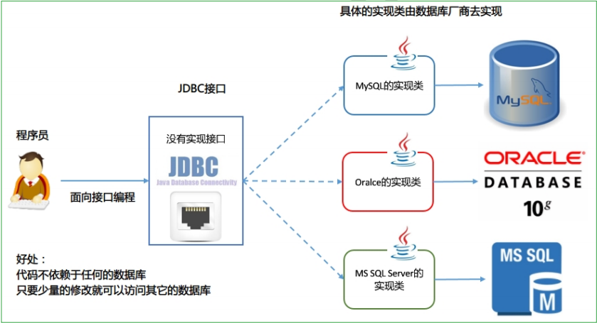


使用JDBC 开发使用到的包：

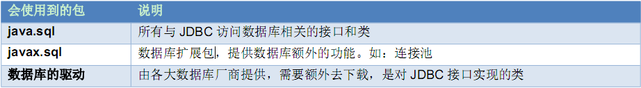

#### 1.1. JDBC 的核心API

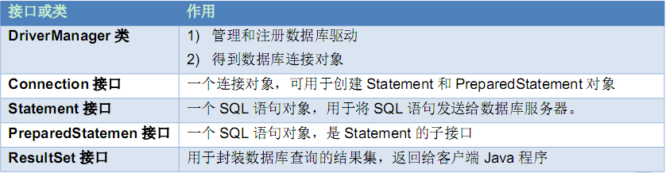

#### 1.2. 加载和注册驱动


```java
public class Demo1 {
     public static void main(String[] args) throws ClassNotFoundException {
              //抛出类找不到的异常，注册数据库驱动
         Class.forName("com.mysql.jdbc.Driver");
     }
}

```

com.mysql.jdbc.Driver源代码：

```java
// Driver 接口，所有数据库厂商必须实现的接口，表示这是一个驱动类
public class Driver implements java.sql.Driver {
     public Driver() throws SQLException {
     }

     static {
         try {
             DriverManager.registerDriver(new Driver());   //注册数据库驱动
         } catch (SQLException var1) {
             throw new RuntimeException("Can't register driver!");
         }
     }
}

```

> 注：从JDBC3 开始，目前已经普遍使用的版本。可以不用注册驱动而直接使用。Class.forName
这句话可以省略。


#### 1.3. DriverManager类

##### 1.3.1. DriverManager作用

管理和注册驱动

创建数据库的连接


##### 1.3.2. 类中的方法

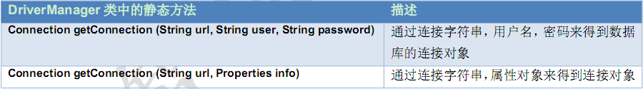


##### 1.3.3. 使用JDBC 连接数据库的四个参数

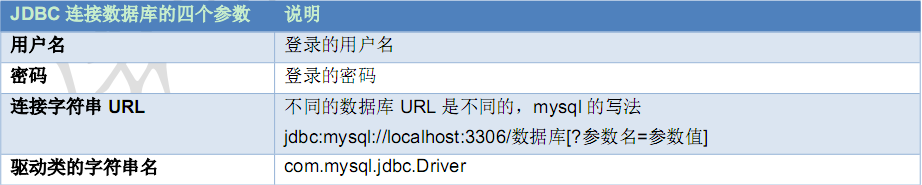


##### 1.3.4. 连接数据库的URL 地址格式

协议名:子协议://服务器名或 IP地址:端口号/数据库名?参数=参数值

URL用于标识数据库的位置，程序员通过URL地址告诉JDBC程序连接那个数据库，URL的写法为：


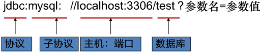


##### 1.3.5. 乱码的处理

如果数据库出现乱码，可以指定参数: ?characterEncoding=utf8，表示让数据库以UTF-8 编码来处理数据。
`jdbc:mysql://localhost:3306/数据库?characterEncoding=utf8`


##### 1.3.6. 案例：得到MySQL 的数据库连接对象

- 使用用户名、密码、URL 得到连接对象

```java

import java.sql.Connection;
import java.sql.DriverManager;
import java.sql.SQLException;

/**
 * 得到连接对象
 */
public class Demo2 {
     public static void main(String[] args) throws SQLException {
         String url = "jdbc:mysql://localhost:3306/day24";
         //1)    使用用户名、密码、URL 得到连接对象
         Connection connection = DriverManager.getConnection(url, "root", "root");
         //com.mysql.jdbc.JDBC4Connection@68de145
         System.out.println(connection);
     }
}
```

- 使用属性文件和url 得到连接对象

```java
import java.sql.Connection;
import java.sql.DriverManager;
import java.sql.SQLException;
import java.util.Properties;

public class Demo3 {
     public static void main(String[] args) throws SQLException {
         //url 连接字符串
         String url = "jdbc:mysql://localhost:3306/day24";
         //属性对象
         Properties info = new Properties();
         //把用户名和密码放在info 对象中
         info.setProperty("user","root");
         info.setProperty("password","root");
         Connection connection = DriverManager.getConnection(url, info);
         //com.mysql.jdbc.JDBC4Connection@68de145
         System.out.println(connection);
     }
 }
```


#### 1.4. Connection 接口

作用

Connection 接口，具体的实现类由数据库的厂商实现，代表一个连接对象。


Connection 方法


#### 1.5. Statement接口

##### 1.5.1. JDBC 访问数据库的步骤

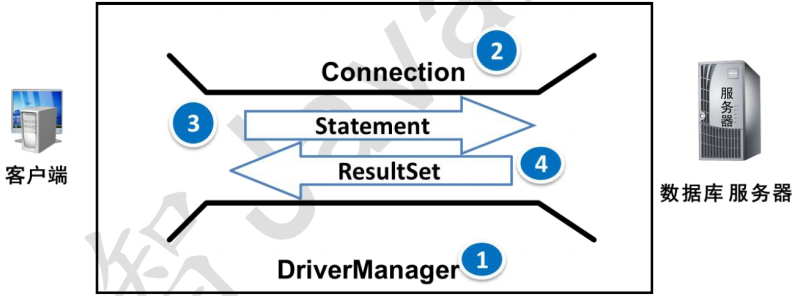

1. 注册和加载驱动(可以省略)

2. 获取连接

3. Connection 获取Statement 对象

4. 使用Statement 对象执行SQL语句

5. 返回结果集

6. 释放资源

##### 1.5.2. Statement作用

代表一条语句对象，用于发送SQL语句给服务器，用于执行静态  SQL 语句并返回它所生成结果的对象


##### 1.5.3. Statement中的方法

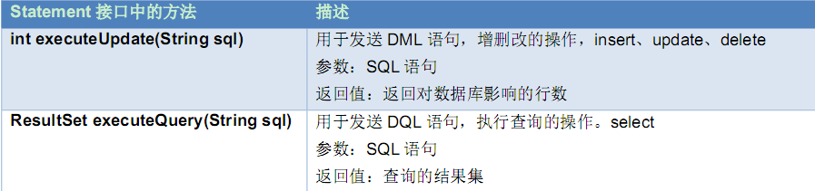

##### 1.5.4. 释放资源

- 需要释放的对象：ResultSet结果集，Statement 语句，Connection 连接

- 释放原则：先开的后关，后开的先关。ResultSet  Statement  Connection

- 放在哪个代码块中：finally块

##### 1.5.5. 执行DDL 操作

需求

- 使用JDBC 在MySQL 的数据库中创建一张学生表

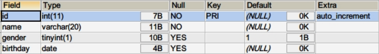


代码

```java

import java.sql.Connection;
import java.sql.DriverManager;
import java.sql.SQLException;
import java.sql.Statement;

/**
 * 创建一张学生表
 */
public class Demo4DDL {

     public static void main(String[] args) {
         //1. 创建连接
         Connection conn = null;
         Statement statement = null;
         try {
             conn = DriverManager.getConnection("jdbc:mysql:///day24", "root", "root");
             //2. 通过连接对象得到语句对象
             statement = conn.createStatement();
             //3. 通过语句对象发送 SQL 语句给服务器
             //4. 执行 SQL
             statement.executeUpdate("create table student (id int PRIMARY key auto_increment, name varchar(20) not null, gender boolean, birthday date)");
             //5. 返回影响行数(DDL 没有返回值)
             System.out.println("创建表成功");
         } catch (SQLException e) {
             e.printStackTrace();
         }
         //6. 释放资源
         finally {
             //关闭之前要先判断
             if (statement != null) {
                 try {
                     statement.close();
                 } catch (SQLException e) {
                     e.printStackTrace();
                 }
             if (conn != null) {
                 try {
                     conn.close();
                 } catch (SQLException e) {
                     e.printStackTrace();
                 }
             }
         }
     }
}
```


##### 1.5.6. 执行DML 操作

需求：

- 向学生表中添加4 条记录，主键是自动增长

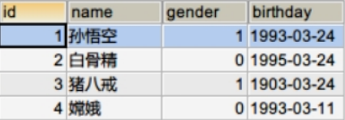


步骤：

1. 创建连接对象
2. 创建Statement 语句对象
3. 执行SQL语句：executeUpdate(sql)
4. 返回影响的行数
5. 释放资源

代码

```java
import java.sql.Connection;
import java.sql.DriverManager;
import java.sql.SQLException;
import java.sql.Statement;

/**
 * 向学生表中添加4 条记录，主键是自动增长
 */
public class Demo5DML {

     public static void main(String[] args) throws SQLException {
//         1) 创建连接对象
         Connection connection = DriverManager.getConnection("jdbc:mysql:///day24", "root","root");
//         2) 创建Statement语句对象
         Statement statement = connection.createStatement();
//         3) 执行SQL 语句：executeUpdate(sql)
         int count = 0;
//         4) 返回影响的行数
         count += statement.executeUpdate("insert into student values(null, '孙悟空', 1, '1993-03-24')");
         count += statement.executeUpdate("insert into student values(null, '白骨精', 0, '1995-03-24')");
         count += statement.executeUpdate("insert into student values(null, '猪八戒', 1, '1903-03-24')");
         count += statement.executeUpdate("insert into student values(null, '嫦娥', 0, '1993-03-11')");
         System.out.println("插入了" + count + "条记录");
//         5) 释放资源
         statement.close();
         connection.close();
     }

}
```

##### 1.5.7. 执行DQL操作

 ResultSet接口：

作用：

- 封装数据库查询的结果集，对结果集进行遍历，取出每一条记录

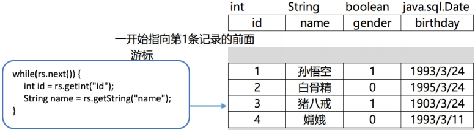


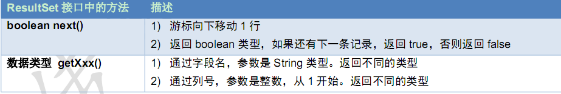


##### 1.5.8. 常用数据类型转换表

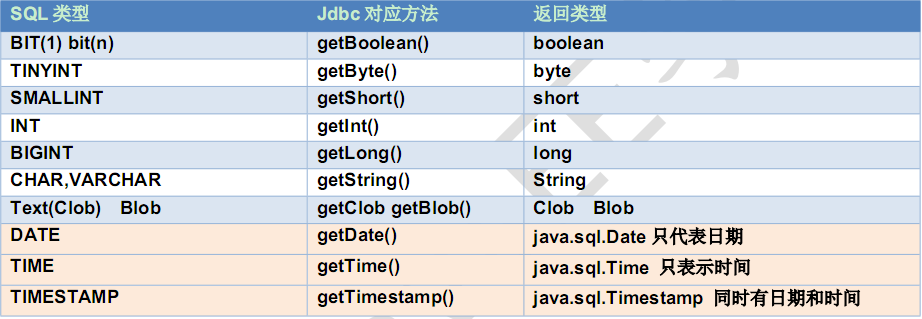

> java.sql.Date、Time、Timestamp(时间戳)，三个共同父类是：java.util.Date

##### 1.5.9. 案例

需求

- 确保数据库中有3 条以上的记录，查询所有的学员信息

步骤

1. 得到连接对象
2. 得到语句对象
3. 执行SQL语句得到结果集ResultSet对象
4. 循环遍历取出每一条记录
5. 输出的控制台上
6.  释放资源

结果


```java
import java.sql.*;


/**
 * 查询所有的学生信息
 */
public class Demo6DQL {

     public static void main(String[] args) throws SQLException {
         //1) 得到连接对象
         Connection connection =
DriverManager.getConnection("jdbc:mysql://localhost:3306/day24","root","root");
         //2) 得到语句对象
         Statement statement = connection.createStatement();
         //3) 执行SQL 语句得到结果集ResultSet对象
         ResultSet rs = statement.executeQuery("select * from student");
         //4) 循环遍历取出每一条记录
         while(rs.next()) {
             int id = rs.getInt("id");
             String name = rs.getString("name");
             boolean gender = rs.getBoolean("gender");
             Date birthday = rs.getDate("birthday");
         //5) 输出的控制台上
             System.out.println("编号：" + id + ", 姓名：" + name + ", 性别：" + gender + ", 生日：" +birthday);
         }
         //6) 释放资源
         rs.close();
         statement.close();
         connection.close();
     }
}
```

##### 1.5.10. 关于ResultSet接口中的注意事项

如果光标在第一行之前，使用rs.getXX()获取列值，报错：Before start of result set

如果光标在最后一行之后，使用rs.getXX()获取列值，报错：After end of result set

使用完毕以后要关闭结果集ResultSet，再关闭 Statement，再关闭Connection


#### 1.6. 数据库工具类JdbcUtils

什么时候自己创建工具类？

- 如果一个功能经常要用到，我们建议把这个功能做成一个工具类，可以在不同的地方重用。

需求

上面写的代码中出现了很多重复的代码，可以把这些公共代码抽取出来。


创建类JdbcUtil 包含3 个方法：

- 可以把几个字符串定义成常量：用户名，密码，URL，驱动类

- 得到数据库的连接：getConnection()

- 关闭所有打开的资源：

    - close(Connection conn, Statement stmt)，close(Connection conn, Statement stmt, ResultSet rs)

```java
import java.sql.*;

/**
 * 访问数据库的工具类
 */
public class JdbcUtils {

     //可以把几个字符串定义成常量：用户名，密码，URL，驱动类
     private static final String USER = "root";
     private static final String PWD = "root";
     private static final String URL = "jdbc:mysql://localhost:3306/day24";
     private static final String DRIVER= "com.mysql.jdbc.Driver";

     /**
      * 注册驱动
      */
     static {
         try {
             Class.forName(DRIVER);
         } catch (ClassNotFoundException e) {
             e.printStackTrace();
         }
     }

     /**
      * 得到数据库的连接
      */
     public static Connection getConnection() throws SQLException {
         return DriverManager.getConnection(URL,USER,PWD);
     }

     /**
      * 关闭所有打开的资源
      */
     public static void   close(Connection conn, Statement stmt) {
         if (stmt!=null) {
             try {
                 stmt.close();
             } catch (SQLException e) {
                 e.printStackTrace();
             }
         }
         if (conn!=null) {
             try {
                 conn.close();
             } catch (SQLException e) {
                 e.printStackTrace();
             }
         }
     }

     /**
      * 关闭所有打开的资源
      */
     public static void close(Connection conn, Statement stmt, ResultSet rs) {
         if (rs!=null) {
             try {
                 rs.close();
             } catch (SQLException e) {
                 e.printStackTrace();
             }
         }
         close(conn, stmt);
     }

}
```

#### 1.7. SQL 注入问题

当我们输入以下密码，我们发现我们账号和密码都不对竟然登录成功了

```java
请输入用户名：
newboy
请输入密码：
a' or '1'='1
select * from user where name='newboy' and password='a' or '1'='1'
登录成功，欢迎您：newboy
```

问题分析：

```mysql
select * from user where name='newboy' and password='a' or '1'='1'
-- name='newboy' and password='a' 为假
-- '1'='1' 真相当于
select * from user where true; -- 查询了所有记录
```

我们让用户输入的密码和SQL语句进行字符串拼接。用户输入的内容作为了SQL语句语法的一部分，改变了原有SQL真正的意义，以上问题称为 SQL注入。要解决SQL注入就不能让用户输入的密码和我们的SQL语句进行简单的字符串拼接。


#### 1.8. PreparedStatement接口

PreparedStatement是Statement 接口的子接口，继承于父接口中所有的方法。它是一个预编译的SQL语句

##### 1.8.1. 执行原理

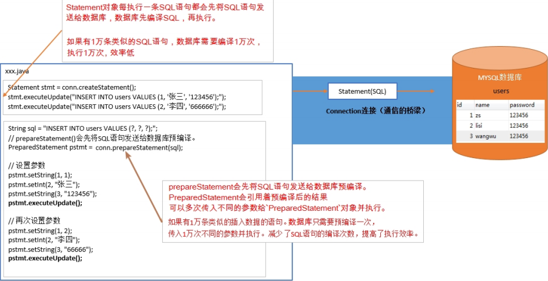


- 因为有预先编译的功能，提高SQL的执行效率。

- 可以有效的防止SQL注入的问题，安全性更高。

##### 1.8.2. Connection 创建PreparedStatement对象


##### 1.8.3. PreparedStatement接口中的方法

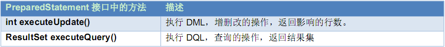


##### 1.8.4. PreparedSatement的好处

prepareStatement()会先将SQL语句发送给数据库预编译。PreparedStatement会引用着预编译后的结果，可以多次传入不同的参数给PreparedStatement对象并执行。减少SQL编译次数，提高效率。


安全性更高，没有SQL注入的隐患。

提高了程序的可读性


##### 1.8.5. 使用PreparedStatement的步骤


编写SQL语句，未知内容使用?占位："SELECT * FROM user WHERE name=? AND password=?"

获得PreparedStatement对象

设置实际参数：setXxx(占位符的位置, 真实的值) 

执行参数化SQL语句

关闭资源


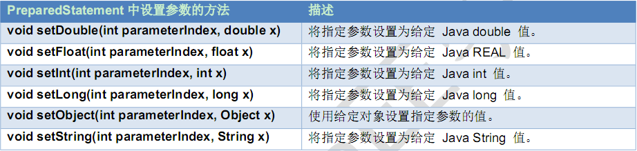


#### 1.9. JDBC 事务的处理

之前我们是使用MySQL 的命令来操作事务。接下来我们使用JDBC 来操作银行转账的事务。


##### 1.9.1. 准备数据

```mysql
CREATE TABLE account (
  id INT PRIMARY KEY AUTO_INCREMENT,
  NAME VARCHAR(10),
  balance DOUBLE
);
-- 添加数据
INSERT INTO account (NAME, balance) VALUES ('Jack', 1000), ('Rose', 1000);
```


##### 1.9.2. API 介绍

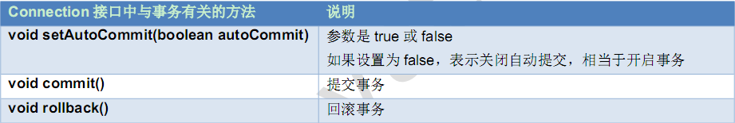


##### 1.9.3. 开发步骤

获取连接

开启事务

获取到PreparedStatement

使用PreparedStatement执行两次更新操作

正常情况下提交事务

出现异常回滚事务

最后关闭资源


```java
import com.itheima.utils.JdbcUtils;

import java.sql.Connection;
import java.sql.PreparedStatement;
import java.sql.SQLException;

public class Demo12Transaction {

     //没有异常，提交事务，出现异常回滚事务
     public static void main(String[] args) {
              //1) 注册驱动
         Connection connection = null;
         PreparedStatement ps = null;
         try {
         //2) 获取连接
             connection = JdbcUtils.getConnection();
         //3) 开启事务
             connection.setAutoCommit(false);
         //4) 获取到PreparedStatement
             //从jack 扣钱
             ps = connection.prepareStatement("update account set balance = balance - ? where name=?");
             ps.setInt(1, 500);
             ps.setString(2,"Jack");
             ps.executeUpdate();
             //出现异常
             System.out.println(100 / 0);
             //给rose 加钱
             ps = connection.prepareStatement("update account set balance = balance + ? where name=?");
             ps.setInt(1, 500);
             ps.setString(2,"Rose");
             ps.executeUpdate();
             //提交事务
             connection.commit();
             System.out.println("转账成功");
         } catch (Exception e) {
             e.printStackTrace();
             try {
                 //事务的回滚
                 connection.rollback();
             } catch (SQLException e1) {
                     e1.printStackTrace();
             }
             System.out.println("转账失败");
          }
         finally {
         //7) 关闭资源
             JdbcUtils.close(connection,ps);
         }

     }
}
```