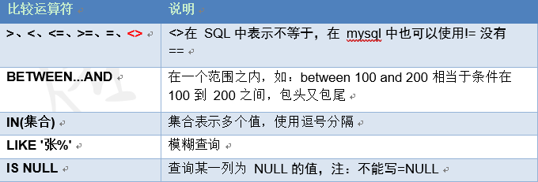
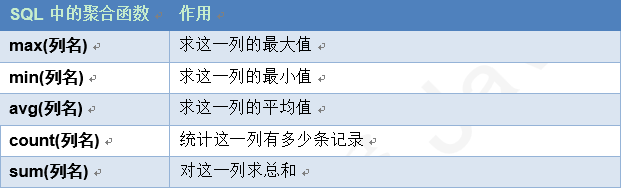
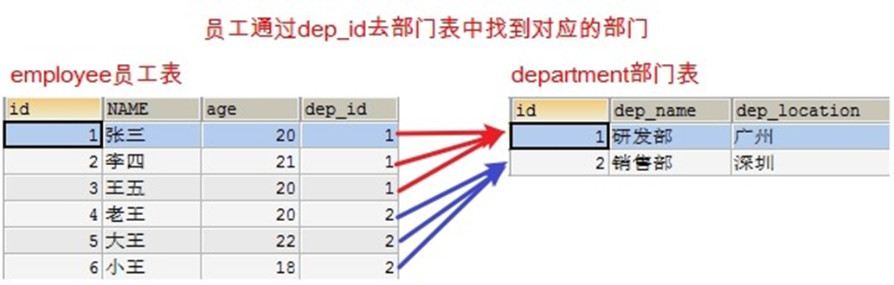
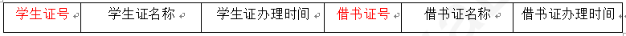
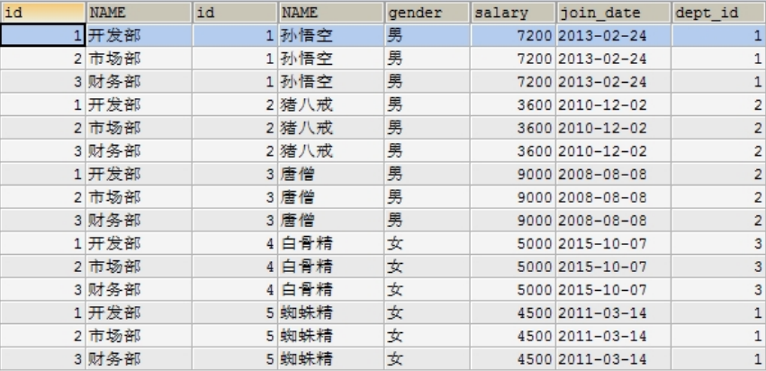
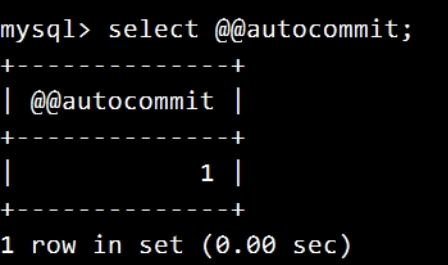
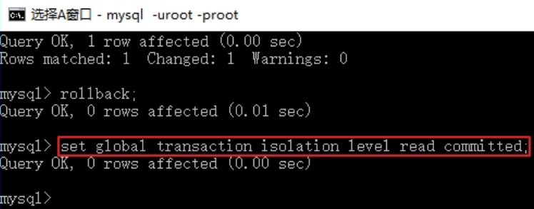
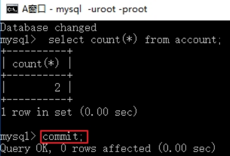

## 1. 数据库-MySQL基础

### 1.1. 基础

存储数据的仓库

本质上是一个文件系统，还是以文件的方式存在服务器的电脑上的

所有的关系型数据库都可以使用通用的 SQL 语句进行管理 DBMS DataBase Management System


#### 1.1.1. 常见数据库排行榜


- **MySQL**：开源免费的数据库，小型的数据库，已经被 Oracle 收购了。MySQL6.x 版本也开始收费。后来 Sun 公司收购了 MySQL，而 Sun 公司又被 Oracle 收购


- **Oracle**：收费的大型数据库，Oracle 公司的产品。


- **DB2** ：IBM 公司的数据库产品,收费的。常应用在银行系统中。
- **SQL Server**：MicroSoft 公司收费的中型的数据库。C#、.net 等语言常使用。


- **SQLite**: 嵌入式的小型数据库，应用在手机端，如：Android。

#### 1.1.2. 为什么选择 MySQL

- 免费

- 功能强大


#### 1.1.3. 数据库管理系统

数据库管理系统（DataBase Management System，DBMS）：指一种操作和管理数据库的大型软件，用于建立、使用和维护数据库，对数据库进行统一管理和控制，以保证数据库的安全性和完整性。用户通过数据库管理系统访问数据库中表内的数据 


#### 1.1.4. 数据库管理系统、数据库和表的关系

数据库管理程序(DBMS)可以管理多个数据库，一般开发人员会针对每一个应用创建一个数据库。为保存应用中实体的数据，一般会在数据库创建多个表，以保存程序中实体 User 的数据。

数据库管理系统、数据库和表的关系如图所示：


一个数据库服务器包含多个库

一个数据库包含多张表

一张表包含多条记录


#### 1.1.5. SQL 的概念

什么是 SQL

Structured Query Language 结构化查询语言


SQL 作用

- 是一种所有关系型数据库的查询规范，不同的数据库都支持。

- 通用的数据库操作语言，可以用在不同的数据库中。

- 不同的数据库 SQL 语句有一些区别


##### 1.1.5.1. SQL 语句分类

- Data Definition Language (DDL 数据定义语言) 如：建库，建表

- **Data Manipulation Language(DML 数据操纵语言)，如：对表中的记录操作增删改**

- **Data Query Language(DQL 数据查询语言)，如：对表中的查询操作**

- Data Control Language(DCL 数据控制语言)，如：对用户权限的设置

##### 1.1.5.2. MySQL 的语法

- 每条语句以分号结尾，如果在 SQLyog 中不是必须加的。
- SQL 中不区分大小写，关键字中认为大写和小写是一样的
- 3 种注释：


#### 1.1.6. DDL 操作数据库

##### 1.1.6.1. 创建数据库

```mysql
-- 直接创建数据库db1
create database db1;

-- 判断是否存在，如果不存在则创建数据库db2
create database if not exists db2;

-- 创建数据库并指定字符集为gbk
create database db3 default character set gbk;

```

##### 1.1.6.2. 查看数据库

```mysql
-- 查看所有的数据库
show databases;

-- 查看某个数据库的定义信息
show create database db3; show create database db1;

```

##### 1.1.6.3. 修改数据库

修改数据库默认的字符集

ALTER DATABASE 数据库名 DEFAULT CHARACTER SET 字符集;


```mysql
将 db3 数据库的字符集改成 utf8
alter database db3 character set utf8;
```

##### 1.1.6.4. 删除数据库

DROP DATABASE 数据库名;

```mysql
-- 删除 db2 数据库
drop database db2;
```

##### 1.1.6.5. 使用数据库

查看正在使用的数据库

SELECT DATABASE();  使用的一个 mysql 中的全局函数

使用/切换数据库

USE 数据库名;

```mysql
-- 查看正在使用的数据库
select database();

-- 改变要使用的数据库
use db4;

```

##### 1.1.6.6. 面试题

在 MySQL 数据库软件中，有如下三个数据库：


登录数据库之后，输入语句：select database test2; 运行结果是什么?


#### 1.1.7. DDL 操作表结构


##### 1.1.7.1. 数据类型


##### 1.1.7.2. 创建表

CREATE TABLE 表名 ( 字段名 1 字段类型 1,  字段名 2 字段类型 2 );

```mysql
-- 创建 student 表包含 id,name,birthday 字段
create table student (
id int,  -- 整数
name varchar(20),  -- 字符串
birthday date -- 生日，最后没有逗号
);

```

##### 1.1.7.3. 查看表

查看某个数据库中的所有表

- SHOW TABLES;

查看表结构

- DESC 表名;

查看创建表的 SQL 语句

- SHOW CREATE TABLE 表名;

```mysql
-- 查看 day21 数据库中的所有表
use day21;

show tables;

-- 查看 student 表的结构
desc student;
```


```mysql

-- 查看 student 的创建表 SQL 语句
show create table student;
```
执行结果：

```mysql
CREATE TABLE `student` (
  `id` int(11) DEFAULT NULL,
  `name` varchar(20) DEFAULT NULL,
  `birthday` date DEFAULT NULL
) ENGINE=InnoDB DEFAULT CHARSET=utf8

```
- `  存在的目的是为了避免关键字的冲突

##### 1.1.7.4. 快速创建一个表结构相同的表

```mysql
-- 创建一个s1的表与student结构相同
create table s1 like student;

desc s1;

```

##### 1.1.7.5. 删除表

直接删除表

- DROP TABLE 表名;

判断表是否存在，如果存在则删除表

- DROP TABLE IF EXISTS 表名;


```mysql
-- 直接删除表s1表
drop table s1;

-- 判断表是否存在并删除s1表,与直接删除的区别如果表不存在，不删除，存在则删除
drop table if exists `create`;

```

##### 1.1.7.6. 修改表结构

添加表列 ADD

- ALTER TABLE 表名 ADD 列名 类型;

修改列类型 MODIFY

- ALTER TABLE 表名 MODIFY列名 新的类型;

修改列类型

- ALTER TABLE 表名 CHANGE 旧列名 新列名 类型;

删除列类型

- ALTER TABLE 表名 DROP 列名;

修改表名

- RENAME TABLE 表名 TO 新表名;

修改字符集

- ALTER TABLE 表名 character set 字符集;

#### 1.1.8. DML 操作表中的数据

用于对表中的记录进行增删改操作

##### 1.1.8.1. 插入记录

INSERT [INTO] 表名 [字段名] VALUES (字段值)

- INSERT INTO 表名：表示往哪张表中添加数据

- (字段名 1, 字段名 2, …)：要给哪些字段设置值

- VALUES (值 1, 值 2, …)：设置具体的值

插入全部字段

- 所有的字段名都写出来：INSERT INTO 表名 (字段名1, 字段名2, 字段名3…) VALUES (值1, 值2, 值3);
- 不写字段名：INSERT INTO 表名 VALUES (值1, 值2, 	值3…);
- 插入部分数据：INSERT INTO 表名 (字段名1, 字段名2, 	...) VALUES (值1, 值2, ...);

```mysql
-- 插入所有的列，向学生表中
insert into student (id,name,age,sex) values (1, '孙悟空', 20, '男');
insert into student (id,name,age,sex) values (2, '孙悟天', 16, '男');
-- 插入所有列
insert into student values (3, '孙悟饭', 18, '男', '龟仙人洞中');
-- 如果只插入部分列，必须写列名
insert into student values (3, '孙悟饭', 18, '男');

select * from student;

```

##### 1.1.8.2. insert 的注意事项

- 插入的数据应与字段的数据类型相同

- 数据的大小应在列的规定范围内，例如：不能将一个长度为 80 的字符串加入到长度为 40 的列中。

- 在values中列出的数据位置必须与被加入的列的排列位置相对应。在mysql中可以使用value，但不建议使用，功能与 values 相同。

- 字符和日期型数据应包含在单引号中。MySQL 中也可以使用双引号做为分隔符。

- 不指定列或使用 null，表示插入空值。


##### 1.1.8.3. 命令窗口数据乱码问题的解决

当我们使用 DOS 命令行进行 SQL 语句操作如有有中文会出现乱码


##### 1.1.8.4. 乱码产生的原因


##### 1.1.8.5. 查看 MySQL 内部设置的编码

```mysql
-- 查看包含 character 开头的全局变量
show variables like 'character%';
```

执行结果


##### 1.1.8.6. 解决方案

修改 client、connection、results 的编码为 GBK，保证和 DOS 命令行编码保持一致


```mysql

/* 修改客户端的字符集为 GBK*/
set character_set_client=gbk;

/*修改连接的字符集为 GBK*/
set character_set_connection=gbk;

/* 修改查询的结果字符集为 GBK */
set character_set_results=gbk;

-- 同时设置三项
set names gbk;
```

##### 1.1.8.7. 蠕虫复制

什么是蠕虫复制：将一张已经存在的表中的数据复制到另一张表中。

将表名2中的所有的列复制到表名1中

- INSERT INTO 表名 1 SELECT * FROM 表名 2;

只复制部分列

- INSERT INTO 表名 1(列 1, 列 2) SELECT 列 1, 列 2 FROM student;

```mysql
-- 创建student2表，student2结构和student表结构一样
drop table student2;

create table student2 like student;

-- 将student表中数据添加到student2表中
insert into student2 select * from student;

-- 如果只想复制student表中name字段到student2表中，两张表都写出相应的列明

insert into student2(name,age) select name,age from student;

select * from student2;

```

##### 1.1.8.8. 更新表记录

UPDATE 表名 SET 列名=值 [WHERE 条件表达式]

- UPDATE: 需要更新的表名

- SET: 修改的列值

- WHERE: 符合条件的记录才更新

- 你可以同时更新一个或多个字段。

- 你可以在 WHERE 子句中指定任何条件。

不带条件修改数据

```mysql
-- 修改所有的行
UPDATE 表名 SET 字段名=值;
```

带条件修改数据 

```mysql
UPDATE 表名 SET 字段名=值 WHERE 字段名=值;
```


```mysql
-- 不带条件修改数据，将所有的性别改成女
update student set sex = '女';

-- 带条件修改数据，将id号为2的学生性别改成男
update student set sex='男' where id=2;

-- 一次修改多个列，把id为3的学生，年龄改成26岁，address改成北京
update student set age=26, address='北京' where id=3;

```

##### 1.1.8.9. 删除表记录

DELETE FROM 表名 [WHERE 条件表达式]


- 如果没有指定 WHERE 子句，MySQL 表中的所有记录将被删除。

- 你可以在 WHERE 子句中指定任何条件


不带条件删除数据

- DELETE FROM 表名;

带条件删除数据

- DELETE FROM 表名 WHERE 字段名=值;

使用 truncate 删除表中所有记录

- TRUNCATE TABLE 表名;

truncate 和 delete 的区别：

- truncate 相当于删除表的结构，再创建一张表

```mysql
-- 带条件删除数据，删除id为1的记录
delete from student where id=1;

-- 不带条件删除数据,删除表中的所有数据
delete from student;

```

#### 1.1.9. DQL 查询表中的数据

查询不会对数据库中的数据进行修改.只是一种显示数据的方式

SELECT 列名 FROM 表名 [WHERE 条件表达式]

- SELECT 命令可以读取一行或者多行记录。

- 你可以使用星号（*）来代替其他字段，SELECT 语句会返回表的所有字段数据

- 你可以使用 WHERE 语句来包含任何条件。

##### 1.1.9.1. 简单查询

使用*表示所有列

- SELECT * FROM 表名;

```mysql
-- 查询所有的学生
select * from student;
```

查询指定列

查询指定列的数据,多个列之间以逗号分隔

- SELECT 字段名1, 字段名2, 字段名3, ... FROM 表名;

```mysql
-- 查询 student 表中的 name 和 age 列
select name,age from student;
```

指定列的别名进行查询

使用别名的好处： 显示的时候使用新的名字，并不修改表的结构。

对列指定别名

- SELECT 字段名1 AS 别名, 字段名2 AS 别名... FROM 表名;

对列和表同时指定别名

- SELECT 字段名1 AS 别名, 字段名2 AS 别名... FROM 表名 AS 表别名;

```mysql
-- 使用别名
select name as 姓名,age as 年龄 from student;
-- 表使用别名
select st.name as 姓名,age as 年龄 from student as st

```

表使用别名的原因：用于多表查询操作

##### 1.1.9.2. 清除重复值

查询指定列并且结果不出现重复数据

- SELECT DISTINCT 字段名 FROM 表名;

```mysql
-- 查询学生来至于哪些地方
select address from student;

-- 去掉重复的记录
select distinct address from student;

```

##### 1.1.9.3. 查询结果参与运算

某列数据和固定值运算

- SELECT 列名 1 + 固定值 FROM 表名;

某列数据和其他列数据参与运算

- SELECT 列名 1 + 列名 2 FROM 表名;

> 注意: 参与运算的必须是数值类型

```mysql
select * from student;

-- 给所有的数学加 5 分
select math+5 from student;

-- 查询 math + english 的和 select * from student;

select *,(math+english) as 总成绩 from student;
-- as 可以省略

select *,(math+english) 总成绩 from student;
```

##### 1.1.9.4. 条件查询

为什么要条件查询

如果没有查询条件，则每次查询所有的行。实际应用中，一般要指定查询的条件。对记录进行过滤


条件查询的语法

- SELECT 字段名 FROM 表名 WHERE 条件;

- 流程：取出表中的每条数据，满足条件的记录就返回，不满足条件的记录不返回

准备数据创建一个学生表，包含如下列

```mysql
CREATE TABLE student3 (
id int,  -- 编号
name varchar(20), -- 姓名
age int, -- 年龄
sex varchar(5),  -- 性别
address varchar(100),  -- 地址
math int, -- 数学
english int -- 英语
);

INSERT INTO student3(id,NAME,age,sex,address,math,english) VALUES (1,'马云',55,'男',' 杭州',66,78),(2,'马化腾',45,'女','深圳',98,87),(3,'马景涛',55,'男','香港',56,77),(4,'柳岩',20,'女','湖南',76,65),(5,'柳青',20,'男','湖南',86,NULL),(6,'刘德华',57,'男','香港',99,99),(7,'马德',22,'女','香港',99,99),(8,'德玛西亚',18,'男','南京',56,65);

```

运算符




```mysql
-- 查询math分数大于80分的学生
select * from student3 where math>80;

-- 查询english分数小于或等于80分的学生
select * from student3 where english <=80;

-- 查询age等于20岁的学生
select * from student3 where age = 20;

-- 查询age不等于20岁的学生，注：不等于有两种写法
select * from student3 where age <> 20; select * from student3 where age != 20;

```

逻辑运算符


```mysql
-- 查询 age 大于 35 且性别为男的学生(两个条件同时满足)
select * from student3 where age>35 and sex='男';

-- 查询 age 大于 35 或性别为男的学生(两个条件其中一个满足)
select * from student3 where age>35 or sex='男';

-- 查询 id 是 1 或 3 或 5 的学生
select * from student3 where id=1 or id=3 or id=5;

```

in 关键字

- SELECT 字段名 FROM 表名 WHERE 字段 in (数据 1, 数据 2...);

in 里面的每个数据都会作为一次条件，只要满足条件的就会显示

```mysql

-- 查询ID是1或者3或者5的学生
select * from student3 where id in(1,3,5);

-- 查询id不是1或者3或者5的学生
select * from student3 where id not in(1,3,5);

```

范围查询

- BETWEEN 值 1 AND 值 2
    - 表示从值 1 到值 2 范围，包头又包尾

```mysql
-- 查询 english 成绩大于等于 75，且小于等于 90 的学生
select * from student3 where english between 75 and 90;
```

like 关键字

LIKE 表示模糊查询

- SELECT * FROM 表名 WHERE 字段名 LIKE '通配符字符串';

MySQL通配符

- % 匹配任意多个字符
- _ 匹配一个任意字符

```mysql

-- 查询姓马的学生
select * from student3 where name like '马%';

select * from student3 where name like '马';

-- 查询姓名中包含'德'字的学生
select * from student3 where name like '%德%';

-- 查询姓马，且姓名有两个字的学生
select * from student3 where name like '马_';

```


##### 1.1.9.5. 排序

通过 ORDER BY 子句，可以将查询出的结果进行排序(排序只是显示方式，不会影响数据库中数据的顺序) 

- SELECT 字段名 FROM 表名 WHERE 字段=值 ORDER BY 字段名 [ASC|DESC];

- ASC: 升序，默认值

- DESC: 降序

**单列排序**

什么是单列排序：只按某一个字段进行排序，单列排序。

```mysql
-- 查询所有数据,使用年龄降序排序
select * from student order by age desc;

```

**组合排序**

同时对多个字段进行排序，如果第 1 个字段相等，则按第 2 个字段排序，依次类推。 组合排序的语法：

- SELECT 字段名 FROM 表名 WHERE 字段=值 ORDER BY 字段名 1 [ASC|DESC], 字段名 2 [ASC|DESC];

```mysql
-- 查询所有数据,在年龄降序排序的基础上，如果年龄相同再以数学成绩升序排序
select * from student order by age desc, math asc;

```


##### 1.1.9.6. 聚合函数

之前我们做的查询都是横向查询，它们都是根据条件一行一行的进行判断，而使用聚合函数查询是纵向查询，它是对一列的值进行计算，然后返回一个结果值。聚合函数会忽略空值 NULL。 



**基础语法**

SELECT 聚合函数(列明) FROM 表名；


```mysql
-- 查询学生总数
select count(id) as 总人数 from student;
select count(*) as 总人数 from student;
```

我们发现对于 NULL 的记录不会统计，建议如果统计个数则不要使用有可能为 null 的列，但如果需要把 NULL也统计进去呢？

- IFNULL(列名，默认值)  	如果列名不为空，返回这列的值。如果为 NULL，则返回默认值。

```mysql
-- 查询id字段，如果为null，则使用0代替
select ifnull(id,0) from student;

```


```mysql
-- 查询年龄大于20的总数
select count(*) from student where age>20;

-- 查询数学成绩总分
select sum(math) 总分 from student;

-- 查询数学成绩平均分
select avg(math) 平均分 from student;

-- 查询数学成绩最高分
select max(math) 最高分 from student;

-- 查询数学成绩最低分
select min(math) 最低分 from student;

```


##### 1.1.9.7. 分组


分组查询是指使用 GROUP BY 语句对查询信息进行分组，相同数据作为一组

- SELECT 字段 1,字段 2... FROM 表名 GROUP BY 分组字段 [HAVING 条件];

将分组字段结果中相同内容作为一组，如按性别将学生分成 2 组。


GROUP BY 将分组字段结果中相同内容作为一组，并且返回每组的第一条数据，所以单独分组没什么用处。分组的目的就是为了统计，**一般分组会跟聚合函数一起使用。**

```mysql

/*按性别进行分组，求男生和女生数学的平均分*/
select sex, avg(math) from student3 group by sex;

```

> 注意：当我们使用某个字段分组,在查询的时候也需要将这个字段查询出来,否则看不到数据属于哪组的 


查询男女各多少人

- 查询所有数据,按性别分组。

- 统计每组人数

```mysql
select sex, count(*) from student3 group by sex;


```


查询年龄大于 25 岁的人,按性别分组,统计每组的人数

- 先过滤掉年龄小于 25 岁的人。
- 再分组
- 最后统计每组的人数

```mysql
select sex, count(*) from student3 where age > 25 group by sex ;
```


查询年龄大于 25 岁的人，按性别分组，统计每组的人数，并只显示性别人数大于 2 的数据以下代码是否正确？

```mysql
SELECT sex, COUNT(*) FROM student3 WHERE age > 25 GROUP BY sex WHERE COUNT(*) >2;
```

正确写法

```mysql
/*对分组查询的结果再进行过滤*/
SELECT sex, COUNT(*) FROM student3 WHERE age > 25 GROUP BY sex having COUNT(*) >2;

```

只有分组后人数大于 2 的`男`这组数据显示出来


**having 与 where 的区别 **

| 子名        | 作用                                                                                                                                     |
| :--------- | :--------------------------------------------------------------------------------------------------------------------------------------- |
| where 子句  | 1、对查询结果进行分组前，将不符合 where 条件的行去掉，即在分组之前过滤数据，即先过滤再分组。<br/>2、where 后面**不可以**使用聚合函数                |
| having 子句 | 1、having 子句的作用是筛选满足条件的组，即在分组之后过滤数据，即先分组再过滤。                                            <br/> 2、having 后面**可以**使用聚合函数 |


##### 1.1.9.8. limit 语句

准备数据

```mysql
INSERT INTO student3(id,NAME,age,sex,address,math,english) VALUES
(9,'唐僧',25,'男','长安',87,78),
(10,'孙悟空',18,'男','花果山',100,66),
(11,'猪八戒',22,'男','高老庄',58,78),
(12,'沙僧',50,'男','流沙河',77,88),
(13,'白骨精',22,'女','白虎岭',66,66), (14,'蜘蛛精',23,'女','盘丝洞',88,88);

```

LIMIT 是限制的意思，所以 LIMIT 的作用就是限制查询记录的条数。

SELECT *|字段列表 [as 别名] FROM 表名 [WHERE 子句] [GROUP BY 子句][HAVING 子句][ORDER BY 子句][LIMIT 子句];

limit offset ,length

- offset：起始行数，从0开始计数，如果省略，默认是0
- length：返回的行数

```mysql
-- 查询学生表中的数据，从第3条开始，显示6条
select * from student3 limit 2,6;
```


作用

分页：比如我们登录京东，淘宝，返回的商品信息可能有几万条，不是一次全部显示出来。是一页显示固定的条数。 假设我们每页显示 5 条记录的方式来分页。


```mysql
-- 如果第一个参数是0可以省略写：
select * from student3 limit 5;

-- 最后如果不够5条，有多少显示多少
select * from student3 limit 10,5;

```

### 1.2. 数据库表约束

对表中的数据进行限制，保证数据的正确性、有效性和完整性。一个表如果添加了约束，不正确的数据将无法插入到表中。约束在创建表的时候添加比较合适。

#### 1.2.1. 约束的种类


#### 1.2.2. 主键约束

用来唯一标识数据库中的每一条记录

##### 1.2.2.1. 哪个字段应该作为表的主键

通常不用业务字段作为主键，单独给每张表设计一个 id 的字段，把 id 作为主键。**主键是给数据库和程序使用的，不是给最终的客户使用的。所以主键有没有含义没有关系，只要不重复，非空就行**。

##### 1.2.2.2. 创建主键

主键关键字： primary key

主键的特点

- 非空 not null
- 唯一

在创建表的时候给字段添加主键

- 字段名 字段类型 PRIMARY KEY

在已有表中添加主键

- A;TER TABLE 表名 ADD PRIMARY KEY(字段名);

```mysql
-- 创建学生表st5,包含字段(id,name,age)将id作为主键
create table st5(
id int primary key,--id为主键
name varchar(20),
age int
);

desc st5;
```


```mysql
/*插入重复的主键值*/
insert into st  values (1, '关羽', 30);
/* 错误代码：1062 Duplicate entry '1' for key 'PRIMARY' insert into st5 values (1, '关云长', 20);*/
 select * from st5;

/*插入NULL的主键值, Column 'id' cannot be null insert into st5 values (null, '关云长', 20);*/

```

##### 1.2.2.3. 删除主键

```mysql
-- 删除st5表的主键
alter table st5 drop primary key;

-- 添加主键
alter table st5 add primary key(id);

-- 插入数据
insert into st5 (name,age) values('小乔',18);
insert into st5 (name,age) values('大乔',20);

-- 另一种写法
insert into st5 values(null,'周瑜',35);

select * from st5;
```


##### 1.2.2.4. 主键自增

主键如果让我们自己添加很有可能重复,我们通常希望在每次插入新记录时,数据库自动生成主键字段的值 AUTO_INCREMENT 表示自动增长(字段类型必须是整数类型)

修改自增长的默认值起始值默认地 AUTO_INCREMENT 的开始值是1，如果希望修改起始值,请使用下列 SQL 语法

**创建表时指定起始值**

CREATE TABLE 表名(
    列名 int primary key AUTO_INCREMENT
)AUTO_INCREMENT=起始值

```mysql

-- 指定起始值为1000
create table st4(
    id int primary key auto_increment,
    name varchar(20)
) auto_increment=1000;

insert into st4 values(null,'孔明');

select * from st4;
```

**创建好以后修改起始值**

ALTER TABLE 表名 AUTO_INCREMENT=起始值;

```mysql
alter table st4 auto_increment=2000;
insert into st4 values(null,'刘备');
```

**DELETE 和 TRUNCATE 对自增长的影响**

DELETE：删除所有的记录之后，自增长没有影响。

RUNCATE：删除以后，自增长又重新开始


#### 1.2.3. 唯一约束

表中某一列不能出现重复的值

##### 1.2.3.1. 一约束的基本格式

字段名 字段类型 UNIQUE


##### 1.2.3.2. 实现唯一约束

```mysql
-- 创建学生表st7, 包含字段(id, name),name这一列设置唯一约束,不能出现同名的学生
create table st7 (
id int,
name varchar(20) unique
)

-- 添加一个同名的学生
insert into st7 values (1, '张三');
 select * from st7;
-- Duplicate entry '张三' for key 'name'
insert into st7 values (2, '张三');

-- 重复插入多个null会怎样？
insert into st7 values (2, null);
 insert into st7 values (3, null);

```


> null没有数据，不存在重复的问题


#### 1.2.4. 非空约束

什么是非空约束：某一列不能为 null。

非空约束的基本语法格式

```mysql
-- 创建学生表st8,包含字段(id,name,gender)其中name不能为NULL
create table st8(
    id int,
    name varchar(20) not null,
    gender char(1)
)

-- 添加一条记录其中姓名不赋值

insert into st8 values(1 '张三疯','男');

select * from st8;

```

##### 1.2.4.1. 默认值

```mysql
-- 创建学生表st9,包含字段(id,name,address)默认地址是广州
create table st9(
    id int,
    name varchar(20) not null,
    address char(20) default '广州'
)

-- 添加一条记录，使用默认地址
insert into st9 values(1,'李四',default);
select * from st9;

-- 添加一条记录，不使用默认地址
insert into st9 values(2,'李四光','深圳');
```

如果一个字段设置了非空与唯一约束，该字段与主键的区别

- 主键数在一个表中，只能有一个。不能出现多个主键。主键可以单列，也可以是多列
- 自增长只能用在主键上


#### 1.2.5. 外键约束

##### 1.2.5.1. 单表的缺点

创建一个员工表包含如下列(id, name, age, dep_name, dep_location),id 主键并自动增长,添加 5 条数据

```mysql
CREATE TABLE emp (
 id INT PRIMARY KEY AUTO_INCREMENT,  NAME VARCHAR(30),  age INT,  dep_name VARCHAR(30),  dep_location VARCHAR(30)
);

-- 添加数据
INSERT INTO emp (NAME, age, dep_name, dep_location) VALUES ('张三', 20, '研发部', '广州');

INSERT INTO emp (NAME, age, dep_name, dep_location) VALUES ('李四', 21, '研发部', '广州');
INSERT INTO emp (NAME, age, dep_name, dep_location) VALUES ('王五', 20, '研发部', '广州');
INSERT INTO emp (NAME, age, dep_name, dep_location) VALUES ('老王', 20, '销售部', '深圳');
INSERT INTO emp (NAME, age, dep_name, dep_location) VALUES ('大王', 22, '销售部', '深圳');
INSERT INTO emp (NAME, age, dep_name, dep_location) VALUES ('小王', 18, '销售部', '深圳');

```

以上数据表的缺点:

- 数据冗余
- 后期还会出现增删改的问题


##### 1.2.5.2. 解决方案



```mysql
-- 解决方案：分成2张表
-- 创建部门表(id,dep_name,dep_location)
-- 一方，主表

create table department(  id int primary key auto_increment,  dep_name varchar(20),  dep_location varchar(20) 
);

-- 创建员工表(id,name,age,dep_id)
-- 多方，从表
create table employee(  id int primary key auto_increment,  name varchar(20),  age int,  dep_id int  -- 外键对应主表的主键
)

-- 添加2个部门
insert into department values(null, '研发部','广州'),(null, '销售部', '深圳'); select * from department;

-- 添加员工,dep_id表示员工所在的部门
INSERT INTO employee (NAME, age, dep_id) VALUES ('张三', 20, 1);

INSERT INTO employee (NAME, age, dep_id) VALUES ('李四', 21, 1);
INSERT INTO employee (NAME, age, dep_id) VALUES ('王五', 20, 1);

INSERT INTO employee (NAME, age, dep_id) VALUES ('老王', 20, 2);
INSERT INTO employee (NAME, age, dep_id) VALUES ('大王', 22, 2);
INSERT INTO employee (NAME, age, dep_id) VALUES ('小王', 18, 2);
select * from employee;

```

**问题**

当我们在 employee 的 dep_id 里面输入不存在的部门,数据依然可以添加.但是并没有对应的部门，实际应用中不能出现这种情况。employee 的 dep_id 中的数据只能是 department 表中存在的 id


**目标**

需要约束 dep_id 只能是 department 表中已经存在 id

**解决方式**

使用外键约束

##### 1.2.5.3. 什么是外键约束

在从表中与主表主键对应的那一列，如：员工表中的 dep_id

主表： 一方，用来约束别人的表

从表：多方，被别人约束的表


##### 1.2.5.4. 创建约束的语法

新建表时增加外键：

- [CONSTRAINT] [外键约束名称] FOREIGN KEY(外键字段名) REFERENCES 主表名(主键字段名)

已有表增加外键：

- ALTER TABLE 从表 ADD [CONSTRAINT] [外键约束名称] FOREIGN KEY (外键字段名) REFERENCES 主表(主键字段名);

```mysql
-- 1) 删除副表/从表
employee drop table employee;

-- 2) 创建从表 employee 并添加外键约束emp_depid_fk

-- 多方，从表
create table employee(  id int primary key auto_increment,  name varchar(20),  age int,  dep_id int,  -- 外键对应主表的主键
 -- 创建外键约束
 constraint emp_depid_fk foreign key (dep_id) references department(id) )
-- 3) 正常添加数据
INSERT INTO employee (NAME, age, dep_id) VALUES ('张三', 20, 1);
INSERT INTO employee (NAME, age, dep_id) VALUES ('李四', 21, 1);
INSERT INTO employee (NAME, age, dep_id) VALUES ('王五', 20, 1);

INSERT INTO employee (NAME, age, dep_id) VALUES ('老王', 20, 2);
INSERT INTO employee (NAME, age, dep_id) VALUES ('大王', 22, 2);
INSERT INTO employee (NAME, age, dep_id) VALUES ('小王', 18, 2);
 select * from employee;
-- 4) 部门错误的数据添加失败
-- 插入不存在的部门
-- Cannot add or update a child row: a foreign key constraint fails
INSERT INTO employee (NAME, age, dep_id) VALUES ('老张', 18, 6);
 select * from department;
 -- 要把部门表中的id值2，改成5，能不能直接更新呢？
 -- Cannot delete or update a parent row: a foreign key constraint fails  update department set id=5 where id=2;
 -- 要删除部门id等于1的部门, 能不能直接删除呢？
 -- Cannot delete or update a parent row: a foreign key constraint fails   delete from department where id=1;

```

##### 1.2.5.5. 删除外键

ALTER TABLE 从表 drop foreign key 外键名称

```mysql
-- 删除employee表的emp_depid_fk外键
alter table employee drop foreign key emp_depid_fk;

-- 在employee表存在的情况下添加外键
alter table employee add constraint emp_depid_fk foreign key(dep_id) references department(id);
```


##### 1.2.5.6. 外键的级联

在修改和删除主表的主键时，同时更新或删除副表的外键值，称为级联操作 


```mysql
-- 删除 employee表，重新创建employee表，添加级联更新和级联删除
 drop table employee;

 create table employee(
 id int primary key auto_increment,
 name varchar(20),
 age int,
 dep_id int,   -- 外键对应主表的主键
 -- 创建外键约束
 constraint emp_depid_fk foreign key (dep_id) references
    department(id) on update cascade on delete cascade
)

-- 再次添加数据到员工表和部门表
INSERT INTO employee (NAME, age, dep_id) VALUES ('张三', 20, 1);
INSERT INTO employee (NAME, age, dep_id) VALUES ('李四', 21, 1);
INSERT INTO employee (NAME, age, dep_id) VALUES ('王五', 20, 1);

INSERT INTO employee (NAME, age, dep_id) VALUES ('老王', 20, 2);
INSERT INTO employee (NAME, age, dep_id) VALUES ('大王', 22, 2);
INSERT INTO employee (NAME, age, dep_id) VALUES ('小王', 18, 2);
-- 删除部门表？能不能直接删除？
drop table department;

-- 把部门表中id 等于 1 的部门改成id 等于10
update department set id=10 where id=1;
 select * from employee;
 select * from department;

-- 删除部门号是2 的部门
delete from department where id=2;

```


### 1.3. 表与表之间的关系

现实生活中，实体与实体之间肯定是有关系的，比如：老公和老婆，部门和员工，老师和学生等。那么我们在设计表的时候，就应该体现出表与表之间的这种关系！

- 一对多：最常用的关系 部门和员工

- 多对多：学生选课表 和 学生表， 一门课程可以有多个学生选择，一个学生选择多门课程

- 一对一：相对使用比较少。员工表 简历表， 公民表 护照表


#### 1.3.1. 一对多

一对多（1:n） 例如：班级和学生，部门和员工，客户和订单，分类和商品

一对多建表原则: 在从表(多方)创建一个字段,字段作为外键指向主表(一方)的主键


#### 1.3.2. 多对多

多对多（m:n） 例如：老师和学生，学生和课程，用户和角色

多对多关系建表原则: 需要创建第三张表，中间表中至少两个字段，这两个字段分别作为外键指向各自一方的主键。


#### 1.3.3. 一对一

一对一（1:1） 在实际的开发中应用不多.因为一对一可以创建成一张表。

两种建表原则：

- 外键唯一 ：主表的主键和从表的外键（唯一），形成主外键关系，外键唯一 UNIQUE
- 外键是主键 ：主表的主键和从表的主键，形成主外键关系


### 1.4. 数据规范化

好的数据库设计对数据的存储性能和后期的程序开发，都会产生重要的影响。建立科学的，规范的数据库就需要满足一些规则来优化数据的设计和存储，这些规则就称为范式。


#### 1.4.1. 三大范式

目前关系数据库有六种范式：

第一范式（1NF）、第二范式（2NF）、第三范式（3NF）、巴斯-科德范式（BCNF）、第四范式(4NF）和第五范式（5NF，又称完美范式）。


满足最低要求的范式是第一范式（1NF）。在第一范式的基础上进一步满足更多规范要求的称为第二范式（2NF），其余范式以次类推。一般说来，数据库只需满足第三范式(3NF）就行了。

#### 1.4.2. 1NF

数据库表的每一列都是不可分割的原子数据项，不能是集合、数组等非原子数据项。即表中的某个列有多个值时，必须拆分为不同的列。**简而言之，第一范式每一列不可再拆分**，称为原子性。


| 学号 | 姓名 |   班级   |
| ---- | ---- | ------- |
| 1   | 张三 | 一年三班 |
| 2   | 李四 | 一年二级 |
| 3   | 王五 | 二年三班 |


#### 1.4.3. 2NF

在满足第一范式的前提下，表中的每一个字段都完全依赖于主键。

所谓完全依赖是指不能存在仅依赖主键一部分的列。**简而言之，第二范式就是在第一范式的基础上所有列完全依赖于主键列**。当存在一个复合主键包含多个主键列的时候，才会发生不符合第二范式的情况。比如有一个主键有两个列，不能存在这样的属性，它只依赖于其中一个列，这就是不符合第二范式。

第二范式的特点：

- 一张表只描述一件事情。

- 表中的每一列都完全依赖于主键

借书证表：



分成两张表


#### 1.4.4. 3NF

在满足第二范式的前提下，表中的每一列都直接依赖于主键，而不是通过其它的列来间接依赖于主键。

简而言之，第三范式就是所有列不依赖于其它非主键列，也就是在满足 2NF 的基础上，**任何非主列不得传递依赖于主键**。所谓传递依赖，指的是如果存在"A → B → C"的决定关系，则 C 传递依赖于 A。因此，满足第三范式的数据库表应该不存在如下依赖关系：主键列 → 非主键列 x → 非主键列 y

学生信息表 :


存在传递的决定关系： **学号-->所在学院--->学院地点 **


拆分成两张表:


#### 1.4.5. 总结


### 1.5. 多表查询


数据准备

```mysql
/*创建部门表*/
create table dept(
id int primary key auto_increment,
name varchar(20)
)

insert into dept (name) values ('开发部'),('市场部'),('财务部');

-- 创建员工表
create table emp (
id int primary key auto_increment,
name varchar(10),
gender char(1),   -- 性别
salary double,   -- 工资
join_date date,  -- 入职日期
-- 外键，关联部门表(部门表的主键
dept_id int,   foreign key (dept_id) references dept(id) )
)
insert into emp(name,gender,salary,join_date,dept_id) values('孙悟空','男',7200,'2013-02-24',1);

insert into emp(name,gender,salary,join_date,dept_id) values('猪八戒','男',3600,'2010-12-02',2);
insert into emp(name,gender,salary,join_date,dept_id) values('唐僧','男',9000,'2008-08-08',2);

insert into emp(name,gender,salary,join_date,dept_id) values('白骨精','女
',5000,'2015-10-07',3);

insert into emp(name,gender,salary,join_date,dept_id) values('蜘蛛精','女 ',4500,'2011-03-14',1);

```

**多表查询的作用**

比如：我们想查询孙悟空的名字和他所在的部门的名字，则需要使用多表查询。如果一条 SQL 语句查询多张表，因为查询结果在多张不同的表中。每张表取 1 列或多列。


#### 1.5.1. 多表查询的分类


#### 1.5.2. 笛卡尔积现象

```mysql
-- 需求：查询所有的员工和所有的部门
select * from emp,dept;
```


如何清除笛卡尔积现象的影响我们发现不是所有的数据组合都是有用的，只有**员工表.dept_id = 部门表.id** 的数据才是有用的。所以需要通过条件过滤掉没用的数据。

```mysql
/* 设置过滤条件 Column 'id' in where clause is ambiguous*/
select * from emp,dept where id=5;

select * from emp,dept where emp.`dept_id` = dept.`id`;

/*查询员工和部门的名字*/
select emp.`name`, dept.`name` from emp,dept where emp.`dept_id` = dept.`id`;

```

内连接用左边表的记录去匹配右边表的记录，如果符合条件的则显示。如：从表.外键=主表.主键 

#### 1.5.3. 隐式内连接

隐式内连接：看不到join关键字，条件使用where指定

SELECT 字段名 FROM 左表,右表 WHERE 条件

```mysql
select * from emp,dept where emp.`dept_id` = dept.`id`;
```


#### 1.5.4. 显式内连接

显示内连接：使用INNER JOIN ... ON语句, 可以省略INNER

- SELECT 字段名  FROM 左表  [INNER] JOIN 右表  ON 条件

查询唐僧的信息，显示员工id，姓名，性别，工资和所在的部门名称，我们发现需要联合2 张表同时才能查询出需要的数据，使用内连接


1. 确定查询哪些表

```mysql
select * from emp inner join dept;
```



2. 确定表连接条件，员工表.dept_id = 部门表.id 的数据才是有效的

```mysql
select * from emp e inner join dept d on e.`dept_id` = d.`id`;

```


3. 确定查询条件，我们查询的是唐僧的信息，员工表.name='唐僧'

```mysql
select * from emp e inner join dept d on e.`dept_id` = d.`id` where e.`name`='唐僧';
```


4. 确定查询字段，查询唐僧的信息，显示员工id，姓名，性别，工资和所在的部门名称

```mysql
select e.`id`,e.`name`,e.`gender`,e.`salary`,d.`name` from emp e inner join dept don e.`dept_id` = d.`id` where e.`name`='唐僧';
```


5. 我们发现写表名有点长，可以给表取别名，显示的字段名也使用别名

```mysql
select e.`id` 编号,e.`name` 姓名,e.`gender` 性别,e.`salary` 工资,d.`name` 部门名字 from emp e inner join dept d on e.`dept_id` = d.`id` where e.`name`='唐僧';
```


##### 1.5.4.1. 总结内连接查询步骤

-  确定查询哪些表
- 确定表连接的条件
- 确定查询的条件
- 确定查询的字段

#### 1.5.5. 左外连接

左外连接：使用LEFT OUTER JOIN ... ON，OUTER可以省略

- SELECT 字段名  FROM 左表  LEFT [OUTER] JOIN 右表  ON 条件

用左边表的记录去匹配右边表的记录，如果符合条件的则显示；否则，显示NULL

可以理解为：在内连接的基础上保证左表的数据全部显示(左表是部门，右表员工)

```mysql
/* 在部门表中增加一个销售部 */
insert into dept (name) values ('销售部');
select * from dept;

/* 使用内连接查询*/
select * from dept d inner join emp e on d.`id` = e.`dept_id`;

/* 使用左外连接查询 */
select * from dept d left join emp e on d.`id` = e.`dept_id`;
```


#### 1.5.6. 右外连接

右外连接：使用RIGHT OUTER JOIN ... ON，OUTER可以省略

- SELECT 字段名  FROM 左表  RIGHT [OUTER ]JOIN 右表  ON 条件

用右边表的记录去匹配左边表的记录，如果符合条件的则显示；否则，显示NULL

可以理解为：在内连接的基础上保证右表的数据全部显示


```mysql
-- 在员工表中增加一个员工
insert into emp values (null, '沙僧','男',6666,'2013-12-05',null);
select * from emp;
-- 使用内连接查询
select * from dept inner join emp on dept.`id` = emp.`dept_id`;

-- 使用右外连接查询
select * from dept right join emp on dept.`id` = emp.`dept_id`;
```


#### 1.5.7. 子查询

 需求：查询开发部中有哪些员工

```mysql
select * from emp;

-- 通过两条语句查询
select id from dept where name='开发部' ;
select * from emp where dept_id = 1;
-- 使用子查询
select * from emp where dept_id = (select id from dept where name='市场部');
```

##### 1.5.7.1. 子查询的概念

- 一个查询的结果做为另一个查询的条件
- 有查询的嵌套，内部的查询称为子查询
- 子查询要使用括号


##### 1.5.7.2. 子查询的结果是一个值的时候

子查询结果只要是单行单列，肯定在WHERE 后面作为条件，父查询使用 ： 比较运算符，如 ： > 、<、<>、 = 等


- SELECT 查询字段  FROM 表 WHERE 字段=（子查询）;

案例：查询工资最高的员工是谁？

```mysql
-- 1) 查询最高工资是多少
select max(salary) from emp;
-- 2) 根据最高工资到员工表查询到对应的员工信息
select * from emp where salary = (select max(salary) from emp);
```

查询工资小于平均工资的员工有哪些？

```mysql
-- 1) 查询平均工资是多少
select avg(salary) from emp;
-- 2) 到员工表查询小于平均的员工信息
select * from emp where salary < (select avg(salary) from emp);
```

##### 1.5.7.3. 子查询结果是多行单列的时候

子查询结果是单例多行，结果集类似于一个数组，父查询使用IN运算符

- SELECT 查询字段  FROM 表 WHERE 字段  IN （子查询）;

查询工资大于5000 的员工，来自于哪些部门的名字

```mysql
-- 先查询大于5000 的员工所在的部门id
select dept_id from emp where salary > 5000;
-- 再查询在这些部门id 中部门的名字   Subquery returns more than 1 row
select name from dept where id = (select dept_id from emp where salary > 5000);

select name from dept where id in (select dept_id from emp where salary > 5000);
```


查询开发部与财务部所有的员工信息

```mysql
-- 先查询开发部与财务部的id
select id from dept where name in('开发部','财务部');
-- 再查询在这些部门id 中有哪些员工
select * from emp where dept_id in (select id from dept where name in('开发部','财务部'));
```
##### 1.5.7.4. 子查询的结果是多行多列

子查询结果只要是多列，肯定在FROM后面作为表

- SELECT 查询字段  FROM （子查询） 表别名 WHERE 条件;

子查询作为表需要取别名，否则这张表没有名称则无法访问表中的字段

查询出2011 年以后入职的员工信息，包括部门名称

```mysql
-- 查询出 2011 年以后入职的员工信息，包括部门名称
-- 在员工表中查询2011-1-1以后入职的员工
select * from emp where join_date >='2011-1-1';

-- 查询所有的部门信息，与上面的虚拟表中的信息组合，找出所有部门id 等于的dept_id
select * from dept d, (select * from emp where join_date >='2011-1-1') e where d.`id`= e.dept_id ;
```
 也可以使用表连接

```mysql
select * from emp inner join dept on emp.`dept_id` = dept.`id` where join_date >='2011-1-1';
select * from emp inner join dept on emp.`dept_id` = dept.`id` and join_date >='2011-1-1';
```


### 1.6. 事务

什么是事务： 在实际的开发过程中，一个业务操作如：转账，往往是要多次访问数据库才能完成的。转账是一个用户扣钱，另一个用户加钱。如果其中有一条SQL语句出现异常，这条SQL 就可能执行失败

事务执行是一个整体， 所有的SQL语句都必须执行成功。如果其中有1条SQL语句出现异常， 则所有的SQL 语句都要回滚，整个业务执行失败。

转账操作

```mysql
-- 创建数据表
CREATE TABLE account (
  id INT PRIMARY KEY AUTO_INCREMENT,
  NAME VARCHAR(10),
  balance DOUBLE
);

-- 添加数据
INSERT INTO account (NAME, balance) VALUES ('张三', 1000), ('李四', 1000);
```

模拟张三给李四转500 元钱，一个转账的业务操作最少要执行下面的2 条语句：

- 张三账号-500
- 李四账号+500

```mysql
-- 张三账号-500
update account set balance = balance - 500 where name='张三';
-- 李四账号+500
update account set balance = balance + 500 where name='李四';
```

假设当张三账号上-500 元,服务器崩溃了。李四的账号并没有+500 元，数据就出现问题了。我们需要保证其中一条SQL语句出现问题，整个转账就算失败。只有两条SQL都成功了转账才算成功。这个时候就需要用到事务

#### 1.6.1. 手动提交事务

手动提交事务的SQL 语句


##### 1.6.1.1. 手动提交事务使用过程

- 执行成功的情况： 开启事务 -->执行多条SQL语句-->成功提交事务

- 执行失败的情况： 开启事务 -->执行多条SQL语句-->事务的回滚


##### 1.6.1.2. 案例演示1：事务提交

模拟张三给李四转500 元钱（成功） 目前数据库数据如下：


使用DOS控制台进入MySQL

执行以下SQL语句：

1. 开启事务
2. 张三账号-500
3. 李四账号+500

使用SQLYog 查看数据库：发现数据并没有改变

在控制台执行commit 提交事务：

使用SQLYog 查看数据库：发现数据改变


##### 1.6.1.3. 案例演示2：事务回滚

模拟张三给李四转500 元钱（失败） 目前数据库数据如下：


在控制台执行以下SQL语句：

1. 开启事务
2. 张三账号-500

使用SQLYog 查看数据库：发现数据并没有改变

在控制台执行rollback回滚事务：

使用SQLYog 查看数据库：发现数据没有改变


> 总结: 如果事务中SQL语句没有问题，commit 提交事务，会对数据库数据的数据进行改变。 如果事务中SQL语句有问题，rollback回滚事务，会回退到开启事务时的状态。

#### 1.6.2. 自动提交事务

MySQL 默认每一条DML(增删改)语句都是一个单独的事务，每条语句都会自动开启一个事务，语句执行完毕自动提交事务，MySQL 默认开始自动提交事务


##### 1.6.2.1. 案例演示3：自动提交事务

1.  将金额重置为1000
2.  更新其中某一个账户
3.  使用SQLYog 查看数据库：发现数据已经改变


#### 1.6.3. 取消自动提交

查看MySQL 是否开启自动提交事务



> @@表示全局变量，1 表示开启，0 表示关闭

取消自动提交事务


执行更新语句，使用SQLYog 查看数据库，发现数据并没有改变

在控制台执行commit 提交任务


#### 1.6.4. 事务原理

事务开启之后, 所有的操作都会临时保存到事务日志中, 事务日志只有在得到commit 命令才会同步到数据表中，其他任何情况都会清空事务日志(rollback，断开连接)


##### 1.6.4.1. 事务的步骤：

客户端连接数据库服务器，创建连接时创建此用户临时日志文件

开启事务以后，所有的操作都会先写入到临时日志文件中

所有的查询操作从表中查询，但会经过日志文件加工后才返回

如果事务提交则将日志文件中的数据写到表中，否则清空日志文件。


#### 1.6.5. 回滚点

在某些成功的操作完成之后，后续的操作有可能成功有可能失败，但是不管成功还是失败，前面操作都已经成功，可以在当前成功的位置设置一个回滚点。可以供后续失败操作返回到该位置，而不是返回所有操作，这个点称之为回滚点。

##### 1.6.5.1. 回滚点的操作语句


##### 1.6.5.2. 具体操作


- 将数据还原到1000

- 开启事务

- 让张三账号减3 次钱，每次 10 块

- 设置回滚点：savepoint three_times;

- 让张三账号减4 次钱，每次 10 块

- 回到回滚点：rollback to three_times;

- 分析执行过程

总结：设置回滚点可以让我们在失败的时候回到回滚点，而不是回到事务开启的时候。


#### 1.6.6. 事务的隔离级别

##### 1.6.6.1. 事务的四大特性ACID


#### 1.6.7. 事务的隔离级别

事务在操作时的理想状态： 所有的事务之间保持隔离，互不影响。因为并发操作，多个用户同时访问同一个数据。可能引发并发访问的问题：


#### 1.6.8. MySQL数据库有四种隔离级别

上面的级别最低，下面的级别最高。“是”表示会出现这种问题，“否”表示不会出现这种问题。


> 隔离级别越高，性能越差，安全性越高。

#### 1.6.9. MySQL 事务隔离级别相关的命令

查询全局事务隔离级别:

```mysql
-- 查询隔离级别
select @@tx_isolation;
-- 设置隔离级别
set global transaction isolation level 级别字符串;
```

> - 设置事务隔离级别，需要退出MySQL再重新登录才能看到隔离级别的变化
> - MySQL8.0 已删除原来的 tx_isolation ，改用 transaction_isolation

#### 1.6.10. 脏读的演示

将数据进行恢复：`UPDATE account SET balance = 1000;`

1. 打开A窗口登录MySQL，设置全局的隔离级别为最低

```mysql
mysql -uroot -proot
set global transaction isolation level read uncommitted;
```


2. 打开B窗口,AB窗口都开启事务

```mysql
use day23;
start transaction;
```


3. A窗口更新2 个人的账户数据，未提交

```mysql
update account set balance=balance-500 where id=1;

update account set balance=balance+500 where id=2;
```


4. B窗口查询账户

```mysql
select * from account;
```


5. A窗口回滚

```mysql
rollback;
```


6. B窗口查询账户，钱没了


脏读非常危险的，比如张三向李四购买商品，张三开启事务，向李四账号转入500 块，然后打电话给李四说钱已经转了。李四一查询钱到账了，发货给张三。张三收到货后回滚事务，李四的再查看钱没了。

##### 1.6.10.1. 解决脏读的问题

将全局的隔离级别进行提升

将数据进行恢复：

```mysql
UPDATE account SET balance = 1000;
```

1.  在A窗口设置全局的隔离级别为read committed

```mysql
set global transaction isolation level read committed;
```




B窗口退出MySQL，B窗口再进入MySQL


AB窗口同时开启事务


2.  A更新2 个人的账户，未提交

```mysql
update account set balance=balance-500 where id=1;

update account set balance=balance+500 where id=2;
```


3. B窗口查询账户


A窗口commit 提交事务


4. B窗口查看账户


结论：read committed 的方式可以避免脏读的发生


#### 1.6.11. 不可重复读的演示

将数据进行恢复

```mysql
UPDATE account SET balance = 1000;
```
1.  开启A窗口

```mysql
set global transaction isolation level read committed;
```


2. 开启B窗口，在B窗口开启事务

```mysql
start transaction;
select * from account;
```


3.  在A窗口开启事务，并更新数据

```mysql
start transaction;
update account set balance=balance+500 where id=1;
commit;
```


4. B窗口查询

```mysql
select * from account;
```


两次查询输出的结果不同，到底哪次是对的？不知道以哪次为准。 很多人认为这种情况就对了，无须困惑，当然是后面的为准。我们可以考虑这样一种情况，比如银行程序需要将查询结果分别输出到电脑屏幕和发短信给客户，结果在一个事务中针对不同的输出目的地进行的两次查询不一致，导致文件和屏幕中的结果不一致，银行工作人员就不知道以哪个为准了。


##### 1.6.11.1. 解决不可重复读的问题

将全局的隔离级别进行提升为：repeatable read

将数据进行恢复：

```mysql
UPDATE account SET balance = 1000;
```

1.  A窗口设置隔离级别为：repeatable read

```mysql
set global transaction isolation level repeatable read;
```


2.  B窗口退出MySQL，B窗口再进入MySQL

```mysql
start transaction;
select * from account;
```


3. A窗口更新数据

```mysql
start transaction;
update account set balance=balance+500 where id=1;
commit;
```


4.  B窗口查询

```mysql
select * from account;
```


结论：同一个事务中为了保证多次查询数据一致，必须使用repeatable read 隔离级别 


#### 1.6.12. 幻读的演示

**在 MySQL中无法看到幻读的效果。**
但我们可以将事务隔离级别设置到最高，以挡住幻读的发生


将数据进行恢复：

```mysql
UPDATE account SET balance = 1000;
```

1. 开启A窗口

```mysql
set global transaction isolation level serializable; -- 设置隔离级别为最高
```


2. A窗口退出MySQL，A窗口重新登录MySQL

```mysql
start transaction;
select count(*) from account;
```


3.  再开启B窗口，登录MySQL

4.  在B窗口中开启事务，添加一条记录

```mysql
start transaction; -- 开启事务
insert into account (name,balance) values ('LaoWang', 500);
```


5. 在A窗口中commit 提交事务，B窗口中insert 语句会在A窗口事务提交后立马运行




6. 在A窗口中接着查询，发现数据不变

```mysql
select count(*) from account;
```


7. B窗口中commit 提交当前事务


8. A窗口就能看到最新的数据


结论：使用serializable隔离级别，一个事务没有执行完，其他事务的SQL 执行不了，可以挡住幻读 


### 1.7. DCL (Data Control Language)


我们现在默认使用的都是root 用户，超级管理员，拥有全部的权限。但是，一个公司里面的数据库服务器上面可能同时运行着很多个项目的数据库。所以，我们应该可以根据不同的项目建立不同的用户，分配不同的权限来管理和维护数据库。

注：mysqld 是MySQL的主程序，服务器端。mysql 是MySQL的命令行工具，客户端。


#### 1.7.1. 创建用户

CREATE USER '用户名'@'主机名' IDENTIFIED BY '密码';

关键字说明：


##### 1.7.1.1. 具体操作


创建user1 用户，只能在 localhost这个服务器登录mysql 服务器，密码为123

```mysql
create user 'user1'@'localhost' identified by '123';
```

创建user2 用户可以在任何电脑上登录mysql 服务器，密码为123

```mysql
create user 'user2'@'%' identified by '123';
```

> 注：创建的用户名都在mysql 数据库中的 user 表中可以查看到，密码经过了加密


#### 1.7.2. 给用户授权

用户创建之后，没什么权限！需要给用户授权

-  GRANT 权限 1, 权限 2... ON 数据库名.表名  TO '用户名'@'主机名';


##### 1.7.2.1. 具体操作

```mysql
-- 给user1 用户分配对test这个数据库操作的权限：创建表，修改表，插入记录，更新记录，查询
grant create,alter,insert,update,select on test.* to 'user1'@'localhost';

-- 给user2 用户分配所有权限，对所有数据库的所有表
grant all on *.* to 'user2'@'%';

```

> 注：用户名和主机名要与上面创建的相同，要加单引号。

#### 1.7.3. 撤销授权

语法：

- REVOKE   权限 1, 权限 2... ON 数据库.表名  revoke all on test.* from 'user1'@'localhost'; '用户名'@'主机名';


##### 1.7.3.1. 具体操作

```mysql
-- 撤销user1 用户对test数据库所有表的操作的权限
revoke all on test.* from 'user1'@'localhost';

```
> 注：用户名和主机名要与创建时相同，各自要加上单引号 


#### 1.7.4. 查看权限

语法：

- SHOW GRANTS FOR '用户名'@'主机名';

##### 1.7.4.1. 具体操作

查看user1 用户的权限 


> 注：usage 是指连接（登陆）权限，建立一个用户，就会自动授予其usage 权限（默认授予）。


#### 1.7.5. 删除用户

语法：

- DROP USER '用户名'@'主机名';

##### 1.7.5.1. 具体操作

```mysql
-- 删除user2
drop user 'user2'@'%';
```

#### 1.7.6. 修改管理员密码

语法：

- mysqladmin -uroot -p password 新密码

> 注意：需要在未登陆MySQL的情况下操作，新密码不需要加上引号。

##### 1.7.6.1. 具体操作：

- 将root 管理员的新密码改成123456

- 要求输入旧密码

- 使用新密码登录


#### 1.7.7. 修改普通用户密码

语法

- set password for '用户名'@'主机名' = password('新密码');

> 注意：需要在登陆MySQL的情况下操作，新密码要加单引号


##### 1.7.7.1. 具体操作

- 将'user1'@'localhost'的密码改成'666666'

- 使用新密码登录，老密码登录不了

