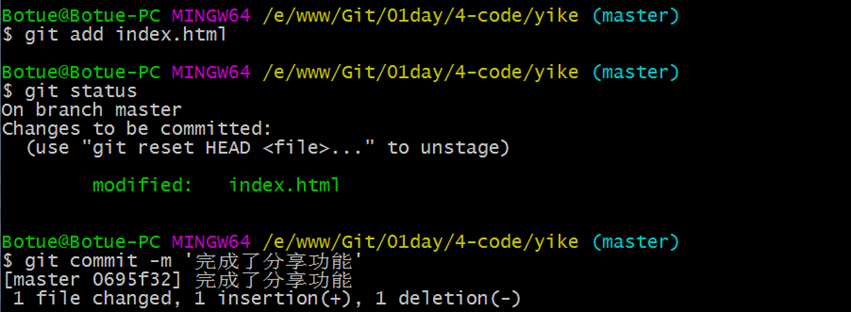
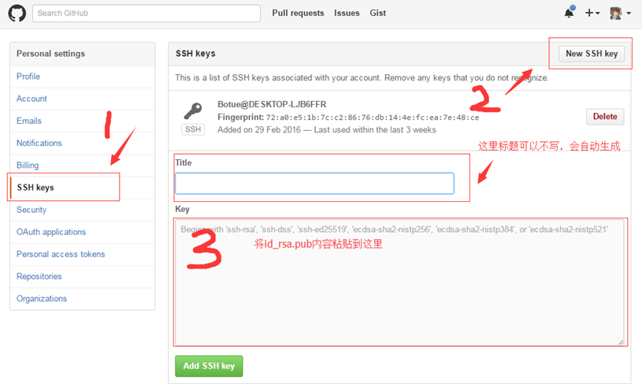

### 1. 版本控制-Git

#### 1.1. 什么是shell


在计算机科学中，Shell俗称壳，用来区别于Kernel（核），是指“提供使用者使用界面”的软件（命令解析器）。它类似于DOS下的command和后来的cmd.exe。它接收用户命令，然后调用相应的应用程序。


#### 1.2. shell分类

图形界面shell：通过提供友好的可视化界面，调用相应应用程序，如windows系列操作系统，Linux系统上的图形化应用程序GNOME、KDE等。

命令行shell：通过键盘输入特定命令的方式，调用相应的应用程序，如windows系统的cmd.exe、Windows PowerShell，Linux系统的Bourne shell ( sh)、Bourne Again shell ( bash)等。


#### 1.3. bash和shell

在window系统下使用bash，需要一个软件，这个软件模拟集成了bash大部分命令。

各个 shell 的功能都差不多， Linux 默认使用 bash ，所以我们主要学习bash的使用。


##### 1.3.1. bash命令格式

命令 [-options]  [参数]，如：tar  zxvf  demo.tar.gz

查看帮助：命令 --help

##### 1.3.2. bash常见命令


| 命令                          | 描述                                                                     |
| :---------------------------- | :---------------------------------------------------------------------- |
| pwd (Print Working Directory) | 查看当前目录                                                             |
| cd (Change Directory)         | 切换目录，如 cd /etc                                                     |
| ls (List)                     | 查看当前目录下内容，如 ls -al                                              |
| mkdir (Make Directory)        | 创建目录，如 mkdir blog                                                  |
| touch                         | 创建文件，如 touch index.html                                            |
| cat                           | 查看文件全部内容，如 cat index.html                                       |
| more/less                     | 查看文件，如more /etc/passwd、less /etc/passwd                            |
| rm (remove)                   | 删除文件，如 rm index.html、rm -rf  blog                                  |
| rmdir (Remove Directory)      | 删除文件夹，只能删除空文件夹，不常用                                        |
| mv (move)                     | 移动文件或重命名，如 mv index.html ./demo/index.html                      |
| cp (copy)                     | 复制文件，cp index.html ./demo/index.html                                |
| head                          | 查看文件前几行，如 head -5 index.html                                     |
| tail                          | 查看文件后几行 –n –f，如 tail index.html、tail -f -n 5 index.html         |
| tab                           | 自动补全，连按两次会将所有匹配内容显示出来                                   |
| history                       | 查看操作历史                                                             |
| > 和 >>                       | 重定向，如echo hello world! > README.md，>覆盖 >>追加                     |
| wget                          | 下载，如wget https://nodejs.org/dist/v4.4.0/node-v4.4.0.tar.gz           |
| tar                           | 解压缩，如tar zxvf node-v4.4.0.tar.gz                                    |
| curl                          | 网络请求，如curl http://www.baidu.com                                    |
| whoami                        | 查看当前用户                                                             |
| `|`                           | 管道符可以将多个命令连接使用，上一次（命令）的执行结果当成下一次（命令）的参数。 |
| grep                          | 匹配内容，一般结合管道符使用                                               |


#### 1.4. vi编辑器

如同Windows下的记事本，vi编辑器是Linux下的标配，通过它我们可以创建、编辑文件。它是一个随系统一起安装的文本编辑软件。


##### 1.4.1. 三种模式

vi编辑器提供了3种模式，分别是命令模式、插入模式、底行模式，每种模式下用户所能进行的操作是不一样的。

种模式的切换如下图所示：


通过上图我们发现，输入模式是不能直接切换到末行模式的，必须要先切回到命令模式（按ESC键）

##### 1.4.2. 使用vi编辑器

| 使用模式   | 描述                             |
| :-------- | :------------------------------ |
| 不需要模式 | 打开/创建文件vi 文件路径           |
| 底行模式   | :w保存，:w filenme另存为          |
| 底行模式   | :q退出                           |
| 底行模式   | :wq保存并退出                     |
| 底行模式   | e! 撤销更改，返回到上一次保存的状态 |
| 底行模式   | q! 不保存强制退出                 |
| 底行模式   | set nu 设置行号                  |
| 命令模式   | ZZ（大写）保存并退出              |
| 命令模式   | u辙销操作，可多次使用              |
| 命令模式   | dd删除当前行                      |
| 命令模式   | yy复制当前行                      |
| 命令模式   | p 粘贴内容                       |
| 命令模式   | ctrl+f向前翻页                   |
| 命令模式   | ctrl+b向后翻页                   |
| 命令模式   | i进入编辑模式，当前光标处插入       |
| 命令模式   | a进入编辑模式，当前光标后插入       |
| 命令模式   | A进入编辑模式，光标移动到行尾       |
| 命令模式   | o进入编辑模式，当前行下面插入新行   |
| 命令模式   | O进入编辑模式，当前行上面插入新行   |


当我们处在**编辑模式**的情况下，和我们在Windows编辑器的使用相似。


##### 1.4.3. SSH

SSH是一种网络协议，用于计算机之间的加密登录。

SSH只是一种协议，存在多种实现，既有商业实现，也有开源实现。本文针对的是**OpenSSH**，它是自由软件，应用非常广泛。

如果要在Windows系统中使用SSH，会用到另一种软件**PuTTY**，我们后面用到的Git客户也集成了SSH

格式：ssh user@host

user 代表真实存在的用户host代表要登录的远程计算机


常见有两种加密技术，分别是**对称性加密**和**非对称性加密**，SSH属于后者。


**对称加密算法**在加密和解密时使用的是同一个密钥；而**非对称加密算法**需要两个密钥来进行加密和解密，这两个秘钥分别是公开密钥(public key，简称公钥)和私有密钥(private key，简称私钥)。

##### 1.4.4. 工作原理

公钥和私钥是成对出现，可以通过ssh-keygen -t rsa来创建，既可以通过密钥来加密数据，也可以通过私钥来加密数据，如果是以公钥进行的数据加密，只能与之相对应的私钥才可以解密，相反如果以私钥进行的数据加密，则只能与之对应的公钥才可以将数据进行解密，这样就可以提高信息传递的安全性。


##### 1.4.5. 免密码登录

我们可以将本地机器上的公钥保存到特定的远程计算机上，这样当我们再次登录访问这台远程计算机时就可以实现免密码登录了。

- ssh-keygen -t rsa会创建公钥和密钥(默认在用户目录/.ssh目录下)

- ssh-copy-id user@host添加到对应远程主机的用户目录/.ssh目录下

- 也可以登录远程主机，进入到用户目录/.ssh目录下手动创建authorized_keys文件，并将自已的公钥粘入该文件。


#### 1.5. 关于版本控制

版本控制(**V**ersion **C**ontrol **S**ystems)是一种记录一个或若干文件内容变化，以便将来查阅特定版本修订情况的系统。这个系统可以自动帮我们备份文件的每一次更改，并且可以非常方便的**恢复**到任意的备份（版本）状态。

举例：我们通常都是手动的重命名一个文件进行备份的，index.html改成index1.html或者index.html.bak等形式，然后这种方式对于单个文件我们还能够管理，但是对于整个项目而言，就会成为噩梦了！！！我们不得不借助于软件来实现。


实现版本控制的软件有很多种类，大致可以分为本地版本控制系统、集中式版本控制系统、分布式版本控制系统。


#### 1.6. 本地版本控制系统

借助软件我们可以记录下文件的每一次修改，如下图所示，文件被修改后，记录下了**3个版本**，这样我们通过版本控制系统（软件）便可以非常方便的恢复到任意版本。


这种类型的版本控制系统，功能比较单一，比如**很难实现多人协同开发**，所以现在几乎很少使用了。


#### 1.7. 集中式版本控制系统

实际开发环境，一个项目通常是由**多人协作**共同完成的，如何让在不同终端上的开发者协同工作成了亟待解决的问题，集中式版本控制系统便应运而生了。它通过单一的集中管理的服务器，保存所有文件的修订版本，协同工作的开发者都通过**客户端连到这台服务器**，取出最新的文件或者提交更新。其代表为**SVN**，如下图所示。


这种方式很好解决了多人协同开发的问题，但是也有一个弊端，如果集中管理的服务器出现故障，**将会导致数据(版本)丢失的风险**，另外协同开发者从集中服务器中更新数据时，**严重依赖网络**，如果网络不佳，也给开发带来诸多不便。


#### 1.8. 分布式版本控制系统

分布式版本控制系统，则**不需要中央服务器**，每个协同开发者都拥有一个**完整的版本库**，这么一来，任何协同开发者用的服务器发生故障，事后都可以用其它协同开发者本地仓库恢复。

由于版本库在本地计算机，也便**不再受网络影响**了。如果要将本地的修改，推送给其它协同开发者，还需要一台**共享服务器**，所有开发者通过这台共享服务器**同步和更新**数据。如下图所示


分布式版本控制系统弥补了前面两种版本控制系统的缺陷，成为了版本控制的首选方案。其代表就是**Git**。


#### 1.9. Git安装

Window安装

http://git-scm.com/download/win下载Git客户端软件，和普通软件安装方式一样。

Linux安装

CentOS发行版：sudo yum install git

Ubuntu发行版：sudo apt-get install git

Mac安装

打开Terminal直接输入git命令，会自动提示，按提示引导安装即可。


#### 1.10. Git工作原理

为了更好的学习Git，我们们必须了解Git管理我们文件的**3种状态**，分别是已提交（committed）、已修改（modified）和已暂存（staged），由此引入 Git 项目的三个工作区域的概念：Git 仓库、工作目录以及暂存区域。

**Git仓库**目录是Git用来保存项目的元数据和对象数据库的地方。 这是Git 中最重要的部分，从其它计算机克隆仓库时，拷贝的就是这里的数据。

**工作目录**是对项目的某个版本独立提取出来的内容。这些从Git仓库的压缩数据库中提取出来的文件，放在磁盘上供你**使用或修改**。

**暂存区域**是一个文件，保存了下次将提交的文件列表信息，一般在Git仓库目录中。有时候也被称作“索引”（Index），不过一般说法还是叫暂存区域。


基本的Git工作流程如下：

- 在工作目录中修改文件。

- 暂存文件，将文件的快照放入暂存区域。

- 提交文件，找到暂存区域的文件，将快照永久性存储到Git仓库目录。

> Git本地仓库指的是开发者开发设备中的仓库。


#### 1.11. Git基础

命令行方式：任意目录（建议开发根目录）右键 > Git Bash Here

##### 1.11.1. 配置用户

配置用户的意义在于记录开发者信息，以便在版本控制记录开发者的操作行为，如lion于2016-08-24解决了一个bug。

git config --global user.name "自已的名字"

git config --global user.email "自已的邮箱地址"

--global 配置当前用户所有仓库

--system 配置当前计算机上所有用户的所有仓库

> 注：配置用户只需要执行1次，可以重复使用。

##### 1.11.2. 初始化仓库

我们如果想要利用git进行版本控制，需要将现有项目初始化为一个仓库，或者将一个已有的使用git进行版本控制的仓库克隆到本地。

git init


git init只是创建了一个名为.git的隐藏目录，这个目录就是存储我们历史版本的仓库，ls -al 可以查看。


假如公司已有项目用了Git，那我们就利用克隆，git clone 仓库地址


执行完这个命令，会在当前目录下生成一个Monment目录（默认和仓库名称相同），这个便是已有一个使用Git管理的项目。


##### 1.11.3. 查看文件状态

初始化仓库后便可以进行开发了，进入到刚刚创建好并初始为仓库的目录，添加我们开发需要的文件。

通过git status可以检测当前仓库文件的状态


> 注：git会忽略空的目录


##### 1.11.4. 添加文件到暂存区

假设经过一段时间的开发后，需要把已开发的部分存起来，使用git add 添加到暂存区。

git add 文件名/ 文件路径 “*”或-A代表所有


放到暂存区的文件被标记成了绿色，等待提交。

> 注：颜色是工具给添加的，目的是增加可读性并不是git统一的。

##### 1.11.5. 撤销更改

继续我们的开发

再次git status可以再次查看仓库状态


说明index.html再次被修改了，并被标记了**红色**。

又经过一段时间后发现新开发的部分有Bug，想要回到之前状态，可以使用git checkout 文件名。


> 注：从暂存区还原原到工作区

##### 1.11.6. 提交文件

经过一个相对较长阶段开发或者一个功能开发完成了，就可以提交到本地仓库了，永久保存了。

git commit -m '备注信息'


将暂存区被标记成绿色的文件，全部提交到**本地仓库**存储。


这时git status查看状态


没有什么可提交的，变的很**干净**。


##### 1.11.7. 查看提交历史

反反复复开发了很多的功能了，通过git log查看一下提交的历史。


我们可以查看到一次次提交记录

commit 81b1e4fc2ae178caedf4575596377a80a6f1e73f

代表一次提交的唯一ID，一般称为SHA值。

> 注：按键盘q键退出。


##### 1.11.8. 再次检测仓库文件状态

隔了好些天后，继续开发

git status 查看状态


又提示有修改，等待重新添加到暂存区。

##### 1.11.9. 重新添加暂存区然后提交




##### 1.11.10. 再次查看历史

git log 可查到所有提交历史


这时可以查看到更多提交历史。**这时关掉所有目录甚至关机！**


##### 1.11.11. 恢复上一次提交的状态

通过SHA值可以回到之前某一次的提交（时光倒流）

git reset --hard c888a614e072e2这样便回到了支付功能的状态

git log再次查看发现最后一次提交成了支付功能了

git 仓库示意图


#### 1.12. Git分支

在我们的现实开发中，需求往往是五花八门的，同时开发个需求的情况十分常见，比如当你正在专注开发一个功能时，突然有一个紧急的BUG需要你来修复，这个时候我们当然是希望在能够保存当前任务进度，再去修改这个BUG，等这个BUG修复完成后再继续我们的任务。如何实现呢？


**通过Git创建分支来解决实际开发中类似的问题。**

在Git的使用过程中一次提交称为历史记录（版本），并且会生成一个唯一的字符串，如下图


这个串可以代表某一个历史版本（**实际使用只取前面几位就可以**），

值得注意的是所有的**提交**（commit）实际上都是在**分支**（branch）的基础上进行的。如下图所示：


当我们在初始化仓库的时候（实际上是产生第1次提交时），Git会**默认**帮我们**创建**了一个**master**的分支，并且有**指针**（HEAD）指到了末端。

指针（HEAD）用来标明当前处于哪个分支的哪个版本，如上图指的处于master分支的最后1个版本。


我们也可以创建**自已的分支**


##### 1.12.1. 创建分支

git branch hotfix

新的分支会在当前分支原有历史版本的结点上进行创建，我称其为子分支如下图


> 新建的子分支会继承父分支的所有提交历史。

##### 1.12.2. 切换分支

git checkout hotfix


我们发现HEAD现在又指向了hotfix的**末端**。

##### 1.12.3. 再次提交操作

修改bug后，提交


当我们切换回master后，HEAD指向了master分支的末端，并且我们观察**发现我们的文件内容还是原来的"模样"**。


##### 1.12.4. 继续之前的开发


总结：当我们git checkout branchname时，HEAD会自动指向对应分支的末端，**工作目录中的源码也会随之发生改变**。


这个时候我们就在hotfix这个分支上修复了这个BUG，而我们原来在master分支上的操作并未受到影响。

思考一个问题：

现在master这个分支上是否包含了hotfix的修复呢？

实际上从上图可以看出这时的master分支并没有包含有hotfix的修复。


##### 1.12.5. 合并(融合)分支


这时master会有两个父结点了，master便包含了hotfix里的修复了


##### 1.12.6. 删除分支

git branch -d hotfix

这时用来修复BUG创建的hotfix分支已经没有用处了，我们可以将它删除。


#### 1.13. Git远程(共享)仓库

通过上面学习我们可以很好的管理本地版本控制了，可是如果我们下班回到家里突然来了灵感觉得有部分代码可以优化，如果能接着公司电脑上的代码继续写该有多好呀！另一种情形，假设项目比较大，不同的功能模块由不同的开发人员完成，不同模块儿之间又难免会依赖关系，这时如果我们的代码互相合并（融合）该有多好呀！所有模块开发完毕后，需要整合到一起，要能做到准确无误该有多好呀！

借助一个远程仓库，大家可以共享代码、历史版本等数据，便可以解决以上遇到的所有问题，在学习远程仓库前我们先来学习git clone path这个命令。


##### 1.13.1. 创建共享仓库

Git要求共享仓库是一个以**.git**结尾的目录。

mkdir repo.git 创建以.git结尾目录

cd repo.git 进入这个目录

git init --bare 初始化一个共享仓库，也叫裸仓库 **注意选项--bare**


这样我们就建好了一个共享的仓库，但这时这个仓库是一个**空的仓库**，并且不允在这个仓库中进行任何修改。

##### 1.13.2. 向共享仓库共享(同步)内容

将自已开发的项目同步到这个目录中，其它开发者就可以共享你开发的项目了。

- 进入到yike目录

- git push ../repo.git master，这样便把yike中的项目同步进了repo.git中。


##### 1.13.3. 从共享仓库里取出内容

- 新创建一个目录(模拟另一个开发者)

- git clone ./repo.git demo，通过repo.git共享仓库，我们轻松得到了一个yike的副本


##### 1.13.4. 通过demo仓库向repo.git共享内容

进入到demo里，我们做一些修改

cd demo

git push ../repo.git master


##### 1.13.5. 在360仓库从repo.git获取共享的内容

cd yike

git pull ../repo.git master


奇迹似乎发生了，我们轻松的将demo仓库里的内容，通过repo.git共享给了yike仓库。

惊喜不断，问题也总是不断，我们发现我们这个共享的仓库只是放到了本地的，其它人是没有办法从我们这个共享仓库共享内容的！！！
然而现实是，办法总是有的！！！！

我们把这个共享的仓库放到一台远程服务器上，问题不就解决了吗？


#### 1.14. gitHub和gitLab

如果我们熟悉服务器的话，我们完全可以将上述的步骤在我们的远程服务器上进行操作，然后再做一些登录权限的设置，就可非常完美的搭建一个共享服务器了。其实为了更好的管理我们的仓库，一些第三方机构开发出了**Web版仓库管理程序**，通过Web界面形式管理仓库。

gitHub关于它的名气与意义，大家可以自行查阅，我们这里介绍它的使用

##### 1.14.1. 注册账号并完善资料

自行注册略过

##### 1.14.2. 创建共享仓库


##### 1.14.3. 填写仓库资料


##### 1.14.4. 共享仓库


远程地址特别长，我们可以给他起一个别名

```shell
git remote add origin git@github.com:Botue/repo.git

```
这样origin 就代表 git@github.com:Botue/repo.git

当我们通过git clone 从共享仓库获内容时，会自动帮我们添加origin到对应的仓库地址，例如：git clone git@github.com:Botue/repo.git 会自动添加origin 对应 git@github.com:Botue/repo.git

##### 1.14.5. 生成密钥

ssh-keygen -t rsa 然后一路回车，这里会在当前用户生成了一个.ssh的文件夹


将id_rsa.pub公钥的内容复制，打开gitHub的个人中心





到此我们便可以通过gitHub 提供的Web界面来管理我们的仓库了。

我们发现通过gitHub管理仓库实在是太方便了，可是只能免费使用公开仓库，自已公司的代码当然不能公开了，可是私有仓库又是需要交“保护费”的，无耐国人还是比较喜欢免费的，网络界总是有很多雷峰的，比如gitLab!!!


gitLab也是一个可以通过Web界面管理仓库的网站程序，我们可以把它架设到公司自已的服务器上，实现仓库私有化，这也是大部分公司通常采用的方法，其使用方法与gitHub十分相似。


#### 1.15. 冲突解决

假如两个开发同时改到同一文件的同一段内容会发生什么事情呢？

这时就会就会产生冲突了，当冲突产生后，需要开发者进行协商确认冲突的原因，然后将冲突代码删除重新提交就可以了。


#### 1.16. gitignore忽略文件

在项目根目录下创建一个.gitignore文件，可以将不希望提交的罗列在这个文件里，如项目的配置文件、node_modules等

https://github.com/github/gitignore


#### 1.17. 比较差异

当内容被修改，我们无法确定修改哪些内容时，可以通过git diff来进行差异比较。

git difftool 比较的是工作区和暂存的差异

git difftool “SHA”比较与特定提交的差异

git difftool “SHA”“SHA”比较某两次提交的差异

git difftool 分支名称 比较与某个分支的差异

#### 1.18. 回滚（撤销）操作


HEAD 默认指向当前分支的“末端”，即最后的一次提交，但是我们通过git reset 可以改变HEAD的指向。

看情况解释（稍微复杂一些，理解就好）


git reset

- --hard 工作区会变、历史(HEAD)会变， 暂存区也变

- --soft 只会变历史(HEAD)

- --mixed（默认是这个选项）历史(HEAD)会变、暂存区也变，工作区不变

git checkout

git checkout SHA -- "某个文件"，代表只是从SHA这个版中取出特定的文件，**和git reset 是有区别的，reset 重写了历史，checkout 则没有**。


#### 1.19. 更新仓库

在项目开发过程中，经常性的会遇到远程（共享）仓库和本地仓库不一致，我们可以通过git fetch 命令来更新本地仓库，使本地仓库和远程（共享）仓库保持一致。

git fetch  “远程主机” 或者 git fetch “远程主机” “分支名称”

我们要注意的是，利用git fetch 获取的更新会保存在本地仓库中，但是并没有体现到我们的工作目录中，需要我们再次利用git merge来将对应的分支合并（融合）到特定分支。如下

git pull origin 某个分支， 上操作相当于下面两步

git fetch

git merge origin/某个分支

git branch -a 便可以查看所有(本地+远程仓库)分支了


#### 1.20. 其他

删除远程分支git push origin --delete 分支名称

删除远程分支git push origin :分支名称


#### 1.21. 不同平台同账号配置

##### 1.21.1. 生成公钥

```shell
ssh-keygen -t rsa -C "gana10007@163.com"  -f ~/.ssh/coding-rsa
#coding-rsa:生成公钥私钥对的文件名称
# ~/.ssh/表示生成的路径,windows下指向C:\Users\Administrator,Administrator表示当前的用户名
```

##### 1.21.2. 托管平台配置

1. 托管平台有很多,例如:[号称全球最大的同性交友平台的github](https://github.com)、[码市](https://coding.net)和[码云](https://gitee.com)
2. 配置方式大同小异,以github为例:

    -   

    - 选择settings,当然英文不好的可以直接使用浏览器的翻译功能(推荐谷歌)
    - 
    - 这里就可以看到设置选项
3. 点击New SSH key,将之前生成的coding.net.pub文件中内容全部复制过来
    -   

5. 点击新建之后会有标题和公钥内容的选项,标题无所谓

##### 1.21.3. 配置多个平台托管
1. 在.ssh目录下创建一个名字是config的文件,主要此文件没用后缀名
2. 文件的内容如下

    ```shell
    StrictHostKeyChecking no
    # 为了更简化，把known_hosts也省略掉了
    UserKnownHostsFile /dev/null
    # coding
    Host git.coding.net
    User gana10007@163.com
    PreferredAuthentications publickey
    IdentityFile ~/.ssh/coding.net
    # github
    Host github.com
    User gana10007@163.com
    PreferredAuthentications publickey
    IdentityFile ~/.ssh/github
    ```

3. 如果稍微有点编程基础应该能看的出是啥意思,IdentityFile指向你不同托管平台存放公钥的文件名

4. 具体配置如下图
    - 

5. 测试是否能够连接:

    ```shell
     ssh -T git@github.com
    ```

6. **注意:@后面跟的内容以平台项目的地址为准,例如码市的: `ssh -T git@git.conding.net`**

#### 1.22. 同平台下多个账号配置

##### 1.22.1. 具体配置项

```shell
StrictHostKeyChecking no
UserKnownHostsFile /dev/null  # 为了更简化，把known_hosts也省略掉了
# github
Host github.com1
HostName github.com
User gana10007@163.com
PreferredAuthentications publickey
IdentityFile ~/.ssh/github
# github
Host github.com2
HostName github.com
User yanjianjie6158@163.com
PreferredAuthentications publickey
IdentityFile ~/.ssh/admin-coder163
```
##### 1.22.2. 测试是否连通

```shell
$ ssh -T git@github.com2

```
##### 1.22.3. 设置局部的用户名和邮箱：

```shell
git config user.email "one_email"
git config user.email "two_email"
```
##### 1.22.4. 添加remote

```shell
#删除原来的
git remote rm origin
#添加新的
$ git remote add origin git@github.com2:489405826/coinbigapi.wiki.git
```
***
以上配置完成就可以正常拉去和推送


