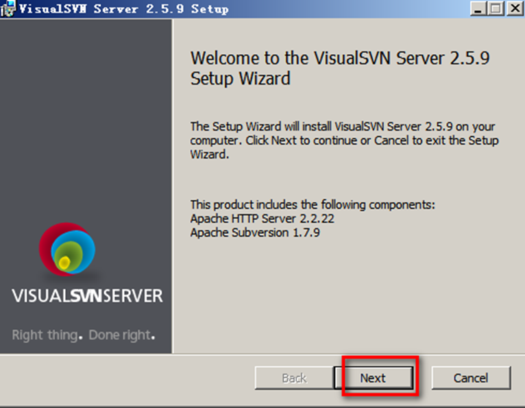
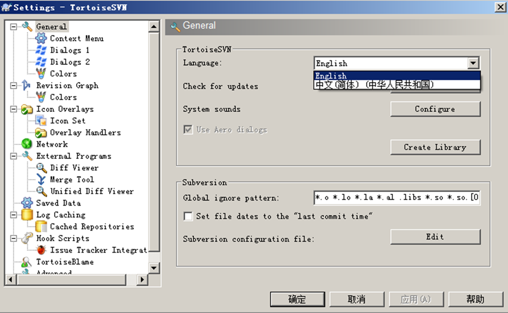

### 1. 版本控制-SVN

一个开源的版本管理软件

可架设在Apache上，使用http或https协议访问；也可使用内置的svn协议访问

SVN由客户端和服务器端两部分组成

#### 1.1. Windows下SVN的安装

##### 1.1.1. 服务器端安装

##### 1.1.2. 创建版本库

##### 1.1.3. 创建用户

##### 1.1.4. 访问服务器

##### 1.1.5. 客户端安装

##### 1.1.6. SVN客户端的使用

##### 1.1.7. 向服务器的版本库中导入文件

> 注意：导入完成之后最后一个确定不要点,而选择【取消】

##### 1.1.8. 从版本库中导出文件

