### 1. 创建项目和配置文件详解

#### 1.1. 创建Java项目

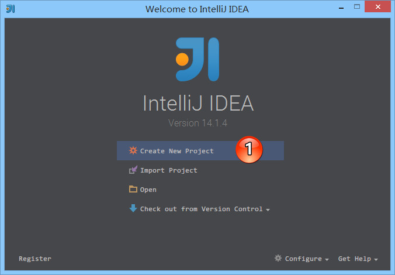

> - 如上图标注 1 所示，点击 Create New Project 进入向导式创建项目

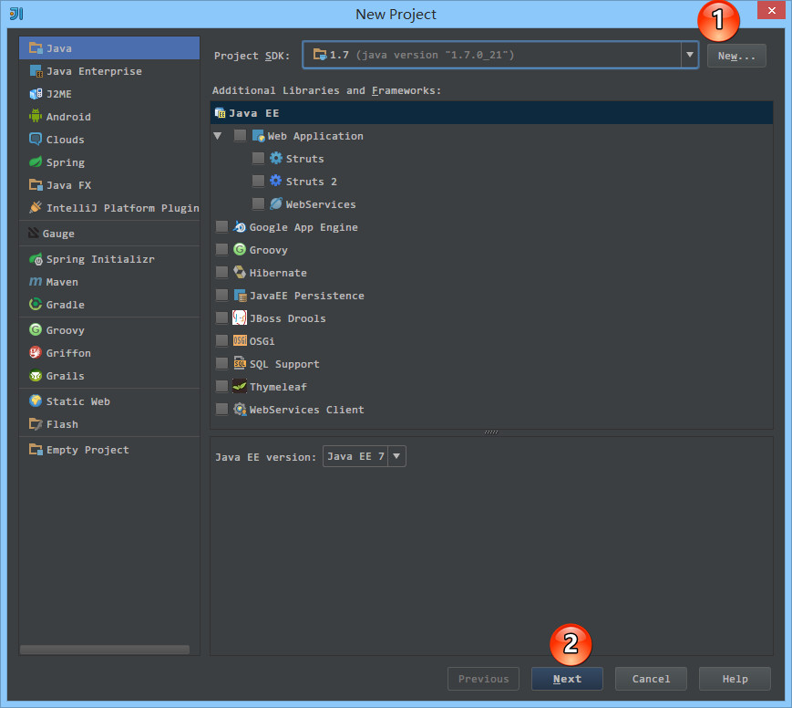

> - 如上图标注 1 所示，如果此时 IntelliJ IDEA 还没有配置任何一个 SDK 的话，可以点击 New... 先进行 SDK 的配置。
> - 如上图标注 2 所示，配置好 SDK 或选择好 SDK 之后，点击 Next 进入下一步。

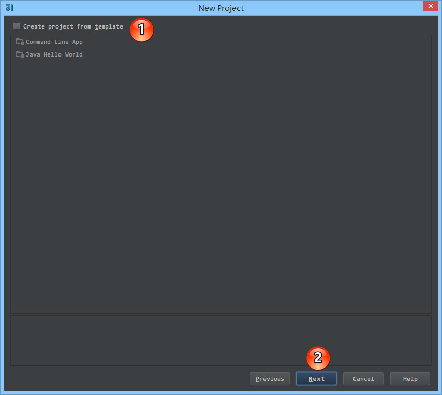

> - 如上图标注 1 所示，可以选择模板快速创建项目。
> - Command Line App 会自动创建一个带有 main 方法的类。
> - Java Hello World 会自动创建一个带有 main 方法的并且会打印输出 Hello World 的类。
> - 我们这里不勾选使用模板，而是手工创建，所以我们点击上图标注 2，进入下一步。

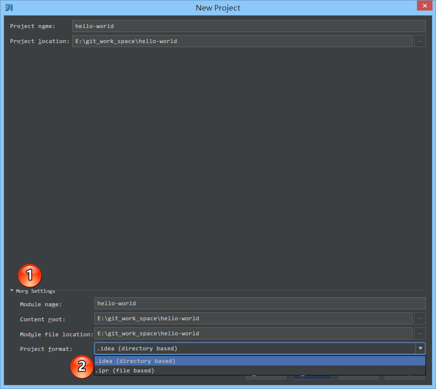

> - 如上图标注 1 所示，默认 More Settings 是没有展开的，点击此处可以展开更多细节的信息。
> - 如上图标注 2 所示，IntelliJ IDEA 的项目格式文件主要提供两种方式
> - .idea (directory based) 创建项目的时候自动创建一个 .idea 的项目配置目录来保存项目的配置信息。这是默认选项。
> - .ipr (file based) 创建项目的时候自动创建一个 .ipr 的项目配置文件来保存项目的配置信息。
> - 需要特别注意的是，我这边默认创建的项目编码是 GBK，而如果你需要 UTF-8 的话，修改编码的方式请看第 10 讲。

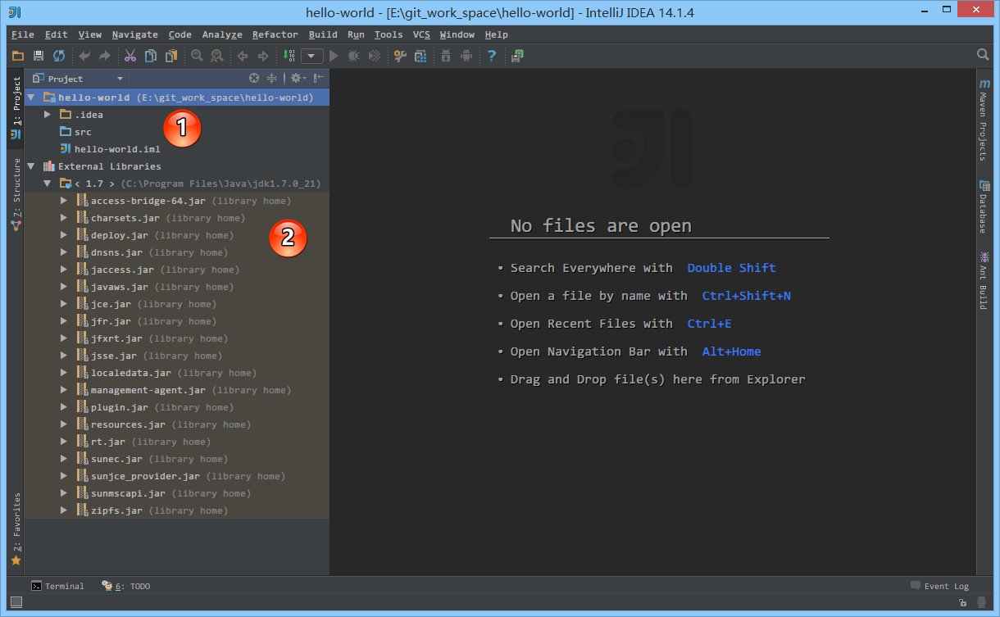

> - 如上图标注 1 所示，根据《常见文件类型的图标介绍》章节我们知道，src 目录为蓝色表示 Source root，我们可以再此目录下创建包和类。
> - 如上图标注 2 所示，由于该项目使用的是 JDK 7，所以项目是基于 JDK 7，我们可以调用 JDK 7 中的类。

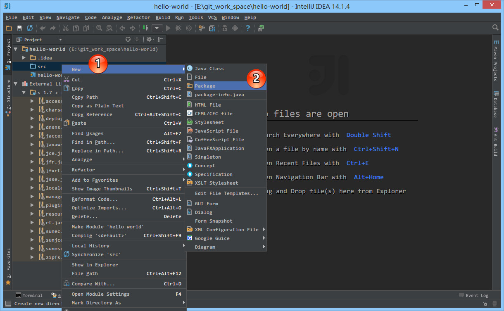

> - 如上图标注 1，2 所示，在 src 目录右键，选择 New 创建包目录。

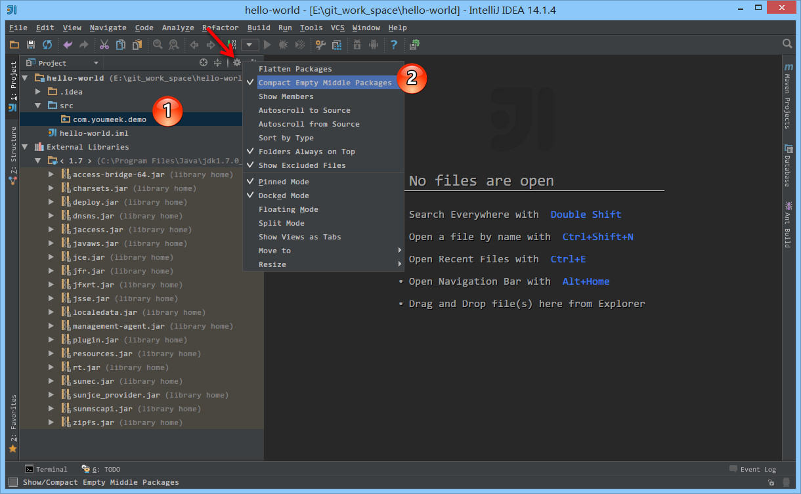

> - 如上图标注 1 所示，在没有文件的情况下包目录默认是连在一起的，这不方便看目录层级关系。
> - 如上图标注 箭头 所示，点击此齿轮，在弹出的菜单中去掉选择标注 2 选项：Compact Empty Middle Packages。

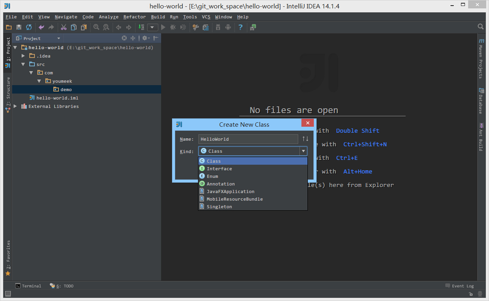

> - 如上图所示，在包下可以直接创建 Class、Interface、Enum、Annotation 等常见类型文件。

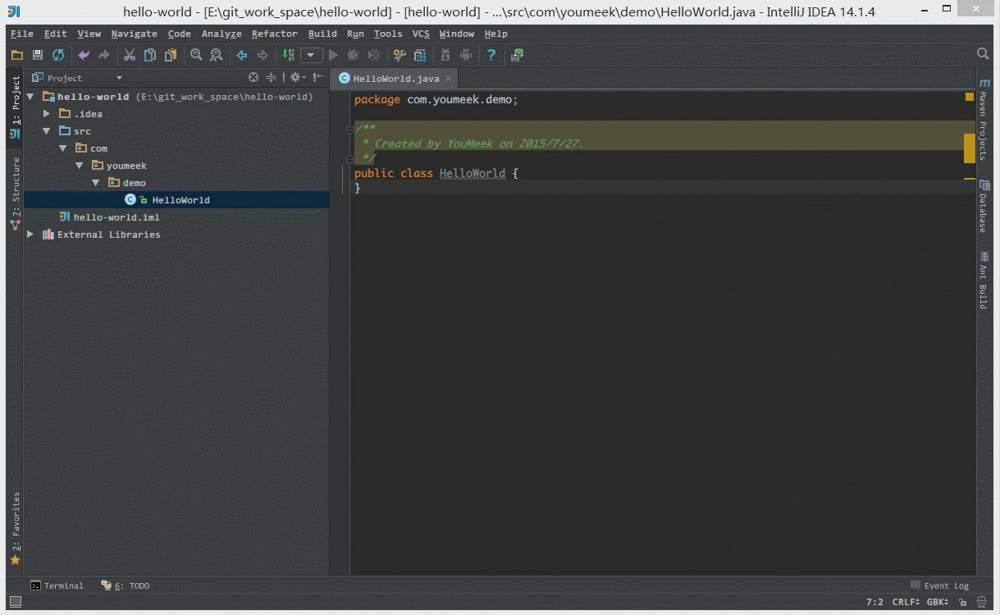

> - 如上图 Gif 演示，写一个 main 方法，打印输出 Hello world。

> - 如上图 Gif 演示，运行 main 方法，打印输出 Hello world。

#### 1.2. 创建Web项目

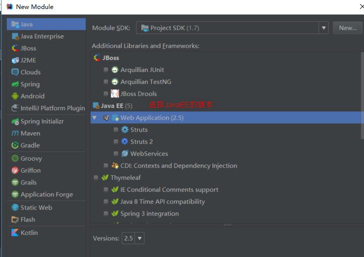

##### 1.2.1. 关联Tomcat

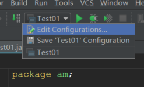

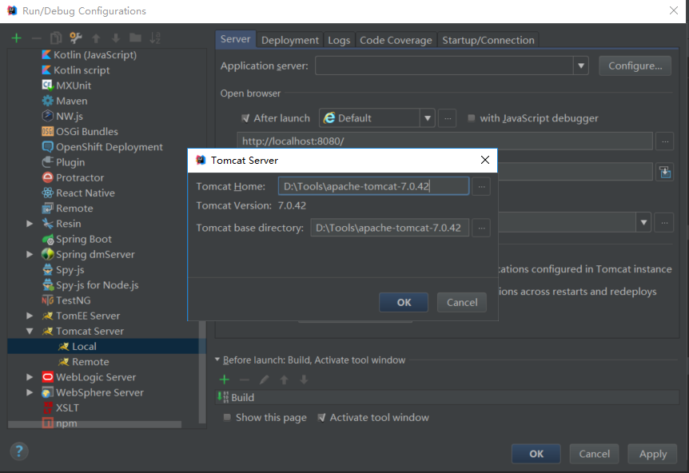

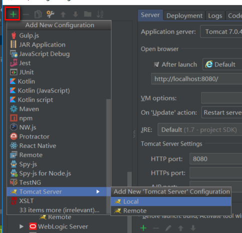

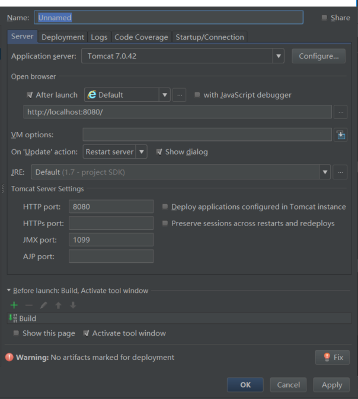

##### 1.2.2. 部署项目

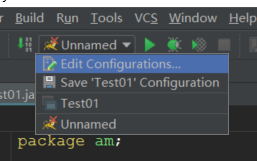

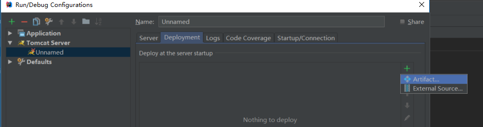

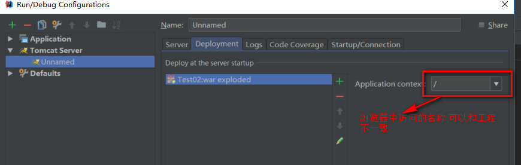

#### 1.3. 项目配置文件介绍

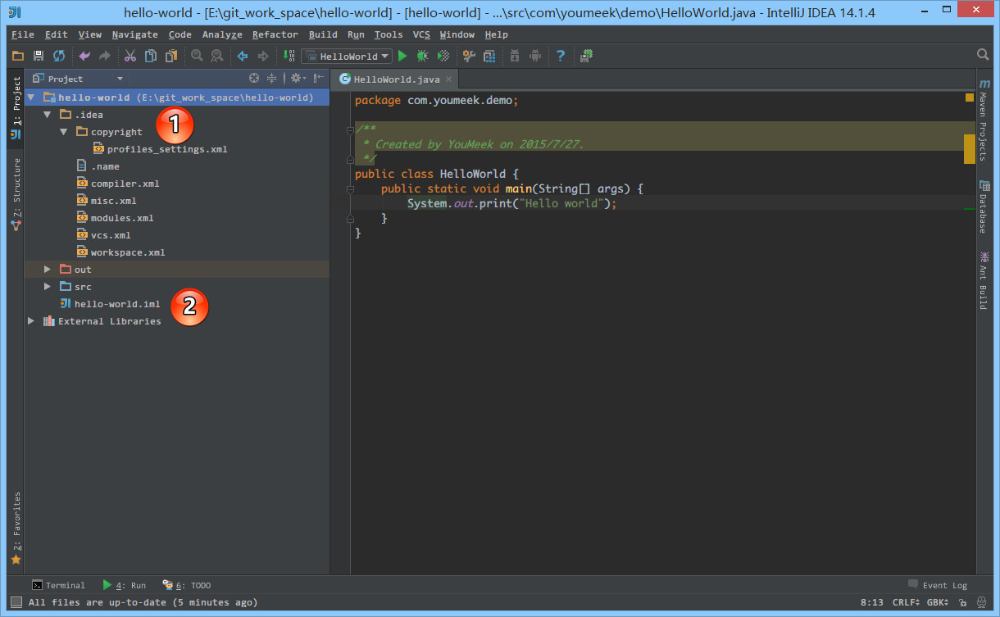

> - 如上图标注 1 所示，.idea 即为 Project 的配置文件目录。
> - 如上图标注 2 所示，.iml 即为 Module 的配置文件。
> - 通过上面的了解我们也知道 IntelliJ IDEA 项目的配置变动都是以这些 XML 文件的方式来表现的，所以我们也可以通过了解这些 XML 文件来了解 IntelliJ IDEA 的一些配置。也因为此特性，所以如果在项目协同中，我们要保证所有的项目配置一致，就可以考虑把这些配置文件上传到版本控制中（包括 .idea 目录和 .iml 文件）。如果把这些文件加入到版本控制之后，那又有一点是需要考虑的，那就是协同者 Checkout 项目下来之后，按自己的需求进行项目配置的之后，项目的 XML 文件也会跟着变化。此时协同者的这些变化的文件就不应该再上传到版本控制中。至于如何更好地控制这些不想随时提交的文件，在接下来的版本控制专讲中会进行详细讲解。

