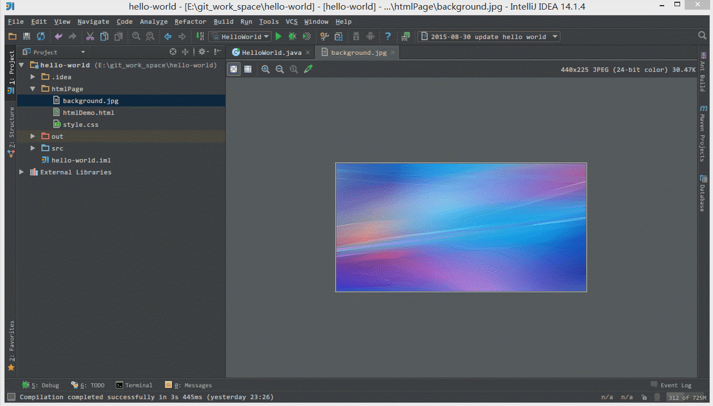
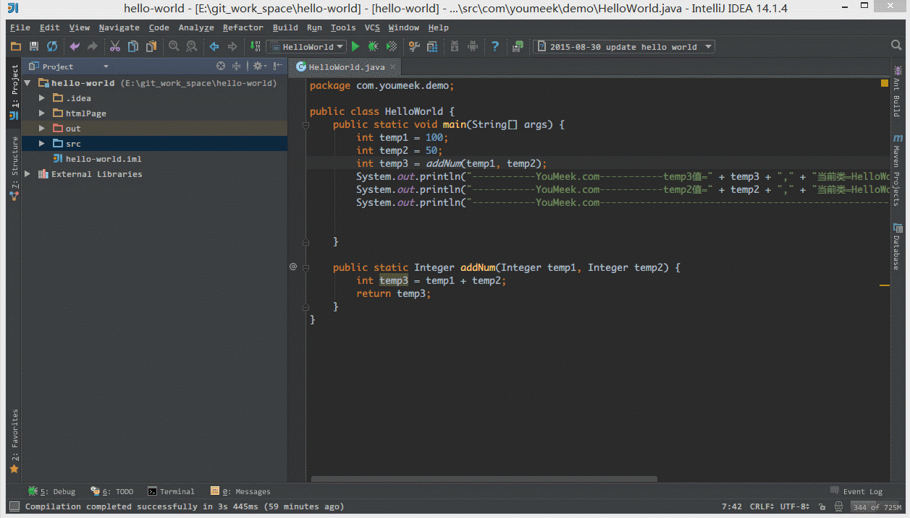

### 1. 常用设置

#### 1.1. 自动编译开关

#### 1.2. 忽略大小写开关

IDEA默认是匹配大小写，此开关如果未关。你输入字符一定要符合大小写。比如你敲string是不会出现代码提示或智能补充。但是，如果你关闭了区分大小写的开关，你无论输入String或者string都会出现代码提示或者智能补充！

#### 1.3. 智能导包开关

你在代码中，只要敲list，就会出现提示，自动导入java.util.List这个类。

> - 如上图标注 1 所示，当我们 Java 类中导入的某个包下类超过这里设置的指定个数，就会换成用 * 号来代替。

> - 如上图 Gif 所示，IntelliJ IDEA 默认是会折叠空包的，这样就会出现包名连在一起的情况。但是有些人不喜欢这种结构，喜欢整个结构都是完整树状的，所以我们可以去掉演示中的勾选框即可。

#### 1.4. 悬浮提示开关

这个容易理解，打开这个开关后。只要把鼠标放在相应的类上，就会出现提示，如下图所示

#### 1.5. 取消单行显示tabs的操作

打开多个文件的时候，会换行显示，非常直观。大大提升效率！

#### 1.6. 文件 Tab 个数

> - 如上图箭头所示，该设置可以增加打开的文件 Tab 个数，当我们打开的文件超过该个数的时候，早打开的文件会被新打开的替换。

#### 1.7. 项目文件编码

Transparent native-to-ascii conversion的意思是：自动转换ASCII编码。

这样做是为了防止文件乱码。这样你的properties文件，一般都不会出现中文乱码！

#### 1.8. 滚轴修改字体大小

> - 如上图 Gif 所示，我们可以勾选此设置后，增加 Ctrl + 鼠标滚轮 快捷键来控制图片的大小显示。

#### 1.9. 设置行号显示

> - 如上图红圈所示，默认 IntelliJ IDEA 是没有勾选 Show line numbers 显示行数的，但是我建议一般这个要勾选上。
> - 如上图红圈所示，默认 IntelliJ IDEA 是没有勾选 Show method separators 显示方法线的，这种线有助于我们区分开方法，所以也是建议勾选上的。

#### 1.10. 代码等级检查

如上图 Gif 所示，该功能用来快速设置代码检查等级。我个人一般在编辑大文件的时候会使用该功能。IntelliJ IDEA 对于编辑大文件并没有太大优势，很卡，原因就是它有各种检查，这样是非常耗内存和 CPU 的，所以为了能加快大文件的读写，我一般会暂时性设置为 None。

> - Inspections 为最高等级检查，可以检查单词拼写，语法错误，变量使用，方法之间调用等。
> - Syntax 可以检查单词拼写，简单语法错误。
> - None 不设置检查。

#### 1.11. 代码折叠

> - 如上图标注红圈所示，我们可以对指定代码类型进行默认折叠或是展开的设置，勾选上的表示该类型的代码在文件被打开的时候默认是被折叠的，去掉勾选则反之。

#### 1.12. 代码分组

> - 如上图 Gif 所示，IntelliJ IDEA 支持对代码进行垂直或是水平分组。一般在对大文件进行修改的时候，有些修改内容在文件上面，有些内容在文件下面，如果来回操作可能效率会很低，用此方法就可以好很多。当然了，前提是自己的浏览器分辨率要足够高。

#### 1.13. 单词拼写

> - 如上图箭头所示，IntelliJ IDEA 默认是开启单词拼写检查的，有些人可能有强迫症不喜欢看到单词下面有波浪线，就可以去掉该勾选。但是我个人建议这个还是不要关闭，因为拼写检查是一个很好的功能，当大家的命名都是标准话的时候，这可以在不时方便地帮我们找到代码因为拼写错误引起的 Bug。

#### 1.14. 窗口复位

> - 如上图 Gif 所示，我们可以对组件窗口的子窗口进行拖动移位，有时候设置过头或是效果不满意，那我们需要点击此按钮进行窗口还原。

#### 1.15. 行首注释

> - 如上图 Gif 所示，默认 IntelliJ IDEA 对于 Java 代码的单行注释是把注释的斜杠放在行数的最开头，我个人觉得这样的单行注释非常丑，整个代码风格很难看，所以一般会设置为单行注释的两个斜杠跟随在代码的头部。

#### 1.16. 代码风格

> - 如上图 Gif 所示，默认 Java 代码的头个花括号是不换行的，但是有人喜欢对称结构的花括号，可以进行此设置。对于此功能我倒是不排斥，我个人也是颇喜欢这种对称结构的，但是由于这种结构会占行，使得文件行数变多，所以虽然我个人喜欢，但是也不这样设置。

#### 1.17. 默认项目打开

如上图标注 1 所示，勾选此选项后，启动 IntelliJ IDEA 的时候，默认会打开上次使用的项目。如果你只有一个项目的话，该功能还是很好用的，但是如果你有多个项目的话，建议还是关闭，这样启动 IntelliJ IDEA 的时候可以选择最近打开的某个项目。

如上图红圈所示，该选项是设置当我们已经打开一个项目窗口的时候，再打开一个项目窗口的时候是选择怎样的打开方式。

> - Open project in new window 每次都使用新窗口打开。
> - Open project in the same window 每次都替换当前已打开的项目，这样桌面上就只有一个项目窗口。
> - Confirm window to open project in 每次都弹出提示窗口，让我们选择用新窗口打开或是替换当前项目窗口。

#### 1.18. 代码折行

> - 如上图 Gif 所示，对于横向太长的代码我们可以进行软分行查看。软分行引起的分行效果是 IntelliJ IDEA 设置的，本质代码是没有真的分行的

#### 1.19. 显示的记录文件个数

#### 1.20. 忽略某些后缀

> - 如上图标注 1 所示，该区域的后缀类型文件在 IntelliJ IDEA 中将以标注 2 的方式进行打开。
> - 如上图标注 3 所示，我们可以在 IntelliJ IDEA 中忽略某些后缀的文件或是文件夹，比如我一般会把 .idea 这个文件夹忽略。

#### 1.21. 组件窗口隐藏

> - 如上图 Gif 所示，当我们设置了组件窗口的 Pinned Mode 属性之后，在切换到其他组件窗口的时候，已设置该属性的窗口不会自动隐藏。

#### 1.22. 文件定位

> - 如上图 Gif 所示，我们可以通过 Alt + F1 + 1 快捷键来定位当前文件所在 Project 组件窗口中的位置

#### 1.23. 模拟请求

> - 如上图 Gif 所示，IntelliJ IDEA 自带模拟请求工具 Rest Client，在开发时用来模拟请求是非常好用的。

#### 1.24. 设置全局的默认设置

