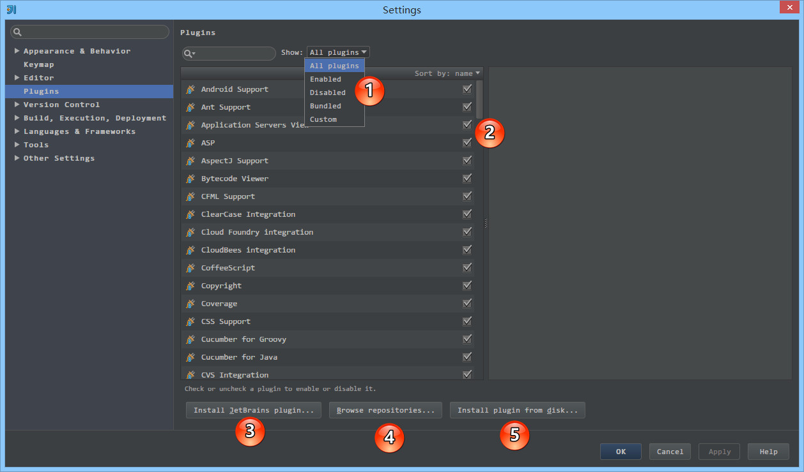
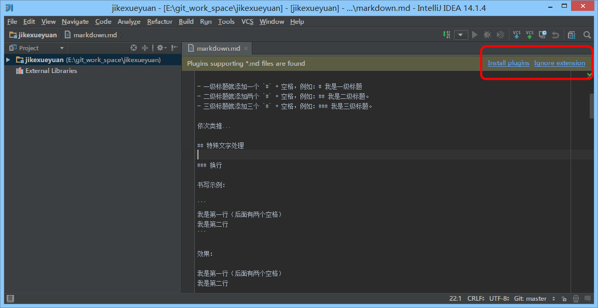
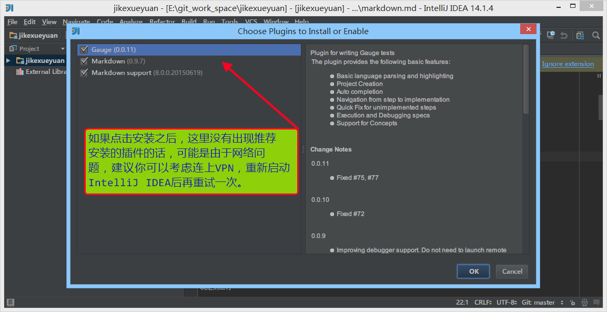
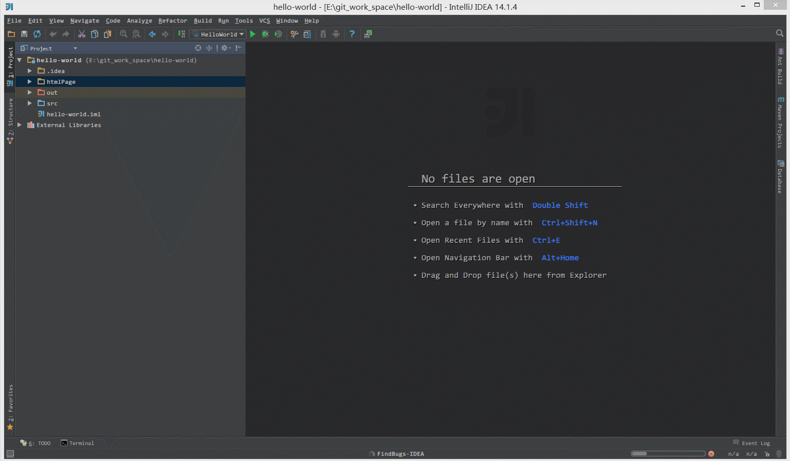
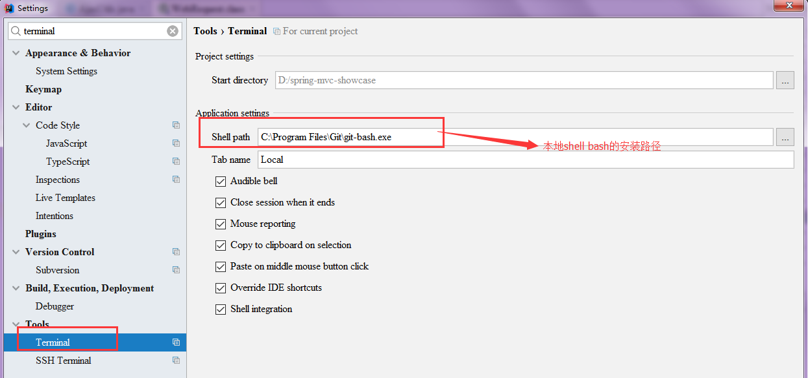

### 1. 插件的设置

在 IntelliJ IDEA 的安装讲解中我们其实已经知道，IntelliJ IDEA 本身很多功能也都是通过插件的方式来实现的，只是 IntelliJ IDEA 本身就是它自己的插件平台最大的开发者而已，开发了很多优秀的插件。

> - 官网插件库：https://plugins.jetbrains.com/




如上图标注 1 所示，IntelliJ IDEA 对插件进行了很好的分类：

- All plugins 显示所有插件。
- Enabled 显示当前所有已经启用的插件。
- Disabled 显示当期那所有已经禁用的插件。
- Bundled 显示所有 IntelliJ IDEA 自带的插件。
- Custom 显示所有我们自行安装的插件，如果你自己装了很多次插件的话，这个选项会用得比较多。
- 如上图标注 2 所示，启用的插件是被勾选的，如果要禁用一个插件，去掉勾选即可。
- 如上图标注 3 所示，弹出 IntelliJ IDEA 公司自行开发的插件仓库列表，供下载安装。
- 如上图标注 4 所示，弹出插件仓库中所有插件列表供下载安装。
- 如上图标注 5 所示，浏览本地的插件文件进行安装，而不是从服务器上下载并安装。
- 需要严重注意的是：在国内的网络下，很经常出现显示不了插件列表，或是显示了插件列表，无法下载完成安装。这时候请自行开VPN，一般都可以得到解决






> - 如上图红圈所示，如果 IntelliJ IDEA 打开一个它可以识别并且支持的文件类型，它会提示你它有对应的插件进行支持，你可以安装对应的插件来加以兼容此类文件。


> - 如上图 Gif 演示，在线安装 IntelliJ IDEA 插件库中的插件。





> - 如上图 Gif 演示，离线安装本地插件文件。

#### 1.1. 插件推荐


| 插件名称                | 插件介绍                                                                      | 官网地址                                                                                                |
| :--------------------- | :--------------------------------------------------------------------------- | :----------------------------------------------------------------------------------------------------- |
| Key promoter           | 快捷键提示                                                                    | [https://plugins.jetbrains.com/plugin/4455?pr=idea](https://plugins.jetbrains.com/plugin/4455?pr=idea) |
| CamelCase              | 驼峰式命名和下划线命名交替变化                                                  | [https://plugins.jetbrains.com/plugin/7160?pr=idea](https://plugins.jetbrains.com/plugin/7160?pr=idea) |
| CheckStyle-IDEA        | 代码样式检查                                                                  | [https://plugins.jetbrains.com/plugin/1065?pr=idea](https://plugins.jetbrains.com/plugin/1065?pr=idea) |
| FindBugs-IDEA          | 代码 Bug 检查                                                                 | [https://plugins.jetbrains.com/plugin/3847?pr=idea](https://plugins.jetbrains.com/plugin/3847?pr=idea) |
| Statistic              | 代码统计                                                                      | [https://plugins.jetbrains.com/plugin/4509?pr=idea](https://plugins.jetbrains.com/plugin/4509?pr=idea) |
| JRebel Plugin          | 热部署                                                                        | [https://plugins.jetbrains.com/plugin/?id=4441](https://plugins.jetbrains.com/plugin/?id=4441)         |
| CodeGlance             | 在编辑代码最右侧，显示一块代码小地图                                             | [https://plugins.jetbrains.com/plugin/7275?pr=idea](https://plugins.jetbrains.com/plugin/7275?pr=idea) |
| Eclipse Code Formatter | 使用 Eclipse 的代码格式化风格，在一个团队中如果公司有规定格式化风格，这个可以使用。 | [https://plugins.jetbrains.com/plugin/6546?pr=idea](https://plugins.jetbrains.com/plugin/6546?pr=idea) |
| GsonFormat             | 把 JSON 字符串直接实例化成类                                                   | [https://plugins.jetbrains.com/plugin/7654?pr=idea](https://plugins.jetbrains.com/plugin/7654?pr=idea) |


#### 1.2. IDEA集成终端

集成Cmder

settings->Tool->Terminal

> Shell path ：cmd.exe  "/k %CMDER_ROOT%\\vendor\\init.bat"

集成GitBash




#### 1.3. 翻译插件

插件地址：[GitHub](https://github.com/YiiGuxing/TranslationPlugin/)

#### 1.4. 阿里开发规范检查插件

插件地址：[GitHub](https://github.com/alibaba/p3c)

> 该插件有Eclipse版本

#### 1.5. lombok插件

- 控制台日志颜色自定义
- 对JavaBean提供了相应的GetSet以及ToString注解支持,无需再生产相应的方法
- 如果想实现日志的多色打印需要安装另外一个插件，因为不需要配置所以不再详细记录 ，下载地址：[官方地址](官网:http://marketplace.eclipse.org/content/ansi-escape-console )

插件地址： http://projectlombok.googlecode.com/files/lombok.jar

##### 1.5.1. 安装步骤
运行Lombok.jar

> java -jar  D:\001_software\work\Java\libs\lombok.jar

官网:https://projectlombok.org/

更多参考资料:https://www.ibm.com/developerworks/cn/java/j-lombok/

确认完eclipse的安装路径后，点击install/update按钮，即可安装完成

安装完成之后，请确认eclipse安装路径下是否多了一个lombok.jar包，并且其配置文件eclipse.ini中是否 添加了如下内容:

```ini
-javaagent:lombok.jar
#也可以没有
-Xbootclasspath/a:lombok.jar
# 如果上面的答案均为true，那么恭喜你已经安装成功，否则将缺少的部分添加到相应的位置即可
```


