### 1. 数据库-MySQL数据库的安装

#### 1.1. 数据库的安装

1.  打开下载的 mysql 安装文件双击解压缩，运行“mysql-5.5.40-win32.msi”

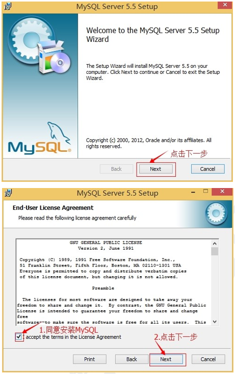

2.  选择安装类型，有“Typical（默认）”、“Complete（完全）”、“Custom（用户自定义）”三个选项，选择“Custom”，按“next”键继续。

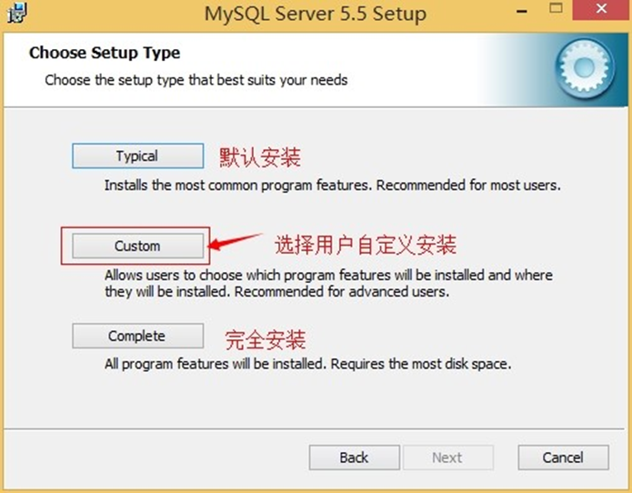

3. 点击"Browse",手动指定安装目录

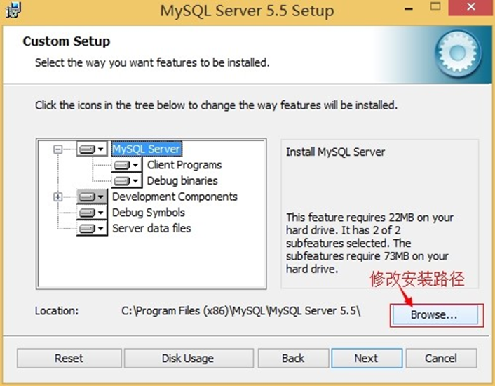

4. 填上安装目录，我的是“d:\Program Files (x86)\MySQL\MySQL Server 5.0”，按“OK”继续

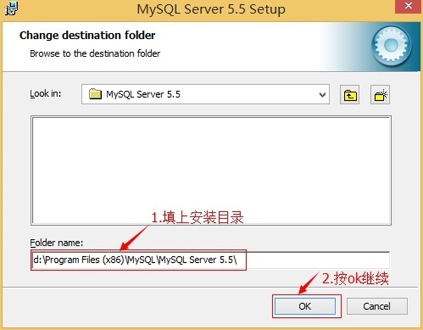

5. 确认一下先前的设置，如果有误，按“Back”返回重做。按“Install”开始安装。

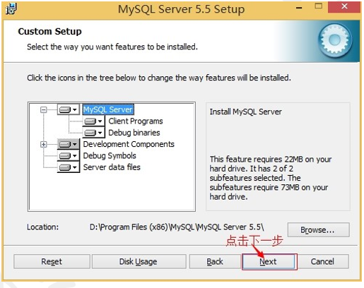

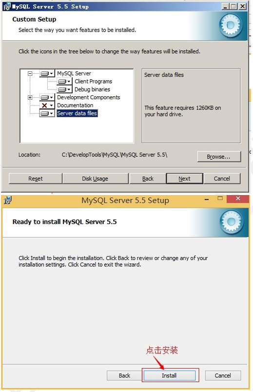
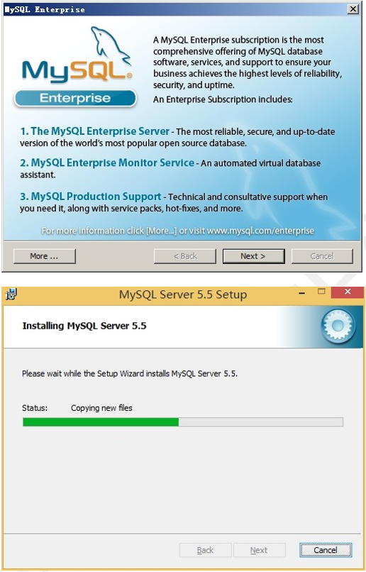

6. 正在安装中，请稍候，直到出现下面的界面, 则完成 MYSQL 的安装

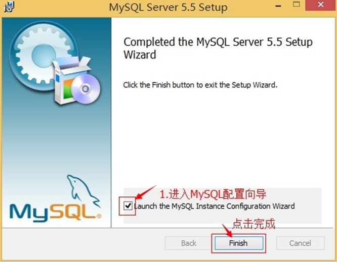

> 	数据库安装好了还需要对数据库进行配置才能使用 MYSQL 的配置

7.	安装完成了，出现如下界面将进入 mysql 配置向导。

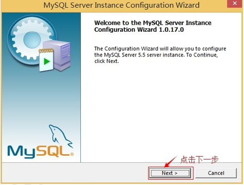

8.	选择配置方式，"Detailed Configuration（手动精确配置）"、"Standard Configuration（标准配置）"，我们选择“Detailed Configuration”，方便熟悉配置过程。

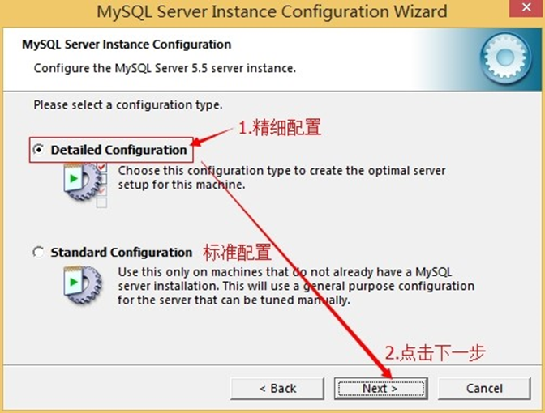

9.	选择服务器类型，“Developer Machine（开发测试类，mysql 占用很少资源）”、“Server Machine（服务器类型，mysql 占用较多资源）”、“Dedicated MySQL Server Machine（专门的数据库服务器，mysql 占用所有可用资源)

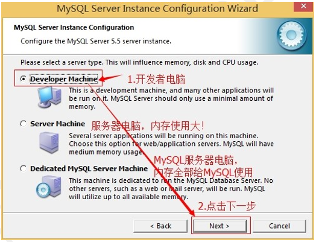

10.	选择mysql数据库的大致用途，"Multifunctional Database（通用多功能型好）"、"TransactionalDatabase Only（服务器类型，专注于事务处理，一般）"、“Non-Transactional Database Only（非事务处理型，较简单，主要做一些监控、记数用，对 MyISAM 数据类型的支持仅限于 non-transactional），按“Next” 继续。 

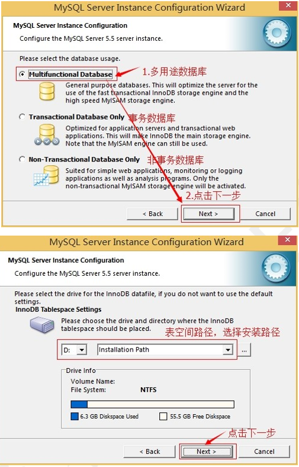

11.	选择网站并发连接数，同时连接的数目，“Decision Support(DSS)/OLAP（20个左右）“Online”、 Transaction Processing(OLTP)（500 个左右）”、“Manual Setting（手动设置，自己输一个数）”。

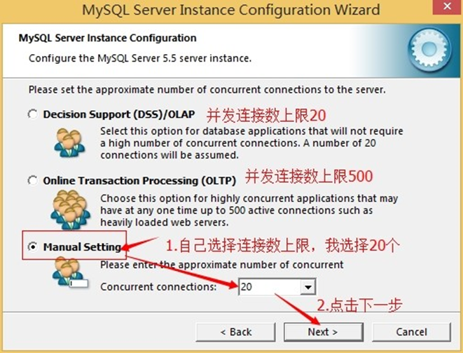

12.	是否启用 TCP/IP 连接，设定端口，如果不启用，就只能在自己的机器上访问 mysql 数据库了，在这个页面上，您还可以选择“启用标准模式”（Enable Strict Mode），这样 MySQL 就不会允许细小的语法错误。如果是新手，建议您取消标准模式以减少麻烦。但熟悉 MySQL 以后，尽量使用标准模式，因为它可以降低有害数据进入数据库的可能性。按“Next”继续 

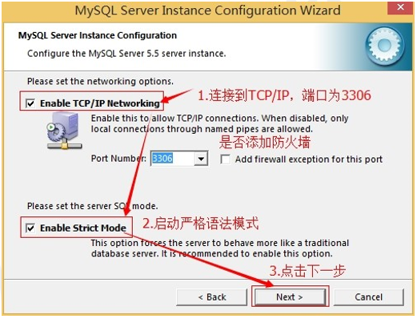

13.	就是对 mysql 默认数据库语言编码进行设置（重要），一般选 UTF-8，按 “Next”继续

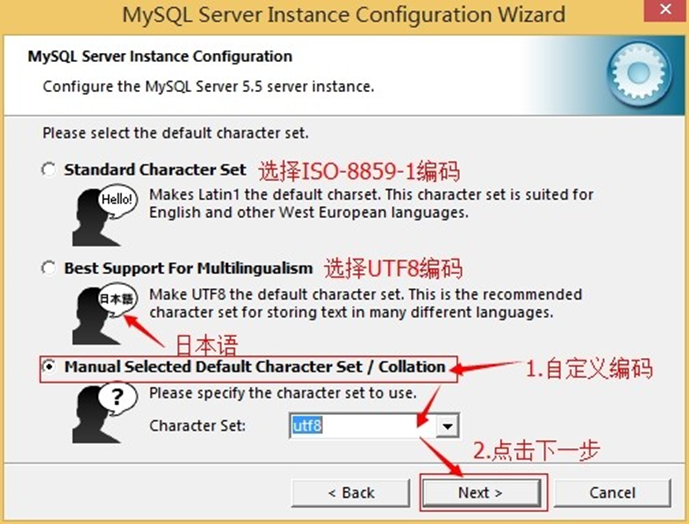

14.	选择是否将 mysql 安装为 windows 服务，还可以指定 Service Name（服务标识名称），是否将 mysql 的 bin 目录加入到 Windows PATH（加入后，就可以直接使用 bin 下的文件，而不用指出目录名，比如连接，“mysql.exe -uusername -ppassword;”就可以了，不用指出 mysql.exe 的完整地址，很方便），我这里全部打上了勾，Service Name 不变。按“Next”继续。

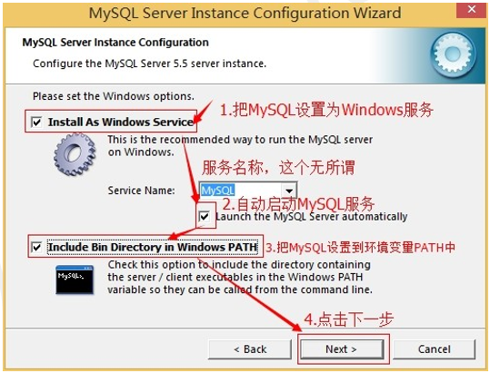

15.	询问是否要修改默认 root 用户（超级管理）的密码。“Enable root access from remote machines（是否允许 root 用户在其它的机器上登陆，如果要安全，就不要勾上，如果要方便，就勾上它）”。最后“Create An Anonymous Account（新建一个匿名用户，匿名用户可以连接数据库，不能操作数据，包括查询）”，一般就不用勾了，设置完毕，按“Next”继续。

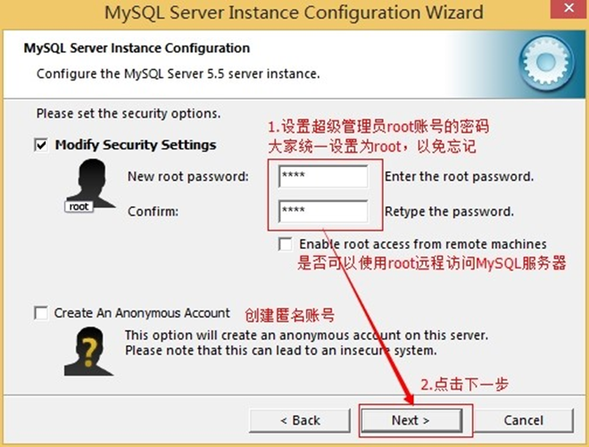

16.	确认设置无误，按“Execute”使设置生效，即完成 MYSQL 的安装和配置。

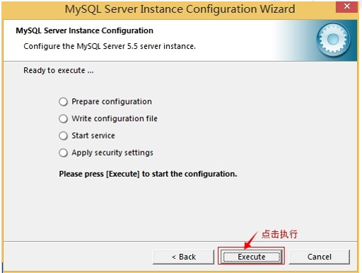

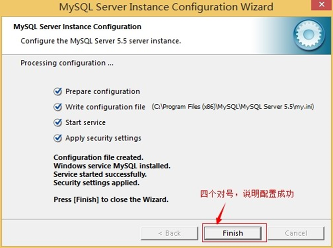

> 注意：设置完毕，按“Finish”后有一个比较常见的错误，就是不能“Start service”，一般出现在以前有安装 mysql 的服务器上，解决的办法，先保证以前安装的 mysql 服务器彻底卸载掉了；不行的话，检查是否按上面一步所说，之前的密码是否有修改，照上面的操作；如果依然不行，将 mysql 安装目录下的 data 文件夹备份，然后删除，在安装完成后，将安装生成的 data 文件夹删除，备份的 data 文件夹移回来，再重启 mysql 服务就可以了，这种情况下，可能需要将数据库检查一下，然后修复一次，防止数据出错

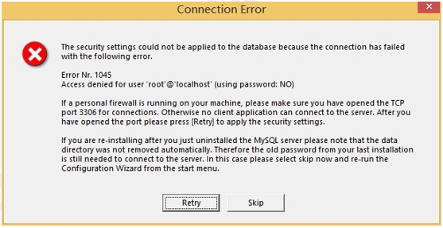

> 	解决方法：卸载 MySQL,重装 MySQL

#### 1.2. 数据库的卸载

1. 停止 window 的 MySQL 服务。 找到“控制面板”-> “管理工具”-> “服务”，停止 MySQL 后台服务。

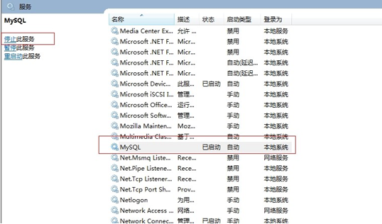

2. 卸载 MySQL 安装程序。找到“控制面板”-> "程序和功能"，卸载 MySQL 程序。

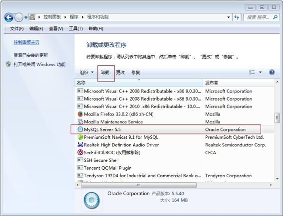

3. 删除MySQL安装目录下的所有文件

4. 删除 c 盘 ProgramDate 目录中关于 MySQL 的目录。路径为：C:\ProgramData\MySQL(是隐藏文件,需要显示出来)

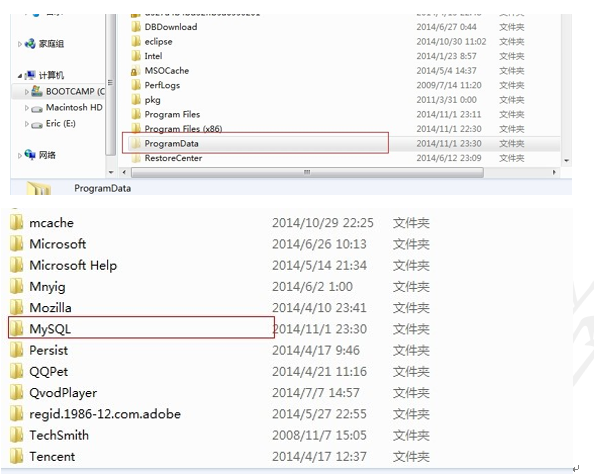

#### 1.3. 数据库服务的启动与登录

通过服务的方式自动启动

手动启动的方式

##### 1.3.1. Windows 服务方式启动

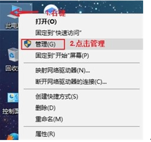

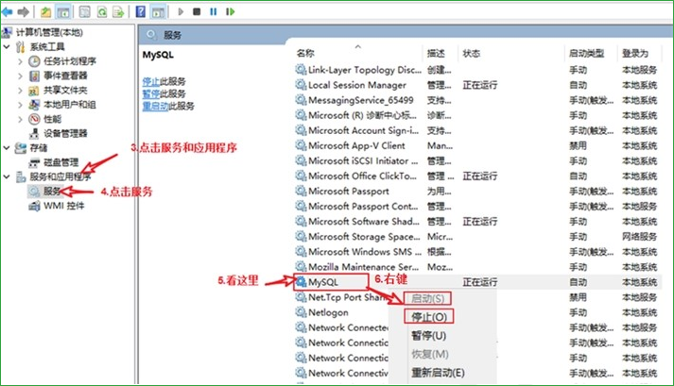

##### 1.3.2. DOS命令启动

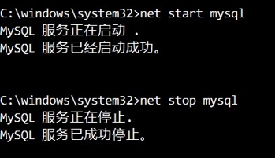

##### 1.3.3. 控制台连接数据库

MySQL 是一个需要账户名密码登录的数据库，登陆后使用，它提供了一个默认的 root 账号，使用安装时设置的密码即可登录

##### 1.3.4. 登录格式 1：

- u 和 p 后面没有空格
- mysql -u用户名 -p密码

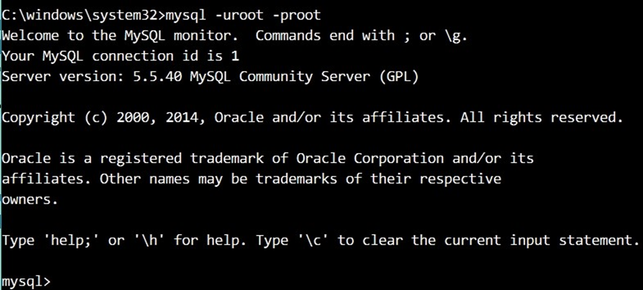

- 后输入密码方式：

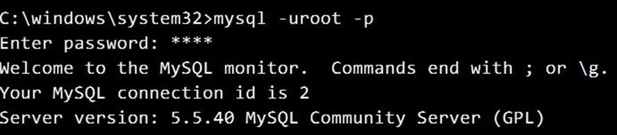

##### 1.3.5. 登录格式 2

- mysql -hip地址 -u用户名 -p密码
- 127.0.0.1代表本机IP

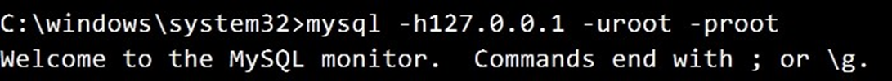

##### 1.3.6. 登录格式 3

- mysql --host=ip地址 --user=用户名 --password=密码

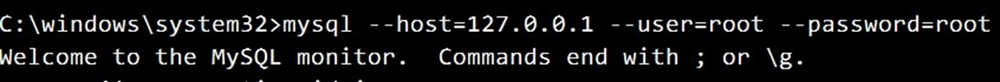

##### 1.3.7. 退出 MySQL

- quit或exit

#### 1.4. SQLyog 图形化工具——客户端 

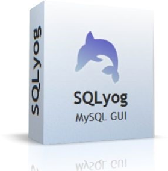

##### 1.4.1. 使用 SQLyog 登录数据库

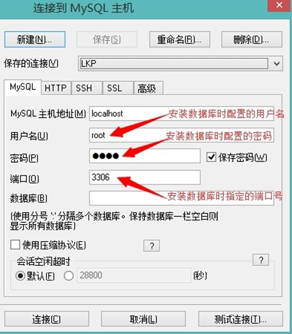

#### 1.5. MySQL 目录结构

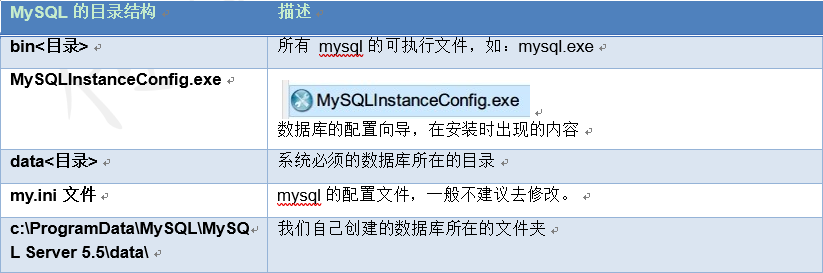