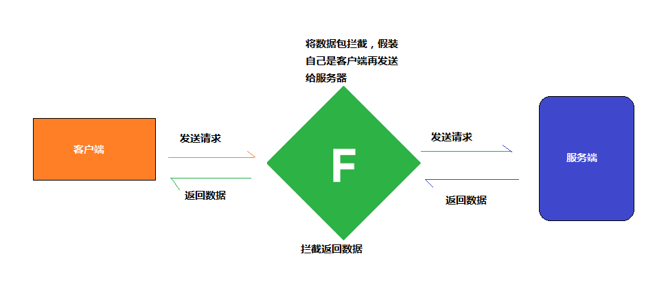
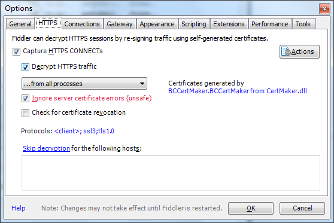

### 1. 什么是 Fiddler

Fiddler是一款免费强大的抓包工具，有了它可以抓取我们在网上的一些请求数据，除了PC端之外，手机也可以使用它来抓包。

原理就是它能够代理我们一些数据的访问和返回，它以web代理服务器的形式工作：

那么我们有了这个 Fiddler 工具之后，就可以对一些数据进行拦截，拿到我们想要的数据，还可以对请求数据进行篡改，有一些游戏不是根据你玩了多少分然后排名的么？如果我们能够使用它来拦截请求数据，把分数改高一点，再请求给服务器，是不是很爽？当然了，Fiddler 的用处还有很多。比如Python爬虫前的数据解析等骚操作

点击File->Capture Traffic就可以来抓包了

### 2. Chrome配置

Fiddler使用的代理地址：127.0.0.1，端口是：8888。我比较喜欢使用 Chrome 浏览器，简单说下配置 Chrome 使用 Fiddler ，也就是让 Fiddler 来抓取我们在 Chrome 浏览器请求和返回数据。

Chrome 默认会使用系统的代理，你可以在 Chrome 浏览器中的设置-->高级-->打开代理设置来设置你的代理地址和端口号。

接着点击局域网设置，勾选为 LAN 使用代理服务器 ，把地址：127.0.0.1，端口：8888 填进去就可以了。

### 3. 抓取 HTTPS 请求数据

现在已经很多请求都是用 https 了，那么我们得给 Fiddler 安装证书才可以使用，有些 Windows 系统在使用的时候会发现这样的错误：

> - 1.Tunnel to 443
> - 2.!ERROR: Failed to generate Certificate using CertEnroll.
> - System.Reflection.TargetInvocationException…

需要设置抓取 HTTPS 请求，点击菜单 Tools->Options , 接着选择 HTTPS ,选择 Decrypt HTTPS traffic。

接着点击右上角的 Action 按钮，然后选择 Reset All Certificates。

然后在 Chrome 中输入 localhost:8888,下载证书进行安装。

如果还是发现 Tunnel to 443 错误的话，可以下载[fiddlercertmaker.exe](https://wistbean.github.io/images/fiddlercertmaker.exe) ，双击运行安装。再打开Fiddler。

最后在 菜单 Tools->Options 右上角的 Action 按钮选择 Trust Root Certificate。

那么接下来就可以进行抓包了，在 Chrome 中输入百度的网址之后，可以看到如下的样子：

Result : 请求的 HTTP(s) 状态吗

Protocol : 请求协议

HOST : 请求的主机名

URL : 请求的资源目录位置

Body : 请求大小

Caching : 请求的缓存

Content-Type : 服务器响应的实体类型

Process : 是谁（进程）发送的

Comments : 备注
Custom : 自定义

当我们点击某一条请求后，在右边的 Insepector 中就可以看到具体的请求和返回信息内容了：

那么这时候就可以分析某个你想要抓取的接口的返回数据，对其进行正则分析，做你想做的事情。

> 参考资料：https://blog.csdn.net/lone1013/article/details/81222556