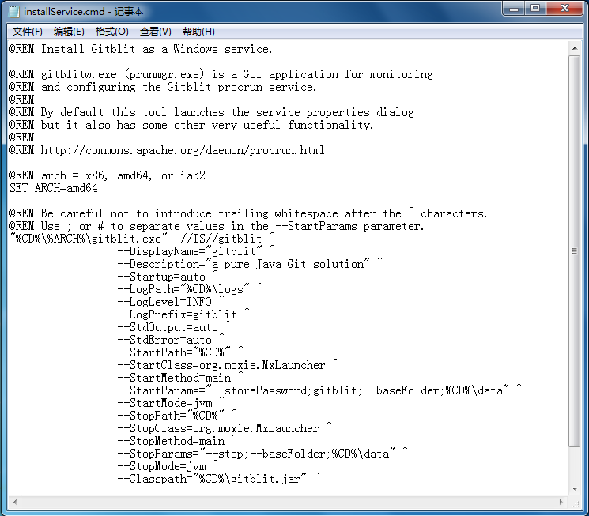
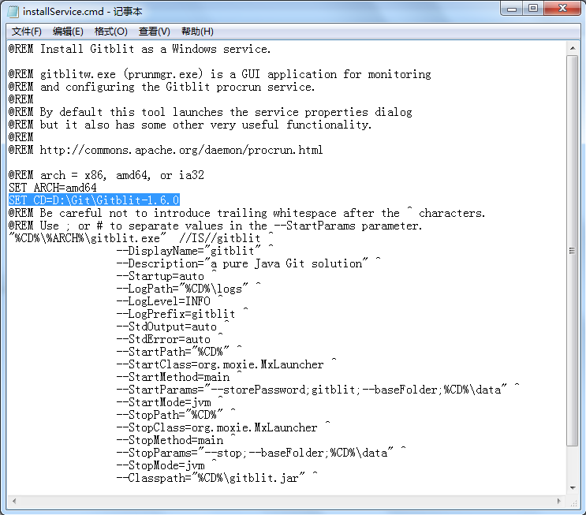

### 1. 搭建gitblit

下载地址：http://www.gitblit.com/

解压缩下载的压缩包即可，无需安装。

创建用于存储资料的文件夹。

### 2. 配置gitblit.properties 文件

找到Git目录下的data文件下的gitblit.properties文件，“记事本”打开。

找到git.repositoriesFolder(资料库路径)，赋值为之前创建好的文件目录。

找到server.httpPort，设定http协议的端口号

找到server.httpBindInterface，设定服务器的IP地址。这里就设定你的服务器IP。

找到server.httpsBindInterface，设定为localhost

### 3. 运行gitblit.cmd 批处理文件

运行结果如下，运行成功。

在浏览器中打开,现在就可以使用GitBlit了。

### 4. 设置以Windows Service方式启动Gitblit.

在Gitblit目录下，找到installService.cmd文件。

用“记事本”打开。

修改 ARCH

32位系统：SET ARCH=x86

64位系统：SET ARCH=amd64

添加 CD 为程序目录

SET CD=D:\Git\Gitblit-1.6.0(你的实际目录)

修改StartParams里的启动参数，给空就可以了。

保存，关闭文件。

以Windows Service方式启动Gitblit.

双击Gitblit目录下的installService.cmd文件(以管理员身份运行)。

在服务器的服务管理下，就能看到已经存在的gitblit服务了。

平时使用时，保持这个服务是启动状态就可以了。