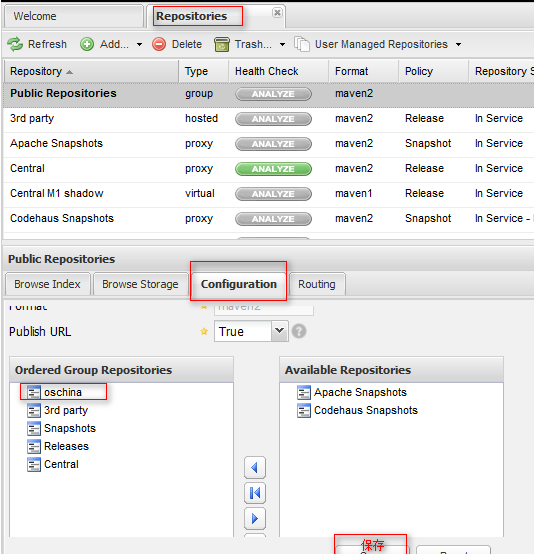

### 1. 安装


#### 1.1. 访问


### 2. 3配置maven镜像


#### 2.1. 配置成功的标志


### 3. 更新nexus的索引

将nexus的服务停止

替换索引文件


### 4. 4添加nexus的远程代理仓库

地址：

- 开源中国社区：http://maven.oschina.net/content/groups/public/
- sonatype：http://repository.sonatype.org/content/groups/public/


点击保存之后刷新浏览器




### 5. 项目发布

向指定仓库中发布jar

```shell
mvn install:install-file -DgroupId=com.oracle -DartifactId=ojdbc14 -Dversion=10.2.0.1.0 -Dpackaging=jar -Dfile=C:/oracle/product/10.2.0/db_1/jdbc/lib/ojdbc14.jar
```

#### 5.1. Nexus中仓库的类型

宿主仓库：一般我们发布的项目全部搞到这里

代理仓库：osichina，一般情况下备用仓库

虚拟机仓库：为了兼容以前的版本而保留的仓库,但是现在基本废弃了

仓库组：可以包含多种仓库


#### 5.2. 发布的版本

一般情况下版本发布：junit4.10.1

< 主版本 >  ------   < 次版本 > ------ < 增量版本 > ------ < 里程碑版本 >


Maven版本的划分

- 快照版：Snapshot版本代表不稳定、尚处于开发中的版本

- 发布版：Release版本则代表稳定的版本

### 6. 3在nexus中发布项目

#### 6.1. 创建宿主仓库


#### 6.2. 创建一个可以使用本仓库的用户


#### 6.3. 创建角色


#### 6.4. 给角色赋予权限


给角色绑定权限


#### 6.5. 给用户绑定角色


#### 6.6. 配置发布项目的账号


远程发布的指令：deploy


启用快照版本支持

```xml
	<profile>
		<id>local-rep</id>
			<repositories>
				<repository>
					<id>local-rep</id>
					<url>http://192.168.1.106:8083/nexus/content/groups/public/</url>
				<snapshots>
					<enabled>true</enabled>
				</snapshots>
					<release>
						<enabled>true</enabled>
					</release>
				</repository>
			</repositories>
	</profile>

    </profiles>
	 <activeProfiles>
		<activeProfile>local-rep</activeProfile>
	</activeProfiles>
```