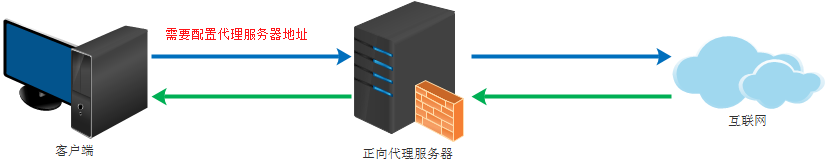
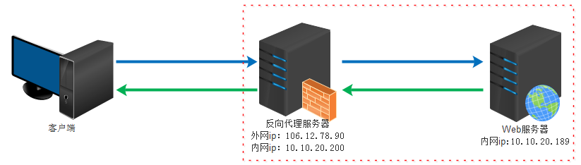
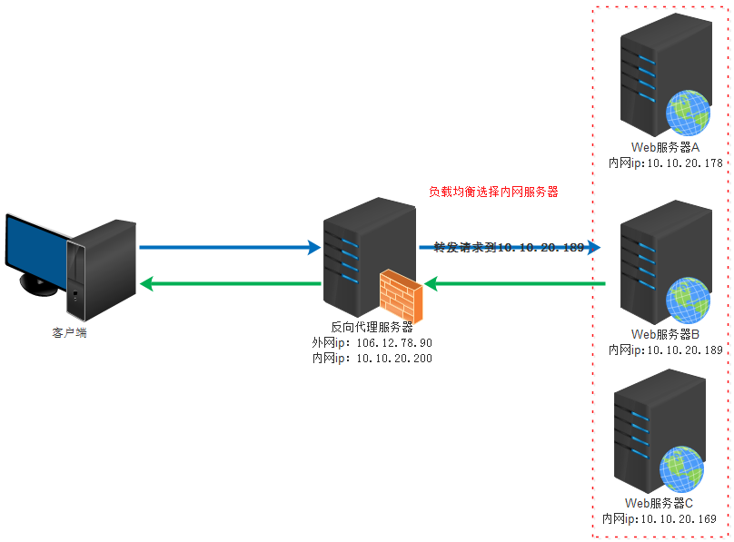

### 1. 什么是Nginx

Nginx是一个Http和反向代理服务器。使用Nginx可以容易的完成负载均衡。

不管是在window下配置负载均衡还是在Linux下配置负载均衡基本都是部署多台Tomcat和一台Nginx，通过访问Nginx映射到不同的Tomcat服务器提供资源。


### 2. 为什么选择nginx


Nginx是一个高性能的Web和反向代理服务器，它具有非常多的优越性。

- 在高连接并发的情况下,Nginx是Apache服务器不错的替代品,能够支持高达50000的并发访问量.

- Nginx作为负载均衡服务器.

- Nginx是一个安装非常简单,配置文件非常简洁,Bugs非常少的服务器,你还可以不间断服务的情况下进行软件版本的升级.


### 3. 负载均衡

负载均衡其意思就是分摊到多个操作单元上进行执行，从而共同完成工作任务。

简单而言就是当有2台或以上服务器时，根据规则随机的将请求分发到指定的服务器上处理，负载均衡配置一般都需要同时配置反向代理，通过反向代理跳转到负载均衡。而Nginx目前支持自带3种负载均衡策略，还有2种常用的第三方策略。

#### 3.1. RR(默认策略)

每个请求按时间顺序逐一分配到不同的后端服务器，如果后端服务器down掉，能自动剔除。（具体是因为Nginx会自动判断服务器的状态，如果服务器处于不能访问（服务器挂了），就不会跳转到这台服务器）。

#### 3.2. 权重

指定轮询几率，weight和访问比率成正比，用于后端服务器性能不均的情况。


#### 3.3. Iphash

上面两种都有一个问题，那就是session不能共享，比如用户现在登录请求的接口是服务器A，而登陆之后又请求验证登录状态，这时候访问了B，由于session不能共享，将导致严重后果，所以使用iphash可以解决这个问题，怎么解决呢？就是同一个用户固定访问同一个服务器。


#### 3.4. fair(第三方)

按照后端服务器的响应时间来分配请求，响应时间短的优先分配。


#### 3.5. url_hash(第三方)


按照访问url的hash结果来分配请求，使每个url定向到同一个服务器，需要在upstream中添加hash语句，server语句中不可以写weight等其他参数，hash_method写hash算法，例如crc32。（其中，fair和url_hash需要引入第三方模块才可以使用）。


### 4. 动静分离

动静分离是让动态网站里的动态网页根据一定规则把不变的资源和经常变得资源区分开来。

添加location ~{}，其中root是根目录，而location后面是正则表达式，例如图片gif|jpg|png等等，可以通过配置将不同的请求分配给不同的服务器来处理。


### 5. 正向代理

正向代理类似一个跳板机，代理访问外部资源。



举个例子：

我是一个用户，我访问不了某网站，但是我能访问一个代理服务器，这个代理服务器呢,他能访问那个我不能访问的网站，于是我先连上代理服务器,告诉他我需要那个无法访问网站的内容，代理服务器去取回来,然后返回给我。从网站的角度，只在代理服务器来取内容的时候有一次记录，有时候并不知道是用户的请求，也隐藏了用户的资料，这取决于代理告不告诉网站。

> 正向代理 是一个位于客户端和原始服务器(origin server)之间的服务器，为了从原始服务器取得内容，客户端向代理发送一个请求并指定目标(原始服务器)，然后代理向原始服务器转交请求并将获得的内容返回给客户端。客户端必须要进行一些特别的设置才能使用正向代理。

#### 5.1. 用途

- 访问原来无法访问的资源，如google
-  可以做缓存，加速访问资源
- 对客户端访问授权，上网进行认证
- 代理可以记录用户访问记录（上网行为管理），对外隐藏用户信息


### 6. 反向代理

初次接触反向代理的感觉是，客户端是无感知代理的存在的，反向代理对外都是透明的，访问者者并不知道自己访问的是一个代理。因为客户端不需要任何配置就可以访问。

反向代理（Reverse Proxy）实际运行方式是指以代理服务器来接受internet上的连接请求，然后将请求转发给内部网络上的服务器，并将从服务器上得到的结果返回给internet上请求连接的客户端，此时代理服务器对外就表现为一个服务器。


#### 6.1. 用途

- 保证内网的安全，可以使用反向代理提供WAF功能，阻止web攻击，大型网站，通常将反向代理作为公网访问地址，Web服务器是内网。


- 负载均衡，通过反向代理服务器来优化网站的负载




```shell
#打开 nginx
./nginx

#重新加载配置|重启|停止|退出 nginx
nginx -s reload|reopen|stop|quit

#测试配置是否有语法错误
nginx -t
```


### 7. 基本配置

默认启动Nginx时，使用的配置文件是： 安装路径/conf/nginx.conf 文件可以在启动nginx的时候，通过-c来指定要读取的配置文件

常见的配置文件有如下几个：

- nginx.conf：应用程序的基本配置文件

- mime.types：MIME类型关联的扩展文件

- fastcgi.conf：与fastcgi相关的配置

- proxy.conf：与proxy相关的配置

- sites.conf：配置Nginx提供的网站，包括虚拟主机

启动Nginx的时候，会启动一个Master进程，这个进程不处理任何客户端的请求，主要用来产生worker进程，一个worker进程用来处理一个request。

Nginx模块分为：核心模块、事件模块、标准Http模块、可选Http模块、邮件模块、第三方模块和补丁等

Nginx基本模块：所谓基本模块，指的是Nginx默认的功能模块，它们提供的指令，允许你使用定义Nginx基本功能的变量，在编译的时候不能被禁用，包括：

- 核心模块：基本功能和指令，如进程管理和安全

- 事件模块：在Nginx内配置网络使用的能力

- 配置模块：提供包含机制


#### 7.1. HTTP基本配置

Nginx的HTTP配置主要包括三个区块，结构如下：

```config
//这个是协议级别
http {
    include       mime.types;
    default_type application/octet-stream;
    keepalive_timeout 65;
    gzip on;
    //这个是服务器级别
    server {
        listen       80;
        server_name localhost;
        //这个是请求级别
        location / {
        root   html;
        index  index.html index.htm;
        }
    }
}
```

#### 7.2. 配置实例

利用nginx实现跨域访问

```config

    # 直接请求nginx也是会报跨域错误的这里设置允许跨域
    # 如果代理地址已经允许跨域则不需要这些, 否则报错(虽然这样nginx跨域就没意义了)
    #add_header Access-Control-Allow-Origin *;
    #add_header Access-Control-Allow-Headers X-Requested-With;
    #add_header Access-Control-Allow-Methods GET,POST,OPTIONS;

    server {
        listen       80;
        server_name  localhost;

        #charset koi8-r;

        #access_log  logs/host.access.log  main;

        location  ~ \.(html)$ {
            root   html;
            index  index.html index.htm;
        }

        location  ~ \.(js|css|png|gif)$  {

            proxy_pass http://localhost:8080;
        }

        location  /api  {
        	rewrite  ^/api/(.*)$ /$1 break;## 替换第一个/api
            proxy_pass http://localhost:8080;
        }
    }
```