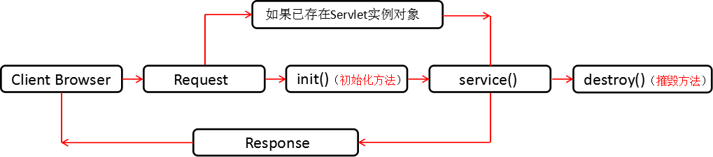

### 1. 什么是Servlet？

可以从两个方面去看Servlet：

- API：有一个接口servlet，它是servlet规范中定义的用来处理客户端请求的程序需要实现的顶级接口。
- 组件：服务器端用来处理客户端请求的组件，需要在web.xml文件中进行配置。

### 2. Servlet的生命周期？

servlet有良好的生存期的定义，包括加载和实例化、初始化、处理请求以及服务结束。这个生存期由javax.servlet.servlet接口中的init、service、destroy方法表达。web容器加载servlet，生命周期开始。通过调用servlet的init()方法进行servlet的初始化。通过调用service()方法实现根据请求的不同调用不同的do**()方法。结束服务，web容器调用servlet的destroy()方法。




### 3. Servlet API中forware()和redirect()的区别？

浏览器显示：重定向会改变URL地址，请求转发不会改变URL地址。

资源共享：重定向不可以资源共享，请求转发可以。

功能：重定向可以用URL绝对路径访问其他Web服务器的资源，而请求转发只能在一个Web应用程序内进行资源转发，即服务器内部的一种操作。

效率：重定向效率低，相当于再一次请求；请求转发效率相对较高，跳转仅发生在服务器端。


### 4. 什么情况下调用doGet()和doPost()?

默认情况是调用doGet()方法，JSP页面中的Form表单的method属性设置为post的时候，调用的为doPost()方法；为get的时候，调用deGet()方法。


### 5. request.getParameter()和request.getAttribute()的区别？

request.getParameter()获取的类型是String；

request.getAttribute()获取的类型是Object

request.getPrameter()获取的是POST/GET传递的参数值和URL中的参数；

request.getAttribute()获取的是对象容器中的数据值/对象

request.setAttribute()和request.getAttribute()可以发送、接收对象；

request.getParamter()只能接收字符串，官方不开放request.setParamter()（也就是没有这个方法）

setAttribute()和getAttribute()的传参原理：

 setAttribute()是应用服务器把这个对象放在该页面所对应的一块内存中去，当你的页面服务器重定向到另外一个页面时，

应用服务器会把这块内存拷贝到另一个页面所对应的那块内存中。这个就可以通过getAttribute()获取到相应的参数值或者对象。


### 6. JSP有哪些内置对象？作用分别是什么？

JSP一共有9个内置对象：

request：负责得到客户端请求的信息，对应类型：javax.servlet.http.HttpServletRequest

response:负责向客户端发出响应，对应类型：javax.servlet.http.HttpServletResponse

session:负责保存同一客户端一次会话过程中的一些信息，对应类型：javax.servlet.http.httpsession

out：负责管理对客户端的输出，对应类型：javax.serlvet.jsp.jspwriter

application:表示整个应用环境的信息，对应类型：javax.servlet.servletcontext

config:表示ServletConfig，对应类型：javax.servlet.servletconfig

exception:表示页面中发生的异常，可以通过它获得页面异常信息，对应类型：java.lang.exception

pagecontext:表示这个JSP页面上下文，对应类型：javax.servlet.jsp.pagecontext

page:表示当前JSP页面本身。


### 7. JSP有哪些动作？作用分别是什么？

JSP一共有以下6中基本动作

  JSP：include(当页面被请求的时候引入一个文件）

  JSP：forward(将请求转到另一个页面)

  JSP：useBean(获得JavaBean的一个实例)

  JSP：setProperty(设置JavaBean的属性)

  JSP：getProperty(获得JavaBean的属性)

  JSP：plugin (根据浏览器类型为Java插件生成object或者embed两种标记)

### 8. JSP常用指令有哪些？


| 指令                                  | 描述                        |
| :------------------------------------ | :-------------------------- |
| page指令                              | 定义页面的一些属性，常用属性   |
| contentType="text/html;charset=utf-8" | 向浏览器端输出数据的编码      |
| pageEncoding="utf-8"                  | JSP编译成java文件时所用的编码 |
| session="true"                        | 是否自动创建session          |
| include指令                           | 引入一个静态的JSP页面         |
| taglib指令                            | 引入一个标签库               |


### 9. JSP中动态include和静态include的区别？

静态include：语法：`<%@ include file="文件名" %>`，相当于复制，编辑时将对应的文件包含进来，当内容变化时，不会再一次对其编译，不易维护。

动态include：语法：`<jsp:include page="文件名">`,能够自动检查被包含文件，当客户端对JSP文件进行请求时，会重新将对应的文件包含进来，进行实时的更新。


### 10. JSP和Servlet有哪些相同点和不同点，他们之间的联系是什么？

JSP是Servlet的扩展，本质上是Servlet的简易方式，更强调应用的外表表达。JSP编译后是"类Servlet"。Servlet和JSP最主要的不同点在于，Servlet的应用逻辑是在java文件中，并且完全从表示层中的HTML里分离开来。而JSP的情况是java和HTML可以组合成一个扩展名为.jsp的文件。JSP偏重于视图，Servlet偏重于业务逻辑。


### 11. 详细描述MVC

基于java的web应用系统采用MVC设计模型，即用Model（模型）、View（视图）和Controller（控制）分离设计，这是目前web应用服务系统的主流设置方向。

Model：处理业务逻辑的模块。

 View：负责页面显示，显示Model的处理结果给用户，主要实现数据到页面的转换过程。

 Controller：负责每个请求的分发，把Form数据传递给Model进行处理，处理完成后，把处理结果返回给相应的View显示给用户。

### 12. MVC各个部分都有哪些技术实现？如何实现？

MVC是Model-View-Controller的简写。Model代表应用的业务逻辑（通过JavaBean、EJB组件实现），View是引用的表示面（由JSP产生），Controller是提供应用的处理过程机制(一般是一个Servelt)，通过这种设计模型把应用逻辑、处理过程和显示逻辑分成不同的组件来实现。这些组件可以交互和重用。


### 13. 我们在web应用开发过程中经常遇到输出某种编码的字符，如iso-8859-1等，如何输出一个某种编码的字符串？


```java
public String Translate(String str){
   String s="";
   try{
         s=new String(str.getBytes("iso-8859-1"),"UTF-8");
         s=str.trim();
   }catch(Exception e){
        System.err.println(e.getMessage());
    }
   return s;
}
```


### 14. get和post的区别？

get是用来从服务器上获取数据，而post是用来向服务器传递数据；

get将表单中数据按照variable=value的形式，添加到action所指向的URL后面，并且两者用"？"连接，变量之间用"&"连接；而post是将表单中的数据放在form的数据体中，按照变量与值对应的方式，传递到action所指定的URL。


get是不安全的，因为在传输过程中，数据是被放在请求的URL中;而post的所有操作对用户来说都是不可见的。

get传输的数据量小，这主要应为受url长度限制;而post可以传输大量的数据，所有上传文件只能用post提交。

get限制form表单的数据集必须为ASCII字符；而post支持整个IS01 0646字符集。

get是form表单的默认方法。


### 15. JSP的四种范围？

page是代表一个页面相关的对象和属性。一个页面由一个编译好的java servlet类（可以带有include指令，但不可以带有include动作）表示。这既包括servlet又包括编译成servlet的jsp页面。


request是代表与web客户机发出的一个请求相关的对象和属性。一个请求可能跨越多个页面，涉及多个web组件（由于forware指令和include动作的关系）


session是代表与用于某个web客户机的一个用户体验相关的对象和属性。一个web回话也可以经常跨域多个客户机请求。


application是代表与整个web应用程序相关的对象和属性。这实质上是跨域整个web应用程序，包括多个页面、请求和回话的一个全局作用域。


### 16. 简述HttpSession的作用、使用方法，可用代码说明。


HttpSession中可以跟踪并存储用户信息，把值设置到属性中，有两个方法：setAttribute("变量/对象","变量/对象");getAttribute("变量/对象");例如：在一个方法中用session.setAttribute("username",username);在session中设置一个属性名为username的变量或者对象，然后可以在同一个session范围内使用session.getAttribute("username"); 来得到username属性或者对象。

### 17. J2EE是什么？

J2EE现在叫做Java EE：是（Java platform,Enterprice Edition 企业版）的简称。企业版本开发和部署服务器应用程序。

 J2EE是Sun公司提出的多层（multi-tiered）、分布式（distributed）、基于组件（component-base）的企业级应用模型（Enterprice Application Model）。

在这样一个应用系统中，可按照功能划分不同的组件，这些组件又可在不同的计算机上，并且处理不同的层次（tier）中。所属层次包括客户层（client tier）、web层和组件、business层和组件、企业信息系统（EIS）层。


### 18. J2EE是技术、平台还是框架？

J2EE本身是一个标准，一个为企业分布式应用的开发提供的标准平台。J2EE也是一个框架，包括JDBC、JNDI、RMI、JMS、EJB、JTA等技术。


### 19. cookie和session的作用、区别、应用范围。

cookie数据保存在客户端，session数据保存在服务端。

cookie不是很安全，别人可以分析存放在本地的cookie并进行cookie欺骗，相当重要的数据，应该使用session保存到服务端。

session会在一定时间内保持在服务器上，但是会占用内存资源，当访问的用户过多，会加重服务器的负载，考虑到减轻服务器的压力，可以将不重要的数据放在cookie中持久的保存。

单个cookie保存的数据不能超过4k，很多浏览器都限制站点最多保存20个cookie。


### 20. JSTL是什么？优点有哪些？

JSTL（JSP Standard Tag Library，JSP标准标签库）是一个不断完善的开放源代码的JSP标签库，由四个定制标记库（core、format、xml、sql）和一对通用标记库验证器（ScriptFreeTLV和PermittedTaglibsTLV）组成。优点有：


在应用程序服务器之间提供了一致的接口，最大程度的提高了web应用在各应用服务器之间的移植。

简化了JSP和web应用程序的开发。

以一种统一的方式减少了JSP中scriptlet代码数据，可以达到没有任何scriptlet代码的代码。在我们公司的项目中是不允许任何scriptlet出现在JSP中。

允许JSP设计工具与web应用程序开发的进一步集成。相信不久就会有支持JSTL的IDE开发工具出现。


### 21. JSP页面是如何被执行的？JSP执行效率比Servlet低吗？

当客户端向一个JSP页面发出请求时，Web Container将JSP转换成Servlet的源代码（只是第一次请求时），然后编译转化后的Servlet并加载到内存中执行，执行的结果Response到客户端。

JSP只在第一次执行的时候会转化为Servlet，以后的每次执行Web容器都是直接执行编译后的Servlet，所有JSP和Servlet只有第一次执行的时候不一样，JSP慢一点，以后的执行都是相同的。


### 22. JSP如何处理运行时异常（run-time）exception？

可是使用页面的errorPaga属性捕捉没有处理的运行时异常，然后自动转向到一个错误处理页面，代码如下：`<%@page errorPage="错误页面URL"%>`

如果在页面请求时出现运行时异常时，以上代码会将代码转向到错误页面，在错误页面里面，可以通过以下代码定义这个页面是错误处理页面：

`<%@page isErrorPage="true"%>` 这样描述错误信息的Throwable对象就可以在错误页面里面访问到。


### 23. 如何避免JSP页面自动生成session对象？为什么要这么做？

在默认情况下，在对一个JSP页面发出请求时，如果session还没有建立，那么JSP页面会自动为请求创建一个session对象，但是session是比较消耗资源的，如果没有必要保持和使用session，就不应该创建session，例如一些只用来宣传产品的网页，往往没必要使用session来保存信息，可以在JSP中使用page指令进行设置，避免JSP页面为每个请求都自动创建session。实例代码如下：`<%@page session="false"%>`


### 24. EL表达式的功能，为什么要用EL表达式？

功能：

从四个域对象中取出数据数据显示。

取出请求参数数据显示。

原因：

在页面中用jsp脚本和jsp表达式来获取数据显示比较麻烦

需要判断

可能需要强转


### 25. JSTL的功能，为什么要用JSTL？

功能：主要用于基本输入输出、流程控制、循环、XML文件剖析、数据库查询及国际化和文字格式标准化的应用等。

原因：在jsp页面做条件判断或者循环操作并输出时，比较费力。


### 26. 如何防止表单重复提交？

使用session技术：

在regist.jsp页面中生成一个为一个随机值，将其保存到session中，同时将其保存为表单的隐藏域的值。

在处理注册的请求时，获取session中的值，获取请求参数的值，比较两者是否相同，如果相同说明不是重复提交，请求通过同时删除session中保存的的值，如果不相同则是重复提交，不能通过。


### 27. session和application的区别？

两者的作用范围不同

 session是用户级别的，application是web应用程序级别的，是一个全局作用域。

一个用户一个session，每个用户的session不同，用户所访问的网站多个页面共享同一个session。

 一个web应用程序一个application对象，每个web应用程序的application对象不同，但是一个web应用程序的多个用户之间共享一个application。

生命周期不同

   session：用户首次在网站中发出请求创建session，用户注销、离开网站或者关闭浏览器消亡。

   application：启动web服务器创建，关闭web服务器销毁。

### 28. 如何从form表单中获取checkbox的值？

可以在页面将checkbox的name属性设置相同，value属性取每个条目的id，在后台使用request.getParametervalues（"name"）;获取一组值。


### 29. 过滤器有哪些作用？

可以验证客户是否来自可信的网络

可以对客户提交的数据进行重写编码

可以从系统里获得配置的信息

可以过滤掉客户某些不应该出现的词汇

验证客户是否登录

验证客户的浏览器是否支持当前的应用

可以记录系统的日志


### 30. 过滤器的用法？（对客户端的请求统一编码和对客户端进行验证）


实现Filter接口，同时重写Filter接口的三个方法：

init(FilterConfig config)    用于获取FilterConfig对象


doFilter(ServletRequest request,ServeltResponse response,FilterChain chain)   进行过滤处理一些业务

destroy()    销毁Filter


### 31. C/S与B/S的区别？

有如下8个方面的不同：

硬件环境的不同

C/S：一般建立在专用的网络上，小范围里的网络环境，局域网之间再通过专门服务器提供连接和数据交换服务。

B/S：建立在广域网之上的，不必是专门的网络硬件环境，有比C/S更强的适应范围，一般只要有操作系统和浏览器就行。

对安全要求不同

C/S：一般面向相对固定的用户群，对信息安全的控制能力很强。一般高度机密的信息系统采用C/S结构适宜。

B/S：建立在广域网之上，对安全的控制能力相对弱，可能面向不可知的用户。

对程序架构不同

C/S：程序可以更加注重流程，可以对权限多层次校验，对系统运行速度可以较少考虑。

B/S：对安全以及访问速度的多重的考虑，建立在需要更加优化的基础之上。

软件重用不同

C/S：程序可以不可避免的整体性考虑，构件的重用性不如在B/S要求下的构件的重用性好.

B/S：对的多重结构，要求构件相对独立的功能。

系统维护不同

C/S：程序由于整体性，必须整体考察，处理出现的问题以及系统升级。

B/S：构件组成，方面构件个别的更换,实现系统的无缝升级。

处理问题不同

C/S：程序可以处理用户面固定，并且在相同区域，安全要求高需求，与操作系统相关。

B/S：建立在广域网上，面向不同的用户群，分散地域，这是C/S无法作到的

用户接口不同

C/S：多是建立的Window平台上，表现方法有限，对程序员普遍要求较高。

B/S：建立在浏览器上，有更加丰富和生动的表现方式与用户交流；并且大部分难度减低,减低开发成本。

信息流不同

C/S：程序一般是典型的中央集权的机械式处理，交互性相对低。

B/S：信息流向可变化，B-B B-C B-G等信息、流向的变化，更像交易中心。


### 32. 什么是web容器？

给处于其中的应用程序组件（JSP、Servlet）提供一个环境，是JSP、Servlet直接跟容器中的变量交互，不必关注其他系统问题。

主要有web服务器来实现。例如：tomcat、weblogic、sphere、JBoss等。该容器提供的接口严格遵守J2EE规范中的web application标准。

我们把遵守以上标准的web服务器叫做J2EE的web容器。